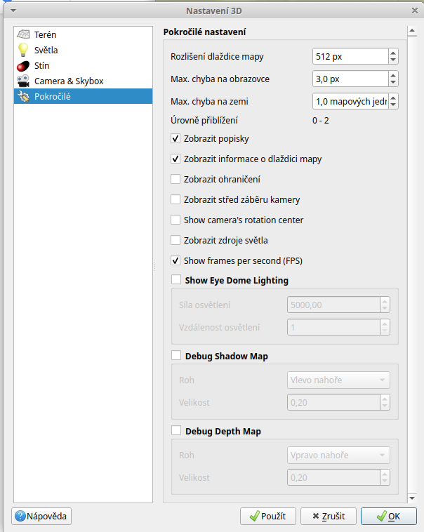

.. |mActionSignPlus| image:: ../images/icon/mActionSignPlus.png
   :width: 1.5em
   
.. _3d_map_view:

*****************
Vizualizace ve 3D
*****************

Mapové okno
-----------

Pro zobrazování dat v režimu 3D je nutné si aktivovat samostatné okno. V menu Zobrazit - New 3D Map View, případně přes zkratku Ctrl+Shift+M se spustí nové
okno pro vykreslování 3D objektů.

Do tohoto okna se po spuštění překreslí všechny vrstvy tak, jak se vykreslují
do mapového okna. Zapínání a vypínání vrstev je přímo napojené a reaguje dle
obvyklého nastavení v panelu vrstev. Pro další práci ponacháme vykreslené pouze
vrstvy v pořadí zdola:
 * Dem - výškový raster
 * Stínovaný reliéf - částečně průhledný
 * Index drstnosti - částečně průhledný
 
Vykreslování funguje na principu vykreslování textur na vygenerovaný terén.
Textury svou symbologií odpovídají symbologii běžného mapového okna. Rozdíly
jsou způsobeny pouze kvalitou rendrování na terénu, se kterou je možné
manipulovat a nastavit ji dle potřeb. 
Rendrování je závislé na přegenerovávání jednotlivých dlaždic dle pozice "pozorovatele". V případě přibližování se počítají nové dlaždice, které lépe odpovídají požadované kvalitě.  

Menu pro nastavení 3D mapového okna je pod ikonkou klíče. V tomto menu můžeme
udělat základní nastavení v části “Terén”. V rolovacím menu pro položku
“Nadmořská výška” vybereme rastrovou vrstvu “DEM” - výškového modelu terénu.
Po uložení tohoto základního nastavení  se začne načítat zobrazený terén jako
3D povrch ve stejném grafickém nastavení jako v mapovém okně. Na vrstvě terénu
se vykreslí i stínovaný reliéf a drsnost povrchu. 

.. figure:: images/3d_settings1.png 
   :class: middle

   Základní nastavení 3D mapového okna a první vizualizace.

Ovládání 3D mapového okna
-------------------------

Při prvním zobrazení dat se vykreslí rozsah vrstvy s terénem do mapového okna centricky a kolmo nad středem.

**Pohyb v okně:**
 * přibližování a oddalování - pohybem kolečka myši
 * posun obrazu - levé  tlačítko myši a tažení
 * změna vertikálního úhlu - Shift + tažení levého tlačítka 

Zjemnění jakéhokoli vyjmenovaného posunu - přidržení tlačítka :item:`Ctrl`

Místo tažení myší je možné používat šipky na klávesnici

.. Tip::
   Tak jako u obyčejného mapového okna, tak i tady je možné vrátit se do
   výchozí polohy, kdy vidíme vrstvu z výchozí pozice - tlačítko “Přiblížit
   na rozměry okna”. Vhodné použít pokud se dostaneme mimo zobrazovaná data
   a neumíme se vhodně zorientovat.

**Další nastavení**
 
Výchozí hodnoty pro vykreslování v 3D mapovém okně je možné měnit a pomocí jejich správné konfigurace zlepšit výstup.

.. figure:: images/3d_compare.png 
   :class: middle

   Porovnání vizualizací s růzým nastavením 3D mapového okna.

Na obrázku jsou vidět dvě různá zobrazení dat v 3D mapovém okně. Rozdíl
není v datech samotných, ale v nastavení jednotlivých parametrů. Je důležité
si uvědomit, že možnosti nastavení jsou závislé na konkrétním zařízení na
kterém zobrazování probíhá a tím se můžou výrazně lišit i dosažitelné výsledky.

   Okno konfigurace 3D mapového okna
   
Možnosti konfigurace mapového okna:
 * Nadmořská výška - výběr rastrové vrstvy, ze které bude geneorván terén
 * Svislé měřítko - pokud reálný poměr vodorovných a svislých délek neumožňuje
   dostatečně dobře analyzovat terén je možné zvýšením čísla zveličit výškové
   poměry (malé nerovnosti vyniknou s vyšším číslem)
 * Tile resolution - počet vzorkovacích plošek na dlaždici, na obrázku je
   nastavení, kdy dlaždice o velikosti 512 pixelů bude složená z 256x256 plošek.
   Princip je tedy takový, že s vyšším číslem roste kvalita, ale také náročnost
   zobrazování.
 * Skirt height - jednotlivé dlaždice můžou být lenovány na spodní straně
   pruhem textury. Ten může pomoct při ucelení případných trhlín medzi
   dlaždicemi. Tento parametr určuje výšku tohoto pruhu v pixelech.
 * Map tile resolution - velikost texturového obrázků v pixelech pro jednu
   dlaždici. Čím větší číslo použíjeme, tím detailnější textura bude na
   dlaždici vykreslena. Detailnost je závislá na náročnosti vizualizace.
 * Max. screen error - hraniční hodnota chyby vykreslení dlaždic definující mez,
   kdy chyba vykreslení způsobí vykreslení nové detailnější/méně detailní sady
   dlaždic
 * Max. ground error - mezní hodnota pro toleranci chyby ve vykreslování
   terénu. Čím menší číslo, tím složitější hierarchie se generuje.
   
Zatrhávací položky na konci menu umožňují pracovat se zobrazováním popisků,
případně dalších informací o dlaždicích a zobrazovaném celku.
