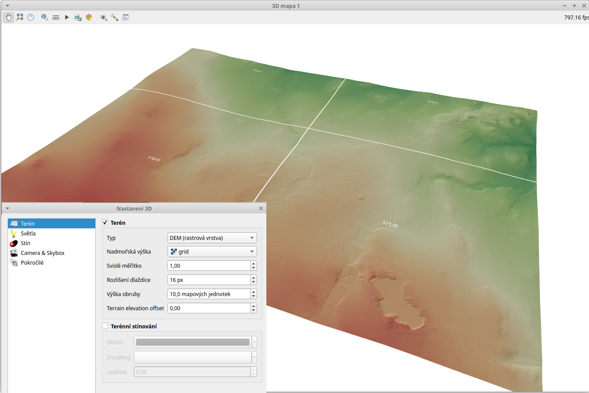

.. |mActionSignPlus| image:: ../images/icon/mActionSignPlus.png
   :width: 1.5em
   
.. _3d_map_view:

*****************
Vizualizace ve 3D
*****************

Mapové okno
-----------

Pro zobrazování dat v režimu 3D je nutné si aktivovat samostatné okno. V menu Zobrazit - New 3D Map View, případně přes zkratku Ctrl+Shift+M se spustí nové
okno pro vykreslování 3D objektů.

Do tohoto okna se po spuštění překreslí všechny vrstvy tak, jak se vykreslují
do mapového okna. Zapínání a vypínání vrstev je přímo napojené a reaguje dle
obvyklého nastavení v panelu vrstev. Pro další práci ponacháme vykreslené pouze
vrstvy v pořadí zdola:
 * Dem - výškový raster
 * Stínovaný reliéf - částečně průhledný
 * Index drstnosti - částečně průhledný

Menu pro nastavení 3D mapového okna je pod ikonkou klíče. V tomto menu můžeme
udělat základní nastavení v části “Terén”. V rolovacím menu pro položku
“Nadmořská výška” vybereme rastrovou vrstvu “DEM” - výškového modelu terénu.
Po uložení tohoto základního nastavení  se začne načítat zobrazený terén jako
3D povrch ve stejném grafickém nastavení jako v mapovém okně. Na vrstvě terénu
se vykreslí i stínovaný reliéf a drsnost povrchu. 

   Základní nastavení 3D mapového okna a první vizualizace.

Ovládání 3D mapového okna
-------------------------

Při prvním zobrazení dat se vykreslí rozsah vrstvy s terénem do mapového okna centricky a kolmo nad středem.

**Pohyb v okně:**
 * přibližování a oddalování - pohybem kolečka myši
 * posun obrazu - levé  tlačítko myši a tažení
 * změna vertikálního úhlu - Shift + tažení levého tlačítka 

Zjemnění jakéhokoli vyjmenovaného posunu - přidržení tlačítka :item:`Ctrl`

Místo tažení myší je možné používat šipky na klávesnici

.. Tip::
   Tak jako u obyčejného mapového okna, tak i tady je možné vrátit se do
   výchozí polohy, kdy vidíme vrstvu z výchozí pozice - tlačítko “Přiblížit
   na rozměry okna”. Vhodné použít pokud se dostaneme mimo zobrazovaná data
   a neumíme se vhodně zorientovat.

**Další nastavení**
 
Výchozí hodnoty pro vykreslování v 3D mapovém okně je možné měnit a pomocí jejich správné konfigurace zlepšit výstup.

   Porovnání vizualizací s růzým nastavením 3D mapového okna.

Na obrázku jsou vidět dvě různá zobrazení dat v 3D mapovém okně. Rozdíl
není v datech samotných, ale v nastavení jednotlivých parametrů. Je důležité
si uvědomit, že možnosti nastavení jsou závislé na konkrétním zařízení na
kterém zobrazování probíhá a tím se můžou výrazně lišit i dosažitelné výsledky.

