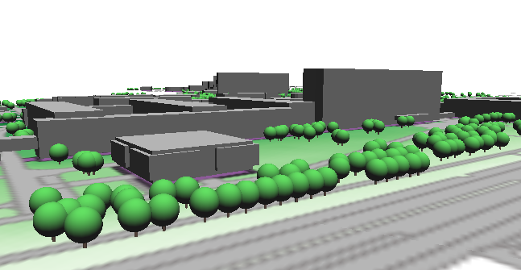

.. |mActionSignPlus| image:: ../images/icon/mActionSignPlus.png
   :width: 1.5em
   
.. _3dgeometry:

************
3D geometrie
************

Postup pomocí kterého jsme vytvořili DMT je postup, který nepracuje s objekty,
které by měli geometrii ve 3D. Pouze obsahují atribut s výškou.

Pomocí importu je možné nastavit geometrii pouze jako **X** a **Y** i když
soubor obsahuje Z-ovou souřadnici. Proto je nutné tuto souřadnici dodatečně
přidat z existujícího atributového pole.
V processingovém menu buď vyhledáme nástroj podle názvu, nebo jeho části
**Nastavit Z hodnotu** (Set Z value). Nástroj se nachází ve skupině nástrojů QGIS ve složce “Vektorová geometrie”.

Vytvoření 3D geometrie z 2D
---------------------------

Nastavení vyžaduje výběr správné vrstvy v rolovacím menu v první části a
následně pravidlo pro přiřazení Z-ové hodnoty. První volbou je možnost zadání konstantní hodnoty, což není pro naše potřeby vhodné. Pro přiřazení hodnoty
atributového pole je nutné použít nastavení dostupné přes ikonku :item:`Daty definované přepsání`. Pod položkou menu :item:`Typ pole:int, double, řetězec`
jsou v nabídce všechny atributová pole, které je možné použít pro nastavení
Z-ové hodnoty. 
Po úspěšném nastavení změní původní ikona svou barvu na žlutou.
Jako výsledek je vygenerován nový výstupní soubor, dle zadání v parametru
:item:`Z přidáno`.Při nastavení nástroje s parametrem :item:`Otevřít výstupní
soubor po doběhnutí algoritmu` se výsledek po skončení výpočtu přidá do panelu
vrstev jako nová položka. Nástroj se spustí pomocí :item:`Spustit na pozadí`,
což znamená, že v průběhu výpočtu je možné provádět jiné úkony v QGISu.

.. tip:: 
   Ověřit si, zda je geometrie opravdu nastavená včetně Z-ové souřadnice je
   možné ve vlastnostech dané vrstvy v záložce “Informace” v sekci
   “Informace od poskytovatele”. Jak je vidět na obrázku položka
   “Geometrie” má vypsanou hodnotu **Point(Point25D)**, co je jednen z formátů
   zápisu 3D geometrie.
   
   .. figure:: images/geometry_3d.png 
      :class: small

   Zápis typu geometrie ve vlastnostech vrstvy.
   
   
Modelované objekty
------------------

Pro zobrazení objektů na terénu je možné také využít jednoduché tvary, jako je
koule, válec nebo krychle nebo jejich kombinace.

Orientace os v 3d pohledu je kupodivu jiná než bychom očekávali, tedy pokud chceme posunout
objekt nad terén, např. korunu stormu musíme tak učinit v ose Y.

.. figure:: images/tvary.png
   :class: middle

Jinou možností je vykreslení existujícího modelu. Pro vzykoušení můžeme stáhnout
`jednoduchý model <https://free3d.com/3d-model/low_poly_tree-816203.html>`_. nebo
si vytovřit vlastní v nějakém modelovacím nástroji jako je např.
`Blender <http://blender.org>`_.

.. figure:: images/simple_tree_model.png
   :class: middle
