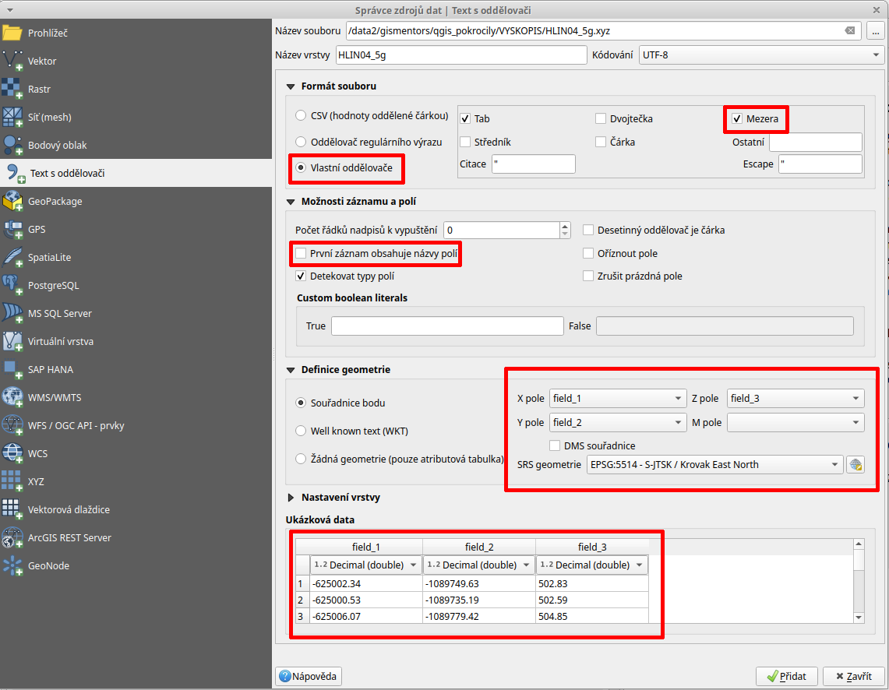

.. |mActionAddRasterLayer| image:: ../images/icon/mActionAddRasterLayer.png
   :width: 1.5em
   
.. _dmrdmp:

********************
Zpracování DMR a DMP
********************

Popis datové sady
-----------------

Tyto sady ČÚZK neposkytuje jako otevřená data, ale je nutné si je zakoupit.
Vzhledem k jejich technické specifikaci se však jedná o unikátní zdroj informací.
Jedná se o tzv. lidarová data, která umožňuje lokalizovat objekty  na zemském
povrchu s poměrne vysokou přesností (střední chyba výšky v odkrytém terénu
0,18 m, v zalesněném terénu 0,3 m).

Pro účel testování je přímo na stránkách poskytovatele odkaz na `testovací sadu
<geoportal.cuzk.cz/UKAZKOVA_DATA/VYSKOPIS.zip>`_.
V principu se jedná o **mračno bodů**, které mají určené souřadnice **x, y a z**.
Data jsou poskytovány ve 2 základních formátech:
 * XYZ (textový formát, kde každý řádek zachycuje 1 bod)
 * LAS/LAZ (binární formát, který je případně komprimovaný)
    

   Ukázka zápisu údajů ve formátu XYZ.

Ukázkový dataset obsahuje data pouze ve formátu XYZ v souřadnicovém systému **S-TJSK (EPSG:5514)**.
Nadmořská výška, která je uvedeme ja v metrech ve výškovém referenčním systému Balt po vyrovnání- Bpv.
Proces zpracování dat je rozebrát v následujících krocích.

Import dat XYZ
--------------

Jak již bylo uvedeno data jsou uložena ve textovém formátu po jednotlivém řádku.
Pro import těchto dat  použijeme nástroj "Přidat vrstvu s odděleným textem" (Add delimited text layer)
http://training.gismentors.eu/qgis-zacatecnik/vektorova_data/import_delim.html#import-dat

   Nastavení parametrů pro import dat ze souboru XYZ.

.. tip::

   Při výběru souboru  je výchozí filtrování souborů nastaveno na soubory s
   příponou .txt, je proto nutné v spodní pravé části změnit nastavení na
   “Všechny soubory”.

Pro nastavení použijeme vlastní oddělovač “mezera”, X nastavíme jako sloupec field_1 a Y nastavíme jako field_2. V rolovacím menu vybereme souřadnicový systém S-JTSK (EPSG:5514). Jelikož soubor neobsahuje žádnou hlavičku a první řádek obsahuje přímo bod, tak musíme odstranit zatrhnutou možnost “První záznam obsahuje názvy polí”. Po vizuální kontrole náhledu  můžeme pomocí tlačítka “Přidat” načíst obsah souboru jako novou bodovou vrstvu. 

