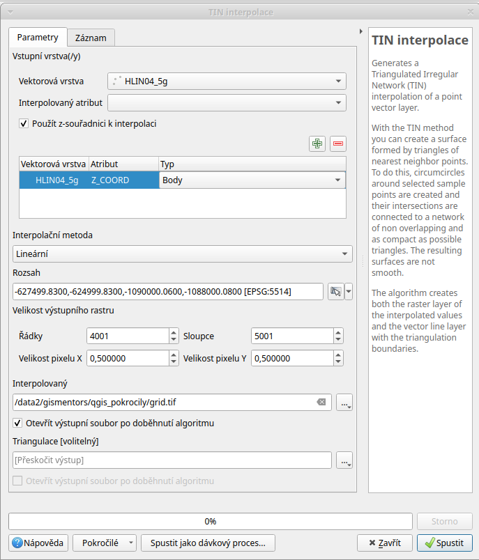

.. |mActionSignPlus| image:: ../images/icon/mActionSignPlus.png
   :width: 1.5em
   
.. _dmt:

***************************
Tvorba DMT a teréní analýzy
***************************

Vytvoření DMT
-------------

Jeden ze způsobů na vytvoření DMT je nástroj “TIN interpolace” (TIN interpolate) z processingového menu ve skupině nástrojů QGIS ve složce “Interpolace”.

   
   Interpolace digitálního modelu terénu.

Vstupem do této funkce je bodová vrstva se Z-ovou souřadnicí. Interpolovaným
atributem je atributové pole obsahující Z souřadnici. V případě, že pracujeme s
vektorovou vrstvou, která obsahuje Z-ovou souřadnici přímo v geometrii,
tak je možné  zatrhnout nastavení “použít z-souřadnici k interpolaci”. 

Pomocí tlačítka |mActionSignPlus| přidáme  nastavení interpolované hodnoty.
Další nastavení je metoda interpolace s volbou **lineární** nebo 
**kubické** metody výpočtu. 

Velikost a podrobnost výstupního rastru ovlivňují 2 základní nastavení. Prvním je rozsah cílové vrstvy a druhým je velikost buňky. Velikost buněk je dána počtem sloupců a řádek pokrývajících cílový rozsah vrstvy. Toto nastavení je nutno provést dle hustoty zdrojové vrstvy.
V našem případě se jedná o body v mřížce 2,5 x 2 km. Pro naše potřeby budeme generovat DMT v rozlišení 0,5m. Rozsah zvolíme podle rozsahu vstupní vrstvy (načteme přes tlačítko :item:`...` a zvolíme vstupní vrstvu). Výstup uložíme ve formátu
`.tif.`

   
   Ukázka velikosti pixelu a hustoty vstuoních bodů.

Výpočet stínovaného reliéfu
---------------------------

Dle postupu z kurzu `QGIS pro začátečníky <http://training.gismentors.eu/qgis-zacatecnik/rastrova_data/rastr_terenni_analyzy.html#stinovany-relief-hillshade>`_ 
vypočteme z DMT stínovaný reliéf ve formátu `.tif`, kterému nastavíme ve
vlastnostech průhlednost na 35%. Již při tomto zobrazení  působí území plasticky.

Drsnost terénu
--------------

Další charakteristickou vlastností je drsnost terénu. Jedná se o analýzu buňky a
jejího okolí z hlediska  různorodosti těchto hodnot. Příkladem nízkého indexu
drsnosti je rovná betonová plocha. Opakem může být například úbočí kopce pokryté
většími kameny.

Nástroj na výpočet této vlastnosti je k dispozici v různých variantách v
processingovém menu.
Použijeme nástroj ze sady GDAL, skupina nástrojů “Rastrová analýza”, **Index
drsnosti terénu** (TRI). Vstupní vrstvou pro tuto analýzu je výškový model,
přičemž index se počítá přímo z výšek.
Výstup z této analýzy je opět rastrový formát, dle nastavení použitého při zpracování.

   
   Dialog pro výpočet drsnosti terénu.

Tento typ výstupu patří do skupiny, kde je nutné najít vhodné nastavení
symbologie vrstvy, aby její zobrazení  mělo správný efekt. Nejjednodušší
možností je nastavení průhlednosti celé vrstvě konstantní hodnotou, např.
Nastavením neprůhlednosti na 35% (ve vlastnostech vrstvy).

Další možností je nastavit různým intervalům  postupně klesající průhlednost.
Na obrázku je vidět  histogram hodnot  a pak následně nastavené kategorie s
průhledností. Na obrázku je vidět, že u intervalů hodnota 100 se nazývá
průhledností a  znamená, že tato kategorie se nebude vykreslovat vůbec
(nastavení průhlednosti nahoře funguje s opačnými hodnotami - nastavuje
se tam neprůhlednost).

