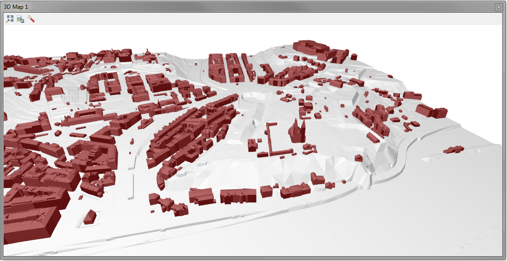

.. |mActionAddRasterLayer| image:: ../images/icon/mActionAddRasterLayer.png
   :width: 1.5em

***************
Práce s 3D daty
***************

Zobrazování 3D dat v QGISu bylo možné už v minulosti a to zejména pomocí pluginů
(např. `Qgis2threejs <https://plugins.qgis.org/plugins/Qgis2threejs/>`_ ).
Od verze 3.0 je základní součástí QGISu také `3D mapové okno 
<https://qgis.org/en/site/forusers/visualchangelog30/index.html#d-features>`_,
které slouží na vizualizaci 3D dat.

Práce s daty, které mají i Z-ovou souřadnici je na vzestupu i díky postupu v
technologii, která umožňuje práci s takovýmito daty zpřístupnit i pro běžné
počítače bez speciálního  vybavení a zvýšených nároků na jejich výkon.

   Ukázka zobrazení dat v 3D mapovém okně QGIS.

  
**Popis typických dat**

Tak jako u běžných mapových podkladů zobrazujeme zemský povrch a jevy, které se
na něm nachází, budeme z tohoto předpokladu vycházet i v případě práce se 
zobrazováním ve 3D. Musíme tedy začít tím, že budeme zobrazovat
**zemský povrch**.

Jednu formu reprezentace povrchu jsme použili již v `začátečnickém kurzu  
<http://training.gismentors.eu/qgis-zacatecnik/rastrova_data/rastr_terenni_analyzy.html>`_.
Jedná se o digitální model terénu, který pokrývá celé území ČR.
Jeho nevýhodou však je, že jeho prostorové rozlišení není dostačující pro
řešení úkolů pro jednotlivé části území.
Pro území ČR `ČÚZK <https://www.cuzk.cz/>`_ poskytuje digitální model reliéfu (nejnovější je pátá generace
`DMR5G <http://geoportal.cuzk.cz/(S(zm3aqx2il4wdjxyk2drf4bn3))/Default.aspx?lng=CZ&mode=TextMeta&side=vyskopis&metadataID=CZ-CUZK-DMR5G-V&mapid=8&menu=302>`_) a digitální model povrchu (jediná verze 
`DMP1G <http://geoportal.cuzk.cz/(S(zm3aqx2il4wdjxyk2drf4bn3))/Default.aspx?lng=CZ&mode=TextMeta&side=vyskopis&metadataID=CZ-CUZK-DMP1G-V&mapid=8&menu=303>`_).

Na povrchu jsou pak standardně zobrazovány různé další objekty jako např.
budovy. Možností jak z obyčejné dvoudimenzionální geometrie udělat 3D je
víc. Jednou z možností je použít atributové pole s výškou objektu a pak
pomocí nastavení vytáhnou do výšky jako tzv. "boxíky". 
Další možností je přímé modelování objektů zložených z vícero rovinných
polygonů (takovéto objekty jsou na obrázku výše). Tvorba a editace
takovýchto dat je časově náročná a QGIS není vhodným nástrojem pro
tento typ editace pro produkční proces.

Při jednodušších objektech, například bodových, je možné vytvořit zjednodušenou
symbologii a tu používat. Prozatím ale není možné používat natolik pokročilé
možnosti stylování jako jsme zvyklí u symbologie pro 2D.

**Další kroky**

.. toctree::
   :maxdepth: 2

   dmrdmp
   dmt
   3d_map_view
   3dgeometry
   profiles

