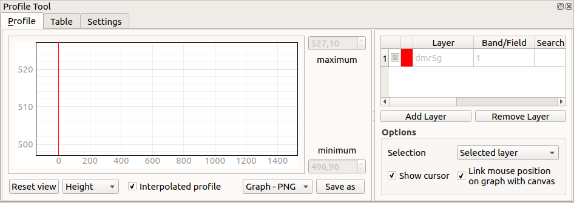
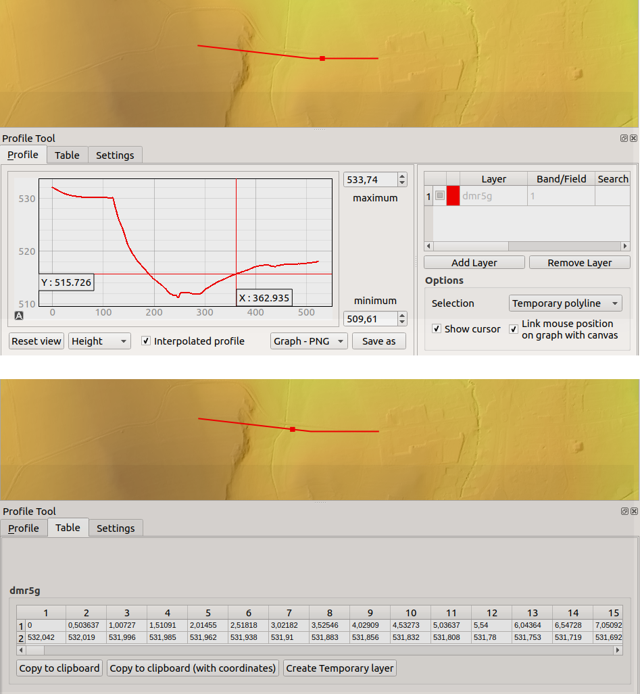

.. |mActionSignPlus| image:: ../images/icon/mActionSignPlus.png
   :width: 1.5em
   
.. _profiles:

*************
Profil terénu
*************

Sledování výškových změn na určité zvolené trase je běžně používaný nástroj. 
Jedna z možností jak tento druh měření provádět v QGISu je plugin 
**Profile tool**, který je součástí oficiálního repozitáře. Je možné jej
nainstalovat pomocí menu "Zásuvné moduly".
Nainstalovaný plugin se přidá do menu Zásuvné moduly jako samostatné položka.

Pro výpočet profilu je možné použít digitální model terénu v rastru, ale i
bodovou vrstvu, která obsahuje v atributové tabulce výšky. Bodová vrstva,
která má 3D geometrii, ale neobsahuje atributové pole s výškou není
dostatečným vstupem.

Standarní použití výpočtu profilu
---------------------------------

Po spuštění nástroje je nutné nejdřív přidat vrstvu, ze které se bude profil
počítat. Při kliknutí na tlačítko :item:`Add Layer` se přidá aktivní vrstva.
V případě rastrové vrstvy je nutné vybrat kanál s údaji o výšce, pokud je rastr
jednokanálový tak se nastavení vrstvy rovnou zapíše do tabulky.
Při výběru bodové vrstvy se otevře dialogové okno na výběr atributu s výškami.

   Výchozí nastavení pluginu po zadání vrstvy pro výpočet profilu.

Výchozí nastavení pluginu, tak jak je vidět na obrázku, umožňuje začít s
okamžitým měřením profilů pomocí interaktivního zadání trasy profilu v mapovém
okně. 
Pomocí zadávání jednotlivých bodů linie se aktualizuje profil v grafu pro
všechny ukončené segmenty linie, ale i tabulka profilu v další samostatné
záložce pluginu. Zadávání linie se ukončí běžným dvouklikem.
Zadáním nové linie se zruší předešlé vyhodnocení. 

Dle výchozího nastavení se všechny výsledky interpolují mezi lomovými body
vstupní linie. Při zrušení nastavení interpolace pomocí zatrhávací položky
se budou hodnoty určovat pouze pro lomové body.

Zobrazení výsledků
------------------

Samotné výsledky měření profilu se skládá ze 2 základních částí, které jsou
umístěny v samostatných záložkách. První záložka obsahuje graf profilu.
Výhodou je nastavení, které umožňuje propojit graf s mapovým oknem tak, že při
procházení profilu v grafu se ukazuje poloha na trase přímo v mapovém okně.
Toto nastavení je pomocí zatrhávací položky
:item:`Link mouse position on graph with canvas`.

Samotný graf je určen osou **X**, na které je zobrazena vzdálenost na trase od
počátečního bodu. Osa **Y** slouží pro zobrazování sledované veličiny - 
nadmořské výšky. Přesné umístění kurzoru je možné zobrazovat tak jak je to viditelné na obrázku a to pomocí zatrhávací položky :item:`Show cursor`.

Rozsah grafu v ose Y je možné nastavit pomocí změny  minimální a maximální
nalezené hodnoty její manuálním zadáním, či úpravou stávající hodnoty.

Opětovné nastavení grafu do jeho výchozího nastavení je možné pomocí tlačítka
:item:`Reset view`.

   Zobrazení výsledků v obou záložkách.
   
Druhá forma výsledků z tohoto měření je tabulka. Nachází se v samostatné
záložce. Tabulku obsahuje pravidelně rozestoupené body na trase. Interval
vypočtených bodů je 0.5 m. 
Obsah tabulky je možné zkopírovat a přímo vložit do tabulkového editoru ve
2 verzích - se souřadnicemi a bez nich.
Další funkce je vytvoření dočasné vrstvy z této tabulky a její zobrazení v
mapovém okně pomocí tlačítka :item:`Create Temporary layer`.
   
   
Režim výpočtu
-------------

Pomocí tohoto nástroje je možné počítat standardní výškový profil. Dalšími
možnostmi je výpočet sklonu ve dvou variantách - v procentách a ve stupních.

Toto nastavení je možné změnit pro již spočtenou trasu a graf se automaticky
přepočte. Výsledková tabulka počítá pouze výškový profil.

Výstupy
-------

Profil je možné exportovat ve 3 variantách. Dvě z nich slouží pouze pro export
grafu - jako SVG nebo PNG.
Samotný profil je možné vyexportovat jako 3D linii do formátu .DXF.

V případě vytvoření dočasné vrstvy z tabulky je možné pak vrstvu uložit jako
běžnou geometrii a dále s ní pracovat dle potřeby. Jedná se o bodovou 2D vrstvu, která má výškový údaj zapsaný jako atributové pole.

Výpočet pro vrstvu
------------------

dopsat
