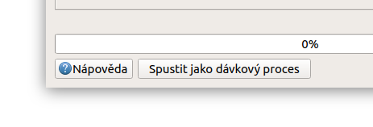
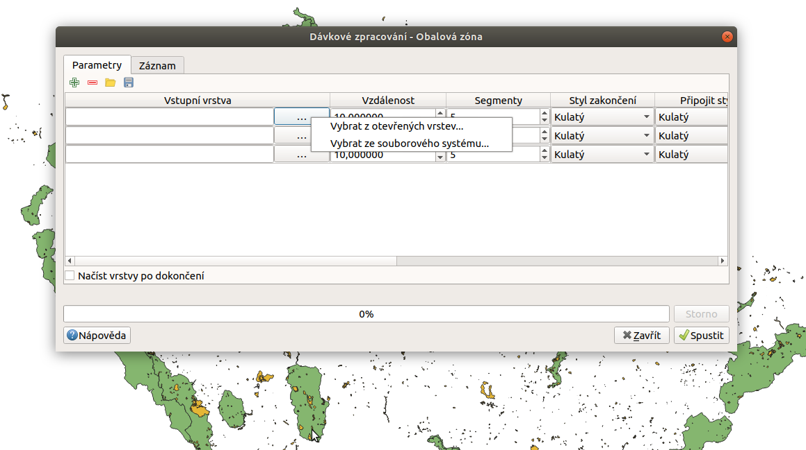

.. |symbologyAdd| image:: ../images/icon/symbologyAdd.png
   :width: 1.5em
.. |symbologyRemove| image:: ../images/icon/symbologyRemove.png
   :width: 1.5em
.. |mActionFileSave| image:: ../images/icon/mActionFileSave.png
   :width: 1.5em
.. |mActionFileOpen| image:: ../images/icon/mActionFileOpen.png
   :width: 1.5em
.. |alg| image:: ../images/icon/alg.png
   :width: 1.5em

.. _davka:

Dávkové zpracování
==================
Dávkové zpracování nám umožní spustit jeden algoritmus vícekrát najednou s různými parametry. Spustit dávkový preces lze přímo z okna nástrohů zpracování vyvoláním kontextové nabídky pravým kliknutím na požadovaný algoritmus a výběrem :guilabel:`Spustit dávkový proces` (:num:`#batch`). Další možnost jak dávkový proces spustit je přío z okna algoritmu, kde se nám v horní liště ukáže tlačítko :item:`Spustit jako dávkový proces` (:num:`#batch2`)

.. _batch:
.. figure:: images/geoproc_batch.png 
   :class: small		 
   :scale-latex: 40 

   Spuštění dávkového procesu z okna nástrojů zpracvání

.. _batch2:

   Tlačítko :item:`Spustit jako dávkový proces` v okně algoritmu

Popis okna
----------
V okně dávkového zprcování máme opět záložky :guilabel:`Parametry` a :guilabel:`Záznam`. V záložce :guilabel:`Parametry` se nám zobrazí všechny vstupní parametry vybraného algoritmu v jednom řádku, každý řádek potom odopvídá samostatnému procesu. Řádky lze přidávat a odebírat pomíc tlačítek |symbologyAdd| a |symbologyRemove|. Dále lze nakonfigurovaný dávkový proces uložit |mActionFileSave| do souboru .JSON nebo tento typ souboru nahrát |mActionFileOpen|. U algoritmů, kde je možná volba pokročilého nastavení se pro aktivaci těchto parametrů ukáže ikonka |alg|.

.. figure:: images/geoproc_batch_win.png 
   :class: middle 
   :scale-latex: 40 

   Okno dávkového zpracování
   
.. warning:: Při odebírání řádků se odebere vždy poslední řádek.
   
Zadávání parametrů
------------------
Zadávání parametrů funguje, až na malé odchylky, stejně jako u samostatného procesu. Některá specifika si popíšeme níže.

Výběr vrstev
^^^^^^^^^^^^
Výběr vrstev provádíme za pomocí tlačítka :item:`...`, kdy můžeme buď vybrat vrstvy nahrané v projektu (:num:`#batchlay`) nebo vyhledat soubory uložené na disku. V obou případech je možné (u některých algoritmů nutné) vybrat více vrstev. Pokud se jedná o algoritmus se vstupem jedné vrstvy, při výběru  více vrstev se jednotlivé vrstvy přiřadí k vlastním procesům procesům.

   Možnosti výběru vrstev
   
.. _batchlay:
.. figure:: images/geoproc_batch_lay2.png 
   :class: small 
   :scale-latex: 40 

   Výběr více vrstev v projektu
   
   
.. figure:: images/geoproc_batch_lay3.png 
   :class: middle 
   :scale-latex: 40 

   Při výběru více vrstev se každá přiřadí k vlastnímu procesu
   
Výstupní soubor
^^^^^^^^^^^^^^^
Zde je, oproti samostatnému procesu, nutné zadat cestu k výstupnímu souboru pomocí tlačítka :item:`...`. Stačí však zadat uložení prvního výstupního souboru a objeví se nám okno pro automatické doplnění výstupních souborů (:num:`#batchout`). Zde je možné automaticky vytvořit výstupní soubory s příponou pořadového čísla nebo na základě vybraného vstupního parametru (název vrstvy, velikost bufferu atd.)(:num:`#batchout2`).

.. _batchout:
.. figure:: images/geoproc_batch_out.png 
   :class: small 
   :scale-latex: 40 
   
   Nastavení automatického vyplnění výstupního souboru
   
.. _batchout2:

   
   Možnosti automatického vytvoření přípon výstupního souboru

Ostatní vstupy
^^^^^^^^^^^^^^
Ostatní vstupy nelze vyplnit pro všechny procesy hromadně, pro snadnější a rychlejší přesun mezi jednotlivými řádky lze použít šipky na klávesnici. U číselných vstupů nelze zadávat hodnoty pomocí kalkulátoru tak jako u samostatného procesu

Praktická ukázka
----------------
.. todo:: buffer 1000 5000 10000
.. todo:: GDAL clip (ořez více rastrů)
.. todo:: GDAL slope (rastry DEM z iterace)
