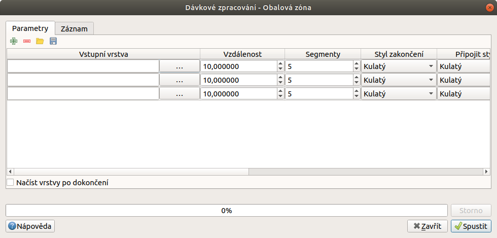
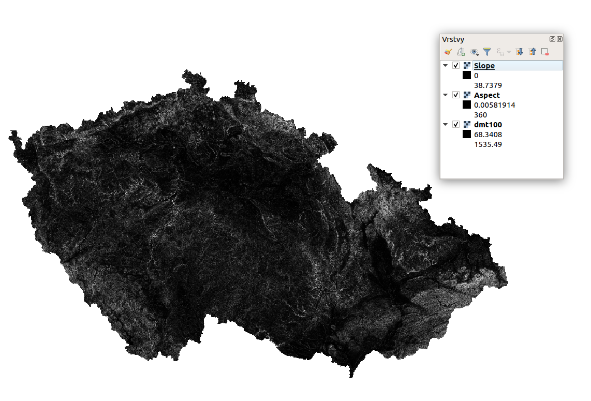

.. |symbologyAdd| image:: ../images/icon/symbologyAdd.png
   :width: 1.5em
.. |symbologyRemove| image:: ../images/icon/symbologyRemove.png
   :width: 1.5em
.. |mActionFileSave| image:: ../images/icon/mActionFileSave.png
   :width: 1.5em
.. |mActionFileOpen| image:: ../images/icon/mActionFileOpen.png
   :width: 1.5em
.. |alg| image:: ../images/icon/alg.png
   :width: 1.5em
.. |qgis| image:: ../images/intro_logo.png
   :width: 1.5em
.. |grass| image:: ../images/icon/grasslogo.png
   :width: 1.5em
.. |saga| image:: ../images/icon/custom_saga.png
   :width: 1.5em
.. |gdal| image:: ../images/icon/gdal.png
   :width: 1.5em
   
.. _davka:

Dávkové zpracování
==================

Dávkové zpracování nám umožní spustit jeden algoritmus vícekrát najednou s 
různými parametry. Spustit dávkový preces lze přímo z okna nástrohů zpracování 
vyvoláním kontextové nabídky pravým kliknutím na požadovaný algoritmus a 
výběrem :guilabel:`Spustit dávkový proces` (:numref:`batch`). Další možnost jak 
dávkový proces spustit je přío z okna algoritmu, kde se nám v horní liště 
ukáže tlačítko :item:`Spustit jako dávkový proces` (:numref:`batch2`).

.. _batch:
.. figure:: images/geoproc_batch.png 
   :class: small

   Spuštění dávkového procesu z okna nástrojů zpracování.

.. _batch2:
.. figure:: images/geoproc_batch2.png 
   :class: small 

   Tlačítko :item:`Spustit jako dávkový proces` v okně algoritmu.

Popis okna
----------

V okně dávkového zpracování máme opět záložky :guilabel:`Parametry` a
:guilabel:`Záznam`. V záložce :guilabel:`Parametry` se nám zobrazí
všechny vstupní parametry vybraného algoritmu v jednom řádku, každý
řádek potom odopovídá samostatnému procesu. Řádky lze přidávat a
odebírat pomíc tlačítek |symbologyAdd| a |symbologyRemove|. Dále lze
nakonfigurovaný dávkový proces uložit |mActionFileSave| do souboru ve
formátu :wikipedia:`JSON` nebo tento typ souboru nahrát
|mActionFileOpen|. U algoritmů, kde je možná volba pokročilého
nastavení se pro aktivaci těchto parametrů ukáže ikonka |alg|. Záložka
záznam má totožnou funkci jako u samostatného procesu.

   Okno dávkového zpracování.
   
.. warning:: Při odebírání řádků se odebere vždy poslední řádek.
   
Zadávání parametrů
------------------
Zadávání parametrů funguje, až na malé odchylky, stejně jako u samostatného 
procesu. Některá specifika si popíšeme níže.

Výběr vrstev
^^^^^^^^^^^^
Výběr vrstev provádíme za pomocí tlačítka :item:`...`, kdy můžeme buď vybrat 
vrstvy nahrané v projektu (:numref:`batchlay`) nebo vyhledat soubory uložené na 
disku. V obou případech je možné (u některých algoritmů nutné) vybrat více 
vrstev. Pokud se jedná o algoritmus se vstupem jedné vrstvy, při výběru  více 
vrstev se jednotlivé vrstvy přiřadí k vlastním procesům procesům.

.. figure:: images/geoproc_batch_lay.png 
   :class: tiny

   Možnosti výběru vrstev.
   
.. _batchlay:
.. figure:: images/geoproc_batch_lay2.png 
   :class: tiny

   Výběr více vrstev v projektu.
   
   
.. figure:: images/geoproc_batch_lay3.png 
   :class: middle 

   Při výběru více vrstev se každá přiřadí k vlastnímu procesu.
   
Výstupní soubor
^^^^^^^^^^^^^^^

Zde je, oproti samostatnému procesu, nutné zadat cestu k výstupnímu souboru 
pomocí tlačítka :item:`...`. Stačí však zadat uložení prvního výstupního 
souboru a objeví se nám okno pro automatické doplnění výstupních souborů 
(:numref:`batchout`). Zde je možné automaticky vytvořit výstupní soubory s 
příponou pořadového čísla nebo na základě vybraného vstupního parametru 
(název vrstvy, velikost bufferu atd., viz :numref:`batchout2`).

.. warning:: Pokud v obecném nastavení možností zpracování neaktivujeme 
	     |alg|:guilabel:`Použít název souboru pro název vrstvy` budou 
	     všechny vrstvy stále pojmenovávány podle algoritmu (viz. 
	     :ref:`nastaveni` ). Soubory však budou pojmenované podle naší 
	     konfigurace výstupu.

.. _batchout:
.. figure:: images/geoproc_batch_out.png 
   :class: tiny
   
   Nastavení automatického vyplnění výstupního souboru.
   
.. _batchout2:
.. figure:: images/geoproc_batch_out2.png 
   :class: tiny
   
   Možnosti automatického vytvoření přípon výstupního souboru.

.. note:: U vektorových dat vstupují pouze vybrané prvky (v závislosti na 
	  obecném nastavení).

Ostatní vstupy
^^^^^^^^^^^^^^
Ostatní vstupy nelze vyplnit pro všechny procesy hromadně. U číselných vstupů 
nelze zadávat hodnoty pomocí kalkulátoru tak jako u samostatného procesu.

Praktická ukázka
----------------

V následujících příkladech si ukážeme možné praktické využití dávkového 
zpracování.

Tvorba vícenásobné obalové zóny
^^^^^^^^^^^^^^^^^^^^^^^^^^^^^^^

V případě, že potřebujeme kolem nějakého území vytvořít větší počet
různě velkých obalových zón, je možné využít funkci
|qgis|:guilabel:`Obalová zóna dle pevné vzdálenosti` v režimu
dávkového procesu. Z vrstvy velkoplošných chráněných území vybereme
jedno území a vytvoříme tři obalové zóny (1, 5 a 10 km).

Spustíme dávkový proces algoritmu, nastavíme vstupní vrstvu s vybraným prvkem 
do tří řádků (pro každý proces) a požadované hodnoty vzdáleností obalové zóny 
v metrech (1000, 5000, 10000). 

   Tvorba vícenásobné obalové zóny vybraného území.

Vybereme výstupní soubor a nastavíme automatickou výpň na základě parametru 
:guilabel:`Vzdálenost` a spustíme dávkový proces tlačítkem :item:`Run`, 
zkontrolujeme záznama a zavřeme okno.

.. figure:: images/geoproc_batch_pract1_2.png 
   :class: tiny

   Nastavení automatického vyplnění na základě paraetru - Vzdálenost.

   Výsledné názvy výstupních souborů
   
.. figure:: images/geoproc_batch_pract1_4.png 
   :class: middle

   Výsledek tvorby vícenásobné obalové zóny.

Ořezání více rastrových vrstev 
^^^^^^^^^^^^^^^^^^^^^^^^^^^^^^
K tomuto úkolu si nejdříve vytvoříme z digitálního modelu terénu (dmt) 
vybraného velkoplošného chráněného území vrstvu sklonu svahů (Slope) a 
orientace svahů (Aspect). K vytvoření vrstvy sklonu a orientace svahů jsme nyní 
schopni využít mnoho funkcí, mimo vestavěné funkce to jsou  např. GDAL 
|gdal|:guilabel:`Sklon` a |gdal|:guilabel:`Aspekt` nebo využít externí 
|grass|:grasscmd:`r.slope.aspect` nebo |saga|:guilabel:`Slope, aspect, 
curvature`.

   Vybrané území.
   
Vytvořili jsme tedy 2 nové rastrové vrstvy pro dané území. Potřebujeme
také výstup z vybrané části území. V tomto případě využijeme opět
funkce |gdal| :guilabel:`Oříznout rastr podle rozsahu`, ale tentokrát
jako dávkový proces na všechny rastrové vrstvy najednou.
  
Jako vstupní vrstvy vybereme rastrové vrstvy, které chceme ořezat (dmt, aspect, 
slope), a zvolíme rozsah ořezu v mapovém okně, hodnotu rozsahu potom 
nakopírujeme do dalších řádků (:numref:`batchclip`). Výstupním souborům necháme 
přidělit příponu podle paraetru :guilabel:`Vstupní vrstva` a spustíme proces.

.. _batchclip:

        
   Vstupní vrstvy a zvolený rozsah pro dávkový zpracování 
   |gdal| :guilabel:`Oříznout rastr podle rozsahu`.
   
.. figure:: images/geoproc_batch_pract2_4.png 
   
   Automatické přidělení přípony výstupním souborům na základě
   vstupních vrstev.
   
.. figure:: images/geoproc_batch_pract2_5.png 
   
   Výsledek hromadného ořezání rastrových vrstev.
   
