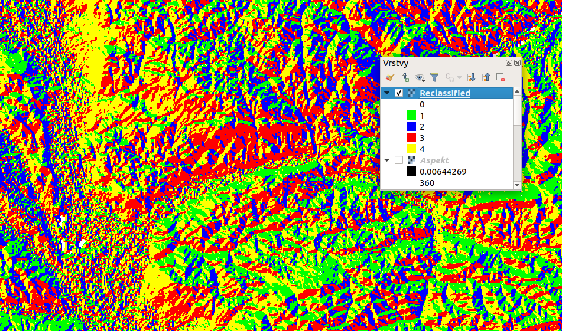
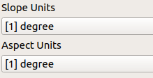

.. |grass| image:: ../images/icon/grasslogo.png
   :width: 1.5em
.. |saga| image:: ../images/icon/custom_saga.png
   :width: 1.5em

.. _externi:

Externí geoalgorytmy (GRASS GIS, SAGA, R)
=========================================
Jak již bylo zmíněno, pomocí nástrojů zpracování lze spouštět algoritmy 
externích poskytovatelů. Tímto způsobem lze spouštět algoritmy např. ze 
softwarů GRASS GIS, SAGA či R. Dále je možné spouštět funkce některých pluginů.
Požadované poskytovatele je nejdříve nutné aktivovat (viz. 
kapitola :ref:`nastaveni`).

GRASS
-----

Reklasifikace rastru
^^^^^^^^^^^^^^^^^^^^
Pomocí funkce |grass| :grasscmd:`r.reclass` lze snadno reklasifikovat rastry 
do kategorii. Ukážeme si reklasifikaci na příkladu orientace svahů (aspect). 

Nejdříve je nutné připravit si textový soubor, ve kterém bude definována naše 
zvolená klasifikace

::

	0 thru 45 = 1 sever
	45 thru 135 = 2 vyhod
	135 thru 225 = 3 jih
	225 thru 315 = 4 zapad
	315 thru 360= 1 sever
	0 = 5 rovina
	

Po té spustíme algoritmus |grass| :grasscmd:`r.reclass` a zadáme vstupní 
vrstvu (sklony svahů) a vytvořený textový soubor. Po vytvoření výstupu, 
můžeme rastr nastylovat.

.. figure:: images/geoproc_reclass.png 
   :class: middle 
   :scale-latex: 40 

   Spouštění algoriitmu |grass| :grasscmd:`r.reclass` 
   
.. figure:: images/geoproc_reclass2.png 
   :class: middle 
   :scale-latex: 40 

   Nastavení stylu reklasifikované vrstvy sklonu svahů
   

   Výsledná rastrová vrstva sklonu svahů

Pokud bychom chtěli získat data s plovoucí desetinou čárkou (float) je nutné 
použít funkci |grass| :grasscmd:`r.recode`. Toho lze využít pokud potřebujeme 
rastr s hodnotami od 0 do 1 (např. pro klasifikaci vhodnosti podmínek při 
výpočtu krajiného potenciálu pro výskyt konkrétního organismu)

.. tip:: Pro další možnosti zápisu reklasifikace přejděte v okně nástroje na 
		 záložku nápověda, nebo otevřete nápovědu přímo v manuálu GRASS GIS - 
		 :grasscmd:`r.reclass`
	
SAGA
----
Slope, aspect, curvature
^^^^^^^^^^^^^^^^^^^^^^^^
Tento algoritmus nám umožní vytvořit z digitálního modelu terénu (dmt) vrstvu 
sklonů, orientace svahů a různých typů zakřivení. Výhodou je možnost výběru 
metody, ale především výstupních jednotek u svahů a orientací 
(:num:`#sagajednotky`). Sklon svahu můžeme zvolit buď ve stupních, 
radiánech nebo procentech. Orientaci svahu potom ve stupních nebo radiánech. 
Při spuštění algoritmu se vypočítají sice všechny výstupy, ale lze samostatně 
vybrat ty, které chceme nahrát do projektu či uložit do souboru.

.. figure:: images/geoproc_saga.png 
   :class: middle 
   :scale-latex: 40 

   Dialogové okno algoritmu |saga|:guilabel:`Slope, aspect, curvature`
   
.. _sagajednotky:

   Možnost výběru jednotek
   
.. figure:: images/geoproc_saga3.png 
   :class: large 
   :scale-latex: 40 

   Výsledek algoritmu |saga|:guilabel:`Slope, aspect, curvature`
