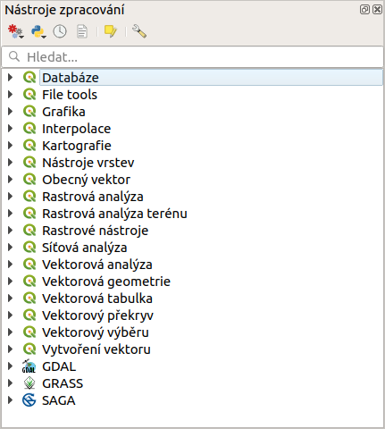

*******************
Nástroje zpracování
*******************

Kromě spouštění různých nástrojů a analýz z hlavního menu (položky
:menuselection:`Vektor` a :menuselection:`Rastr`), můžeme stejné (nebo
obdobné) funkce a mnoho dalších spouštět i z okna :item:`Nástroje zpracování`.

   Okno :item:`Nástroje zpracování`.

Nástroje zpracování jsou stěžejní součástí aplikačního rámce `Zpracování`
(Processing framework), a jejich použití má hned několik výhod. V jednom okně
najdeme funkce z knihovny GDAL, algoritmy poskytované pluginy a další
funkce dostupných externích nástrojů jako jsou například GRASS GIS,
SAGA nebo R.

.. note:: Více o knihovně GDAL ve školení :skoleni:`GeoPython pro
          pokročilé <geopython-pokrocily>`. Nástroj GRASS GIS je podrobně
          popsán ve školení :skoleni:`GRASS GIS pro začátečníky
          <grass-gis-zacatecnik>`.

Jednotlivé funkce lze rychle vyhledávat pomocí filtru v horní části
okna. Snadno lze spouštět dávkové zpracování dat, a v neposlední řadě
funkce (včetně externích) lze používat v grafickém modeleru
(viz. kapitola :ref:`modeler`).

Algoritmy mohou generovat různe typy výstupů:
	
	- rastrové vrstvy
	- vektorové vrstvy
	- tabulky
	- HTML soubory (textové a grafické výstupy) 
	- výběr prvků ve vektorové vrstvě

.. toctree::
   :maxdepth: 2
   
   uvod
   spousteni
   nastaveni
   externi
   davka
           
