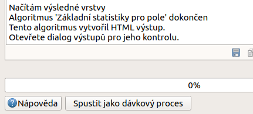
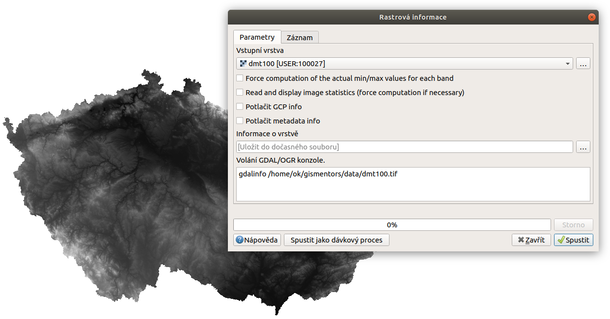

.. |checkbox| image:: ../images/icon/checkbox.png
   :width: 1.5em
.. |tileindex| image:: ../images/icon/tileindex.png
   :width: 1.5em
.. |gdal| image:: ../images/icon/gdal.png
   :width: 1.5em
.. |qgis| image:: ../images/qgis_logo_old.png
   :width: 1.5em

.. _nastaveni:

Nastavení, historie, prohlížení výsledků
========================================

Nastavení
---------

Nastavení sady nástrojů nalezneme v hlavním menu
:menuselection:`Zpracování --> Možnosti...` (:kbd:`Ctrl+Alt+C`). Zde
můžeme procházet, aktivovat a deaktivovat poskytovatele algoritmů,
uživatelské skripty a modely, dále lze přidat jednotlivé funkce do hlavního menu
a lišty, nastavit obecné chování při spouštění algoritmů případně nastavit
chování konkrétních poskytovatelů. Pro prohledávání nastavení lze využít filtr
v horní části okna.

.. figure:: images/geoproc_conf.png 
   :class: small
        
   Okno nastavení sady nástrojů.

Obecné nastavení
^^^^^^^^^^^^^^^^

V obecném nastavení lze nastavit globální chování všech algoritmů
(nezávisle na poskytovateli).

.. figure:: images/geoproc_obec.png 
   :class: small
   
   Obecné nastavení zpracování.
   
Vybraná nastavení:

	- :guilabel:`Použít název souboru pro název vrstvy` - pokud je
          neaktivní, tak výstupní vrstva nese automaticky vygenerovaný
          název, většinou související s danou funkcí (např. funkce
          :guilabel:`Obalová vrstva vekt. vrstvy` ``->`` vrstva
          :guilabel:`Obalová zóna`). V opačném případě se název vrstvy
          generuje z vytvořeného výstupního souboru, to je vhodné
          pokud ručně zadáváme název souboru. Pokud v tomto případě
          ukládáme výstup do dočasných souborů, bude vrstva přebírat
          název tohoto souboru (např. :guilabel:`OUTPUTLAYER.shp` nebo
          jiný, komplikovaný název).
	- :guilabel:`Použít pouze pro vybrané prvky` - výpočet se
          provede jen nad prvky ve výběru.
	- :guilabel:`Post(Pre)-execution script` - možnost nastavit
          cestu ke skriptům, které se budou automaticky spouštět před
          nebo po spuštění algoritmů.
	- :guilabel:`Styl pro ... vrstvy` - možnost nastavení
          uživatelských stylů (symbologie) u různých typů výstupů. Je
          nutné nastavit cestu k souboru s uloženým stylem.
	- :guilabel:`Varovat před spuštěním pokud nesouhlasí SRS
          vrstev` - upozorní pokud chceme provádět analýzy nad daty v
          různých souřadnicových systémech, nutné např. u překryvných
          analýz.
	- :guilabel:`Výstupní složka` - nastavení defaultní výstupní
          složky kam se mohou ukládat výstupy. V případě, že nechceme
          aby se výstup uložil pouze do dočasných souborů, zadáme při
          provádění operace název souboru a ten se uloží do
          přednastavené složky.
	- :guilabel:`Zobrazit definici SRS vrstvy ve výběrových
          boxech` - při výběru vrstev v analýzách uvidíme kromě názvu
          vrstvy i její EPSG kód.

Nastavení poskytovatelů, modeleru aj.
^^^^^^^^^^^^^^^^^^^^^^^^^^^^^^^^^^^^^

V nastavení poskytovatelů procesů se hlavně setkáme z možností
aktivace a deaktivace poskytovatelů (:guilabel:`Activate`
|checkbox|). U jednotlivých poskytovatelů potom mohou být další
možnosti nastavení, jako v případě uživatelských skriptů |tileindex|
:item:`Složka skriptů`, kde můžeme nastavit cestu k našim uživatelským
skriptům.

.. figure:: images/geoproc_poskyt.png 
   :class: small
        
   Nastavení uživatelských skriptů.
   
Přidání tlačítka do nástrojové lišty a hlavního menu
^^^^^^^^^^^^^^^^^^^^^^^^^^^^^^^^^^^^^^^^^^^^^^^^^^^^
V okně nastavení zpracování máme také možnost vytvořit pro jednotlivé algoritmy
položku v hlavním menu, přičemž se nám na liště vytvoří tlačítko pro rychlé
spouštění. To je vhodné pokud používáme k práci opakovaně několik algoritmů,
zejména pak u vytvořených vlastních nástrojů (skripty, modely). K tlačítku v
jde nastavit vlastní ikonka.

.. figure:: images/geoproc_menu_add.png 
   :class: small 

   Přidání tlačítka do nástrojové lišty a hlavního menu
 
.. figure:: images/geoproc_menu_add2.png 
   :class: small 

   Vzled položky v menu a ikonka v nástrojové liště
 

Historie
--------

V okně historie můžeme procházet historii použitých procesů. Okno lze
spustit z menu :menuselection:`Zpracování --> Historie...`, nebo
použitím klávesové zkratky :kbd:`Ctrl+Alt+H`. Ve složce
:item:`ALGORITHM` najdeme seznam spuštěných procesů s vypsaným Python
kódem ve spodní části okna. Tyto procesy lze znovu spustit dvojitým
klikem anebo pomocí Python kódu. V okně se mohou objevit i další
složky: :item:`INFO`, :item:`ERROR`, :item:`WARNINGS`, ve kterých
najdeme další informace nebo chyby ve spouštěných procesech.

.. figure:: images/geoproc_histor.png 

   Okno historie spuštěných algoritmů.
   

Prohlížeč výsledků
------------------

Některé algoritmy generují jako výstup HTML soubor. Pokud takový
algoritmus spouštíme na konci záznamu, tak se nám vypíše text
:guilabel:`HTML output has been generated by this algorithm`
(:numref:`htmlfig`). Okno výsledků slouží k prohlížení tabulek a HTML
výstupů. Otevřeme ho z menu :menuselection:`Zpracování --> Prohlížeč
výsledků...` nebo použitím klávesové zkratky :kbd:`Ctrl+Alt+R`.

.. _htmlfig:

   Informace o vytvoření HTML souboru v záznamu algoritmu.

.. figure:: images/geoproc_vysled.png 
   :class: small

   Ukázka výsledku z funkce :guilabel:`Základní statistiky pro
   numerická pole`.
   
Ukázky algoritmů generující HTML výstupy
^^^^^^^^^^^^^^^^^^^^^^^^^^^^^^^^^^^^^^^^

Základní statistiky pro numerická pole (vektor)
...............................................

Pomocí funkce |qgis| :guilabel:`Základní statistiky pro numerická
pole` zjistíme základní statistiky týkající se rozlohy *velkoplošných
chráněných území*. Spustíme funkci vybereme požadovanou vrstvu a
parametr podle kterého se budou údaje počítat. Výsledek potom
zkontrolujeme v prohlížeči výsledků :menuselection:`Zpracování -->
Prohlížeč výsledků...`.

.. figure:: images/geoproc_pract_3.png 
   :class: middle 

   Funkce |qgis| :guilabel:`Základní statistiky pro numerická pole`.

Informace (rastr)
.................

Pomocí funkce |gdal| :guilabel:`Informace` (spouští příkaz 
:guilabel:`gdalinfo`) zjistíme základní informace o rastru. Výsledek potom 
zkontrolujeme v prohlížeči výsledků :menuselection:`Zpracování --> Prohlížeč 
výsledků...`.

   Funkce |gdal| :guilabel:`Informace` (spouští příkaz :guilabel:`gdalinfo`).
