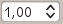
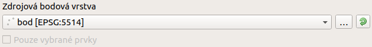
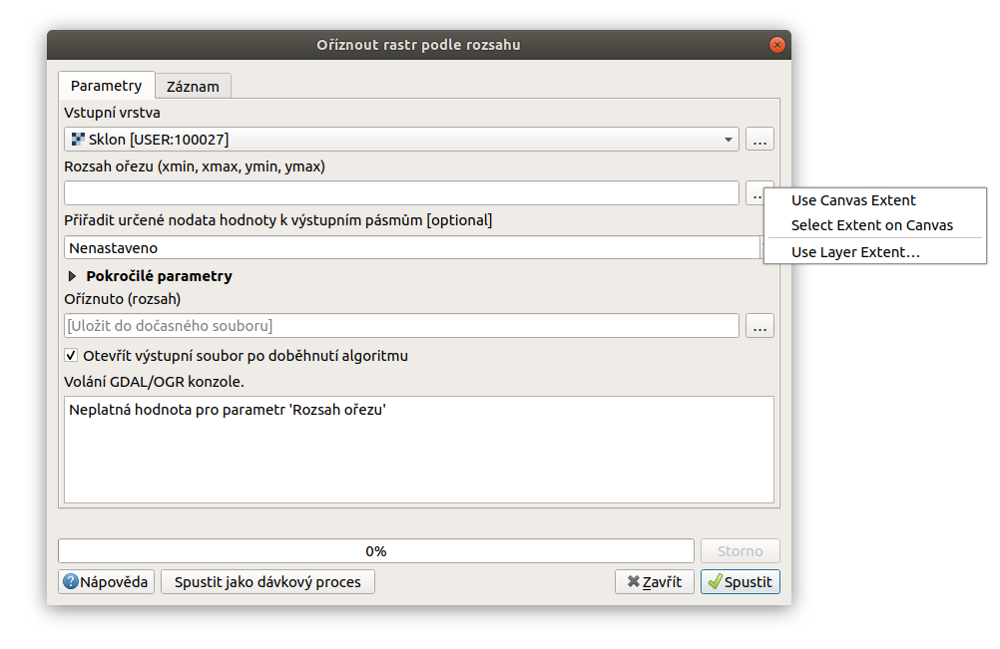
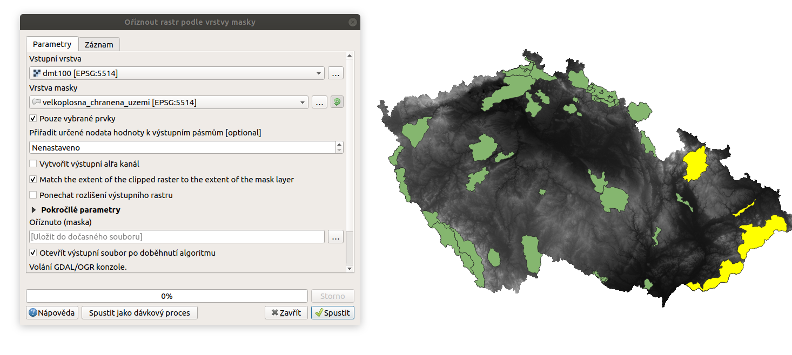

.. |iterate| image:: ../images/icon/custom_iterate.png
   :width: 1.5em
.. |gdal| image:: ../images/icon/gdal.png
   :width: 1.5em

Spouštění geoalgoritmů
======================

Jednotlivé algoritmy se spouštějí z okna nástrojů zpracování a to
dvojitým kliknutím, nebo vyvoláním kontextového menu kliknutím pravým
tlačítkem s výběrem možnosti :guilabel:`Spustit`. V kontextovém menu
je také možnost :guilabel:`Spustit jako dávkový proces`, kterou si
popíšeme v části :ref:`davka`.

.. figure:: images/geoproc_spu.png 
   :scale-latex: 40 

   Spouštění geoalgoritmů.
   
Dialogové okno
--------------

Dialogové okno se skládá z několika záložek. Na hlavní záložce 
:guilabel:`Parametry` zadáváme vstupní parametry (a výstupní soubor) algoritmu. 
Další záložkou je :guilabel:`Záznam`, kde vidíme výpis operací,	které probíhájí 
při spuštění algoritmu. U některých 
funkcí (např. GRASS) se v pravé části okna zobrazí krátký popisek funkce. U 
algoritmů GDAL vidíme také ve spodní části okna výsledný příkaz podle 
námi zadaných parametrů. I když je každý algoritmus jiný a potřebuje 
specifické vstupy a nastavení, základní struktura dialogového okna se nemění. 

.. figure:: images/geoproc_wind.png 

   Dialogové okno algoritmu (GDAL - Oříznout rastr podle rozsahu).
   
.. figure:: images/geoproc_zaznam.png 
   
   Záznam průběhu algoritmu (GDAL - Sklon).
   
Nejčastější parametry
---------------------

Vstupní vrstva
^^^^^^^^^^^^^^

Lze vybrat pomocí rolovací nabídky, kde se nám vypíšou vrstvy nahrané
v projektu. V nabídce se nám zobrazí pouze ty vrstvy, které mohou do
algoritmu vstoupit (je-li potřeba rastr, vektorové vrstvy se zde
vypisovat nebudou a naopak). Za názvem vrstvy je v hranatých závorkách
uveden EPSG kód vrstvy např. :item:`[EPSG:5514]`. Pokud požadovanou
vrstvu v projektu nemáme, můžeme použít tlačítko :item:`...` a vybrat
odpovídající vrstvu uloženou na disku. U vektorových vrstev se můžeme
setkat s tlačítkem |iterate|, které slouží ke spouštění iterace nad
vrstvou. V takovém případě se algoritmus bude spouštět pro každý prvek
ve vrstvě zvlášť. Při iteraci se ve výchozím nastavení processingu
používají pouze vybrané prvky (pokud nějaký výběr máme).

   Příklad vstupní zdrojové vrstvy.

Vícenásobný výběr vrstev
^^^^^^^^^^^^^^^^^^^^^^^^
U některých algoritmů je možné (nebo nutné) vybrat jako vstup nebo parametr 
více vrstev. Pomocí tlačítka :item:`...` se nám otevře okno výběru vrstev.

.. figure:: images/geoproc_vstup_multi.png 

   Příklad algoritmu kde vstupuje více vrstev (GDAL - Sloučit).
   
Rozsah
^^^^^^

Rozsah se zadává v souřadnicích xmin, xmax, ymin, ymax. Tento parametr lze 
zadat ručně, pomocí tlačítka :item:`...` můžeme vybrat rozsah tažením 
v mapovém okně anebo zvolit rozsah daný jinou vrstvou či současným zobrazením 
v mapovém okně. V případě že se jedná o rozsah vstupní vrstvy a pole 
nevyplníme, automaticky se použije minimální rozsah vrstvy.

   Možnosti při výběru rozsahu.
   
   
..   .. figure:: images/geoproc_vstup_ext2.png 
       :class: tiny 

       Použití rozsahu vrstvy/mapového okna.

.. figure:: images/geoproc_vstup_ext3.png 

   Zvolení rozsahu v mapovém okně.
   
.. note:: Kopírování rozsahu vrstvy z projektu nelze kvůli chybě v
          současné LTR verzi QGIS použít

Číselené hodnoty
^^^^^^^^^^^^^^^^
Číselné hodnoty se mohou objevovat ve dvou formátech - celé číslo (int) a číslo 
s desetinnou čárkou (float). Zadat je lze ručně nebo pomocí tlačítek 
|selectnumber|. Pomocí tlačítka :sup:`Daty definované přepsání` lze také
použít hodnoty z atributů prvků nebo pomocí položky `Upravit...` otevřít 
kalkulátor, ve kterém můžeme vytvořit vzorec pro výpočet hodnoty.

.. figure:: images/geoproc_vstup_cis.png 
   :class: small 

   Zadání čísla pomocí vzorce nebo odvozených hodnot.

.. note:: V případě, že parametr vyžaduje celé číslo, desetinné hodnoty z 
          kalkulátoru se zaokrouhlují.

Výstupní soubor
^^^^^^^^^^^^^^^

Pokud nenastavíme cestu nebo název
souboru, výstup se nám automaticky uloží na disk do dočasných
souborů. Pokud zadáme do pole název, vrstva se nám uloží do
předdefinované složky (výchozí nastavení je složka s aktuálním
profilem, viz :menuselection:`Nastavení --> Možnosti --> Zoracování
--> Obecné --> Výstupní složka`). Pomocí tlačítka :item:`...` lze
zvolit další možnosti uložení. Výstup je možné uložit do souboru,
GeoPackage nebo PostGIS. Chování tvorby výstupního souboru
jde změnit v nastavení (viz. kapitola :ref:`nastaveni`).

.. tip:: Pomocí položky :item:`Upravit vykreslovací styly pro výstupy`
         v kontextovém menu algoritmu (pravý klik na algoritmus v
         seznamu), lze změnit výchozí styly jednotlivých výstupů
         použitím uložených stylů.

Další parametry
^^^^^^^^^^^^^^^
Dále se často můžeme setkat s výběrem nebo zadáváním různých parametrů pomocí 
checkboxů a rolovacích nabídek. V některých případech vstupují do algoritmu 
tabulky nebo je nutné zadat parametr výstupního SRS (EPSG). To probíhá 
standardně ze seznamu SRS.

.. .. tip:: Pomocí položky :item:`Create preconfigured algorithm` v kontextovém
             menu algoritmu (pravý klik na algoritmus v seznamu), můžeme vytvářet 
             přednastavené algoritmy pro rychlé spouštění. Pro přednastavené
             algoritmy se vytváří samostatné spouštěče v položce `Preconfigured
             algorithms`. Zde se dále dělí podle zvolených kategorií.

Praktická ukázka
----------------

Ořez rastru
^^^^^^^^^^^

Pomocí funkce GDAL |gdal| :guilabel:`Oříznout rastr podle rozsahu` vytvoříme 
výřez rastru EU-DEM pomocí rozsahu vybraným v mapovém okně. Výstupní soubor 
necháme uložit do dočasných souborů.

   Ořezání rastru pomocí funkce |gdal| :guilabel:`Oříznout rastr podle rozsahu`. 

Využití iterace
^^^^^^^^^^^^^^^
Pomocí funkce GDAL |gdal| :guilabel:`Oříznout rastr podle vrstvy masky` 
ořežeme rastrovou vrstvu EU-DEM pomocí masky *velkoplošných chráněných území*. 
Pro ořezání rastru jen pro naše vybraná území využijeme možnosti iterace. Jak 
jsme již zmínili výše, při iteraci se ve výchozím nastavení processingu 
používají pouze vybrané prvky.

   Ořezání rastru vybranými prvky vrstvy pomocí funkce |gdal| 
   :guilabel:`Oříznout rastr podle vrstvy masky`. 
   
.. figure:: images/geoproc_pract_2_2.png 
   :class: middle 
   :scale-latex: 40 

   Výsledek výřezu vybraných prvků.

		
