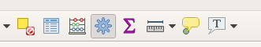
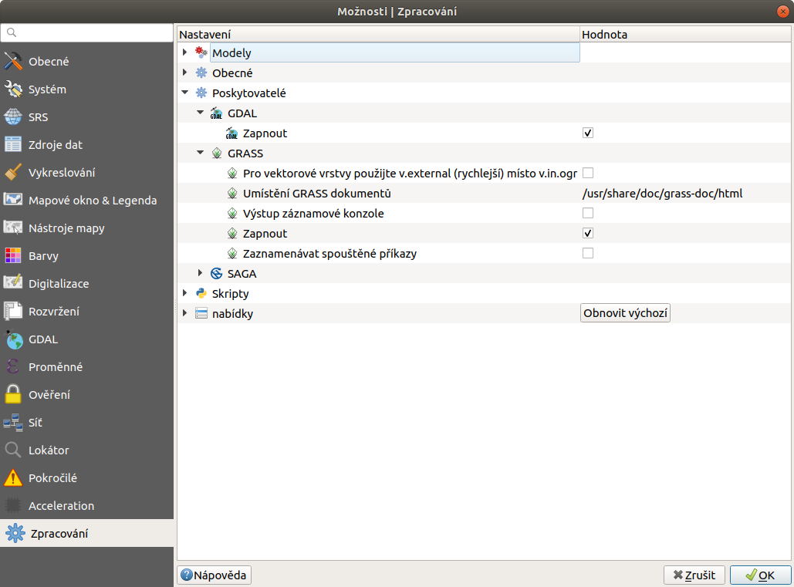

Nastavení a orientace v nástrojích
==================================

Aktivace sydy nástrojů
----------------------
Okno sady nástrojů lze aktivovat v hlavním menu :menuselection:`Zpracování --> Sada nástrojů`, nebo použitím klávesové zkratky :kbd:`Ctrl+Alt+T`, nebo stejně jako u vypínání a zapínání ostatních panelů, nástrojových lišt a oken - pravým kliknutím na panel a výběrem z nabídky.

   Aktivovat sady nástrojů v hlavním menu :menuselection:`Zpracování --> Sada nástrojů`
   

.. note:: Pokud nemáte možnost aktivovat panel sady nástrojů, je možné, že máte deaktivovaný plugin :item:`Processing`, který tento panel poskytuje.

Nastavení
---------
Nastavení sady nástrojů nalezneme v hlavním menu :menuselection:`Zpracování --> Možnosti...` (:kbd:`Ctrl+Alt+C`). Zde můžeme procházet, aktivovat a deaktivovat poskytovatele algoritmů, uživatelské scripty a modely, dále lze nastavit obecné chování při spouštění algoritmů případně nastavit chování konkrétních poskytovatelů.

   Okno nastavení sady nástrojů

Orientace v okně
----------------

