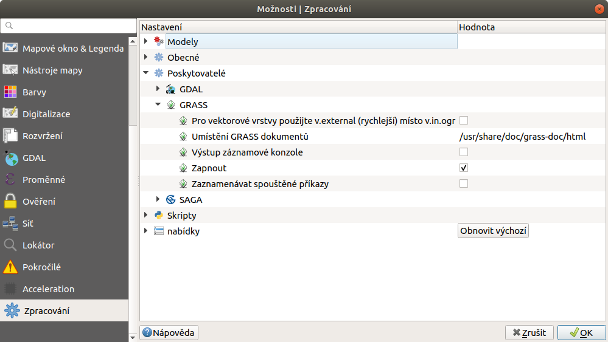
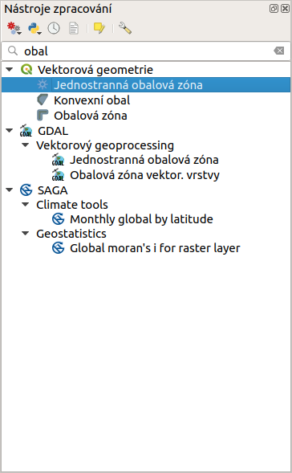
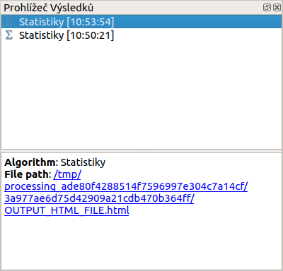

.. |alg| image:: ../images/icon/alg.png
   :width: 1.5em
.. |checkbox| image:: ../images/icon/checkbox.png
   :width: 1.5em
.. |tileindex| image:: ../images/icon/tileindex.png
   :width: 1.5em

Nastavení a orientace v nástrojích
==================================

Aktivace sydy nástrojů
----------------------

Okno sady nástrojů |alg| lze aktivovat v hlavním menu
:menuselection:`Zpracování --> Sada nástrojů`, nebo použitím klávesové
zkratky :kbd:`Ctrl+Alt+T`, nebo stejně jako u vypínání a zapínání
ostatních panelů, nástrojových lišt a oken - pravým kliknutím na panel
a výběrem z nabídky.

.. figure:: images/geoproc_menu.png
   :scale: 70%

   Aktivace sady nástrojů v hlavním menu :menuselection:`Zpracování
   --> Sada nástrojů`
   

.. note:: Pokud nemáte možnost aktivovat panel sady nástrojů, je
          možné, že máte deaktivovaný plugin :item:`Processing`, který
          tento panel poskytuje.

Nastavení
---------

Nastavení sady nástrojů nalezneme v hlavním menu
:menuselection:`Zpracování --> Možnosti...` (:kbd:`Ctrl+Alt+C`). Zde
můžeme procházet, aktivovat a deaktivovat poskytovatele algoritmů,
uživatelské skripty a modely, dále lze nastavit obecné chování při
spouštění algoritmů případně nastavit chování konkrétních
poskytovatelů. Pro prohledávání nastavení lze využít filtr v horní
části okna.

.. figure:: images/geoproc_conf.png 
   :scale: 70%
   :scale-latex: 40 

   Okno nastavení sady nástrojů

Obecné nastavení
^^^^^^^^^^^^^^^^

V obecném nastavení lze nastavit globální chování všech algoritmů
(nezávisle na poskytovateli)

.. figure:: images/geoproc_obec.png 
   :scale: 70% 
   :scale-latex: 40 

   Obecné nastavení zpracování
   
Vybrané nastavení:

	- :guilabel:`Použít název souboru pro název vrstvy` - pokud je
          neaktivní výstupní vrstva nese automaticky vygenerovaný
          název, většinou související z funkcí. (např funkce
          :guilabel:`Obalová vrstva vekt. vrstvy` --> vrstva
          :guilabel:`Obalová zóna`). V případě že máme nastavení
          aktivní, název vrstvy se generuje z vytvořeného výstupního
          souboru, to je vhodné pokud ručně zadáváme název
          souboru. Pokud v tomto případě ukládáme výstup do dočasných
          souborů, bude vrstva přebírat tohoto souboru
          (např. :guilabel:`OUTPUTLAYER.shp` nebo jiný, komplikovaný
          název)
	- :guilabel:`Požít pouze pro vybrané prvky` - výpočet se
          provede jen nad prvky ve výběru
	- :guilabel:`Post(Pre)-execution script` - možnost nastavit
          cestu ke skriptům, které se budou automaticky spouštět před
          nebo po spuštění algoritmů
	- :guilabel:`Styl pro ... vrstvy` - možnost nastavení
          uživatelských stylů (symbologie) u různých typů výstupů. Je
          nutné nastavit cestu k souboru s uloženým stylem
	- :guilabel:`Varovat před spuštěním pokud nesouhlasí SRS
          vrstev` - upozorní pokud chceme provádět analýzy nad daty v
          různých souřadnicových systémech, nutné např. u překryvných
          analýz.
	- :guilabel:`Výstupní složka` - nastavení defaultní výstupní
          složky kam se mohou ukládat výstupy. V případě, že nechceme
          aby se výstup uložil pouze do dočasných souborů, zadáme při
          provádění operace název souboru a ten se uloží do
          přednastavené složky.
	- :guilabel:`Zobrazit definici SRS vrstvy ve výběrových
          boxech` - při výběru vrstev v analýzách uvidíme kromě názvu
          vrstvy i její EPSG kód.

Nastavení poskytovatelů, medeleru aj.
^^^^^^^^^^^^^^^^^^^^^^^^^^^^^^^^^^^^^

V nastavení poskytovatelů procesů se hlavně setkáme z možností
aktivace a deaktivace poskytovatelů (:guilabel:`Activate`
|checkbox|). U jednotlivých poskytovatelů potom mohou být další
možnosti nastavení, jako v případě uživatelských skriptů |tileindex|
:item:`Složka skriptů`, kde můžeme zmenit cestu k našim uživatelským
skriptům.

   Popis obrázku

Orientace v okně Nástroje zpracování
------------------------------------

Orientace v okně a prohledávání nástrojů je velice
intuitivní. Nástroje jsou struktorované podle poskytovatelů a dále
zpravidla rozdělené do tematických okruhů (vektorové analýzy, rastrové
analýzy atd.). Součástí této struktury je také položka
:menuselection:`Naposledy použité algoritmy` kde naleznete naposledy
použité funkce.

.. figure:: images/geoproc_orient.png
   :scale: 70%
   :scale-latex: 40 

   Ukázka orientace v okně podle tromové struktury

V horní části panelu je filtr pro rychlé vyhledání funkce. Výhodou
tohoto filtru je, že vyhledává i v neaktivních algoritmech a v případě
shody se zadaným řetězcem se ukáže ve spodní části upozornění s
možností prohlížení a rychlé aktivace algoritmů.

   Použití filtru a upozornění na výsledky v neaktivních algoritmech

Po kliknutí na odkaz na konci upozornění (:guilabel:`to view item`) se
ukáže struktura s výsledky od neaktivních poskytovatelů (šedá barva
tetu). Po kliknutí na tlačítko :guilabel:`Activete` se nám
poskytovatel aktivuje.

   Zobrazení výsledků neaktivních algoritmů s možností aktivace
   
Historie
--------

V okně historie můžeme procházet historii použitých procesů. Okno lze
spustit z menu :menuselection:`Zpracování --> Historie...`, nebo
použitím klávesové zkratky :kbd:`Ctrl+Alt+H`. Ve složce
:item:`ALGORITHM` najdeme seznam spuštěných procesů s vypsaným python
kódem ve spodní části okna. Tyto procesy lze znovu spustit dvojitým
klikem, a nebo pomocí python kódu. V okně se mohou objevit i další
složky: :item:`INFO`, :item:`ERROR`, :item:`WARNINGS`, ve kterých
najdeme další informace nebo chyby ve spouštěných procesech.

.. figure:: images/geoproc_histor.png 
   :scale: 70% 
   :scale-latex: 40 

   Okno historie spuštěných algoritmů
   
.. noteadvanced::
	
	.. todo:: popsat python
	

Prohlížeč výsledků
------------------

Okno výsledků slouží k prohlížení tabulek a HTML výstupů. Otevřeme ho
z menu :menuselection:`Zpracování --> Prohlížeč výsledků...`, nebo
použitím klávesové zkratky :kbd:`Ctrl+Alt+R`.

   Ukázka výsledku z funkce :guilabel:`Základní statistiky pro
   numerická pole`
