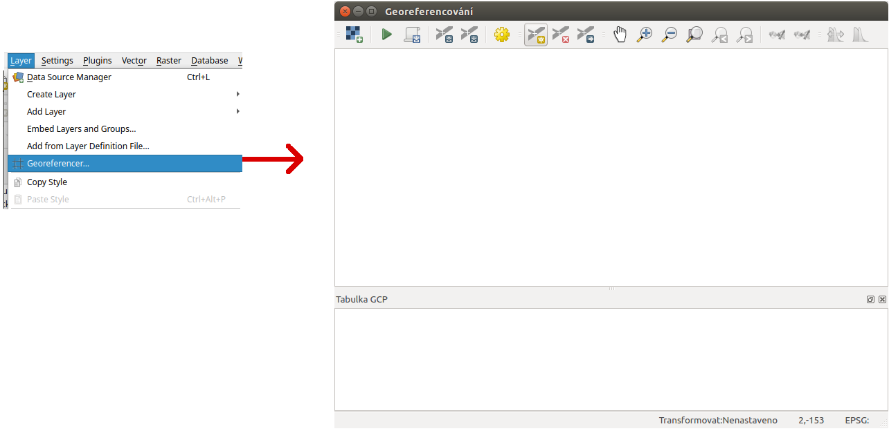
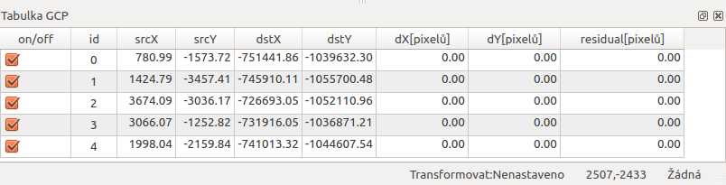
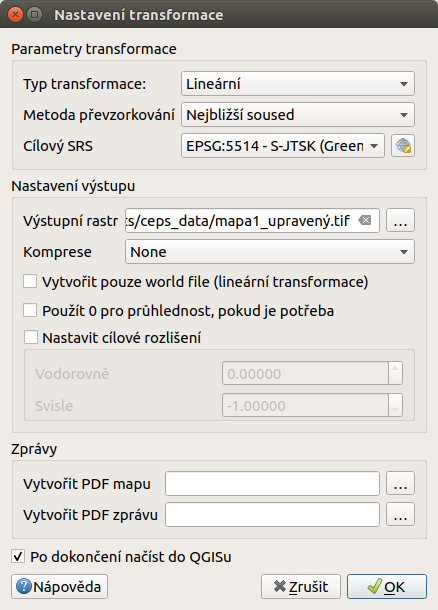

.. |mActionAddRasterLayer| image:: ../images/icon/mActionAddRasterLayer.png
   :width: 1.5em

.. |mActionAddGCPPoint| image:: ../images/icon/mActionAddGCPPoint.png 
   :width: 1.5em
.. |mActionDeleteGCPPoint| image:: ../images/icon/mActionDeleteGCPPoint.png 
   :width: 1.5em
.. |mActionMoveGCPPoint| image:: ../images/icon/mActionMoveGCPPoint.png 
   :width: 1.5em
.. |mActionStartGeoref| image:: ../images/icon/mActionStartGeoref.png 
   :width: 1.5em
   

Georeferencování obrazových dat 
^^^^^^^^^^^^^^^^^^^^^^^^^^^^^^^
V prostředí QGIS je možné pracovat s obrazovými daty - rastry. Jedná se o 
obrazová data s informací o jejich umístění v prostoru. 
Existuje však obrovské množství obrazových dat, které nejsou prostorově
umístěné a jsou to tedy jenom obrázky.
Existuje však možnost jak takovýmto datům určit jejich umístění v prostoru.
Tento proces se nazývá georeferencování.

Využití
=======
V současnosti je k dispozici velké množství obrazových dat, které nemají
protorovou informaci. Často je však žádané zobrazit si takováto data jako
podkladová, nebo je dále využívat pro tvorbu vektorových dat.
Typickým příkladem může být územní plán. Ten je často vypracován jako
přerozdělení prostoru do různých kategorií. Výsledný produkt je často ve 
formátu `pdf` - bez prostorových informací.
Abychom měli možnost pracovat s takovýmito daty jako s prostorovými, 
musíme využít nástroj pro georeferencování.

.. tip::

   Pokud zvolený rastr obsahuje i jiné části než samotnou polohovou složku dat
   (například legendu, popisek, měřítko a jíné), tak je vhodné zpracovávat
   již ořezaný obrázek.

1. instalace pluginu
====================
Nástroj pro georeferencování je možné nainstalovat přes Správce zásuvných
modulů menu :menuselection:`Zásuvné moduly --> Spravovat a instalovat
zásuvné moduly`. Plugin se jmenuje :item:`Georeferencovač GDAL` a je možné
jej najít v :menuselection:`Rastr --> Georeferencování --> Georeferencér` 
(:num:`georeferencer-menu`).
V pluginu se nachází 2 oddělená okna. V prvním se zobrazí zpracovávaný
rastr a v druhém tabulka tzv. `GCP bodů - identických bodů`.

.. _georeferencer-menu:

        
   Nástroj pro georeferencování.   

2. přidání zvoleného obrázku   
============================
Prvním krokem po zpuštění pluginu je přidání zvoleného rastru do nástroje.
Pomocí tlačítka |mActionAddRasterLayer| :sup:`Otevřít rastr`, se otevře
dialogové okno, pomocí kterého lze zvolit požadovaný vstupní rastr.

.. _add-raster:

.. figure:: images/raster_added.png
   :class: small
        
   Přídání obrázku pro georeferencování.

.. note::
   Díky knihovně GDAL jemožné georeferencovat velké množství formátů.
   Seznam všech formátů je vypsán v nástroji  pro přidání rastru. Mezi 
   podporované formáty patří také `pdf, jpeg, png` a mnoho dalších.

Výběrem a potvrzením se zvolený rastr načte do první části okna pluginu, 
kde je připraven na další kroky.

3. zadávání GCP - identických bodů
==================================
Dalším krokem je zadání tzv. identických bodů (z ang. `ground control 
points`). Jde o identifikaci polohy na zpracovávaném obrázku a následné
zadání souřadnic bodu v daném souřadnicovém systému (grafickým výběrem 
nebo zadáním souřadnic). 
Postup je zobrazen na :num:`add-gcp-point`. 
 * Prvním krokem je výběr nástroje pro přidávání bodů pomocí ikonky
   |mActionAddGCPPoint| :sup:`Přidat bod`.
 * Pak identifikujeme bod v georeferencovaném obrázku kliknutím na jeho
   polohu. Jak ikonka, tak zadaný bod jsou zvýrazněné v prvním okně. 
 * Okamžitě po zadání polohy kliknutím se otevře dialog pro zadání 
   mapových souřadnic bodu. Pokud souřadnice známe, tak je můžeme rovnou 
   zadat. Pro odečtení souřadnic z mapového okna je tam samostatná volba.
 * V mapovém okně označíme polohu bodu kliknutím a odečtené souřadnice 
   se automaticky vpíšou do dialogu. Souřadnice je možné i ručně upravit. 
 * Po potvrzení zadaných souřadnic se bod zapíše do tabulky pod 
   georeferencovaný rastr. 
 * V posledním okně je vidět číslo bodu, jeho souřadnice v obrázku, 
   souřadnice z mapového okna a prozatím prázdné kolonky pro 
   odchylky(dX,dY) v pixelech a celkový posun (residual) v pixelech.

.. _add-gcp-point:

.. figure:: images/add_gcp_point.png
        
   Přídávání identických bodů.

.. note::
   Pro dosažení požadovaného výseldku je nutné použít vícero bodů 
   (minimální počet bodů se liší dle dalšího voleného nastavení typu
   transformace). Podstatné je také jejich rozmístění, které by mělo 
   být takové, aby body pokryly ideálně celou plochu rastru rovnoměrně.
   Pokud pro daný typ zvolené transforamce použijete víc než minimální 
   potřebný počet bodů, tak se budou spočtené vektory odchylek na jednotlivých
   bodech vykreslovat do georeferencovaného obrázku. Je tak i graficky vidět
   směr a velikost jednotlivých odchylek.

.. tip::

   V určitých případech můžeme georeferencovat obrázek na kterém jsou
   definované souřadnice (formou křížů se souřadnicemi :num:`input-coordinates`,
   mapovým rámem s popisem, nebo zeměpisnou sítí s popiskami).

   .. _input-coordinates:

   .. figure:: images/input-coordinates.png

      Příklad vstupního obrázku s definovanými souřadnicemi.
   
   V takovém případě nemusíme bod zadávat kliknutím v mapovém okně ale přímo
   zadat souřadnice.
   Další možností je zadávání z mapového okna, kde se vykreslí souřadnicová 
   mřížka i s popisem. Nastavení mřížky je dostupné z menu
   :menuselection:`Zorazit --> Dekorace --> Mřížka...` (:num:`grid`).
   Samostatně se zde nastavuje vykreslování mřížky (symbologie, rozestupy,
   odsazení) a popisků (orientace, font, odsazení, počet desetinných míst).
   Nevýhodou je, že při georeferencování nejde dochytávat (snapovat) na tyto body
   (klasická vektorizace to umožňuje).

   .. _grid:

   .. figure:: images/grid.png
       
      Vykreslení mřížky a souřadnic v mapovém okně.

   Další možností je využití pluginu :item:`ZoomToCoordinates`. Zadáním
   žádaných souřadnic do vyhledávacích políček je možné zazoomovat na hledanou
   plohu. Nástroj funguje s souřadnicovém systému projektu.

Body je možné umazávat |mActionDeleteGCPPoint| :sup:`Smazat bod` anebo změnit
polohu bodu ve zpracovávaném obrázku nebo mapovém okně |mActionMoveGCPPoint|
:sup:`Přesunout CP bod`.   

   
   Přehled zadaných bodů v tabulce.

4. nastavení transformace
=========================
Po zadání dostatečného množství identických bodů je možné pokračovat 
dalším krokem. Buňky vstupního rastru musí být přepočítány pomocí klíče,
který je definován identickými body a typem transformace.
Tlačítko |mActionTransformSettings| :sup:`Nastavení transformace` otevře
dialogové okno, kde se nastavují následující parametry (:num:`transformation`)

 * komprese
 * výstupní rastr
 * souřadnicový systém výstupního rastru
 * vytvoření `pdf` mapy
 * vytvoření `pdf` zprávy
 * cílové rozlišení
 * použít průhlednost 

.. _transformation:
 

   Okno pro nastavení transformace.

Typ transformace:
-----------------
Jak již bylo uvedeno, tak k dispozici je zde více druhů transformací. Výběr
vhodné transformace záleží na kvalitě vstupního obrázku, jeho deformacích, které
chceme ve výsledku ovlivnit a na počtu identických bodů.

 * Lineární - (shodnostní) transformace založená na posunu a rotaci (měřítko se
   nemění), má speciální užití
 * Helmertova - (podobnostní) základní druh trasnformace založený na změně 
   měřítka, rotaci a posunu (tyto hodnoty jsou konstantní pro celý vstupní rastr)
 * Polynomiální (1.-3. stupeň) - transformace deformující zdrojový rastr za účelem
   minimalizování odchylek na identických bodech. Výslední rastr je lokálně
   deformován podle stupně polynomiální transformace. Například 1. stupeň je
   tzv. afinní transformace, kde je různý měřítkový koeficient pro osy X a
   Y. Polynomiální transformace jsou obecně nejčastěji používané pro
   georeferencování skenovaných map, ale je nutné dbát na vhodné rozložení
   identických bodů.
 * Thin Plate Spline - je modernější metoda pro georeferencování na základě
   zložitějších vztahů. Využití je podobné jako u polynomiálních.
 * Projektivní - (kolineární) založená na principu středového promítání 

+---------------------------------+--------------------------------------------+
| Typ transformace                | Minimální počet identických bodů           |
+=================================+============================================+
| Lineární                        | 2                                          |
+---------------------------------+--------------------------------------------+
| Helmertova                      | 2                                          |
+---------------------------------+--------------------------------------------+
| Polynomiální 1. stupně          | 3                                          |
+---------------------------------+--------------------------------------------+
| Polynomiální 2. stupně          | 6                     	               |
+---------------------------------+--------------------------------------------+
| Polynomiální 3. stupně          | 10			                       |
+---------------------------------+--------------------------------------------+
| Thin Plate Spline               | 3                                          |
+---------------------------------+--------------------------------------------+
| Projektivní             	  | 4                                          |
+---------------------------------+--------------------------------------------+

Metoda převzorkování
--------------------
Vzhled výsledného rastru lze ovlivnit i pomocí nastavení metody převzorkování.
Výběr konkrétní metody záleží zejména na požadavcích, zda má být zachována
původní charakterictika, nebo je spíš požadováno optické vyhlazení.

K dispozici jsou následující metody převzorkování:
 * nejbližší soused
 * lineární
 * kubický
 * kubický spline
 * Lanczos  

Další nastavení:
----------------

Komprese - lze vybrat kompresi pro vytvářený rastr

Výstupní rastr - zadání výstupního rastru

Cílový CRS - souřadnicový systém výstupního rastru

Vytvořit PDF mapu - vytvoření výstupního  :map:`.pdf`

Vytvořit PDF zprávu - uložení zprávy o parametrech transformace do :map:`.pdf`

Změnit cílové rozlišení - zadáním rozlišení v obou směrech (v mapových
jednotkách)

5.Spuštění georeferencování
===========================
Po nastavení transfomace a zadání dostatečného počtu identických bodů je možné
spustit tranformaci (|mActionStartGeoref| :sup:`Spustit georeferencování`).
Déla výpočtu je závislá na velikosti georeferencovaného rastru, ale také na
parametrech, které jsou nastaveny pro jeho zpracování.

Pokud pro nastavený typ transformace není zadán dostatečný počet identických
bodů, tak je to vidět na tabulce GCP (hodnoty odchylek na jednotlivých bodch
nejsou spočteny a je uvedena pouze "0" - první část :num:`gcp-points` )
Pokud by jste zkusili spustit georeferencování, tak vás varovná hláška informuje
o selhání tranformace z důvodu neřešitelnosti.
V druhé části :num:`gcp-points` je již do výpočtu zahrnut i bod ID = 2. U
každého bodu je vidět souřadnice zdroje, cíle, a odchylky v pixelech v
jednotlivých osách.

.. _gcp-points:

.. figure:: images/gcp_points2.png

   Příklad nedostačujícího počtu identických bodů pro zvolenou transformaci.

.. tip::

   Pokud by sme v tabulce viděli body se značnou odchylkou, tak je tento bod
   dobré zkontrolovat (v mapě i na zpracovávaném obrázku). Polohu bodu můžeme
   opravit, nebo bod vyřadit z rešení anebo ho úplně odstranit.

   Na :num:`gcp-mistake` je vidět, že byl zadán bod, který má extrémní odchylky.
   Výstupem georeferencování je pak rastr, který má značnou deformaci. Vektor
   odchylky je pak vykreslen do zpracovávaného obrázku 
    
   .. _gcp-mistake:

   .. figure:: images/gcp_remove_point.png

      Příklad nezahrnutí špatného bodu do výpočtu.

Výslený georeferencovaný rastr je pak možné přidat do mapového okna. Pomocí
transparentosti jednotlivých vrstev je možné dostatečně skontrolovat, zda
dosažená polohová přesnost vyhovuje požadavkům.

.. note::
   
   Pro zpracování jedné lokality na více obrazových vstupech je vhodné uložit
   použité identické body a pak je jenom zkontrolovat. Body lze uložit v
   :menuselection:`Soubor --> Uložit GCP body jako...` zadáním názvu výstupního
   souboru.
   Body lze znovu načíst pomocí :menuselection:`Soubor --> Načíst GCP body` .
   Takto uložené body lze editovat jednoduše jako textový soubor. 

 

