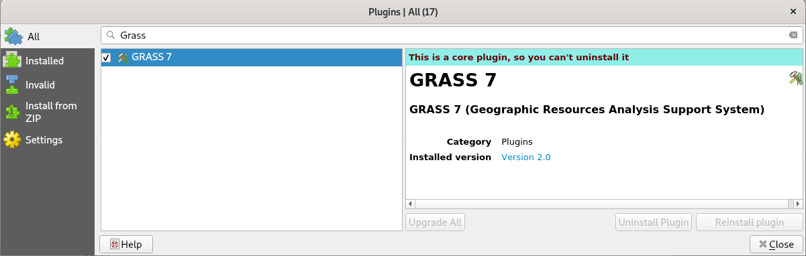

.. |mActionGrassTools| image:: ../images/icon/grass_tools.png
   :width: 1.5em

*******************
Zásuvný modul GRASS
*******************

.. todo:: v procesu tvorby

**Zásuvný modul GRASS** umožňuje kromě čtení a zápisu dat ve formátu GRASS
především volání nástrojů systému GRASS.

.. important:: Tato kapitola vyžaduje alespoň základní znalosti
               systému GRASS. Více ve školení :skoleni:`GRASS GIS pro
               začátečníky <grass-gis-zacatecnik>`.

Tento nástroj doporučujeme používat až od verze QGIS 2.14.
               
.. note:: Zásuvný modul GRASS byl součástí i starších verzi QGISu,
          nicméně podporoval pouze starší verzi systému GRASS
          6.4. Vzhledem k tomu, že nebyl svými tvůrci dostatečně
          udržován, tak byl v LTR verzi QGIS 2.8 odstraněn. V roce
          2015 proběhla `crowdfundingová kampaň
          <http://www.gissula.eu/qgis-grass-plugin-crowdfunding/>`_ s
          cílem zásuvný modul GRASS znovu do QGISu začlenit a přidat
          podporu pro aktuální verzi systému GRASS 7.0. Nově se tedy
          vrátil tento zásuvný modul do verze QGIS 2.10 a plně
          funkčním poté ve verzi QGIS 2.12.

.. todo:: vysvetlit rozdil oproti processingu

Tento zásuvný modul je výchozí součástí QGISu, je potřeba ho ale
aktivovat v :menuselection:`Zásuvné moduly --> Instalovat a spravovat
zásuvné moduly`.

   
   Aktivace zásuvného modulu GRASS.

Po aktivaci se objeví panel nástrojů tohoto zásuvného modulu. Tento
panel lze otevřít  i z menu :menuselection:`Zásuvné moduly --> GRASS
--> Otevřít GRASS nástroje` nebo pomocí ikonky |mActionGrassTools|.

   
   Panel nástrojů zásuvného modulu GRASS.

Proto aby jsme mohli nástroje systému GRASS používat, je potřeba
definovat tzv. **mapset**, se kterým chceme pracovat. Mapset je kromě
tzv. *Gisdbase* a *lokace* základními stavebními kameny struktury dat,
kterou GRASS pro svůj běh vyžaduje. Podrobný popis této struktury
naleznete ve školení GRASS GIS pro začátečníky v kapitole
:skoleni:`struktura dat
<grass-gis-zacatecnik/intro/struktura-dat.html>`.
