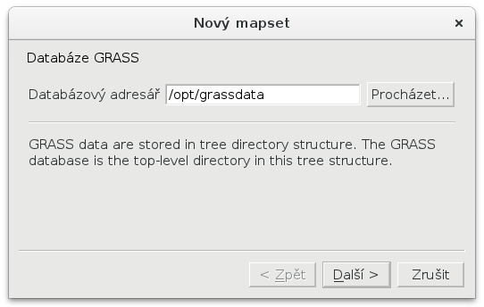

.. |mActionGrassTools| image:: ../images/icon/grass_tools.png
   :width: 1.5em

*******************
Zásuvný modul GRASS
*******************

**Zásuvný modul GRASS** umožňuje kromě čtení a zápisu dat ve formátu GRASS
především volání nástrojů systému GRASS.

.. important:: Tato kapitola vyžaduje alespoň základní znalosti
               systému GRASS. Více ve školení :skoleni:`GRASS GIS pro
               začátečníky <grass-gis-zacatecnik>`.

Tento nástroj doporučujeme používat až od verze QGIS 2.14.
               
.. note:: Zásuvný modul GRASS byl součástí i starších verzi QGISu,
          nicméně podporoval pouze starší verzi systému GRASS
          6.4. Vzhledem k tomu, že nebyl svými tvůrci dostatečně
          udržován, tak byl v LTR verzi QGIS 2.8 odstraněn. V roce
          2015 proběhla `crowdfundingová kampaň
          <http://www.gissula.eu/qgis-grass-plugin-crowdfunding/>`_ s
          cílem zásuvný modul GRASS znovu do QGISu začlenit a přidat
          podporu pro aktuální verzi systému GRASS 7.0. Nově se tedy
          vrátil tento zásuvný modul do verze QGIS 2.10 a plně
          funkčním poté ve verzi QGIS 2.12.

.. todo:: vysvetlit rozdil oproti processingu

Tento zásuvný modul je výchozí součástí QGISu, je potřeba ho ale
aktivovat v :menuselection:`Zásuvné moduly --> Instalovat a spravovat
zásuvné moduly`.

.. figure:: images/grass-plugin-enable.png
   
   Aktivace zásuvného modulu GRASS.

Po aktivaci se objeví panel nástrojů tohoto zásuvného modulu. Tento
panel lze otevřít  i z menu :menuselection:`Zásuvné moduly --> GRASS
--> Otevřít GRASS nástroje` nebo pomocí ikonky |mActionGrassTools|.

.. figure:: images/grass-plugin-tools.png
   
   Panel nástrojů zásuvného modulu GRASS.

Proto, aby jsme mohli nástroje systému GRASS používat, je potřeba
definovat tzv. **mapset**, se kterým chceme pracovat. Mapset je kromě
tzv. *Gisdbase* a *lokace* základními stavebními kameny struktury dat,
kterou GRASS pro svůj běh vyžaduje. Podrobný popis této struktury
naleznete ve školení GRASS GIS pro začátečníky v kapitole
:skoleni:`struktura dat
<grass-gis-zacatecnik/intro/struktura-dat.html>`.

Vytvoření a otevření mapsetu
============================

Nový mapset vytvoříme z menu :menuselection:`Zásuvné moduly --> GRASS
--> Nový mapset`.

Nejprve zadáme tzv. databázový adresář systému GRASS, což je běžný
adresář na disku, který obsahuje či bude obsahovat data, se kterými
GRASS bude pracovat.

        
   Zadání databázové adresáře systému GRASS.

Dále máme možnost otevřít existující lokaci v rámci databázového
adresáře či vytvořit lokaci novou.
   
.. figure:: images/new-mapset-1.png
   :class: small
        
   Výběr již existujicí lokace.

.. figure:: images/new-mapset-2.png
   :class: small
   
   Vytvoření lokace nové.

V případě, že vytváříme novou lokaci je po nás vyžadováno zadání
souřadnicového systému, který bude k lokaci přiřazen.
   

   Definice souřadnicového systému pro nově vytvořenou lokaci.

Dále můžeme definovat výchozí výpočení region, viz :skoleni:`GRASS GIS
pro zacatecniky <intro/region.html>`.
   

   Určení výchozího výpočetního regionu pro nově vytvářenou lokaci.

V dalším kroku definuje název nově vytvářeného lokace v rámci dané lokace.
   

        
   Název nového mapsetu.

Celý process je dokočen potvrzovacím dialogem.
   
.. figure:: images/new-mapset-4.png
   :class: small
        
   Dokončení procesu tvorby nového mapsetu.

Již existující mapset můžeme otevřít z menu :menuselection:`Zásuvné
moduly --> GRASS --> Otevřít mapset`. Po dokončení práce zavřeme
mapset z menu :menuselection:`Zásuvné moduly --> GRASS --> Zavřít
mapset`.

Spouštění nástrojů systému GRASS
================================

Nástroje systému GRASS je možno spouštět až po otevření nějakého
mapsetu. Následuje příklad vytvoření vektorové vrstvy obalových zón
kolem požarních stanic v Praze.

        
   Nalezení nástroje pro tvorbu vektorové obalové zóny :grasscmd:`v.buffer`.

.. figure:: images/grass-buffer-1.png
        
   Volba parametrů nástroje.

Zobrazování dat vytvořených v systému GRASS
===========================================

Vytvořená rastrová a vektorová data v systému GRASS můžeme zobrazovat
v mapovém okně QGISu pomocí datového katalogu.

.. figure:: images/grass-buffer-2.png
   :class: small
        
   Problížení GRASS dat v datovém katalogu GRASS.

        
   Příklad vizualizace požárních stanic v Praze a jejich obalovým
   zón. Na pozadí je ortofoto Prahy.

GRASS Shell
===========

Spouštět příkazy systému GRASS je možno také z příkazové rádky
pluginu, tzv. GRASS Shellu. Následují příklad pro výběr stavebního
objektů, které leží uvnitř obalových zón požárních stanic v Praze.

.. figure:: images/grass-shell.png
   :class: middle
   
   Příklad spuštění nástroje :grasscmd:`v.select` z příkazové řádky
   GRASS pluginu.
