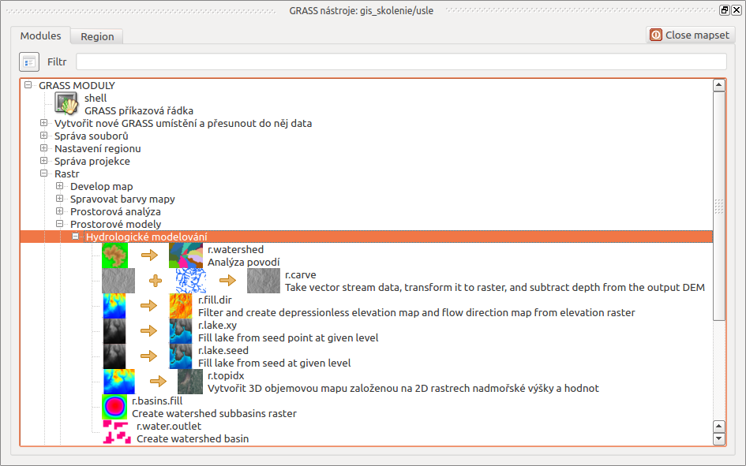

**********
Hydrologie
**********

Globalizace, urbanizace, klimatické změny, extrémní počasí - to jsou
složité problémy, kterým v současné době čelíme. Cílem řady odborníků
je hledat nástroje pro společné plánování a projektovaní, metody pro
nalezení konstruktivních řešení, které pomohou zlepšit život a životní
prostředí.

Geografické informační systémy mohou být užitečným a důležitým
nástrojem také v oblasti hydrologie. Mohou pomoci hydrologům ve
vědeckém výzkumu stejně jako při hospodaření s vodními zdroji. Změna
klimatických poměrů a větší nároky na vodní zdroje vyžadují podrobné
znalosti související s jedním z našich najdůležitějších přírodních
zdrojů.

Od verze QGIS 2.12 se mnozí uživatelé těší z funkčnosti zásuvného
modulu GRASS, viz kapitola :doc:`../grass/index`. Geografický
informačný systém GRASS GIS nabízí celou řadu nástrojů pro
hydrologické modelovaní či výpočet eroze.  V této časti si ukážeme,
jak je možné užitečné nástroje systému GRASS využívat při
hydrologických analýzách v prostředí QGIS. Zaměříme se na odtokové
poměry. Stav rešeného území z hlediska srážkoodtokových vztahů a
ztráty půdy erozí budeme hodnotit pomocí metod :wikipedia:`SCS CN
<Metoda CN křivek>` a :wikipedia:`USLE`, přičem při samotném řešení
využijeme také některé nástroje systému GRASS GIS.

.. note:: Problematice řešení těchto úloh čistě v systému GRASS se
         věnuje část :skoleni:`školení GRASS GIS pokročilé
         <grass-gis-pokrocily/hydrologie>`, ze které také následující
         návody vycházejí.
         

        
   Nástroje pro hydrologické modelovaní v prostředí zásuvného modulu GRASS.

.. rubric:: Témata
   :class: secnotoc
      
.. toctree::
   :maxdepth: 1

   scs-cn
   usle

