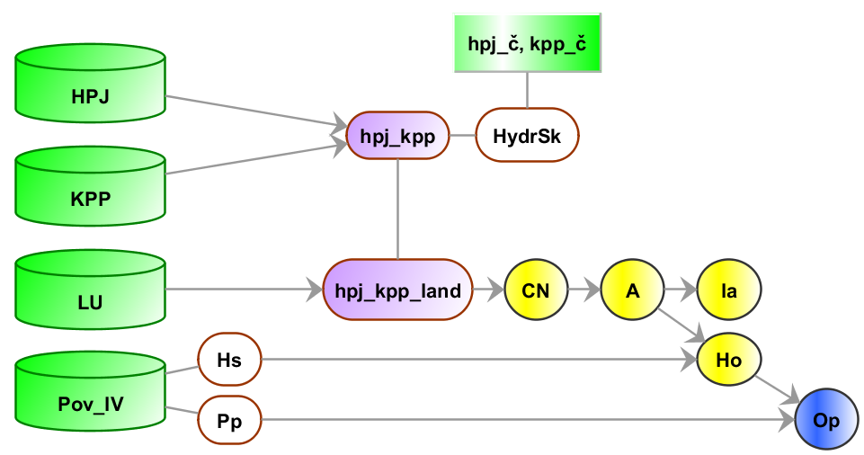

.. |union| image:: ../images/icon/union.png
   :width: 1.5em
.. |plus| image:: ../images/icon/mActionSignPlus.png
   :width: 1.5em
.. |join| image:: ../images/icon/join.png
   :width: 1.5em
.. |edit| image:: ../images/icon/mIconEditable.png
   :width: 1.5em
.. |kalk| image:: ../images/icon/mActionCalculateField.png
   :width: 1.5em
.. |select-attr| image:: ../images/icon/mIconExpressionSelect.png
   :width: 1.5em

1. Metóda SCS CN
================

Teoretické východiská
---------------------

Ide o výpočet priameho odtoku z povodia, ktorý je tvorený tzv. povrchovým odtokom
a tzv. hypodermockým odtokom (odteká pod povrchom). Metóda bola vypracovaná
službou na ochranu pôd *Soil Conservation Service* (:wikipedia:`SCS CN
<Metoda CN křivek>`) v USA. Objem zrážok je na objem odtoku prevedený
podľa čísel odtokových kriviek *CN*, ktoré sú tabelizované na
základe hydrologických vlastností pôd *HydrSk*. Metóda zohľadňuje
závislosť retencie (zadržiavanie vody) od hydrologických vlastností pôd,
počiatočné nasýtenie a spôsob využívania pôdy. Číslo *CN* krivky
reprezentuje teda vlastnosť povodia a platí, že čím je hodnota CN hodnota
vyššia, tým je väčšia pravdepodobnosť, že pri zrážkovej udalosti dôjde k priamemu
odtoku. Číslo obvykle nadobúda hodnoty :item:`30`, t.j. veľké straty až 
:item:`100`, t.j. malé straty.  

Číslo *CN* závisí od kombinácie hydrologickej skupiny pôdy a spôsobu využitia
územia v danom mieste. Kód hydrologickej skupiny pôdy je získaný z dát hlavných
pôdnych jednotiek (presnejší spôsob) alebo dát komplexného prieskumu pôd (tam, 
kde informácie o hlavných pôdnych jednotkách k dispozícii nie sú).

Základné symboly:
----------------

 * :math:`CN` ... číslo odtokovej krivky
 * :math:`A` ... maximálna potenciálna strata z povodia, resp. výška vody 
   zadržaná v povodí; ostatné je odtok (:math:`mm`)
 * :math:`I_a` ... počiatočná strata z povodia, keď ešte nedochádza k odtoku
   (:math:`mm`)
 * :math:`H_s` ... návrhová výška zrážky, záťažový stav (:math:`mm`)
 * :math:`H_o` ... výška priameho odtoku (:math:`mm`)
 * :math:`P_p` ... výmera elementárnej plochy (:math:`m^2`)
 * :math:`O_p` ... objem priameho odtoku (:math:`m^3`)

Platí, že pomer medzi skutočnou a maximálnou stratou z povodia je rovnaký
ako pomer odtoku a zrážky, ktorá je redukovaná o počiatočné straty.

.. math::

   \frac{O_p}{A}=\frac{H_o}{H_s-I_a}

Vstupné dáta
------------

 * :map:`hpj` - vektorová vrstva hlavných pôdnych jednotiek (z kódov BPEJ),
 * :map:`kpp` - vektorová vrstva komplexného prieskumu pôd,
 * :dbtable:`hpj_hydrsk.csv`, :dbtable:`sum_kpp2hydrsk.csv` - pomocné číselníky 
   s hydrologickými skupinami pôd,
 * :map:`landuse` - vektorová vrstva využitia územia,
 * :map:`povodi` - vektorová vrstva povodí IV. rádu s návrhovými
   zrážkami :math:`H_s` (doba opakovania 2, 5, 10, 20, 50 a 100 rokov)
 
 * :map:`toky` - líniová vrstva obsahujúca dráhu toku (DIBAVOD)
 * :map:`zabaged` - polohopisná časť ZABAGED (základná báza geografických dát 
   Českej republiky) potrebná pre tvorbu masky líniových a plošných prvkov
   prerušujúcich odtok.

.. note:: Vrstvu povodí, líniovú vrstvu toku možno získať z voľne dostupnej 
	  databázy DIBAVOD. Bonitované pôdne ekologické jednotky (dve číslice 
	  päťmiestneho kódu udávajúce hlavnú pôdnu jednotku), informácie o využití 
	  územia (Land Parcel Identification System), dáta komplexného 
	  prieskumu pôd, dáta ZABAGED poskytuje väčšinou krajský úrad príslušného 
	  územia. Návrhové zrážky možno získať z HMU.

Navrhovaný postup:
------------------

1. príprava potrebných dát pre výpočet v prostredí GIS (rastrová vrstva s kódmi 
   :math:`CN`, raster s hodnotami :math:`H_s` a raster s výmerou :math:`P_p` 
   pre elementárne plochy v :math:`m^2`),
2. výpočet parametra :math:`A`, ktorý je funkciou :math:`CN`,
3. výpočet parametra :math:`I_a`, ktorý je funkciou :math:`A`,
4. výpočet parametra :math:`H_o`, ktorý je funkciou :math:`H_s` a :math:`A`,
5. výpočet parametra :math:`O_p`, ktorý je funkciou :math:`P_p` a :math:`H_o`.

.. _schema:

   Grafická schéma postupu

.. note:: Ako vyplýva z :num:`#schema`, príprave rastrovej vrstvy s kódmi CN 
	  predchádza odvodenie hydrologických skupín pôd *HydrSk* a jej 
	  priestorové prekrytie s vrstvou využitia krajinnej pokrývky *land*, 
	  čím sa získa jedinečná kombinácia *hpj_kpp_land*, resp. *HydrSk_land*.

Postup spracovania v QGIS
-------------------------

Krok 1
^^^^^^

V prvom kroku založíme projekt a importujeme vstupné vrstvy (:map:`hpj.shp`, 
:map:`kpp.shp`, :map:`hpj_hydrsk.csv`, :map:`kpp_hydrsk.csv`, :map:`landuse.shp` 
a :map:`povodi.shp`). Následne zjednotíme vrstvu hlavných pôdnych jednotiek 
a komplexného prieskumu pôd. Využijeme nástroj geoprocessingu |union| 
:sup:`Sjednotit` (:menuselection:`Vector --> Nástroje geoprocessingu --> Sjednotit)`. 
Vznikne vektorový výstup :map:`hpj_kpp`). 

Tabuľku :dbtable:`hpj_hydrsk` môžeme pripojiť k atribútom novej vektorovej mapy 
:map:`hpj_kpp` pomocou spoločného stĺpca :dbcolumn:`HPJ` (:num:`#at-pred-join`). 
Pravým tlačidlom myši v paneli vrstiev pre :map:`hpj_kpp` zvolíme :item:`Vlastnosti` 
a v dialógovom okne prejdeme do záložky |join| :sup:`Připojení`. Kliknutím na 
ikonku |plus| spustíme dialógové okno s nastaveniami pre spájanie (:num:`#join`). 

.. _at-pred-join:

.. figure:: images/at_pred_join.png
   :class: middle
        
   Spoločný atribút *HPJ* a hydrologické skupiny hlavných pôdnych jednotiek.

.. _join:

.. figure:: images/at_join.png
   :scale: 65%
        
   Pripojenie tabuľky k vektorovej vrstve na základe spoločného atribútu.

Takýmto spôsobom pripojíme tabuľky s informáciami o hydrologických skupinách 
(:num:`#tab-pripojene`).

.. _tab-pripojene:

.. figure:: images/tab_pripojene.png
   :class: middle
        
   Zobrazenie pripojených vrstiev vo vlastnostiach vrstvy *hpj_kpp*.

Potom otvoríme atribútovú tabuľku :map:`hpj_kpp`, zapneme editovací mód ikonkou 
|edit| a v kalkulačke polí |kalk| vytvoríme nový stĺpec. Použijeme pripojené
atribúty o hydrologickej skupine (:dbcolumn:`hpj_HydrSk` z vrstvy hlavných 
pôdnych jednotiek a :dbcolumn:`kpp_Hydrologic_skupina` z vrstvy komplexného 
prieskupu pôd). Primárne použijeme hydrologickú skupinu pre hlavné pôdne jednotky.
Kde informácia nie je (hodnota :dbcolumn:`NULL`), tam použijeme 
:dbcolumn:`kpp_Hydrologic_skupina` (:num:`#at-hydrsk-kalk`) a výsledok znázorníme
(:num:`#hydrsk`).

.. code-block:: bash
	
   CASE WHEN "hpj_HydrSk" IS NULL THEN "kpp_HydrSk" ELSE "hpj_HydrSk" END

.. _at-hydrsk-kalk:

.. figure:: images/at_hydrsk_kalk.png
   :scale: 70%
        
   Vytvorenie atribútu s informáciami o hydrologickej skupine pre elementárne plochy.

.. _hydrsk:

.. figure:: images/hydrsk.png
   :scale: 20%
        
   Hydrologické skupiny elementárnych plôch v záujmovom území.

Pri pohľade na legendu na :num:`#hydrsk` si možno všimnúť, že kódy hydrologických
skupín ako ``(A)B``, ``A(B)``, ``AB`` a podobne by bolo dobré zjednotiť. 
Použijeme editovací mód a atribútové dotazy. V hlavnej lište alebo v lište 
atribútovej tabuľky klikneme na voľbu |select-attr| :sup:`Select by expression`, 
kde vyberieme elementárne plochy
s hydrologickou skupinou  ``(A)B`` a ``A(B)``, potom zapneme editovací režim,
spustíme |kalk| :sup:`Kalkulačka polí` a aktualizujeme existujúce pole 
:dbcolumn:`hydrsk` vybraných prvkov (:num:`#kalk-ab`). Obdobne postupujeme 
pri ďalších kódoch. Výsledok je na :num:`#hydrsk-ok`.

.. _kalk-ab:

.. figure:: images/kalk_AB.png
   :class: middle
        
   Zjednotenie hodnôt atribútov pomocou kalkulátora polí.

.. note:: Na zjednotenie hodnôt možno použiť aj kondicionál *CASE*:

	  .. code-block:: bash

		          CASE WHEN "hydrsk"  =  'B(C)' THEN replace("hydrsk",'B(C)','BC') ELSE "hydrsk" END

	  a 
	  
	  .. code-block:: bash

		          CASE WHEN "hydrsk"  =  'C(D)' THEN replace("hydrsk",'C(D)','CD') ELSE "hydrsk" END

.. _hydrsk-ok:

.. figure:: images/hydrsk_ok.png
   :scale: 20%
        
   Zjednotené hydrologické skupiny elementárnych plôch v záujmovom území.

Do tejto fázy je možné používať QGIS relatívne bez problémov. Ďalej však budeme
pridávať informácie o využití územia pre každú elementárnu plochu pomocou operácie 
prieniku. Pri väčších dátach môžu byť nástroje geoprocessingu časovo náročné.

