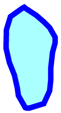
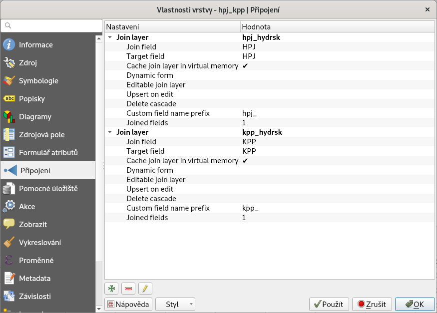
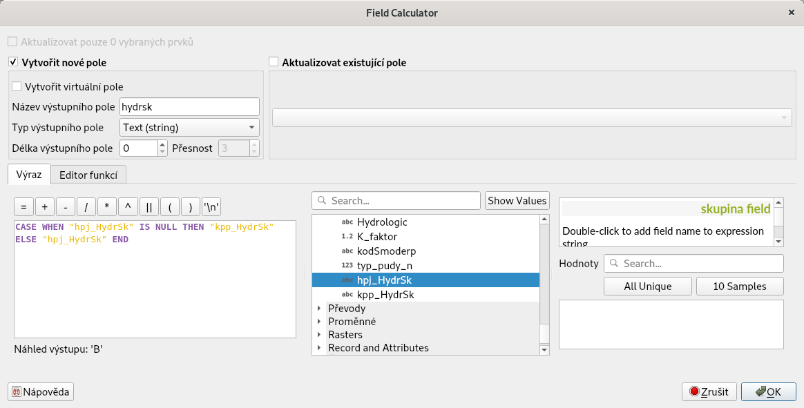
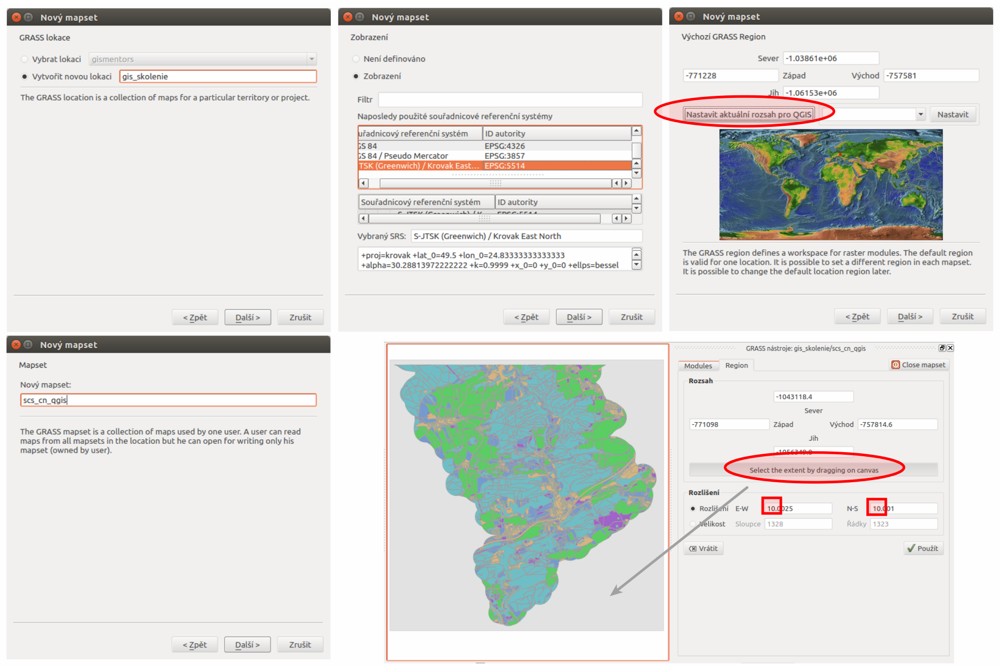
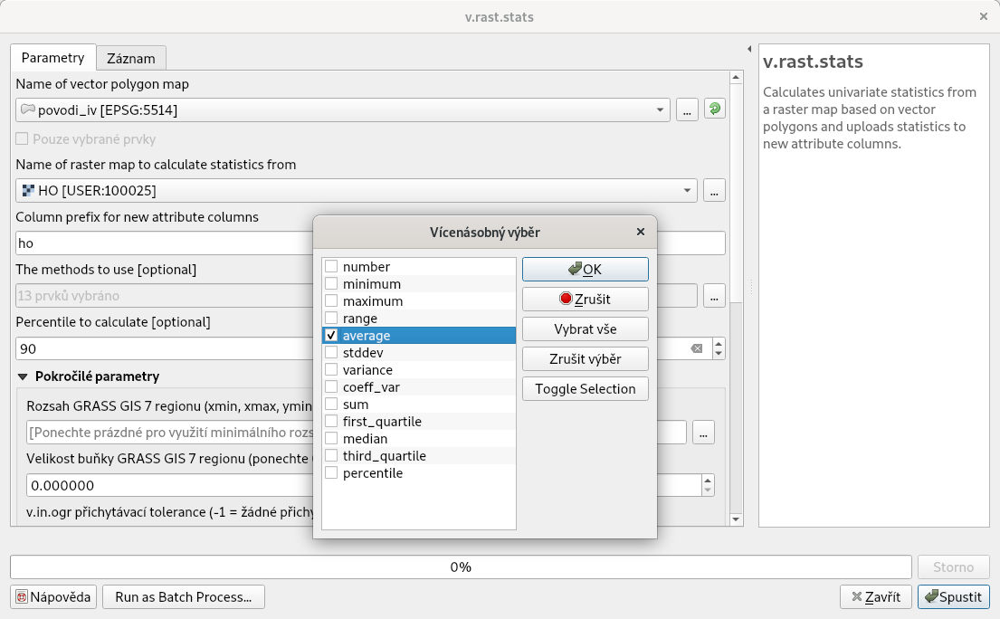
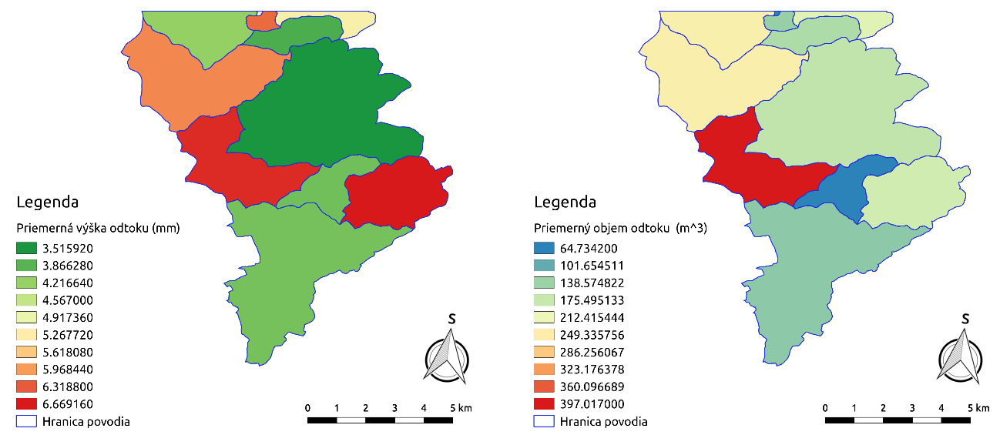

.. |union| image:: ../images/icon/union.png
   :width: 1.5em
.. |plus| image:: ../images/icon/mActionSignPlus.png
   :width: 1.5em
.. |join| image:: ../images/icon/join.png
   :width: 1.5em
.. |edit| image:: ../images/icon/mIconEditable.png
   :width: 1.5em
.. |kalk| image:: ../images/icon/mActionCalculateField.png
   :width: 1.5em
.. |select-attr| image:: ../images/icon/mIconExpressionSelect.png
   :width: 1.5em
.. |grass_shell| image:: ../images/gplugin/shell.1.png
   :width: 1.5em
.. |v.db.select| image:: ../images/gplugin/v.db.select.1.png
   :width: 1.5em
.. |v.db.update| image:: ../images/gplugin/v.db.update_op.2.png
   :width: 1.5em
.. |v.db.addcolumn| image:: ../images/gplugin/v.db.addcolumn.1.png
   :width: 1.5em
.. |v.db.join| image:: ../images/gplugin/v.db.join.3.png
   :width: 3em

.. |v.to.rast.attr| image:: ../images/gplugin/v.to.rast.attr.3.png
   :width: 2em

.. |v.rast.stats| image:: ../images/gplugin/v.rast.stats.3.png
   :width: 4.5em

.. |add_csv| image:: ../images/icon/mActionAddDelimitedTextLayer.png
   :width: 1.5em
.. |grasslogo| image:: ../images/icon/grasslogo.png
   :width: 1.5em
.. |diagram| image:: ../images/icon/diagram.png
   :width: 1.5em

Metóda SCS CN
=============

Teoretické východiská
---------------------

Ide o výpočet priameho odtoku z povodia, ktorý je tvorený tzv. povrchovým odtokom
a tzv. hypodermockým (podpovrchovým) odtokom. Metóda bola vypracovaná
službou na ochranu pôd *Soil Conservation Service* (:wikipedia:`SCS CN
<Metoda CN křivek>`) v USA. Objem zrážok je na objem odtoku prevedený
podľa čísel odtokových kriviek `CN`, ktoré sú tabelizované na
základe hydrologických vlastností pôd. Metóda zohľadňuje
závislosť retencie (zadržiavanie vody) od hydrologických vlastností pôd,
počiatočné nasýtenie a spôsob využívania pôdy. Číslo `CN` krivky
reprezentuje teda vlastnosť povodia a platí, že čím je hodnota `CN` vyššia, 
tým je väčšia pravdepodobnosť, že pri zrážkovej udalosti dôjde k priamemu
odtoku. 

Číslo `CN` závisí od kombinácie hydrologickej skupiny pôdy a spôsobu využitia
územia v danom mieste. Kód hydrologickej skupiny pôdy je získaný z dát hlavných
pôdnych jednotiek (presnejší spôsob) alebo dát komplexného prieskumu pôd (tam, 
kde informácie o hlavných pôdnych jednotkách k dispozícii nie sú).

Základné symboly
----------------

 * :math:`CN` - číslo odtokovej krivky
 * :math:`A` - max potenciálna strata z povodia, výška vody zadržaná v povodí; ostatné je odtok (:math:`mm`)
 * :math:`I_a` - počiatočná strata z povodia, keď ešte nedochádza k odtoku
   (:math:`mm`)
 * :math:`H_s` - návrhová výška zrážky, záťažový stav (:math:`mm`)
 * :math:`H_o` - výška priameho odtoku (:math:`mm`)
 * :math:`O_p` - objem priameho odtoku (:math:`m^3`)

Platí, že pomer medzi skutočnou a maximálnou stratou z povodia je rovnaký
ako pomer odtoku a zrážky, ktorá je redukovaná o počiatočné straty.

.. math::

   \frac{O_p}{A}=\frac{H_o}{H_s-I_a}

.. _vstupne-data:

Vstupné dáta
------------

 * :map:`hpj.shp` - vektorová vrstva hlavných pôdnych jednotiek z kódov BPEJ, :num:`#hpj-kpp` vľavo
 * :map:`kpp.shp` - vektorová vrstva komplexného prieskumu pôd, :num:`#hpj-kpp` vpravo
 * :map:`landuse.shp` - vektorová vrstva využitia územia, :num:`#lu-pov` vľavo
 * :map:`povodi.shp` - vektorová vrstva povodí IV. rádu s návrhovými
   zrážkami :math:`H_s` (doba opakovania 2, 5, 10, 20, 50 a 100 rokov), :num:`#lu-pov` vpravo
 * :dbtable:`hpj_hydrsk` - číselník s hydrologickými skupinami pôd pre hlavné 
   pôdne jednotky, :num:`#ciselniky1` vľavo
 * :dbtable:`kpp_hydrsk` - číselník s hydrologickými skupinami pôd pre vrstvu 
   komplexného prieskumu pôd, :num:`#ciselniky1` v strede
 * :dbtable:`lu_hydrsk_cn` - číselník s číslami CN pre kombináciu využitia 
   územia a hydrologickej skupiny, :num:`#ciselniky1` vpravo

.. note:: Vrstvu povodí možno získať z voľne dostupnej 
	  databázy DIBAVOD. Bonitované pôdne ekologické jednotky - dve číslice 
	  päťmiestneho kódu udávajúce hlavnú pôdnu jednotku, informácie o využití 
	  územia *Land Parcel Identification System* a dáta komplexného 
	  prieskumu pôd poskytuje väčšinou krajský úrad príslušného 
	  územia. Návrhové zrážky možno získať z hydrometeorologického ústavu.

Navrhovaný postup
------------------
:ref:`1.<kr1>` 
zjednotenie hlavných pôdnych jednotiek a komplexného prieskumu pôd 

:ref:`2.<kr2>` 
pripojenie informácií o hydrologickej skupine

:ref:`3.<kr3>` 
prienik vrstvy s hydrologickými skupinami s vrstvou využitia územia 

:ref:`4.<kr4>` 
pripojenie čísel odtokovej krivky :math:`CN`

:ref:`5.<kr5>` 
zjednotenie prieniku vrstvy s hydrologickými skupinami a využitím územia 
s vrstvou povodí 

:ref:`6.<kr6>` 
výpočet výmery elementárnych plôch, parametra :math:`A` a parametra :math:`I_a`

:ref:`7.<kr7>` 
výpočet parametra :math:`H_o` a parametra :math:`O_p` pre každú elementárnu plochu

:ref:`8.<kr8>` 
vytvorenie rastrových vrstiev výšky a objemu priameho odtoku

:ref:`9.<kr9>` 
výpočet priemerných hodnôt výšky a objemu priameho odtoku pre povodie 

.. _schema:

.. figure:: images/schema_scs-cn.png
   :class: middle

   Grafická schéma postupu

Znázornenie vstupných dát spolu s atribútovými tabuľkami je na :num:`#hpj-kpp`
a :num:`#lu-pov`. Tabuľky s informáciami o hydrologickej skupine pôdy a o 
číslach CN pre kombináciu využitia územia a hydrologickej skupiny, resp. 
číselníky sú na :num:`#ciselniky1`.

.. _hpj-kpp:

   Hlavné pôdne jednotky a podrobný prieskup pôd spolu s ich atribútovými tabuľkami.

.. _lu-pov:

.. figure:: images/lupov.png
   :class: large

   Využitie územia a vrstva povodí IV. rádu spolu s ich atribútovými tabuľkami.

.. _ciselniky1:

.. figure:: images/ciselniky.png
   :class: middle

   Číselníky s informáciami o hydrologickej skupine a číslami CN.

Postup spracovania v QGIS
-------------------------

.. note:: Návod vychází z textu ve školení :skoleni:`GRASS GIS pro
          pokročilé <grass-gis-pokrocily/hydrologie/scs-cn.html>`.

.. _kr1:

Krok 1
^^^^^^
V prvom kroku založíme projekt a pomocou |add_vector| a |add_csv| pridáme do 
panelu vrstiev súbory :map:`hpj.shp`, 
:map:`kpp.shp`, :map:`landuse.shp`, :map:`povodi.shp`, :dbtable:`hpj_hydrsk`,
:dbtable:`kpp_hydrsk` a :dbtable:`lu_hydrsk_cn`. 

Následne zjednotíme vrstvu hlavných pôdnych jednotiek 
a komplexného prieskumu pôd. Využijeme nástroj geoprocessingu 
|union| :sup:`Sjednotit`, ktorý nájdeme v záložke 
:menuselection:`Vector --> Nástroje geoprocessingu`. 
Vznikne vektorový výstup :map:`hpj_kpp`. 

.. _kr2:

Krok 2
^^^^^^
.. _join-vo-vlastnostiach:

Tabuľku :dbtable:`hpj_hydrsk` môžeme pripojiť k atribútom novej vektorovej mapy 
:map:`hpj_kpp` pomocou spoločného stĺpca :dbcolumn:`HPJ` (:num:`#at-pred-join`). 
Pravým tlačidlom myši v paneli vrstiev pre :map:`hpj_kpp` zvolíme :item:`Vlastnosti` 
a v dialógovom okne prejdeme do záložky |join| :sup:`Připojení`. Kliknutím na 
ikonku |plus| spustíme dialógové okno s nastaveniami pre spájanie (:num:`#join`). 

.. _at-pred-join:

        
   Spoločný atribút *HPJ* a hydrologické skupiny hlavných pôdnych jednotiek.

.. _join:

.. figure:: images/at_join.png
   :scale: 65%
        
   Pripojenie tabuľky k vektorovej vrstve na základe spoločného atribútu.

Takýmto spôsobom pripojíme tabuľky s informáciami o hydrologických skupinách 
(:num:`#tab-pripojene`).

.. _tab-pripojene:

        
   Zobrazenie pripojených vrstiev vo vlastnostiach vrstvy *hpj_kpp*.

.. note:: V některých případech nemusí připojení tabulek proběhnout
          korektně, např. pokud se liší datový typ sloupečků použitých
          pro připojení. Typicky textové vs. číselné pole, např. '09'
          vs. '9'.

Potom otvoríme atribútovú tabuľku :map:`hpj_kpp`, zapneme editovací mód ikonkou 
|edit| a v kalkulačke polí |kalk| vytvoríme nový stĺpec. Použijeme pripojené
atribúty o hydrologickej skupine (:dbcolumn:`hpj_HydrSk` z hlavných 
pôdnych jednotiek a :dbcolumn:`kpp_HydrSk` z komplexného 
prieskupu pôd). Primárne použijeme hydrologickú skupinu pre hlavné pôdne jednotky.
Kde informácia nie je - hodnota :dbcolumn:`NULL`, tam použijeme 
:dbcolumn:`kpp_HydrSk` (:num:`#at-hydrsk-kalk`) a výsledok znázorníme
(:num:`#hydrsk`).

.. code-block:: bash
	
   CASE WHEN "hpj_HydrSk" IS NULL THEN "kpp_HydrSk" ELSE "hpj_HydrSk" END

.. _at-hydrsk-kalk:

        
   Vytvorenie atribútu s informáciami o hydrologickej skupine pre elementárne plochy.

.. _hydrsk:

.. figure:: images/hydrsk.png
   :class: small
        
   Hydrologické skupiny elementárnych plôch v záujmovom území.

Pri pohľade na legendu na :num:`#hydrsk` si možno všimnúť, že kódy hydrologických
skupín ako ``(A)B``, ``A(B)``, ``AB`` a podobne by bolo dobré zjednotiť. 
Použijeme editovací mód a atribútové dotazy. V hlavnej lište alebo v lište 
atribútovej tabuľky klikneme na voľbu |select-attr| :sup:`Select by expression`, 
kde vyberieme elementárne plochy
s hydrologickou skupinou  ``(A)B`` a ``A(B)``, potom zapneme editovací režim,
spustíme |kalk| :sup:`Kalkulačka polí` a aktualizujeme existujúce pole 
:dbcolumn:`hydrsk` vybraných prvkov (:num:`#kalk-ab`). Obdobne postupujeme 
pri ďalších kódoch. Výsledok je na :num:`#hydrsk-ok`.

.. _kalk-ab:

        
   Zjednotenie hodnôt atribútov pomocou kalkulátora polí.

.. note:: Na zjednotenie hodnôt možno použiť aj kondicionál *CASE*:

	  .. code-block:: bash

		          CASE WHEN "hydrsk"  =  'B(C)' THEN replace("hydrsk",'B(C)','BC') ELSE "hydrsk" END

	  a 
	  
	  .. code-block:: bash

		          CASE WHEN "hydrsk"  =  'C(D)' THEN replace("hydrsk",'C(D)','CD') ELSE "hydrsk" END

.. _hydrsk-ok:

.. figure:: images/hydrsk_ok.png
   :scale: 20%
        
   Zjednotené hydrologické skupiny elementárnych plôch v záujmovom území.

Do tejto fázy je možné používať QGIS relatívne bez problémov. Ďalej však budeme
pridávať informácie o využití územia pre každú elementárnu plochu pomocou operácie 
prieniku. Pri väčších dátach môžu byť nástroje geoprocessingu časovo náročné.
Využijeme zásuvný modul |grasslogo| :sup:`GRASS`.

**Vytvorenie LOKÁCIE a MAPSET-u** 

Dáta GRASS-u sú uložené v 3-úrovňovej štruktúre (databáza, lokácia a mapset).
Z hlavnej lišty menu vyberieme :menuselection:`Zásuvné moduly --> GRASS --> Nový mapset`. 

.. _hydrsk:

.. figure:: images/menu_mapset.png
   :class: small

   Zásuvný modul GRASS.

V dialógovom okne sa objaví predvolená cesta k hlavnému adresáru GRASS súborov
(zvyčajne adresár s názvom `grassdata`). V prípade, že tento adresár obsahuje
lokácie, vyberieme tú, v ktorej chceme pracovať alebo vytvoríme novú. 
Nastavíme súradnicový systém a výpočtový región. Okrem mapsetu `PERMANENT`,
ktorý sa vytvorí automaticky, je potrebné zadať názov nového mapsetu, v ktorom 
budú prebiehať výpočty. Mapset sa automaticky otvorí ako súčasný pracovný mapset. 
V záložke *Region* dialógového okna GRASS nástrojov možno meniť rozsah výpočtovej
oblasti výberom v mapovom okne QGIS pomocou `Select the extent by dragging on canvas`
(:num:`#n-mapset`). Taktiež sa tu nastavuje rozlíšenie. 

.. _n-mapset:

        
   Vytvorenie lokácie a mapsetu, nastavenie výpočtovej oblasti a rozlíšenie.

.. _kr3:

Krok 3
^^^^^^
Záujmové územie potrebujeme rozdeliť na viac elementárnych plôch. Vytvoríme 
prienik vektorových vrstiev. 

.. _import-qgrass:

Keďže chceme prekrývať vrstvy :map:`hpj_kpp` a :map:`landuse` , importujeme ich 
do mapsetu. Na import slúži viacero modulov (:num:`#import`). Použijeme napríklad 
modul :grasscmd:`v.in.ogr.qgis`, ktorý umožňuje načítať vrstvy (akoby) z prostredia 
QGIS. Názvy máp zachováme rovnaké. 

.. _import:

        
   Možnosti importu vektorových vrstiev do mapset-u v prostredí QGIS.

Ak chceme overiť, či sa dané vrstvy v mapsete nachádzajú použijeme *shell*.
Kliknutím na |grass_shell| :sup:`grass shell` spustíme príkazový riadok. Modul 
:grasscmd:`g.list` vypíše obsah konkrétneho mapsetu. Pre výpis vektorov 
v aktuálnom mapsete zadáme :code:`g.list type=vector mapset=.`. Ak zadáme
iba :code:`g.list`, otvorí sa dialógové okno modulu a parametre môžeme zadať 
interaktívne.

.. note:: Dokumentáciu a povinné parametre každého modulu vieme zobraziť 
	  zadaním *man* pred názov modulu, napríklad :code:`man g.list`. 

Na prekrývanie, resp. nájdenie prieniku vektorových vrstiev slúži modul
|v.overlay.and| :sup:`v.overlay.and`, ktorý spustíme cez 
:menuselection:`Vektor --> Prostorová analýza --> Překrytí` (:num:`#v-overlay-and`). 
Výsledný prienik nazveme :map:`hpj_kpp_landuse`. Počet záznamov v atribútovej 
tabuľke sa prienikom výrazne zvýši.

.. _v-overlay-and:

.. figure:: images/v_overlay_and.png
   :class: small
        
   Modul na získanie prieniku dvoch vektorových vrstiev.

.. tip:: V príkazovom riadku možeme vypísať napríklad:

	 * zoznam tabuliek v aktuálnom mapsete, resp. ich názvy: :code:`db.tables`
	 * zoznam atribútov konkrétnej tabuľky: :code:`db.columns table = NAZOVTABULKY` 
	 * počet záznamov v tabuľke: :code:`db.select sql = 'select count(*) from NAZOVTABULKY'` 
Príklad použitia `grass shell` je na :num:`#gshell-db-columns`. Modulom 
|v.db.select| :sup:`v.db.select` vypíšeme hodnoty atribútu, modulom 
|v.db.select| :sup:`v.db.select.where` možno zadať aj podmienku.

.. _gshell-db-columns:

        
   Zobrazenie tabuliek a zoznam ich stĺpcov v príkazovom riadku.

Modul :grasscmd:`v.out.ogr` umožňuje exportovať atribútovú tabuľku do rôznych 
formátov a ďalej s ňou pracovať. Na :num:`#db-export` je export do bežného
formátu `*csv`.

.. _db-export:

        
   Export atribútov do formátu *csv.

.. _kr4:

Krok 4
^^^^^^
V ďalšom kroku je potrebné vytvoriť stĺpec, ktorý bude obsahovať údaje o využití 
územia a o hydrologickej skupine pôdy danej elementárnej plochy v tvare 
*VyužitieÚzemia_HydrologickáSkupina*.

.. _novy-stlpec:

Vytvoríme nový stĺpec pomocou modulu |v.db.addcolumn| 
:sup:`v.db.add.column`, ktorý nazveme :dbcolumn:`landuse_hydrsk` 
(:num:`#v-db-add-column`). Potom ho editujeme použitím
|v.db.update| :sup:`v.db.update_op`, čo je modul, ktorým  stĺpcu 
priradíme hodnoty ako výsledok operácie v rámci jednej atribútovej tabuľky. 
Hodnotu zadáme v tvare ``b_LandUse||'_'||a_hydrsk``. 

.. _v-db-add-column:

.. figure:: images/v_db_addcolumn.png
   :class: middle
        
   Pridanie stĺpca do atribútovej tabuľky s dátovým typom *text*.

.. note:: Výsledok možeme skontrolovať v príkazovom riadku zadaním

	  .. code-block:: bash
	
	     db.select sql='select cat,b_LandUse,a_hydrsk,landuse_hydrsk from hpj_kpp_landuse_1 where cat=1

	     cat|b_LandUse|a_hydrsk|landuse_hydrsk
	     1|OP|B|OP_B

Ďalej do mapsetu modulom :grasscmd:`db.in.ogr` importujeme tabuľku s číslami `CN`.
Nazveme ju :map:`lu_hydrsk_cn`.

Následne použijeme modul |v.db.join| :sup:`v.db.join`, ktorým pripojíme 
importovanú tabuľku k vektorovej vrstve :map:`hpj_kpp_landuse` 
kvôli priradeniu hodnôt `CN` ku každej elementárnej ploche riešeného územia, 
viď. :num:`#v-dbjoin`. Obsah výslednej tabuľky možno overiť v príkazovom riadku 
pomocou ``db.select sql='select * from hpj_kpp_landuse_1 where cat=1``.

.. important:: Jednotlivé atribúty v tabuľkách, ktoré spájame nemôžu obsahovať 
	       rovnaký názov (pozor, nie je ani "case-sensitive").

.. _v-dbjoin:

.. figure:: images/v_db_join.png
   :class: middle
        
   Pripojenie tabuľky k existujúcej tabuľke vektorov.

.. note:: Tento spôsob spájania je alternatívou k spájaniu pomocou 
	  záložky |join| :sup:`Připojení` vo vlastnostiach vektorovej vrstvy, 
	  viď. :ref:`pripojenie tabuľky k vektoru <join-vo-vlastnostiach>`.

.. _kr5:

Krok 5
^^^^^^
Hodnoty návrhových zrážok s rôznou dobou opakovania do vrstvy pridáme 
modulom |v.overlay.or| :sup:`v.overlay.or`. Zjednoteniu predchádza import 
vrstvy povodí s informáciami o zrážkach do mapsetu, pričom postup je obdobný ako 
pri :ref:`importe vektorov v úvode<import-qgrass>`.

Ukážka záznamu (niektoré stĺpce) atribútovej tabuľky novovytvorenej vektorovej 
vrstvy :map:`hpj_kpp_lu_pov` pre 2-ročný úhrn zrážok v *mm* s dobou trvania *120 min*:

.. code-block:: bash
   
   db.select sql='select cat,a_CN,b_H_002_120 from hpj_kpp_lu_pov_1 where cat=1'

   cat|a_CN|b_H_002_120
   1|80|21.6804582207

Ukážka ako sa zmenil počet plošných prvkov v mape :map:`hpj_kpp_landuse` po 
zjednotení s vrstvou povodí dostaneme ako výstup modulu :grasscmd:`v.info`, viď. 
:menuselection:`Vektor --> Zprávy a statistiky`. Štandardné zobrazenie je na 
:num:`#v-info`.

.. _v-info:

.. figure:: images/v_info.png
   :class: middle
        
   Výpis základných informácií o vektorovej mape pomocou modulu *v.info*.

.. tip:: Z príkazového riadku možno zapnúť klasické prostredie GRASS-u
	 príkazom ``g.gui``. Tiež je možné zapnúť mapové okno GRASS-u (príkaz
	 ``d.mon``), vykresliť v nej konkrétnu rastrovú (``d.rast``) alebo 
	 vektorovú (``d.vect``) vrstvu, pridať mierku (``d.barscale``) či 
	 legendu (``d.legend``). Príkazom ``d.rast.leg`` vykreslíme rastrovú 
	 vrstvu aj s legendou.

Ďalej budeme pracovať najmä s hodnotami `CN`. Pre ďalšie operácie je potrebné,
aby typ tohto atribútu bol číselný, na čo použijeme funkciu ``cast()``. 

.. noteadvanced:: 
   
   Vektorovú vrstvu 
   :map:`hpj_kpp_landuse` možno prekonvertovať na rastrovú vrstvu s číslami `CN`
   a zobraziť v mapovom okne GRASS-u. Začneme vytvorením nového stĺpca typu 
   *integer* (modul :grasscmd:`v.db.addcolumn`), pokračujeme jeho editáciou 
   :grasscmd:`v.db.update_op` a následne spustíme modul 
   |v.to.rast.attr| :sup:`v.to.rast.attr`,
   viď. :num:`#v-to-rast-cn`. Príkazmi ``d.mon wx0``, ``d.rast.leg cn``,
   ``d.barscale`` a ``d.vect povodi type=boundary`` mapu s `CN` 
   zobrazíme s mierkou, legendou a v prekrytí s vektorovou vrstvou povodí. 
   
   .. _v-to-rast-cn:

   .. figure:: images/v_to_rast_cn.png
      :class: middle
        
      Konverzia vektorovej mapy na rastrovú na základe atribútu.

.. _kr6:

Krok 6
^^^^^^

Pre každú elementárnu plochu vypočítame jej výmeru, parameter `A` a parameter 
:math:`I_a`.

.. math::

   A = 25.4 \times (\frac{1000}{CN} - 10)

.. math::

   I_a = 0.2 \times A

Do atribútovej tabuľky `hpj_kpp_lu_pov` pridáme nové stĺpce typu *double*, 
konkrétne :dbcolumn:`vymera`, :dbcolumn:`A`, :dbcolumn:`I_a`. Potom výpočítame 
ich príslušné hodnoty. Postupujeme obdobne ako pri :ref:`tvorbe stĺpca <novy-stlpec>` 
s údajmi o využití územia a o hydrologickej skupine (:dbcolumn:`landuse_hydrsk`),
pričom na výpočet použijeme matematické operácie ako sčítanie, 
odčítanie, násobenie a podobne (:num:`#add-columns` a :num:`#area-a`). Na určenie 
plochy každej elementárnej plochy využijeme modul z kategórie 
:menuselection:`Vektor --> Zprávy a statistiky`, modul |v.to.db| :sup:`v.to.db`.

.. _add-columns:

.. figure:: images/add_columns.png
   :class: small
        
   Vytvorenie viacerých stĺpcov naraz použitím *v.db.addcolumn*.

.. _area-a:

        
   Výpočet výmery modulom *v.to.db* a parametra *A* modulom *v.db.update_op*.

.. noteadvanced::

   V príkazovom riadku by predchádzajúce kroky vyzerali takto:

   .. code-block:: bash

      v.db.addcolumn map=hpj_kpp_lu_pov columns="vymera double,A double,Ia double"
      v.to.db map=hpj_kpp_lu_pov option=area columns=vymera
      v.db.update map=hpj_kpp_lu_pov column=A value="24.5 * (1000 / a_CN - 10)"
      v.db.update map=hpj_kpp_lu_pov column=Ia value="0.2 * A"

.. _kr7:

Krok 7
^^^^^^
Znázornenie vektorovej vrstvy povodí s návrhovými zrážkami v prostredí QGIS je na 
:num:`#navrhove-zrazky` (maximálna hodnota atribútu :dbcolumn:`H_002_120` 
predstavuje 23 mm). Histogramy je možné vykresliť v záložke 
|diagram| :sup:`Diagramy` vo vlastnostiach konkrétnej vrstvy.
 
.. _navrhove-zrazky:

.. figure:: images/navrhove_zrazky.png
   :class: middle
        
   Zobrazenie povodí IV. rádu s návrhovými zrážkami.

Vypočítame výšku priameho odtoku v *mm* ako parameter :math:`H_o` a objem ako 
parameter :math:`O_{p}`. 

.. math::

   H_O = \frac{(H_S − 0.2 \times A)^2}{H_S + 0.8 \times A}
   
   O_P = P_P \times \frac{H_O}{1000}

V ďalších krokoch budeme uvažovať priemerný úhrn návrhovej zrážky 
:math:`H_{s}` = 32 mm. Pri úhrne s dobou opakovania 2 roky (atribút
:dbcolumn:`H_002_120`) či dobou 5, 10, 20, 50 alebo 100 rokov by bol postup obdobný.

.. important:: Hodnota v čitateli vzťahu pre :math:`H_o` musí byť kladná, resp. 
	       nesmieme umocňovať 
	       záporné číslo. V prípade, že čitateľ je záporný, výška priameho 
	       odtoku je rovná nule. Na vyriešenie tejto situácie si pomôžeme 
	       novým stĺpcom v atribútovej tabuľke, ktorý nazveme 
	       :dbcolumn:`HOklad`. 

Postupujeme obdobne ako na :num:`#add-columns` a :num:`#area-a` alebo pomocou
príkazového riadku.

.. code-block:: bash

   v.db.addcolumn map=hpj_kpp_lu_pov columns="HOklad double, HO double, OP double" 
   v.db.update map=hpj_kpp_lu_pov column=HOklad value="(32 - (0.2 * A))"

Záporným hodnotám :dbcolumn:`HOklad` priradíme konštantu `0` modulom 
|v.db.update| :sup:`v.db.update_query` (:num:`#v-db-update-query`). Atribúty
:dbcolumn:`HO` a :dbcolumn:`OP` vyplníme modulom |v.db.update| :sup:`v.db.update_op`.

.. code-block:: bash

   v.db.update map=hpj_kpp_lu_pov column=HO value='(HOklad * HOklad)/(32 + (0.8 * A))'
   v.db.update map=hpj_kpp_lu_pov column=OP value="vymera * (HO / 1000)" 

.. _v-db-update-query:

.. figure:: images/v_db_update_query.png
   :class: small
        
   Priradenie novej konštantnej hodnoty v stĺpci v prípade pravdivého dotazu 
   modulom *v.db.update_query*.

.. tip:: 
   
   Priradenie konštantnej hodnoty `0` pre záporné :dbcolumn:`HOklad` možno
   skontrolovať tak ako je to na :num:`#ho-klad`.

   .. _ho-klad:

   .. figure:: images/ho_klad.png
      :class: middle
        
      Kontrola editácie záporných hodnôt v príkazovom riadku.

.. _kr8:

Krok 8
^^^^^^
Modulom |v.to.rast.attr| :sup:`v.to.rast.attr` vytvoríme z vektorovej vrstvy 
:map:`hpj_kpp_lu_pov` rastre :map:`ho` a :map:`op`. Zobrazenie v prostredí QGIS 
je na :num:`#ho-op`.

.. _ho-op:

        
   Zobrazenie výšky a objemu priameho odtoku pre elementárne plochy v prostredí 
   QGIS.

.. _kr9:

Krok 9
^^^^^^ 
V ďalšom kroku vypočítame priemerné hodnoty priameho odtoku pre každé povodie v 
riešenom území. Modul |v.rast.stats| :sup:`v.rast.stats` počíta základné 
štatistické informácie rastrovej mapy na základe vektorovej vrstvy a navyše
tieto informácie ukladá do nových stĺpcov atribútovej tabuľky. Dialógové okno 
je na :num:`#v-rast-stats`. 

.. _v-rast-stats:

        
   Dialógové okno modulu *v.rast.stats*.

Vektor povodí potom prevedieme na rastrové vrstvy, pričom kľúčovým atribútom
je :dbcolumn:`ho_average`, resp. :dbcolumn:`op_average`. Výstup zobrazený 
v prostredí QGIS je na :num:`#ho-op-avg`.

.. _ho-op-avg:

        
   Zobrazenie priemernej výšky a objemu priameho odtoku pre povodia v prostredí 
   QGIS.

