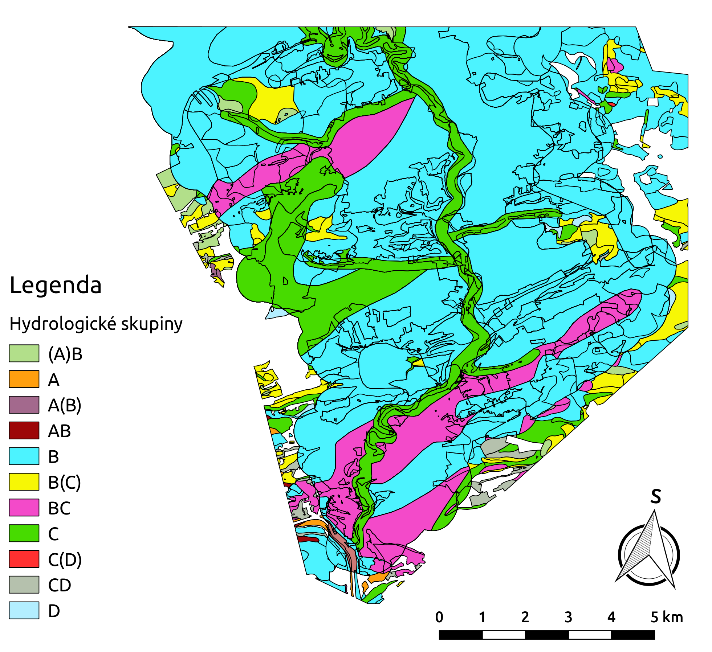
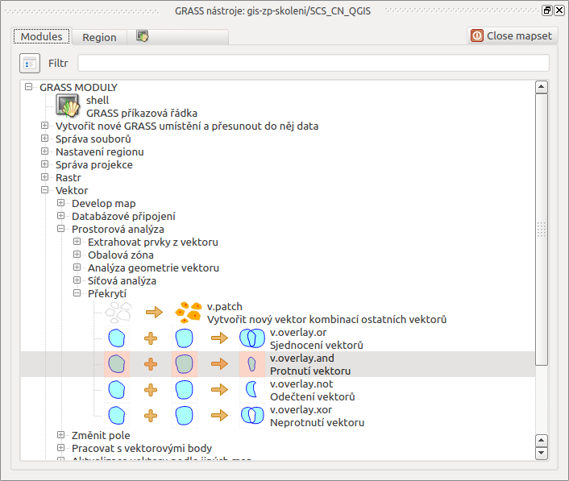
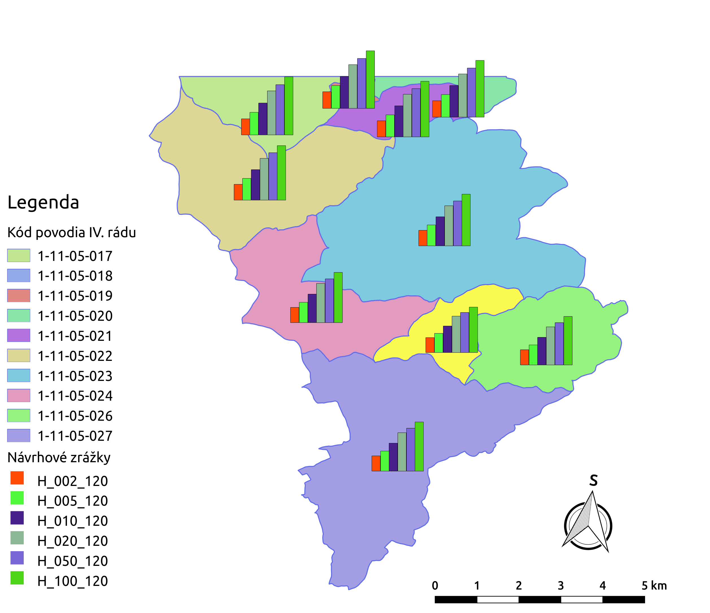

.. |union| image:: ../images/icon/union.png
   :width: 1.5em
.. |plus| image:: ../images/icon/mActionSignPlus.png
   :width: 1.5em
.. |join| image:: ../images/icon/join.png
   :width: 1.5em
.. |edit| image:: ../images/icon/mIconEditable.png
   :width: 1.5em
.. |kalk| image:: ../images/icon/mActionCalculateField.png
   :width: 1.5em
.. |select-attr| image:: ../images/icon/mIconExpressionSelect.png
   :width: 1.5em

.. |v.db.select| image:: ../images/gplugin/v.db.select.1.png
   :width: 1.5em
.. |v.db.update| image:: ../images/gplugin/v.db.update_op.2.png
   :width: 1.5em
.. |v.db.addcolumn| image:: ../images/gplugin/v.db.addcolumn.1.png
   :width: 1.5em
.. |v.db.join| image:: ../images/gplugin/v.db.join.3.png
   :width: 3em
.. |v.overlay.or| image:: ../hydrologie/images/or.png
   :width: 1.5em
.. |v.overlay.and| image:: ../hydrologie/images/and.png
   :width: 1em

.. |v.to.db| image:: ../images/gplugin/v.to.db.2.png
   :width: 3.5em
.. |v.rast.stats| image:: ../images/gplugin/v.rast.stats.3.png
   :width: 4.5em
.. |add_vector| image:: ../images/icon/mIconVectorLayer.png
   :width: 1.5em

.. |grasslogo| image:: ../images/icon/grasslogo.png
   :width: 1.5em
.. |diagram| image:: ../images/icon/diagram.png
   :width: 1.5em

=============
Metoda SCS CN
=============

:skoleni:`Teoretický popis metody
<grass-gis-pokrocily/hydrologie/scs-cn.html#scs-cn-teorie>`,
:skoleni:`základní symboly
<grass-gis-pokrocily/hydrologie/scs-cn.html#scs-cn-symboly>` použité v
dalším textu, :skoleni:`popis vstupních dat
<grass-gis-pokrocily/hydrologie/scs-cn.html#scs-cn-vstupni-data>` a
:skoleni:`navrhovaný postup
<grass-gis-pokrocily/hydrologie/scs-cn.html#scs-cn-postup>` je
součástí školení **GRASS GIS pro pokročilé**.

Postup zpracovaní v QGIS
========================

.. _kr1:

Krok 1
------

*Sjednocení hlavních půdních jednotek a komplexního průzkumu půd*

V prvním kroku založíme projekt a pomocí |add_vector| :sup:`Přidaní
vektorové vrstvy` a |add_csv| :sup:`Přidat vrstvu s odděleným textem`
vložíme do panelu vrstev vstupní data - vektorová data ve formátu Esri
Shapefile :file:`hpj.shp`, :file:`kpp.shp`, :file:`landuse.shp`,
:file:`povodi.shp` a soubory s odděleným textem
:file:`hpj_hydrsk.csv`, :file:`kpp_hydrsk.csv`,
:file:`lu_hydrsk_cn.csv`, viz školení :skoleni:`QGIS pro začátečníky
<qgis-zacatecnik/vektorova_data/import_delim.html>`.

Následně sjednotíme vrstvu hlavních půdních jednotek (:map:`hpj`) a
komplexního průzkumu půd (:map:`kpp`). Využijeme nástroj
geoprocessingu |union| :sup:`Sjednotit`, který najdeme v záložce
:menuselection:`Vektor --> Nástroje geoprocessingu`.  Vznikne nová
vektorová vrstva :map:`hpj_kpp`.

.. _kr2:

Krok 2
------

*Připojení informací o hydrologické skupině*

Tabulku :dbtable:`hpj_hydrsk` můžeme připojit k atributům nové
vektorové vrstvy :map:`hpj_kpp` pomocí společného sloupce
:dbcolumn:`HPJ` (:numref:`at-pred-join`).  Pravým tlačítkem myši v
panelu vrstev u :map:`hpj_kpp` zvolíme :item:`Vlastnosti` a v
dialogovém okně přejdeme do záložky |join| :sup:`Připojení`. Kliknutím
na ikonku |plus| spustíme dialogové okno s nastavením pro připojení
(:numref:`join`), viz kapitola :skoleni:`Připojení tabulkových dat
<qgis-zacatecnik/vektorova_data/join.html>` ve školení QGIS pro
začátečníky.

.. _at-pred-join:

.. figure:: images/at_pred_join.png
   :class: middle
        
   Společný atribut *HPJ* a hydrologické skupiny hlavních půdních jednotek.

.. _join:

.. figure:: images/at_join.png
   :scale: 65%
        
   Připojení tabulky k vektorové vrstvě na zákládě společného atributu.

Tímto způsobem připojíme tabulky s informacemi o hydrologických
skupinách (:numref:`tab-pripojene`).

.. _tab-pripojene:

.. figure:: images/tab_pripojene.png
   :class: middle
        
   Zobrazení připojených vrstev ve vlastnostech vrstvy *hpj_kpp*.

.. note:: V některých případech nemusí připojení tabulek proběhnout
          korektně, např. pokud se liší datový typ sloupečků použitých
          pro připojení. Typicky textové vs. číselné pole, např. '09'
          vs. '9'. V tomto případě je nutné data před přípojením sjednotit.

.. _novy-atribut:

Poté otevřeme atributovou tabulku :map:`hpj_kpp`, zapneme editační mód
ikonkou |edit| :sup:`Přepnout editaci` a pomocí kalkulačky polí |kalk|
:sup:`Otevřít kalkulačku polí` vytvoříme nový atribut. Použijeme
připojené atributy o hydrologické skupině (:dbcolumn:`hpj_HydrSk` z
hlavních půdních jednotek a :dbcolumn:`kpp_HydrSk` z komplexního
průzkumu půd). Primárně použijeme hydrologickou skupinu pro hlavní
půdní jednotky.  Kde informace není dosupná - hodnota
:dbcolumn:`NULL`, tam použijeme :dbcolumn:`kpp_HydrSk`
(:numref:`at-hydrsk-kalk`) a výsledek zobrazíme (:numref:`hydrsk-map`).

.. code-block:: bash
	
   CASE WHEN "hpj_HydrSk" IS NULL THEN "kpp_HydrSk" ELSE "hpj_HydrSk" END

.. _at-hydrsk-kalk:

.. figure:: images/at_hydrsk_kalk.png
   :scale: 70%
        
   Vytvoření atributu s informacemi o hydrologické skupině pro
   elementární plochy.

.. _hydrsk-map:

        
   Hydrologické skupiny elementárních ploch v zájmovém území.

Při pohledu na legendu na :numref:`hydrsk-map` je možno si všimnout, že kódy
hydrologických skupin jako ``(A)B``, ``A(B)``, ``AB`` a podobně by
bylo vhodné sjednotit.  K tomu použijeme editační mód a atributové
dotazy. V hlavní liště anebo v liště atributové tabulky zvolíme volbu
|select-attr| :sup:`Vybrat prvky pomocí vzorce` pomocí které vybereme
elementární plochy s hydrologickou skupinou ``(A)B`` a ``A(B)``, potom
zapneme editační režim, spustíme |kalk| :sup:`Kalkulačka polí` a
aktualizujeme existujíce atributy :dbcolumn:`hydrsk` vybraných prvků
(:numref:`kalk-ab`). Obdobně postupujeme pro další kódy. Výsledek je
prezentován na :numref:`hydrsk-ok`.

.. _kalk-ab:

.. figure:: images/kalk_AB.png
   :class: middle
        
   Sjednocení hodnot atributů pomocí kalkulátoru polí.

.. note:: Pro sjednocení hodnot je možno použít také výraz *CASE*:

   .. code-block:: bash

      CASE WHEN "hydrsk"  =  'B(C)' THEN replace("hydrsk",'B(C)','BC') ELSE "hydrsk" END

   a 
	  
   .. code-block:: bash

      CASE WHEN "hydrsk"  =  'C(D)' THEN replace("hydrsk",'C(D)','CD') ELSE "hydrsk" END

.. _hydrsk-ok:

.. figure:: images/hydrsk_ok.png
   :scale: 20%
        
   Sjednocené hydrologické skupiny elementárních ploch v zájmovém území.

Do této fáze je možné používat QGIS relativně bez problémů. Dále však
budeme přidávat informace o využití území pro každou elementární
plochu pomocí operace průniku. *Při větších objemech dat mohou být
nástroje geoprocessingu časově náročné a nestabilní.* Pro další řešení
tedy použijeme výpočetně stabilnější nástroje systému GRASS GIS.

.. tip:: Více o systému GRASS v rámci školení :skoleni:`GRASS GIS pro
         začátečníky <grass-gis-zacatecnik>`.
         
Vytvoření lokace a mapsetu
^^^^^^^^^^^^^^^^^^^^^^^^^^

Data, ke kterým GRASS přistupuje, udržuje v pevné 3-úrovňové struktuře
(databáze, lokace a mapset), viz :skoleni:`Struktura dat - koncept
lokací a mapsetů <grass-gis-zacatecnik/intro/struktura-dat.html>` ze
školení *GRASS GIS pro začátečníky*. Z hlavní lišty menu vybereme
:menuselection:`Zásuvné moduly --> GRASS --> Nový mapset`.

.. _hydrsk:

   Zásuvný modul GRASS - vytvoření nového mapsetu.

V dialogovém okně se objeví předvolená cesta k hlavnímu adresáři
databáze GRASS (obvykle adresář s názvem `grassdata`). V případě, že
tento adresář obsahuje již nějaké lokace, vybereme tu, ve které chceme
pracovat anebo si vytvoříme novou. Nastavíme souřadnicový systém a
výpočetní region (viz :skoleni:`školení GRASS GIS pro začátečníky
<grass-gis-zacatecnik/intro/region.html>`). Kromě mapsetu `PERMANENT`,
který se vytvoří automaticky, je vhodné zadat i název nového mapsetu,
ve kterém budou probíhat výpočty. Mapset se automaticky otevře jako
aktuální mapset. V záložce *Region* dialogového okna nástrojů
GRASS je možné měnit rozsah výpočetní oblasti výběrem v mapovém okně
QGIS pomocí `Select the extent by dragging on canvas`
(:numref:`n-mapset`). Zároveň je zde možno nastavit prostorové rozlišení.

.. _n-mapset:

.. figure:: images/n_mapset.png
   :class: large
        
   Vytvoření lokace a mapsetu, nastavení výpočetní oblasti a
   prostorového rozlišení.

.. _kr3:

Krok 3
------

*Průnik vrstvy hydrologických skupin s vrstvou využití území*

.. _import-qgrass:

Zájmové území potřebujeme rozdělit na více elementárních
ploch. Vrstvy :map:`hpj_kpp` a :map:`landuse`, pro které vytvoříme
průnik, musíme nejprve naimportovat do mapsetu. Import dat zajišťuje
více nástrojů, tzv. modulů (:numref:`import`). Použijeme například modul
`v.in.ogr.qgis`, který umožňuje načítat vrstvy (jakoby) z
prostředí QGIS. Názvy vrstev zachováme stejné.

.. _import:

.. figure:: images/v_in_ogr_qgis.png
   :class: middle
        
   Možnosti importu vektorových vrstev do GRASS mapsetu v prostředí QGIS.

.. tip:: Pokud chceme oveřit, zda se zadané vrstvy po importu v mapsetu
         nacházejí, použijeme *shell*.  Kliknutím na |grass_shell| :sup:`GRASS
         shell` spustíme příkazový řádek. Obsah konkrétního mapsetu vypiše
         modul :grasscmd:`g.list`. Pro výpis vektorových vrstev v aktuálním
         mapsetu zadáme :code:`g.list vector`. Parametry nástroje lze zadat i
         interaktivně v grafickém dialogu nástroje, který se vyvolá pomocí
         přepínače ``--ui``, např. :code:`g.list --ui`.
         
         Dokumentaci a povinné parametry každého modulu lze zobrazit
	 zadáním příkazu *man* před název modulu, například
	 :code:`man g.list`.

Operaci překrytí, resp. určení průniku vektorových vrstev,
zajišťuje modul |v.overlay.and| :sup:`v.overlay.and`, který spustíme z
:menuselection:`Vektor --> Prostorová analýza --> Překrytí`
(:numref:`v-overlay-and`).  Výslednou vrstvu průniku nazveme
:map:`hpj_kpp_landuse`. 

.. note:: Počet záznamů v atributové tabulce se průnikem prvků výrazně
	  zvýší. Což je zapříčiněno hlavně tím, že QGIS zobrazuje
	  záznamy pro multiprvky jako duplicitní.

.. _v-overlay-and:

        
   Modul pro určení průniku dvou vektorových vrstev.

.. tip:: V příkazovém řádku můžeme vypsat například:

   * seznam tabulek v aktuálním mapsetu, resp. jejich názvy: :code:`db.tables`
   * seznam atributů konkrétní tabulky: :code:`db.columns table=NAZEVTABULKY` 
   * počet záznamů v tabulce: :code:`db.select sql='select count(*) from NAZEVTABULKY'`
     
   Příklad použití `GRASS shell` je znázorněn na
   :numref:`gshell-db-columns`. Modul |v.db.select| :sup:`v.db.select`
   vypíšeme hodnoty atributů, modulem |v.db.select|
   :sup:`v.db.select.where` je možné zadat i podmínku.

   .. _gshell-db-columns:

   .. figure:: images/gshell_db_columns.png
      :class: small
        
      Zobrazení tabulek a záznamů v příkazovém řádku.

   Modul :grasscmd:`v.out.ogr` umožňuje exportovat atributovou tabulku do
   různých formátů a dále s ni pracovat. Na :numref:`db-export` je
   znázorněn export do bežného formátu :wikipedia:`CSV`.

   .. _db-export:

   .. figure:: images/db_export.png
      :class: middle
        
      Export atributů do formátu CSV.

.. _kr4:

Krok 4
------

*Připojení hodnot odtokové křivky* :math:`CN` 

V dalším kroku je potřeba vytvořit atribut, který bude obsahovat údaje
o využití území a o hydrologické skupině půdy dané elementární plochy
ve tvaru *VyužitíÚzemí_HydrologickáSkupina*.

Vytvoříme nový atribut pomocí modulu |v.db.addcolumn|
:sup:`v.db.add.column`, který nazveme :dbcolumn:`landuse_hydrsk`
(:numref:`v-db-add-column`). Poté doplníme hodnoty atributu s využitím
modulu |v.db.update| :sup:`v.db.update_op` jako výsledek operace v
rámci jedné atributové tabulky.  Hodnotu zadáme ve tvaru
``b_LandUse||'_'||a_hydrsk``.

.. _v-db-add-column:

        
   Přidání atributu do atributové tabulky s datovým typem *text*.

.. note:: Výsledek můžeme zkontrolovat v příkazovém řádku zadaním

   .. code-block:: bash
	
      v.db.select map=hpj_kpp_landuse columns=cat,b_LandUse,a_hydrsk,landuse_hydrsk where=cat=1

      cat|b_LandUse|a_hydrsk|landuse_hydrsk
      1|OP|B|OP_B

Dále do mapsetu modulem :grasscmd:`db.in.ogr` importujeme tabulku s
hodnotami `CN`. Nazveme ji :map:`lu_hydrsk_cn`.

Následně použijeme modul |v.db.join| :sup:`v.db.join`, pomocí kterého
připojíme importovanou tabulku k vektorové vrstvě
:map:`hpj_kpp_landuse` a to kvůli přiřazení hodnot `CN` ke každé
elementární ploše řešeného území, viz. :numref:`v-dbjoin`. Obsah
výsledné tabulky je možno oveřit v příkazovém řádku pomocí
:code:`v.db.select map=hpj_kpp_landuse where=cat=1`.

.. important:: Jednotlivé atributy v tabulkách, které spojujeme, nesmí
   obsahovat stejné názvy atributů. Tento problém lze vyřešit
   zavoláním modulu :grasscmd:`v.db.join` z GUI systému GRASS a volbou
   :option:`subset_columns`, která ale v dialogu GRASS pluginu
   chybí. Tento problém lze obejít nativním dialogem nástroje
   vyvolaného příkazem :code:`v.db.join --ui`.

.. _v-dbjoin:

        
   Připojení tabulky k existující atributové tabulce vektorové vrstvy.

.. note:: Tento způsob spojení atributových dat je alternativou k
	  operaci záložky |join| :sup:`Připojení` ve vlastnostech
	  vektorové vrstvy, viz :ref:`kr2`.

.. _kr5:

Krok 5
------

*Sjednocení průniku vrstvy hydrologických skupin a využití území s vrstvou povodí*

Hodnoty návrhových srážek s různou dobou opakovaní do vrstvy přidáme
pomocí modulu |v.overlay.or| :sup:`v.overlay.or`. Sjednocení předchází
import vrstvy povodí s informacemi o srážkách do mapsetu, přičemž
postup je obdobný jako při :ref:`importu vektorových vrstev v
úvodní části <import-qgrass>`.

Ukázka záznamu (vybrané atributy) atributové tabulky nově vytvořené
vektorové vrstvy :map:`hpj_kpp_lu_pov` pro 2-letý úhrn srážek v *mm* s
dobou trvaní srážky *120 min*:

.. code-block:: bash
   
   v.db.select map=hpj_kpp_lu_pov columns=cat,a_CN,b_H_002_120 where="cat=1"

   cat|a_CN|b_H_002_120
   1|80|21.6804582207

Přehled o tom, jak se změnil počet plošných prvků ve vrstvě
:map:`hpj_kpp_landuse` po sjednocení s vrstvou povodí, dostaneme jako
výstup modulu :grasscmd:`v.info`, viz.  :menuselection:`Vektor -->
Zprávy a statistiky`. Standardní zobrazení informací je uvedeno
:numref:`v-info`.

.. _v-info:

        
   Výpis základních informací o vektorové vrstvě pomocí modulu
   *v.info*.

.. tip:: Z příkazového řádku je možno spustit nativní grafické
	 uživatelké rozhraní systému GRASS příkazem
	 :grasscmd:`g.gui`. Taktéž je možné zapnout mapové okno
	 (příkaz :grasscmd:`d.mon`), vykreslit v něm konkrétní
	 rastrovou (:grasscmd:`d.rast`) anebo vektorovou
	 (:grasscmd:`d.vect`) vrstvu, přidat měřítko
	 (:grasscmd:`d.barscale`) či legendu
	 (:grasscmd:`d.legend`). Příkazem :grasscmd:`d.rast.leg`
	 vykreslíme rastrovou vrstvu i s legendou.

Dále budeme pracovat především s hodnotami `CN`. Pro další operace je
potřeba, aby typ tohoto atributu byl číselný, na což použijeme funkci
``cast()``. Vytvoříme tedy nový atribut :dbcolumn:`CN` s datovým typem
*integer*.

.. note:: 
   
   Vektorovou vrstvu :map:`hpj_kpp_landuse` je možno převést na
   rastrovou vrstvu s hodnotami `CN` a zobrazit v mapovém okně systému
   GRASS. Začneme vytvořením nového atributu typu *integer* (modul
   :grasscmd:`v.db.addcolumn`), pokračujeme jeho editací
   :grasscmd:`v.db.update_op` a následně spustíme modul
   |v.to.rast.attr| :sup:`v.to.rast.attr`,
   viz. :numref:`v-to-rast-cn`. Pomocí příkazů ``d.mon wx0``,
   ``d.rast.leg cn``, ``d.barscale`` a ``d.vect povodi type=boundary``
   zobrazíme mapu s `CN` včetně měřítka legendy v překrytí s
   vektorovou vrstvou povodí.
   
   .. _v-to-rast-cn:

   .. figure:: images/v_to_rast_cn.png
      :class: large
      
      Konverze vektorové mapy na rastrovou na základě atributu.

.. _kr6:

Krok 6
------

*Výpočet výměry elementárních ploch, parametru* :math:`A` *a parametru* :math:`I_a` 

Pro každou elementární plochu vypočítame její výměru, parametr
:math:`A` a :math:`I_a`.

.. math::

   A = 25.4 \times (\frac{1000}{CN} - 10)

.. math::

   I_a = 0.2 \times A

Do atributové tabulky :dbtable:`hpj_kpp_lu_pov` přidáme nové atributy typu
*double*, konkrétně :dbcolumn:`vymera`, :dbcolumn:`A`,
:dbcolumn:`I_a`. Poté vypočítame jejich příslušné hodnoty. Postupujeme
obdobně jako při :ref:`tvorbě atributu <novy-atribut>` s hodnotami o
využití území a hydrologické skupině (:dbcolumn:`landuse_hydrsk`),
přičemž pro jejich výpočet použijeme matematické operáce jako sčítaní,
odčítaní, násobení a podobně (:numref:`add-columns` a
:numref:`area-a`). Pro určení plochy každé elementární plochy využijeme
modul z kategorie :menuselection:`Vektor --> Zprávy a statistiky`,
modul |v.to.db| :sup:`v.to.db`.

.. _add-columns:

.. figure:: images/add_columns.png
        
   Vytvoření více atributů najednou s využitím *v.db.addcolumn*.

.. _area-a:

.. figure:: images/area_A.png
   :class: large
        
   Výpočet výměry modulem *v.to.db* a parametru *A* modulem *v.db.update_op*.

.. noteadvanced::

   V příkazovém řádku by tyto kroky vypadaly následovně:

   .. code-block:: bash

      v.db.addcolumn map=hpj_kpp_lu_pov columns="vymera double,A double,Ia double"
      v.to.db map=hpj_kpp_lu_pov option=area columns=vymera
      v.db.update map=hpj_kpp_lu_pov column=A value="24.5 * (1000 / CN - 10)"
      v.db.update map=hpj_kpp_lu_pov column=I_a value="0.2 * A"

.. _kr7:

Krok 7
------

*Výpočet parametru* :math:`H_o` *a parametru* :math:`O_p` *pro každou elementární plochu*

Znázornění vektorové vrstvy povodí s návrhovými srážkami v prostředí
QGIS je uvedeno na :numref:`navrhove-zrazky` (maximální hodnota atributů
:dbcolumn:`H_002_120` představuje 23 mm). Histogramy je možné
vykreslit v záložce |diagram| :sup:`Diagramy` ve vlastnostech
konkrétní vrstvy.
 
.. _navrhove-zrazky:

        
   Zobrazení povodí IV. řádu s návrhovými srážkami.

Vypočítáme výšku přímého odtoku v *mm* jako parametr :math:`H_o` a
objem jako parametr :math:`O_{p}`.

.. math::

   H_O = \frac{(H_S − 0.2 \times A)^2}{H_S + 0.8 \times A}
   
   O_P = P_P \times \frac{H_O}{1000}

V dalších krocích budeme uvažovat průměrný úhrn návrhové srážky
:math:`H_{s}` = 32 mm. Při úhrnu s dobou opakovaní 2 roky (atribut
:dbcolumn:`H_002_120`) či dobou 5, 10, 20, 50 anebo 100 roků by byl
postup obdobný.

.. important:: Hodnota v čitateli vztahu pro :math:`H_o` musí být
   kladná, resp. nelze umocňovat záporné číslo. V případě, že čitatel
   je záporný, výška přímého odtoku je rovná nule. Pomůžeme si novým
   atributem v atributové tabulce, který nazveme :dbcolumn:`HOklad`.

Postupujeme obdobně jako na :numref:`add-columns` a :numref:`area-a` anebo
pomocí příkazového řádku.

.. code-block:: bash

   v.db.addcolumn map=hpj_kpp_lu_pov columns="HOklad double, HO double, OP double" 
   v.db.update map=hpj_kpp_lu_pov column=HOklad value="(32 - (0.2 * A))"

Záporným hodnotám :dbcolumn:`HOklad` přiřadíme konstantu `0` modulem
|v.db.update| :sup:`v.db.update_query`
(:numref:`v-db-update-query`). Atributy :dbcolumn:`HO` a :dbcolumn:`OP`
vyplníme modulem |v.db.update| :sup:`v.db.update_op`.

.. code-block:: bash

   v.db.update map=hpj_kpp_lu_pov column=HO value='(HOklad * HOklad)/(32 + (0.8 * A))'
   v.db.update map=hpj_kpp_lu_pov column=OP value="vymera * (HO / 1000)" 

.. _v-db-update-query:

        
   Přiřazení konstatní hodnoty atributu v případě splnění podmínky
   dotazu modulem *v.db.update_query*.

.. tip:: 
   
   Přiřazení konstanty `0` pro záporné :dbcolumn:`HOklad` je možno
   zkontrolovat tak jako je prezentovano na :numref:`ho-klad`.

   .. _ho-klad:

   .. figure:: images/ho_klad.png
      :class: middle
        
      Kontrola editace záporných hodnot v příkazovém řádku.

.. _kr8:

Krok 8
------

*Vytvoření rastrových vrstev výšky a objemu přímého odtoku*

Modulem |v.to.rast.attr| :sup:`v.to.rast.attr` vytvoříme z vektorové
vrstvy :map:`hpj_kpp_lu_pov` rastrové vrstvy :map:`ho` a
:map:`op`. Výsledky vizualizované v prostředí QGIS jsou uvedeny na
:numref:`ho-op`.

.. important:: Před samotnou rasterizací je nutné korektně nastavit
   :skoleni:`výpočetní region
   <grass-gis-zacatecnik/intro/region.html>`.

.. _ho-op:

.. figure:: images/ho_op.png
   :class: large
        
   Zobrazení výšky a objemu přímého odtoku pro elementární plochy v
   prostředí QGIS.

.. _kr9:

Krok 9
------

*Výpočet průměrných hodnot výšky a objemu přímého odtoku pro povodí*

V dalším kroku vypočítáme průměrné hodnoty přímého odtoku pro každé
povodí v řešeném území. Modul |v.rast.stats| :sup:`v.rast.stats`
počítá základní statistické informace rastrové vrstvy na základě
vektorové vrstvy a ty ukladá do nových atributů v atributové
tabulce. Dialogové okno je uvedeno na :numref:`v-rast-stats`.

.. _v-rast-stats:

.. figure:: images/v_rast_stats.png
        
   Dialogové okno modulu *v.rast.stats*.

Vektorovou vrstvu povodí potom převedeme do podoby rastrové vrstvy,
přičem jako klíčový atribut použijeme :dbcolumn:`ho_average`,
resp. :dbcolumn:`op_average`. Výstup zobrazený v prostředí QGIS je na
:numref:`ho-op-avg`.

.. _ho-op-avg:

.. figure:: images/ho_op_avg.png
   :class: large
        
   Zobrazení průměrné výšky a objemu přímého odtoku pro povodí v
   prostředí QGIS.

