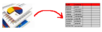
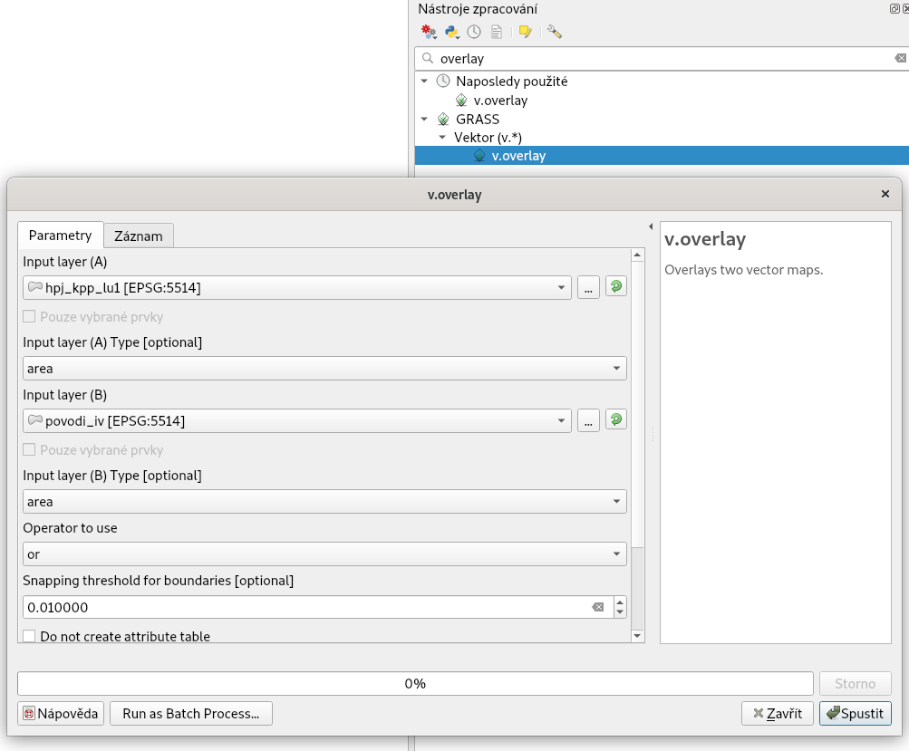

.. |grass_shell| image:: ../images/gplugin/shell.1.png
   :width: 1.5em

.. |v.db.update| image:: ../images/gplugin/v.db.update_op.2.png
   :width: 1.5em
.. |v.db.addcolumn| image:: ../images/gplugin/v.db.addcolumn.1.png
   :width: 1.5em
.. |v.db.join| image:: ../images/gplugin/v.db.join.3.png
   :width: 3em
.. |v.overlay.or| image:: ../hydrologie/images/or.png
   :width: 1.5em
.. |v.overlay.and| image:: ../hydrologie/images/and.png
   :width: 1em
.. |v.to.rast.attr| image:: ../images/gplugin/v.to.rast.attr.3.png
   :width: 2em
.. |v.to.db| image:: ../images/gplugin/v.to.db.2.png
   :width: 3.5em

.. |grasslogo| image:: ../images/icon/grasslogo.png
   :width: 1.5em
.. |diagram| image:: ../images/icon/diagram.png
   :width: 1.5em

=============
Metoda SCS CN
=============

:skoleni:`Teoretický popis metody
<grass-gis-pokrocily/hydrologie/scs-cn.html#scs-cn-teorie>`,
:skoleni:`základní symboly
<grass-gis-pokrocily/hydrologie/scs-cn.html#scs-cn-symboly>` použité v
dalším textu, :skoleni:`popis vstupních dat
<grass-gis-pokrocily/hydrologie/scs-cn.html#scs-cn-vstupni-data>` a
:skoleni:`navrhovaný postup
<grass-gis-pokrocily/hydrologie/scs-cn.html#scs-cn-postup>` je
součástí školení *GRASS GIS pro pokročilé*.

Postup zpracovaní v QGIS
========================

.. _kr1:

Krok 1
------

*Sjednocení hlavních půdních jednotek a komplexního průzkumu půd*

V prvním kroku založíme projekt a pomocí |mActionAddOgrLayer|
:sup:`Přidaní vektorové vrstvy` a |mActionAddDelimitedTextLayer|
:sup:`Přidat vrstvu s odděleným textem` vložíme do panelu vrstev
vstupní data - vektorová data ve formátu Esri Shapefile
:file:`hpj.shp`, :file:`kpp.shp`, :file:`landuse.shp`,
:file:`povodi.shp` a soubory s odděleným textem
:file:`hpj_hydrsk.csv`, :file:`kpp_hydrsk.csv`,
:file:`lu_hydrsk_cn.csv`, viz školení :skoleni:`QGIS pro začátečníky
<qgis-zacatecnik/vektorova_data/import_delim.html>`.

Následně sjednotíme vrstvu hlavních půdních jednotek (:map:`hpj`) a
komplexního průzkumu půd (:map:`kpp`). Využijeme nástroj
geoprocessingu |mAlgorithmUnion| :sup:`Sjednotit`, který najdeme v
záložce :menuselection:`Vektor --> Nástroje geoprocessingu` anebo v
:doc:`../geoprocessing/index`.  Vznikne nová vektorová vrstva
:map:`hpj_kpp`.

.. _kr2:

Krok 2
------

*Připojení informací o hydrologické skupině*

Tabulku :dbtable:`hpj_hydrsk` můžeme připojit k atributům nové
vektorové vrstvy :map:`hpj_kpp` pomocí společného sloupce
:dbcolumn:`HPJ` (:numref:`at-pred-join`).  Pravým tlačítkem myši v
panelu vrstev u :map:`hpj_kpp` zvolíme :item:`Vlastnosti` a v
dialogovém okně přejdeme do záložky |join| :sup:`Připojení`. Kliknutím
na ikonku |mActionSignPlus| spustíme dialogové okno s nastavením pro
připojení (:numref:`join`), viz kapitola :skoleni:`Připojení
tabulkových dat <qgis-zacatecnik/vektorova_data/join.html>` ve školení
QGIS pro začátečníky.

.. _at-pred-join:

.. figure:: images/at_pred_join.png
   :class: middle
        
   Společný atribut *HPJ* a hydrologické skupiny hlavních půdních jednotek.

.. _join:

.. figure:: images/at_join.png
   :scale: 65%
        
   Připojení tabulky k vektorové vrstvě na zákládě společného atributu.

Tímto způsobem připojíme tabulky s informacemi o hydrologických
skupinách (:numref:`tab-pripojene`).

.. _tab-pripojene:

.. figure:: images/tab_pripojene.png
   :class: middle
        
   Zobrazení připojených vrstev ve vlastnostech vrstvy *hpj_kpp*.

.. note:: V některých případech nemusí připojení tabulek proběhnout
          korektně, např. pokud se liší datový typ sloupečků použitých
          pro připojení. Typicky textové vs. číselné pole, např. '09'
          vs. '9'. V tomto případě je nutné data před přípojením sjednotit.

.. _novy-atribut:

Poté otevřeme atributovou tabulku :map:`hpj_kpp`, zapneme editační mód
ikonkou |mIconEditable| :sup:`Přepnout editaci` a pomocí kalkulátoru
polí |mActionCalculateField| :sup:`Otevřít kalkulátoru polí` vytvoříme
nový atribut. Použijeme připojené atributy o hydrologické skupině
(:dbcolumn:`hpj_HydrSk` z hlavních půdních jednotek a
:dbcolumn:`kpp_HydrSk` z komplexního průzkumu půd). Primárně použijeme
hydrologickou skupinu pro hlavní půdní jednotky.  Kde informace není
dosupná - hodnota :dbcolumn:`NULL`, tam použijeme
:dbcolumn:`kpp_HydrSk` (:numref:`at-hydrsk-kalk`) a výsledek zobrazíme
(:numref:`hydrsk-map`).

.. code-block:: bash
	
   CASE WHEN "hpj_HydrSk" IS NULL THEN "kpp_HydrSk" ELSE "hpj_HydrSk" END

.. _at-hydrsk-kalk:

.. figure:: images/at_hydrsk_kalk.png
   :class: middle
   
   Vytvoření atributu s informacemi o hydrologické skupině pro
   elementární plochy.

.. _hydrsk-ok:

.. figure:: images/hydrsk_ok.png
   :scale: 20%
        
   Sjednocené hydrologické skupiny elementárních ploch v zájmovém území.

.. _kr3:

Krok 3
------

*Průnik vrstvy hydrologických skupin s vrstvou využití území*

Využijeme nástroj geoprocessingu |mAlgorithmIntersect|
:sup:`Protnutí`. Výslednou vrstvu průniku nazveme
:map:`hpj_kpp_landuse`.

.. note:: V tomto případě má bohužel QGIS problém uložit výsledné
          prvky do výchozího formátu OGC Geopackage. Funkční náhradou
          je např. ESRI Shapefile. Uložení výsledku do formátu ESRI
          Shapefile je navíc často i rychlejší v porovnání s výchozím
          formátem OGC Geopackage.
          
.. _kr4:

Krok 4
------

*Připojení hodnot odtokové křivky* :math:`CN` 

V dalším kroku je potřeba vytvořit atribut, který bude obsahovat údaje
o využití území a o hydrologické skupině půdy dané elementární plochy
ve tvaru *VyužitíÚzemí_HydrologickáSkupina*.

Pomocí kalkulátoru polí |mActionCalculateField| :sup:`Otevřít
kalkulátor polí` vytvoříme nový atribut a nazveme jej
:dbcolumn:`lu_hydrsk` (datový typ nastavíme na řetězec). Hodnota
atributu bude ve tvaru ``LandUse||'_'||hydrsk``.

Ve vlastnostech vrstvy |join| :sup:`Připojení` připojíme tabulku
:file:`lu_hydrsk_cn.csv`. Tímto krokem získáme pro každou elementární
plochu odpovídající hodnotu `CN`.

           
   Připojení hodnot CN k elementárním plochám.
      
.. _kr5:

Krok 5
------

*Sjednocení průniku vrstvy hydrologických skupin a využití území s vrstvou povodí*

Do této fáze je možné používat QGIS relativně bez problémů. Při
větších objemech dat mohou být ale nativní nástroje QGISu časově
náročné a nestabilní.

Hodnoty návrhových srážek s různou dobou opakovaní do vrstvy přidáme
pomocí operace |mAlgorithmUnion| :sup:`Sjednotit`.

Tato operace bohužel končí topologickou chybou

::
      
   TopologyException: Input geom 0 is invalid: Hole lies outside shell at or near point ...

V nastavení :menuselection:`Nastavení --> Možnosti --> Zpracování -->
Obecné --> Filtrování neplatných prvků` nastavíme `Ignorovat prvky s
neplatnými geometriemi` a výpočet spustíme znovu. Nové nastavení
výrazně výpočet zpomalí, nicméně ani to nepomůže. Výpočet končí
chybou.

::

      TopologyException: found non-noded intersection between LINESTRING (...) and LINESTRING (...) at ...

Pro další řešení tedy použijeme výpočetně stabilnější nástroje systému
GRASS GIS. Více o systému GRASS v rámci školení :skoleni:`GRASS GIS
pro začátečníky <grass-gis-zacatecnik>`. Překryvné operace jako
protnutí či spojení má v systému GRASS na starost nástroj
:grasscmd:`v.overlay.`

Výpočetní nástroje systému GRASS lze spouštět buď přímo z
:doc:`../geoprocessing/index` anebo pomocí :doc:`zásuvného modulu
GRASS <../grass/index>`. Druhý způsob by vyžadoval vytvořit GRASS
lokaci, naimportovat do ní vstupní data. Tento postup byl výhodný
především, pokud bychom chtěli zbytek výpočtu již provést v systému
GRASS celý. Jelikož chceme provést mimo nativní nástroje QGIS pouze
jeden výpočet, tak zvolíme možnost spuštění nástroje GRASS přímo z
nástroje zpracovaní.

.. tip:: Postup postavený na zásuvnému modulu GRASS je k dohledání ve
         :skoleni:`starších materiálech
         <qgis-pokrocily/2.18/hydrologie/scs-cn.html>` školení pro verzi
         QGIS 2.18.

Bohužel externí nástroje spuštěné z nástrojů zpracování ignorují
připojené tabulky ke vstupní vrstvě. Abychom tedy nepřišli o připojené
hodnoty CN, musíme nejprve vstupní vrstvu zapsat do nového souboru.

.. figure:: images/save_join.png
   :class: small

   Uložení vrstvy do nového souboru. V případě použití formátu OGC
   Geopackage vynecháme atribut ``fid``, který je tímto formátem
   vytvořen automaticky. V opačném případě by export prvků skončil
   chybou.
         

   
   Spuštění nástroje :grasscmd:`v.overlay` z prostředí nástrojů
   zpracovaní. Kromě operátoru ``or`` pro operaci sjednocení je vhodné
   nastavit rozumnou hodnotu pro přichycení hranic. Předpokládáme
   totiž na vstupu topologicky nekorektní data. V našem případě jsme
   zvolili 1cm, což je hluboko pod přesností vstupních dat.

Je důležité si uvědomit, že nástroj :grasscmd:`v.overlay` přidává k
názvům atributu prefix ``a_`` a ``b_``. To podle toho z jakého vstupní
vrstvy atributy pocházejí.

   
   Názvy atributů po operaci spojení obsahují prefix.

Dále budeme pracovat především s hodnotami `CN`. Pro další operace je
potřeba, aby typ tohoto atributu byl číselný, na což použijeme funkci
``cast()``. Vytvoříme tedy nový atribut :dbcolumn:`CN` s datovým typem
*integer*.

.. _kr6:

Krok 6
------

*Výpočet výměry elementárních ploch, parametru* :math:`A` *a parametru* :math:`I_a` 

Pro každou elementární plochu vypočítame její výměru, parametr
:math:`A` a :math:`I_a`.

.. math::

   A = 25.4 \times (\frac{1000}{CN} - 10)

.. math::

   I_a = 0.2 \times A

Do atributové tabulky :dbtable:`hpj_kpp_lu_pov` přidáme nové atributy typu
*double*, konkrétně :dbcolumn:`vymera`, :dbcolumn:`A`,
:dbcolumn:`I_a`. Poté vypočítame jejich příslušné hodnoty. Postupujeme
obdobně jako při :ref:`tvorbě atributu <novy-atribut>` s hodnotami o
využití území a hydrologické skupině (:dbcolumn:`landuse_hydrsk`),
přičemž pro jejich výpočet použijeme matematické operáce jako sčítaní,
odčítaní, násobení a podobně (:numref:`add-columns` a
:numref:`area-a`). Pro určení plochy každé elementární plochy využijeme
modul z kategorie :menuselection:`Vektor --> Zprávy a statistiky`,
modul |v.to.db| :sup:`v.to.db`.

.. _add-columns:

        
   Vytvoření více atributů najednou s využitím *v.db.addcolumn*.

.. _area-a:

.. figure:: images/area_A.png
   :class: large
        
   Výpočet výměry modulem *v.to.db* a parametru *A* modulem *v.db.update_op*.

.. noteadvanced::

   V příkazovém řádku by tyto kroky vypadaly následovně:

   .. code-block:: bash

      v.db.addcolumn map=hpj_kpp_lu_pov columns="vymera double,A double,Ia double"
      v.to.db map=hpj_kpp_lu_pov option=area columns=vymera
      v.db.update map=hpj_kpp_lu_pov column=A value="24.5 * (1000 / CN - 10)"
      v.db.update map=hpj_kpp_lu_pov column=I_a value="0.2 * A"

.. _kr7:

Krok 7
------

*Výpočet parametru* :math:`H_o` *a parametru* :math:`O_p` *pro každou elementární plochu*

Znázornění vektorové vrstvy povodí s návrhovými srážkami v prostředí
QGIS je uvedeno na :numref:`navrhove-zrazky` (maximální hodnota atributů
:dbcolumn:`H_002_120` představuje 23 mm). Histogramy je možné
vykreslit v záložce |diagram| :sup:`Diagramy` ve vlastnostech
konkrétní vrstvy.
 
.. _navrhove-zrazky:

.. figure:: images/navrhove_zrazky.png
   :class: middle
        
   Zobrazení povodí IV. řádu s návrhovými srážkami.

Vypočítáme výšku přímého odtoku v *mm* jako parametr :math:`H_o` a
objem jako parametr :math:`O_{p}`.

.. math::

   H_O = \frac{(H_S − 0.2 \times A)^2}{H_S + 0.8 \times A}
   
   O_P = P_P \times \frac{H_O}{1000}

V dalších krocích budeme uvažovat průměrný úhrn návrhové srážky
:math:`H_{s}` = 32 mm. Při úhrnu s dobou opakovaní 2 roky (atribut
:dbcolumn:`H_002_120`) či dobou 5, 10, 20, 50 anebo 100 roků by byl
postup obdobný.

.. important:: Hodnota v čitateli vztahu pro :math:`H_o` musí být
   kladná, resp. nelze umocňovat záporné číslo. V případě, že čitatel
   je záporný, výška přímého odtoku je rovná nule. Pomůžeme si novým
   atributem v atributové tabulce, který nazveme :dbcolumn:`HOklad`.

Postupujeme obdobně jako na :numref:`add-columns` a :numref:`area-a` anebo
pomocí příkazového řádku.

.. code-block:: bash

   v.db.addcolumn map=hpj_kpp_lu_pov columns="HOklad double, HO double, OP double" 
   v.db.update map=hpj_kpp_lu_pov column=HOklad value="(32 - (0.2 * A))"

Záporným hodnotám :dbcolumn:`HOklad` přiřadíme konstantu `0` modulem
|v.db.update| :sup:`v.db.update_query`
(:numref:`v-db-update-query`). Atributy :dbcolumn:`HO` a :dbcolumn:`OP`
vyplníme modulem |v.db.update| :sup:`v.db.update_op`.

.. code-block:: bash

   v.db.update map=hpj_kpp_lu_pov column=HO value='(HOklad * HOklad)/(32 + (0.8 * A))'
   v.db.update map=hpj_kpp_lu_pov column=OP value="vymera * (HO / 1000)" 

.. _v-db-update-query:

.. figure:: images/v_db_update_query.png
        
   Přiřazení konstatní hodnoty atributu v případě splnění podmínky
   dotazu modulem *v.db.update_query*.

.. tip:: 
   
   Přiřazení konstanty `0` pro záporné :dbcolumn:`HOklad` je možno
   zkontrolovat tak jako je prezentovano na :numref:`ho-klad`.

   .. _ho-klad:

   .. figure:: images/ho_klad.png
      :class: middle
        
      Kontrola editace záporných hodnot v příkazovém řádku.

.. _kr8:

Krok 8
------

*Vytvoření rastrových vrstev výšky a objemu přímého odtoku*

Modulem |v.to.rast.attr| :sup:`v.to.rast.attr` vytvoříme z vektorové
vrstvy :map:`hpj_kpp_lu_pov` rastrové vrstvy :map:`ho` a
:map:`op`. Výsledky vizualizované v prostředí QGIS jsou uvedeny na
:numref:`ho-op`.

.. important:: Před samotnou rasterizací je nutné korektně nastavit
   :skoleni:`výpočetní region
   <grass-gis-zacatecnik/intro/region.html>`.

.. _ho-op:

.. figure:: images/ho_op.png
   :class: large
        
   Zobrazení výšky a objemu přímého odtoku pro elementární plochy v
   prostředí QGIS.

.. _kr9:

Krok 9
------

*Výpočet průměrných hodnot výšky a objemu přímého odtoku pro povodí*

V dalším kroku vypočítáme průměrné hodnoty přímého odtoku pro každé
povodí v řešeném území. Modul |v.rast.stats| :sup:`v.rast.stats`
počítá základní statistické informace rastrové vrstvy na základě
vektorové vrstvy a ty ukladá do nových atributů v atributové
tabulce. Dialogové okno je uvedeno na :numref:`v-rast-stats`.

.. _v-rast-stats:

.. figure:: images/v_rast_stats.png
        
   Dialogové okno modulu *v.rast.stats*.

Vektorovou vrstvu povodí potom převedeme do podoby rastrové vrstvy,
přičem jako klíčový atribut použijeme :dbcolumn:`ho_average`,
resp. :dbcolumn:`op_average`. Výstup zobrazený v prostředí QGIS je na
:numref:`ho-op-avg`.

.. _ho-op-avg:

.. figure:: images/ho_op_avg.png
   :class: large
        
   Zobrazení průměrné výšky a objemu přímého odtoku pro povodí v
   prostředí QGIS.

