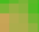
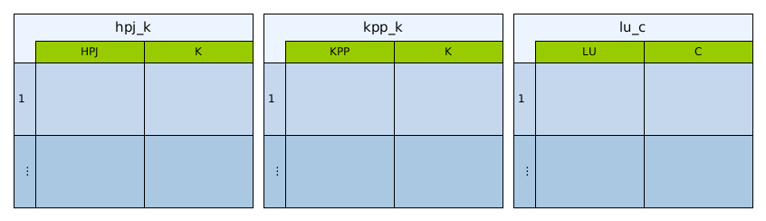

.. |v.overlay.and| image:: ../hydrologie/images/and.png
   :width: 1em
.. |v.db.join| image:: ../images/gplugin/v.db.join.3.png
   :width: 3em
.. |v.db.update| image:: ../images/gplugin/v.db.update_op.2.png
   :width: 1.5em
.. |v.db.addcolumn| image:: ../images/gplugin/v.db.addcolumn.1.png
   :width: 1.5em

.. |v.to.rast.attr| image:: ../images/gplugin/v.to.rast.attr.3.png
   :width: 2em

2. Priemerná dlhodobá strata pôdy
=================================

Teoretické východiská
---------------------

Pri výpočtoch priemernej dlhodobej straty pôdy sa proces vodnej erózie
popisuje pomocou matematického modelu USLE, tzv. univerzálnej rovnice
straty pôdy:

.. _vzorec-G:

.. math::
   
   G = R \times K \times L \times S \times C \times P

Základné symboly
----------------

 * G - priemerná dlhodobá strata pôdy (:math:`t.ha^{-1} . rok^{-1}`)
 * R - faktor eróznej účinnosti dažďa (:math:`MJ.ha^{-1} .cm.h^{-1}`)
 * K - faktor erodovateľnosti pôdy (:math:`t.h.MJ^{-1} .cm^{-1} .rok^{-1}`) 
 * L - faktor dĺžky svahu (:math:`-`)
 * S - faktor sklonu svahu (:math:`-`)
 * C - faktor ochranného vplyvu vegetačného krytu (:math:`-`) 
 * P - faktor účinnosti protieróznych opatrení (:math:`-`) 
          
Vstupné dáta
------------

 * :map:`dmt.gtiff` - digitálny model terénu v rozlišení 10 x 10 m
 * :map:`hpj.shp` - vektorová vrstva hlavných pôdnych jednotiek (z kódov BPEJ),
 * :map:`kpp.shp` - vektorová vrstva komplexného prieskumu pôd,
 * :map:`landuse.shp` - vektorová vrstva využitia územia,
 * :map:`povodi.shp` - vektorová vrstva povodí IV. rádu s návrhovými
   zrážkami :math:`H_s` (doba opakovania 2, 5, 10, 20, 50 a 100 rokov)

 * :dbtable:`hpj_k` - číselník s kódom `K` pre hlavné pôdne jednotky,
 * :dbtable:`kpp_k` - číselník s kódom `K` pre pre vrstvu komplexného prieskumu pôd,
 * :dbtable:`lu_c` - číselník s kódom `C` pre vrstvu využitia územia
 * :map:`maska.pack` - oblasť riešeného územia bez líniových a plošných prvkov 
   prerušujúcich odtok
             
Navrhovaný postup
-----------------

:ref:`1.<krok1>` 
zjednotenie hlavných pôdnych jednotiek a komplexného prieskumu pôd (:map:`hpj_kpp`)

:ref:`2.<krok2>` 
pripojenie kódov `K` k vrstve :map:`hpj_kpp`

:ref:`3.<krok3>` 
prienik vrstvy s kódmi `K` s vrstvou využitia územia (:map:`hpj_kpp_landuse`)

:ref:`4.<krok4>` 
pripojenie kódov `C` k vrstve :map:`hpj_kpp_landuse`

:ref:`5.<krok5>` 
výpočet parametra `KC`

:ref:`6.<krok6>` 
vytvorenie rastrovej mapy sklonu a mapy akumulácií toku v každej bunke 
(:map:`slope` a :map:`accu`)

:ref:`7.<krok7>` 
výpočet parametra `LS`

:ref:`8.<krok8>` 
výpočet parametra `G`

:ref:`9.<krok9>` 
vytvorenie rastrových vrstiev :map:`g.gtiff`, :map:`g_m.gtiff` a :map:`ls_m.gtiff`

:ref:`10.<krok10>` 
výpočet priemerných hodnôt `G` pre povodie s maskou a bez masky a vytvorenie :map:`g_pov.gtiff` a :map:`g_pov_m.gtiff`

Na :num:`#schema-usle` je prehľadne znázornený navrhovaný postup. 

.. _schema-usle:

.. figure:: images/schema_usle.png
   :class: large

   Grafická schéma postupu 

Postup spracovania v QGIS
-------------------------

Znázornenie vstupných vektorových dát spolu s atribútovými tabuľkami je totožné
so :skoleni:`vstupnými vektorovými dátami pri metóde SCS CN 
<qgis-pokrocily/hydrologie/scs-sc/vstupne-data>`. Digitálny model reliéfu a 
oblasť riešeného územia bez líniových a plošných prvkov prerušujúcich odtok 
(maska) je na :num:`#dmr-maska`. Tabuľky s kódmi `K` a kódmi `C` sú na 
:num:`#ciselniky`.

.. _dmr-maska:

.. figure:: images/x.png
   :class: middle

   Vrstva digitálneho modelu reliéfu a oblasť riešeného územia bez prvkov 
   prerušujúcich odtok.

.. _ciselniky:

   Číselníky s kódmi *K* a *C*. 

.. _krok1:

Krok 1
^^^^^^
1. zjednotenie hlavných pôdnych jednotiek a komplexného prieskumu pôd (:map:`hpj_kpp`)

.. _krok2:

Krok 2
^^^^^^
2. pripojenie kódov `K` k vrstve :map:`hpj_kpp`

.. _ciselniky:

   Pripojenie číselníkov s faktorom *K* v prostredí QGIS. 

``CASE WHEN "hpj_K" IS NULL THEN "kpp_K" ELSE "hpj_K" END``

.. _ciselniky:

   Vytvorenie atribútu s hodnotami faktora *K*.

.. _ciselniky:

.. figure:: images/usle_k.png
   :class: small

   Faktor *K* elementárnych plôch v záujmovom území. 

.. _krok3:

Krok 3
^^^^^^
3. prienik vrstvy s kódmi `K` s vrstvou využitia územia (:map:`hpj_kpp_landuse`)

|v.overlay.and| :sup:`v.overlay.and`

.. _krok4:

Krok 4
^^^^^^
4. pripojenie kódov `C` k vrstve :map:`hpj_kpp_landuse`, :num:`#usle-db-join-c`

|v.db.join| :sup:`v.db.join`

.. _usle-db-join-c:

.. figure:: images/usle_db_join_c.png
   :class: small

   Pripojenie hodnôt faktora `C` k elementárnym plochám. 

.. _krok5:

Krok 5
^^^^^^
5. výpočet parametra `KC`

Pre ďalšie výpočty je potrebné, aby typ atribútov s faktorom `K` a faktorom `C` 
bol číselný. Použijeme modul |v.db.addcolumn| :sup:`v.db.addcolumn`, 
modul |v.db.update| :sup:`v.db.update_op`, funkciu ``cast()`` a typ *real*.

Hodnoty oboch faktorov vynásobíme pre každú plochu a nový atribút nazveme 
:dbcolumn:`KC`. V záložke :item:`Region` nastavíme rozlíšenie 1 x 1 m a modulom
|v.to.rast.attr| :sup:`v.to.rast.attr` vektor :map:`hpj_kpp_landuse` prevediem
na rastrové dáta :map:`kc`. Následne použijeme modul |r.resamp.stats| 
:sup:`r.resamp.stats` a raster prevzorkujeme pomocou agregácie tak, aby rozlíšenie 
odpovedalo rozlíšeniu 10 x 10 (rozlíšenie :map:`dmt`). Použijeme redukciu 
rozlíšenia na základe priemeru hodnôt vypočítaného z okolitých buniek 
(:num:`#r-resamp-stats`).
Výsledok je na :num:`#kc`. 

.. note:: Týmto postupom nedôjde k strate informácie, ku ktorej by došlo pri 
	  priamom prevode na raster s rozlíšením 10 x 10 m (hodnota bunky by 
	  bola zvolená na základe polygónu, ktorý prechádza stredom bunky alebo 
	  na základe polygónu, ktorý zaberá najväčšiu časť plochy bunky). 

.. _r-resamp-stats:

   Dialógové okno modulu na prevzorkovanie rastra pomocou agregácie na základe 
   priemeru okolitých buniek.

.. _kc:

.. figure:: images/kc.png
   :class: small

   Faktor KC zahrňujúci vplyv erodovateľnosti pôdy a vplyv ochranného vplyvu 
   vegetačného krytu. 

.. _krok6:

Krok 6
^^^^^^
6. vytvorenie rastrovej mapy sklonu a mapy akumulácií toku v každej bunke 
   (:map:`slope` a :map:`accu`)

.. _krok7:

Krok 7
^^^^^^
7. výpočet parametra `LS`

.. _krok8:

Krok 8
^^^^^^
8. výpočet parametra `G`

.. _krok9:

Krok 9
^^^^^^
9. vytvorenie rastrových vrstiev :map:`g.gtiff`, :map:`g_m.gtiff` a :map:`ls_m.gtiff`

.. _krok10:

Krok 10
^^^^^^^
10. výpočet priemerných hodnôt `G` pre povodie s maskou a bez masky a vytvorenie rastrových vrstiev :map:`g_pov.gtiff` a :map:`g_pov_m.gtiff`

