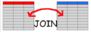
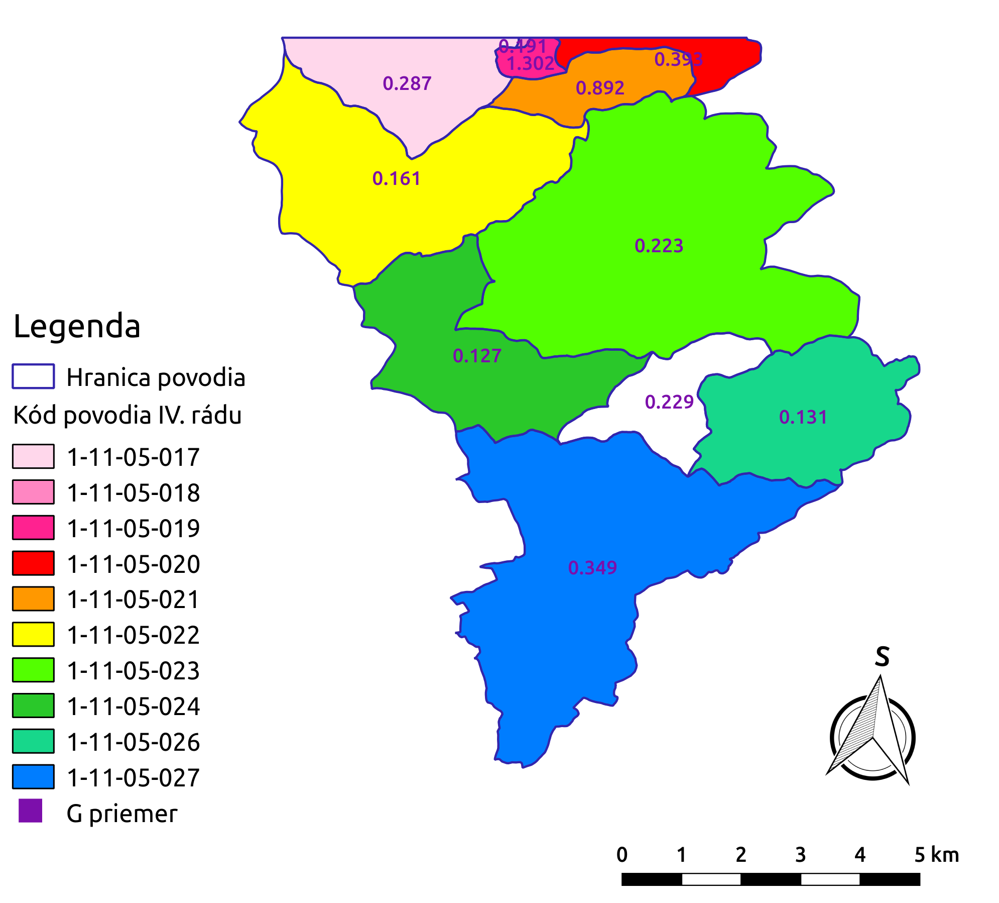
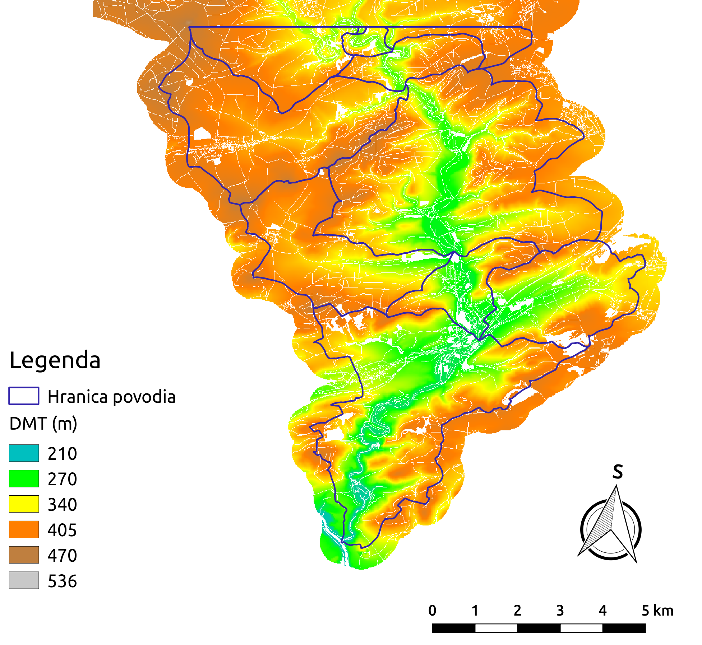

.. |v.overlay.and| image:: ../hydrologie/images/and.png
   :width: 1em

.. |v.db.update| image:: ../images/gplugin/v.db.update_op.2.png
   :width: 1.5em
.. |v.db.addcolumn| image:: ../images/gplugin/v.db.addcolumn.1.png
   :width: 1.5em
.. |r.resamp.stats| image:: ../images/gplugin/r.resamp.stats.2.png
   :width: 1.5em
.. |v.to.rast.attr| image:: ../images/gplugin/v.to.rast.attr.3.png
   :width: 2em
.. |r.mask.rast| image:: ../images/gplugin/r.mask.rast.2.png
   :width: 1.5em

.. |grass_shell| image:: ../images/gplugin/shell.1.png
   :width: 1.5em
.. |r.mapcalc| image:: ../images/gplugin/r.mapcalc.1.png
   :width: 1.5em

.. |mc2| image:: ../hydrologie/images/mc2.png
   :width: 1.5em

.. |mc4| image:: ../hydrologie/images/mc4.png
   :width: 1.5em
.. |mc5| image:: ../hydrologie/images/mc5.png
   :width: 1.5em

.. |v.rast.stats| image:: ../images/gplugin/v.rast.stats.3.png
   :width: 4.5em

2. Priemerná dlhodobá strata pôdy
=================================

Teoretické východiská
---------------------
Priemerné ročné straty pôdy spôsobené odtokom z pozemku určitého sklonu a 
určitého spôsobu využívania možno predikovať pomocou matematického modelu 
:wikipedia:`USLE <Univerzální rovnice ztráty půdy>`, tzv. univerzálnej rovnice 
straty pôdy:

.. _vzorec-G:

.. math::
   
   G = R \times K \times L \times S \times C \times P

Základné symboly
----------------

 * G - priemerná dlhodobá strata pôdy (:math:`t.ha^{-1} . rok^{-1}`)
 * R - faktor eróznej účinnosti dažďa (:math:`MJ.ha^{-1} .cm.h^{-1}`)
 * K - faktor erodovateľnosti pôdy (:math:`t.h.MJ^{-1} .cm^{-1} .rok^{-1}`) 
 * L - faktor dĺžky svahu (:math:`-`)
 * S - faktor sklonu svahu (:math:`-`)
 * C - faktor ochranného vplyvu vegetačného krytu (:math:`-`) 
 * P - faktor účinnosti protieróznych opatrení (:math:`-`) 
          
Vstupné dáta
------------

 * :map:`hpj.shp` - vektorová vrstva hlavných pôdnych jednotiek z kódov BPEJ
 * :map:`kpp.shp` - vektorová vrstva komplexného prieskumu pôd
 * :map:`landuse.shp` - vektorová vrstva využitia územia
 * :map:`povodi.shp` - vektorová vrstva povodí IV. rádu s návrhovými
   zrážkami :math:`H_s` (doba opakovania 2, 5, 10, 20, 50 a 100 rokov)
 * :dbtable:`hpj_k` - číselník s kódom `K` pre hlavné pôdne jednotky, :num:`#ciselniky` vľavo
 * :dbtable:`kpp_k` - číselník s kódom `K` pre pre vrstvu komplexného prieskumu pôd, :num:`#ciselniky` vpravo
 * :dbtable:`lu_c` - číselník s kódom `C` pre vrstvu využitia územia, :num:`#ciselniky` vpravo
 * :map:`dmt` - digitálny model terénu v rozlišení 10 x 10 m, :num:`#dmt-maska` vľavo
 * :map:`maska.pack` - oblasť územia bez líniových a plošných prvkov prerušujúcich odtok, :num:`#dmt-maska` vpravo
             
Navrhovaný postup
-----------------

:ref:`1.<krok1>` 
zjednotenie hlavných pôdnych jednotiek a komplexného prieskumu pôd

:ref:`2.<krok2>` 
pripojenie hodnôt faktora `K` k elementárnym plochám

:ref:`3.<krok3>` 
prienik vrstvy s faktorom `K` s vrstvou využitia územia 

:ref:`4.<krok4>` 
pripojenie hodnôt faktora `C`

:ref:`5.<krok5>` 
výpočet parametra `KC` 

:ref:`6.<krok6>` 
vytvorenie rastrovej mapy sklonu a mapy akumulácií toku v každej bunke 

:ref:`7.<krok7>` 
výpočet parametra `LS`

:ref:`8.<krok8>` 
výpočet `G` a vytvorenie rastra s hodnotami predstavujúcimi priemernú dlhodobú 
stratu pôdy

:ref:`9.<krok9>` 
výpočet priemerných hodnôt `G` pre povodie 

:ref:`10.<krok10>` 
vytvorenie rastrových vrstiev `LS` a `G` s maskou

:ref:`11.<krok11>` 
výpočet priemerných hodnôt `G` pre povodie s maskou 

.. _schema-usle:

.. figure:: images/schema_usle.png
   :class: large

   Grafická schéma postupu 

Znázornenie vstupných vektorových dát spolu s atribútovými tabuľkami je totožné
so :skoleni:`vstupnými vektorovými dátami pri metóde SCS CN 
<qgis-pokrocily/hydrologie/scs-sc/vstupne-data>`. Digitálny model reliéfu a 
oblasť riešeného územia bez líniových a plošných prvkov prerušujúcich odtok 
(maska) sú na :num:`#dmt-maska`. Tabuľky s faktormi `K` a `C` sú na 
:num:`#ciselniky`.

.. _dmt-maska:

.. figure:: images/dmt_maska.png
   :class: middle

   Vrstva digitálneho modelu reliéfu a oblasť riešeného územia bez prvkov 
   prerušujúcich odtok.

.. _ciselniky:

.. figure:: images/ciselniky_usle.png
   :class: middle

   Číselníky s kódmi *K* a *C*. 

Postup spracovania v QGIS
-------------------------

.. _krok1:

Krok 1
^^^^^^
Postup ako zjednotiť vrstvu hlavných pôdnych jednotiek a komplexného prieskumu 
pôd je totožný s :skoleni:`prvým krokom <qgis-pokrocily/hydrologie/scs-sc/vkr1>` 
pri metóde SCS CN. 

.. _krok2:

Krok 2
^^^^^^
.. _ciselniky:

Pripojenie tabuliek :dbtable:`hpj_k` a :dbtable:`kpp_k` je tiež podobné ako 
:skoleni:`druhý krok <qgis-pokrocily/hydrologie/scs-sc/vkr2>` pri metóde SCS CN
iba s tým rozdielom, že spoločným atribútom nie je hydrologická skupina 
:dbtable:`HPJ`, ale faktor :dbtable:`K`. Dialógové okno s nastaveniami pre 
toto spájanie je na :num:`#usle-join`. Vyplnenie informácií o faktore `K`
z vrstvy komplexného prieskumu pôd pomocou kalkulačky polí 
a znázornenie výsledku sú na :num:`usle-kalk-k`.

.. _usle-join: 

.. figure:: images/usle_join.png
   :class: small

   Pripojenie číselníkov s faktorom *K* v prostredí QGIS. 

.. _usle-kalk-k:

.. figure:: images/usle_kalk_k.png
   :class: middle

   Vytvorenie atribútu s hodnotami faktora *K* pre elementárne plochy v záujmovom území.

.. _krok3:

Krok 3
^^^^^^

Aj tento krok sa veľmi podobá na 
:skoleni:`tretiu časť postupu <qgis-pokrocily/hydrologie/scs-sc/vkr2>` pri metóde
SCS CN. Na vytvorenie prieniku vrstvy :map:`hpj_kpp` s vrstvou využitia krajiny
:map:`landuse` v riešenej oblasti využijeme modul |v.overlay.and| 
:sup:`v.overlay.and`. Výsledok nazveme :map:`hpj_kpp_landuse`. 

.. _krok4:

Krok 4
^^^^^^
Pokračujeme pripojením hodnôt faktora `C` k elementárnym plochám vrstvy 
:map:`hpj_kpp_landuse`, viď. :num:`#usle-db-join-c` so znázornením dialógového 
okna modulu |v.db.join| :sup:`v.db.join`. 

.. _usle-db-join-c:

   Pripojenie hodnôt faktora `C` k elementárnym plochám. 

.. _krok5:

Krok 5
^^^^^^
Pre ďalšie výpočty je potrebné, aby typ atribútov s faktorom `K` a faktorom `C` 
bol číselný. Použijeme modul |v.db.addcolumn| :sup:`v.db.addcolumn`, 
modul |v.db.update| :sup:`v.db.update_op`, funkciu ``cast()`` a typ ``real``.

Hodnoty oboch faktorov vynásobíme pre každú plochu a nový atribút nazveme 
:dbcolumn:`KC`. V záložke :item:`Region` nastavíme rozlíšenie 1 x 1 m a modulom
|v.to.rast.attr| :sup:`v.to.rast.attr` vektor :map:`hpj_kpp_landuse` prevediem
na rastrové dáta :map:`kc`. Následne použijeme modul |r.resamp.stats| 
:sup:`r.resamp.stats` a raster prevzorkujeme pomocou agregácie tak, aby rozlíšenie 
odpovedalo rozlíšeniu 10 x 10 (rozlíšenie :map:`dmt`). Použijeme redukciu 
rozlíšenia na základe priemeru hodnôt vypočítaného z okolitých buniek 
(:num:`#r-resamp-stats`).
Výsledok je na :num:`#kc`. 

.. note:: Týmto postupom nedôjde k strate informácie, ku ktorej by došlo pri 
	  priamom prevode na raster s rozlíšením 10 x 10 m (hodnota bunky by 
	  bola zvolená na základe polygónu, ktorý prechádza stredom bunky alebo 
	  na základe polygónu, ktorý zaberá najväčšiu časť plochy bunky). 

.. _r-resamp-stats:

.. figure:: images/r_resamp_stats.png
   :class: small

   Dialógové okno modulu na prevzorkovanie rastra pomocou agregácie na základe 
   priemeru okolitých buniek.

.. _kc:

   Faktor KC zahrňujúci vplyv erodovateľnosti pôdy a vplyv ochranného vplyvu 
   vegetačného krytu. 

.. _krok6:

Krok 6
^^^^^^
Z digitálneho modelu terénu vytvoríme rastrovú mapu znázorňujúcu
sklonové pomery v stupňoch a nazveme ju :map:`slope`. 

.. _maska:

Pred výpočtom nastavíme masku 
(oblasť výpočtu) podľa vrstvy :map:`dmt` modulom |r.mask.rast| :sup:`r.mask`, viď.
:menuselection:`Rastr --> Prostorová analýza --> Maska`. Všetky rastrové
operácie budú obmedzené na masku oblasti (v mapsete ako :map:`MASK`). 
Následne spustíme modul |r.slope| :sup:`r.slope` a vypočítame sklon v riešenom
území (:num:`#slope` a :num:`#slope-accumulation` vľavo).

.. _slope:

.. figure:: images/slope.png
   :class: middle

   Výpočet sklonových pomerov v záujmovom území. 

Ďalej otvoríme príkazový riadok |grass_shell| :sup:`shell`, spustíme modul 
:grasscmd:`r.terraflow`, ktorý z digitálneho modelu terénu produkuje vyhladený DMT 
(:map:`dmt_fill`), rastrovú mapu smeru
odtoku do susednej bunky s najväčším sklonom (:map:`direction`), mapu mikropovodí
(:map:`swatershed`), rastrovú mapu znázorňujúcu akumuláciu toku v každej bunke
(:map:`accumulation`) a mapu konvergenčného topografického indexu (:map:`tci`).
Dialógové okno modulu je na :num:`#terraflow`. Zobrazenie ďalej potrebnej akumulácie 
odtoku v :math:`m^2` je na :num:`#slope-accumulation` vpravo.

.. _terraflow:

   Dialógové okno modulu *r.terraflow*. 

.. _slope-accumulation:

.. figure:: images/slope_accumulation.png
   :class: middle

   Sklonové pomery v stupňoch a akumulácia odtoku v :math:`m^2`. 

.. _faktor-ls:

.. _krok7:

Krok 7
^^^^^^
Topografický faktor `LS` vypočítame ako

.. math::
   
   LS = (accu \times \frac{10.0}{22.13})^{0.6} \times (\frac{sin(slope \times \frac{pi}{180})}{0.09})^{1.3}
   
Použijeme grafický kalkulátor rastrových máp |r.mapcalc| :sup:`r.mapcalc` 
(:menuselection:`Rastr --> Prostorová analýza --> Mapová algebra`). 
Pri používaní tohto modulu je potrebné, aby vrstvy boli pridané v paneli vrstiev
v aktuálnom projekte QGIS.

.. note:: V paneli prehliadača nájdeme príslušný mapset a pravým kliknutím
	  myši na konkrétnu mapu zvolíme ``Přidat vrstvu``.

V dialógovom okne modulu |r.mapcalc| :sup:`r.mapcalc` zostavíme algoritmus.
Ikonou |mc1| pridáme rastrovú mapu, ikonou |mc2| konštantu, ikonou |mc3|
vložíme operátor alebo funkciu, ikona |mc4| spája jednotlivé elementy, pomocou 
|mc5| elementy vyberáme a ikonou |mc6| ich možno vymazať. 
Výraz na výpočet `LS` a výsledok sú na :num:`#calc-ls`. 

.. _calc-ls:

.. figure:: images/calc_ls.png
   :class: middle

   Grafický kalkulátor a topografický faktor LS zahrňujúci vplyv dĺžky a sklonu 
   svahu. 

.. tip:: Výpočet v príkazovom riadku napíšeme ako 
	 :code:`r.mapcalc expr="ls = pow(accumulation * (10.0 / 22.13), 0.6) * pow(sin(slope * (3.14159/180)) / 0.09, 1.3)"`

.. _faktor-g:

.. _krok8:

Krok 8
^^^^^^
Na výpočet parametra `G` okrem `KC` a `LS` ešte potrebujeme faktor `R` a `P`, 
ktorých hodnoty nebudeme odvádzať ako tie predchádzajúce. Použijeme priemernú 
hodnotu ``R`` a ``P`` faktora pre Českú republiku, t.j ``R = 40`` a ``P = 1``.
Následne modulom |r.mapcalc| :sup:`r.mapcalc` vypočítame stratu pôdy, viď. 
:ref:`vzťah na výpočet G <vzorec-G>`. Vrstva s hodnotami predstavujúcimi 
priemernú dlhodobú stratu pôdy v jednotkách :math:`t.ha^{-1} . rok^{-1}` je 
na :num:`#g-map`.

.. _g-map:

.. figure:: images/g_map.png
   :class: small

   Priemerná dlhodobá strata pôdy pre riešené územie. 

.. _krok9:

Krok 9
^^^^^^
Na určenie priemernej hodnoty straty pre každé čiastkové
povodie využijeme modul |v.rast.stats| :sup:`v.rast.stats`. Kľúčovou vrstvou je
vektorová mapa :map:`povodi`, kde nastavíme prefix ``g`` pre 
novovytvorený stĺpec. V mapovom okne QGIS hodnoty vizualizujeme (:num:`g-pov`).

.. _g-pov:

   Povodia s priemernými hodnotami straty pôdy v jednotkách :math:`t.ha^{-1}.rok^{-1}`. 

.. _krok10:

Krok 10
^^^^^^^

Pre výpočet uvedený vyššie môže vychádzať strata pôdy v niektorých miestach 
enormne vysoká. To je spôsobené tým, že vo výpočtoch nie sú zahrnuté líniové a 
plošné prvky prerušujúce povrchový odtok. Týmito prvkami sú najmä budovy, 
priekopy diaľnic a ciest, železničné trate alebo múry lemujúce pozemky.

Presnejšie hodnoty možno získať zahrnutím týchto prvkov do výpočtu. 
Použijeme masku líniových a plošných prvkov prerušujúcich odtok 
(vrstva :map:`maska` na :num:`#dmt-maska` vpravo) a vypočítame nové hodnoty `LS` 
faktora a straty pôdy `G`. 

Modulom |r.mask.rast| :sup:`r.mask.rast` :ref:`nastavíme oblasť výpočtu <maska>` 
bez neželaných miest. Nastavenie skontrolujeme napríklad zobrazením digitálneho 
modelu terénu (:num:`#dmt-m`). Dopočítame :ref:`faktor LS <faktor-ls>` a 
:ref:`faktor G <faktor-g>`.

.. _dmt-m:

   Vrstva digitálneho modelu terénu vstupujúca do výpočtov bez prvkov prerušujúcich odtok. 

Porovnanie výsledkov *USLE* bez ohľadu na prvky prerušujúce odtok a s nimi
je na :num:`#g-por`.

.. _g-por:

   Porovnanie výsledkov USLE bez ohľadu na prvky prerušujúce odtok (vľavo) a s prvkami prerušujúcimi odtok (vpravo)

.. _krok11:

Krok 11
^^^^^^^

Priemerné hodnoty `G` určíme pre každé povodie po uvážení prvkov, ktoré 
prerušujú odtok. Pre porovnanie sú na :num:`#g-pov-por` hodnoty 
straty pôdy vykreslené pomocou textového diagramu v jednotkách 
:math:`t.ha^{-1}.rok^{-1}` bez a s úvážením prvkov prerušujúcich odtok.

.. _g-pov-por:

.. figure:: images/g_pov_por.png
   :class: small

   Povodia s priemernými hodnotami straty pôdy v jednotkách :math:`t.ha^{-1}.rok^{-1}` bez a s úvážením prvkov prerušujúcich odtok. 
