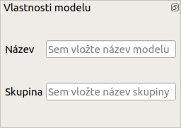
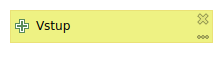
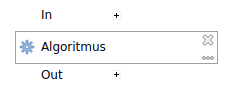
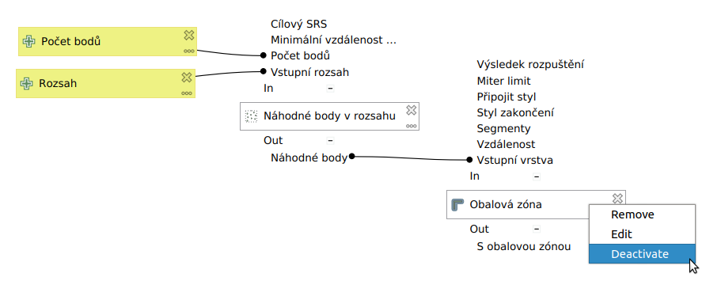
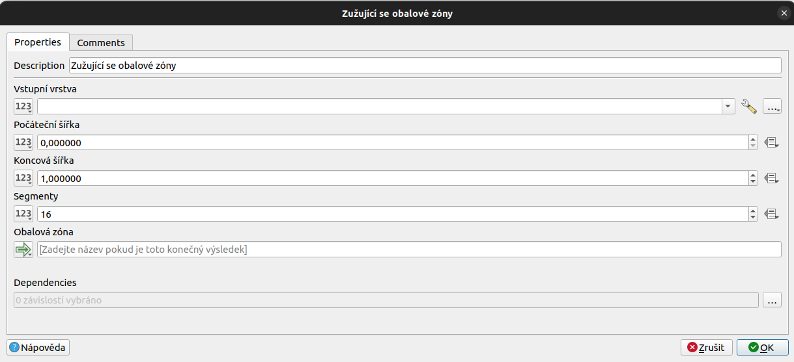
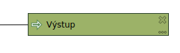

.. |qgis| image:: ../images/qgis_logo.png
   :width: 1.5em
.. |mActionFileSave| image:: ../images/icon/mActionFileSave.png
   :width: 1.5em
.. |random_points| image:: ../images/icon/random_points.png
   :width: 1.5em
.. |buffer| image:: ../images/icon/buffer.png
   :width: 1.5em
.. |model| image:: ../images/icon/model.png
   :width: 1.5em
   
Části modelu
============
Název a skupina
---------------
Před samotnou tvorbou modelu je vhodné zadat název a skupinu modelu (num část 
3) a uložit jej |mActionFileSave|. Potom můžeme model při jeho tvorbě průběžně 
ukládat.

   Zadání jména a skupiny modelu.

Vstupní parametry
-----------------

.. _vstupdia:

   Značení vstupního parametru v modelu.
   
Prvním krokem při tvorbě modelu je vložení vstupních parametrů. Tyto parametry 
jsou stejné jako u běžných algoritmů - vrstva, rozsah vrstvy, číslo, text, 
boolean (formou checkboxu) atd. Při spouštění vytvořeného modelu bude 
požadováno vyplnění vložených vstupních parametrů. Tyto parametry jsou 
navázany na konkrétní algoritmy v modelu.

.. figure:: images/modeler_vstup.png 
   :class: small 

   Možné vstupní parametry.
   
Jednotlivé parametry lze do modelu přidat tažením nebo poklikáním. Po přídání 
se objeví dialogové okno, které je u většiny parametrů jednoduché. Základní 
položkou je zde název parametru. Nastavení parametrů v modelu lze průběžně 
měnit kliknutím na symbol tužky, nebo lze parametry odstranit kliknutím na 
křížek (:numref:`vstupdia`).

.. figure:: images/modeler_vstup_num.png 
   :class: small 

   Dialogové okno při vložení číselného parametru.

- do našeho modelu přidáme vstupy :item:`Extent` a :item:`Number`. Pojmenujeme 
  např. :guilabel:`Rozsah` a :guilabel:`Počet bodů`, pozděj můžeme podle potřeby 
  změnit.

Algoritmy
---------

   Značení algoritmu v modelu.
   
Hlavní součástí modelů jsou algoritmy. Nalezneme zde většinu algoritmů, které 
jsou v okně nástrojů zpracování. Kromě těchto funkcí jsou zde speciální 
|model|:guilabel:`Nástroje jen pro modely` (:numref:`algor`).

.. _algor:
.. figure:: images/modeler_algor.png 
   :class: small 

   Možné vstupní algoritmy.
   
Algoritmy se přidávají do modelu opět tažením nebo poklikáním. Po přidání se 
ukáže běžné dialogové okno konkrétního algoritmu (:numref:`algorrand`). Zde máme 
možnost nastavit výchozí hodnoty parametrů algoritmu, se kterými se bude 
počítat při spuštění modelu. Jesltiže chceme mít parametry při spouštění modelu 
volitelné je třeba nakonfigurovat odpovídající vstupy (:numref:`algorrand2`).

- vložíme algoritmus |random_points|:guilabel:`Random points in extent` a jako
  vstupní rozsah zadáme náš vstupní parametr :item:`Rozsah`. Jako počet bodů
  zvolíme vstupní parametr :item:`Počet bodů` . Minimální vzdálenost a výstupní
  soubor měnit prozatím nebudeme, potvrdíme parametry tlačítkem :item:`OK`. 

.. _algorrand:
.. figure:: images/modeler_algor_rand.png 
   :class: medium 

   Dialogové okno algoritmu s pevně stanovenými parametry.

.. _algorrand2:
.. figure:: images/modeler_algor_rand2.png 
   :class: large 

   Nastavení parametrů na základě vstupů do modelu.

Nastavení algoritmů v modelu lze průběžně editovat kliknutím na symbol
tužky nebo lze algotritmy odstranit kliknutím na křížek. Také lze
použít tlačítek ``+`` a ``-`` lze měnit vstupy a výstupy algoritmu.

.. _algorrand3:
.. figure:: images/modeler_algor_rand3.png 

   Nastavení volitelných parametrů algoritmu |random_points|:guilabel:`Random
   points in extent` při spouštění modelu.

Jednotlivé algoritmy lze na sebe dále navazovat - to co je výstupem z jednoho 
algoritmu může nějakým způsobem vstupovat do algoritmu druhého 
(:numref:`algorrand4`).

- Vložíme do modelu algoritmus |buffer|:guilabel:`Obalová zóna dle pevné
  vzdálenosti`. Jako vstupní vrstvu nastavíme :guilabel:`'Náhodné body' z
  algoritmu 'Random points in extent'` a dále nastavíme libovolnou fixní vzdálenost v metrech.

.. _algorrand4:
.. figure:: images/modeler_algor_rand4.png 
   :class: middle 

   Náhodné body vygenerované |random_points|:guilabel:`Random points in extent`
   použité jako vstup pro vytvoření obalových zón.

Pravým kliknutím na algoritmus v modelu můžeme vyvolat kontextové menu, 
ve kterém můžeme algoritmus vymazat, deaktivovat nebo spustit jeho editaci 
(:numref:`algkont`). Ve spodní části dialogového okna každého algoritmu je 
parametr :guilabel:`Rodičovské algoritmy`, pomocí kterého lze nastavit 
nadřazené algoritmy. Takto vybrané algoritmy se budou vždy spouštět před 
tímto algoritmem (:numref:`algpar`).

.. _algkont:

   Kontextové menu algoritmu v modelu.

.. _algpar:

   Nastavení rodičovských algoritmů.

Výstupy
-------

   Značení výstupu v modelu.
   
Výstup slouží k vytvoření souboru (vrstva, HTML stránka atd.). Může
sloužit jako vlastní konečný výsledek modelu, ale také lze nastavit
výstupy průběžně u jednotlivých algoritmů. Výstup se konfiguruje u
každého algoritmu zvlášť, stačí zadat název výstupu do textového pole
ve spodní části dialogového okna algoritmu
(:numref:`modeloutname`). Všeobecně, a především při generování více
výstupů, je vhodné zvolit smysluplný název podle toho jaký je obsah
dat nebo co nám data sdělují.
   
.. _modeloutname:
.. figure:: images/modeler_out_name.png 
   :class: middle

   Dialogové okno algoritmu - pole pro zadání názvu výstupu.

- Otevřeme (editace) algoritmus |buffer|:guilabel:`Fixed distance buffer` 
  zadáme libovolný název finálního výstupu (např. :item:`Výstup`).

Zadáním jména do textového pole pro výstup, nastavíme model, aby vytvořil 
výstupní soubor. Pokud pole necháme nevyplněné, model žádný soubor nevytvoří. 
Výsledek algoritmu však může dále sloužit jako vstup pro jiné algoritmy.

.. _modelerukaz:

   Model, ve kterém bude výstup vrstva obalových zón.

.. figure:: images/modeler_out_model2.png 
   :class: middle 

   Ukázka modelu z více výstupy.
