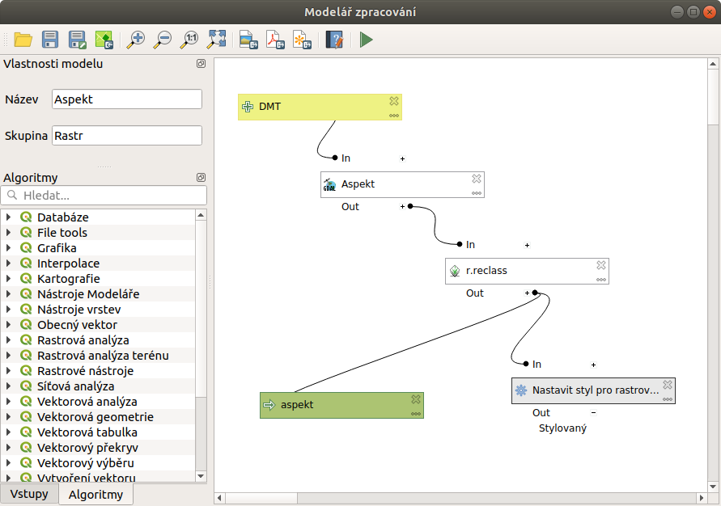

.. _modeler:

****************
Grafický modelář
****************

Grafický modelář (Graphical modeler) nám umožňuje vytvářet složitější řetězce 
algoritmů v poměrně jednoduchém prostředí. Snadno si tedy můžeme poskládat 
posloupnost funkcí, které pozděj můžeme spouštět jako jeden algoritmus nad 
různýmy daty, a tak si zjednodušit, ale především zrychlit pracovní postup.

   Náhled na vytvořený model

.. toctree::
   :maxdepth: 2
   
   uvod
   tvorba
   
	      
