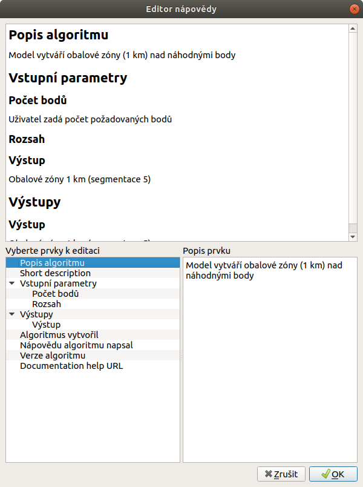

.. |iconSaveAsConsole| image:: ../images/icon/iconSaveAsConsole.png
   :width: 1.5em
.. |help| image:: ../images/icon/custom_modelerhelp.png
   :width: 1.5em
.. |mActionSaveMapAsImage| image:: ../images/icon/mActionSaveMapAsImage.png
   :width: 1.5em 
   
Tvorba nápovědy a export modelu
===============================
Nápověda modelu je důležitá jak pro orientaci ostatních uživatelů se kterými chceme model sdíet, ale také pro vlastní orientaci v modelu v budoucnu. 

Tvorba nápovědy
---------------
Nápověda modelu, slouží jednak k popisu jednotlivých operací, vstupů a výstupů tak i k doprovodným informacím jako jsou autor nebo verze modelu. Editaci nápovědy spustíme s okna modeláře pomocí ikony |help|. Takto vytvořená nápověda se potom bude zobrazovat při spuštění odelu v záložce :guilabel:`Nápověda` (:num:`#modelerhelp`)

.. figure:: images/modeler_help.png 
   :class: middle 
   :scale-latex: 40 

   Okno editace nápovědy modelu
   
- v okně editace nápovědy doplníme k jednolivým položkám vlastní text

   Ukázka vyplněné nápovědy

.. _modelerhelp:
.. figure:: images/modeler_help3.png 
   :class: middle 
   :scale-latex: 40 

   Nápvěda v dialogovém okně při spouštění modelu

Export modelu
-------------
Kromě uložení modelu do souboru :file:`.model` můžeme pomocí ikony |mActionSaveMapAsImage| exportovat model jako obrázek :file:`.PNG` a nebo jako Python skript |iconSaveAsConsole|.

.. figure:: images/modeler_exportpng.png 
   :class: middle 
   :scale-latex: 40 

   Model exportovaný do souboru :file:`.PNG`

   Model exportovaný jako python skript :file:`.py`
