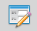

.. |mActionSaveMapAsImage| image:: ../images/icon/mActionSaveMapAsImage.png
   :width: 1.5em 
   
Tvorba nápovědy a export modelu
===============================

Nápověda modelu je důležitá jak pro orientaci ostatních uživatelů, se
kterými chceme model sdílet, ale také pro vlastní orientaci v modelu v
budoucnu.

Tvorba nápovědy
---------------

Nápověda modelu, slouží jednak k popisu jednotlivých operací, vstupů a
výstupů tak i k doprovodným informacím jako je autor nebo verze
modelu. Editaci nápovědy spustíme z okna modeláře pomocí ikony
|help|. Takto vytvořená nápověda se potom bude zobrazovat při spuštění
odelu v záložce :guilabel:`Nápověda` (:numref:`modelerhelp`)

.. figure:: images/modeler_help.png 

   Okno editace nápovědy modelu.
   
- v okně editace nápovědy doplníme k jednolivým položkám vlastní text

.. figure:: images/modeler_help2.png 

   Ukázka vyplněné nápovědy.

.. _modelerhelp:
.. figure:: images/modeler_help3.png 

   Nápověda v dialogovém okně při spouštění modelu.

Export modelu
-------------

Kromě uložení modelu do souboru :file:`.model` můžeme pomocí ikony
|mActionSaveMapAsImage| exportovat model jako obrázek ve formátu PNG a
nebo jako Python skript |iconSaveAsConsole|.

   Model exportovaný do souboru ve formátu PNG.

.. figure:: images/modeler_exportpy.png 
   :class: middle 

   Model exportovaný jako Python skript.
