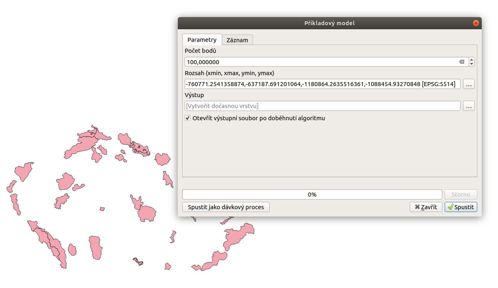

Spouštění a editace modelu
==========================

Spouštění modelu
----------------

Model se spouští z okna nástrojů zpracování stejným způsobem jako ostatní 
algoritmy. Lze jej také spustit jako dávkový proces. Při tvorbě modelu jej 
lze také přímo spouštět z okna modeláře pomocí ikonky.

   Dialogové okno ukázkového modelu.

   Výstup ukázkového modelu.
   
Editace, smazání modelu
-----------------------

K modelu se můžeme vracet a provádět změny pomocí kontextového menu vyvolaného 
v okně nástrojů zpracování. Zde můžeme také změnit výchozí styl pro generované 
výstupy nebo model smazat.

.. figure:: images/modeler_edit.png 
   :class: small 

   Kontextová nabídka modelu.
