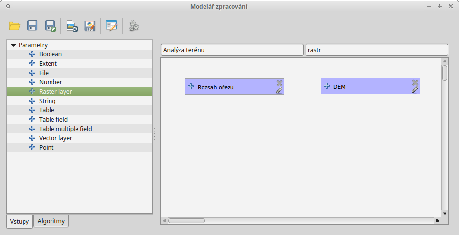
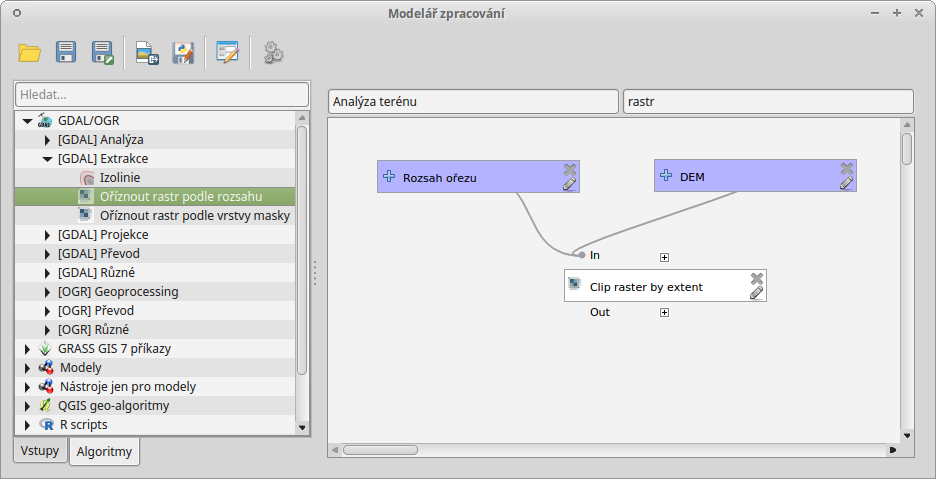
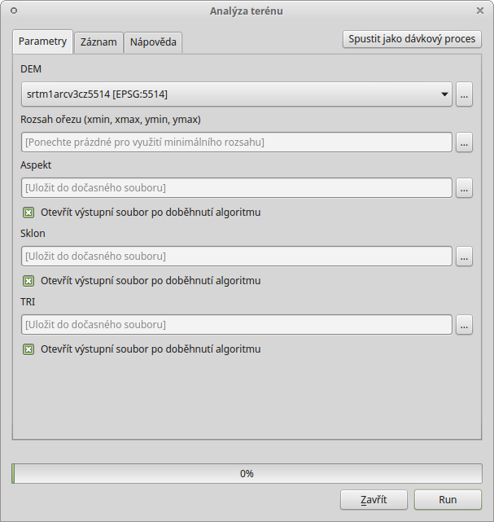
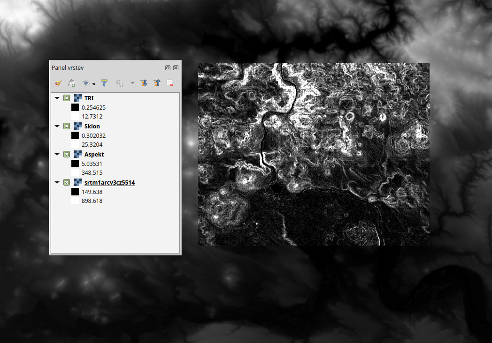
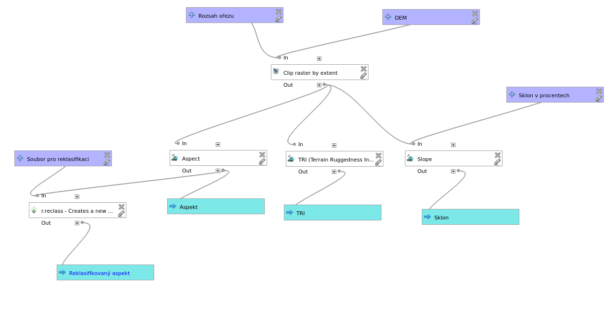

.. |gdalclip| image:: ../images/icon/raster-clip.png
   :width: 1.5em
.. |grass| image:: ../images/icon/grasslogo.png
   :width: 1.5em
   
   
Další příklady
==============

Model pro analýzu terénu
------------------------

Na tomto příkladu si ukážeme jak vytvořit model, který nám z výřezu digitálního 
modelu terénu vytvoří vrstvy sklonu svahů, orientace svahů a index drsnoti 
terénu (TRI).

Základní model
^^^^^^^^^^^^^^

1. Zadáme název modelu a skupiny. Model uložíme.
2. Přidáme vstupní parametry :item:`Raster layer` a :item:`Extent` a 
   pojmenujeme si je (např. :guilabel:`DEM` a :guilabel:`Rozsah ořezu`).

   Přidání vstupních parametrů modelu.
 
3. Přidáme algoritmus |gdalclip|:guilabel:`Oříznout rastr podle rozsahu`. Jako 
   vstupní vrstvu nastavíme parametr :item:`DEM`, nastavíme hodnotu pro 
   :guilabel:`nodata` (např. -9999) a jako rozsah ořezu nastavíme vstupní 
   parametr :item:`Rozsah ořezu`.

   
   Navázání vstupních parametrů na algoritmus ořezu.
   
4. Přidáme algoritmy |gdal|:guilabel:`Aspekt`, |gdal|:guilabel:`Sklon` a 
   |gdal|:guilabel:`TRI - index drsnosti terénu`. U všech nastavíme jako 
   vstupní vrstvu :guilabel:`'Oříznuto (rozsah)' z algoritmu 'Clip raster by 
   extent'` a u všech vyplníme odpovídající výstup.
   
.. figure:: images/modeler_terr3.png 
   :class: large 

   Výsledný model.
   

   Dialogové okno při spuštění modelu.
   

   Výsledek modelu.
   
Úpravy modelu
^^^^^^^^^^^^^

Pomocí editace můžeme model upravovat a dále rozšiřovat.

Volitelné nastavení vypočtení sklonu svahu ve stupních/procentech
.................................................................

Díky jednomu z parametrů algoritmu |gdal|:guilabel:`Sklon` můžeme
vybrat, jestli chceme výsledek v procentech namísto stupňů (boolean -
Ano/Ne).

   Výběr jednotek sklonu svahu.

Jak jsme již vysvětlili, model se spouští vždy s hodnotou, která je nastavena 
při jeho tvorbě. Pokud bychom chtěli mít možnost volby při spouštění, musíme 
na tento parametr navázat nový vstupní parametr :item:`Boolean`. Vložíme tedy 
nový parametr :item:`Boolean` , pojmenujeme ho :guilabel:`Sklon v procentech`. 
Nyní budeme mít v dialogovém okně algoritmu :item:`Slope` u parametru na výběr 
hodnotu :guilabel:`Sklon v procentech`.

.. figure:: images/modeler_terr_slope2.png 

   Přidání možností výběru výpočtu sklonu v procentech.

.. figure:: images/modeler_terr_slope3.png 

   Dialogové okno modelu s možností výpočtu sklonu v procentech.

Vytvoření již reklasifikované orientace svahu (Aspekt)
......................................................

Pro přidání reklasifikace do modelu využijeme algoritmu
|grass|:grasscmd:`r.reclass`. V kapitole :ref:`externi` jsme si
ukázali jak vytvořit soubor reklasifikace. Abychom takový soubor
dostali do modelu musíme přidat vstupní parametr :item:`File`
(pojmenujeme si ho např. :guilabel:`Soubor pro reklasifikaci`). V
dialogovém okně aloritmu |grass|:grasscmd:`r.reclass` nastavíme
jednotlivé parametry (:numref:`modelreclass`). Pokud nechceme používat
reklasifikační soubor, ale chceme mít možnost zadávat reklasifikační pravidla
ručně, použijeme vstupní parametr :item:`String`.

.. _modelreclass:
.. figure:: images/modeler_terr_reclass.png 

   Nastavení parametrů |grass|:grasscmd:`r.reclass` v modelu.
      
Výsledný model nám nyní může vygenerovat vedle původního rastru :item:`Aspekt` 
i reklasifikovanou verzi :item:`Reklasifikovaný aspekt`.

.. figure:: images/modeler_terr_reclass2.png 
   :class: middle 

   Model s reklasifikací orientace svahu.
   

   Výsledný upravený model.
