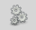
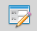
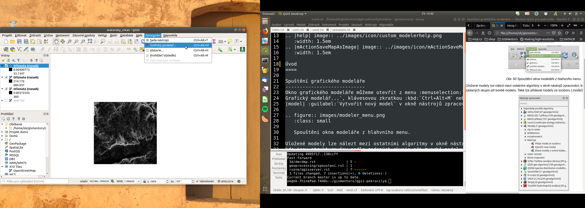
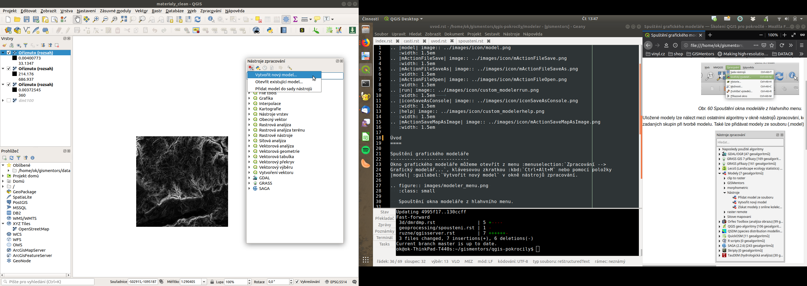
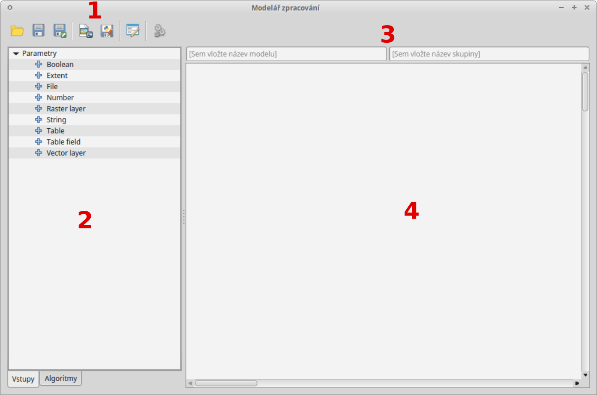

.. |model| image:: ../images/icon/model.png
   :width: 1.5em
.. |mActionFileSave| image:: ../images/icon/mActionFileSave.png
   :width: 1.5em
.. |mActionFileSaveAs| image:: ../images/icon/mActionFileSaveAs.png
   :width: 1.5em
.. |mActionFileOpen| image:: ../images/icon/mActionFileOpen.png
   :width: 1.5em

.. |mActionSaveMapAsImage| image:: ../images/icon/mActionSaveMapAsImage.png
   :width: 1.5em    
Úvod
====
Spuštění grafického modeláře
----------------------------
Okno grafického modeláře můžeme otevřít z menu :menuselection:`Zpracování --> 
Grafický modelář...`, klávesovou zkratkou :kbd:`Ctrl+Alt+M` nebo pomocí položky 
|model| :guilabel:`Vytvořit nový model` v okně nástrojů zpracování.

   Spouštění okna modeláře z hlahvního menu
   
   
Uložené modely lze nálezt mezi ostatními algoritmy v okně nástrojů zpracování, 
kde jsou strukturovány podle zadaných skupin při tvorbě modelu. Také lze 
přidávat modely ze souboru (.model) nebo z online kolekce.

   Modely jako součást okna nástrojů zpracování
   
Popis okna
----------

   Okno grafického modeláře

Popis jednotlivých částí okna:

1. V horní části okna máme sadu ikonek pro základní operace (ukládání, export 
   atd.)

	- |mActionFileOpen|, |mActionFileSave|, |mActionFileSaveAs| - ikony pro 
	  otevření a uložení souboru :file:`.model`
	- |mActionSaveMapAsImage| - export modelu jako obrázku :file:`.PNG`
	- |iconSaveAsConsole| - export modelu jako Python skript :file:`.py`
	- |help| - editace informací o modelu a nápovědy k modelu 
	- |run| - spustí model
	
2. Levá část okna slouží k přidávání prvků do modelu - vstupních parametrů 
   (záložka :guilabel:`Vstupy`) a Algoritmů (záložka :guilabel:`Algoritmy`)
3. Dvě textové pole složí k zadání názvu a skupiny, do které se model zařadí v 
   rámci nástrojů zpracování (před uložením nutné vyplnit)
4. Hlavní okno modeláře. Zde se skládají, configurují a propojují jednotlivé 
   části modelu
