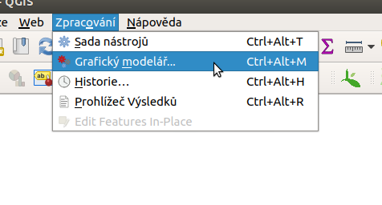
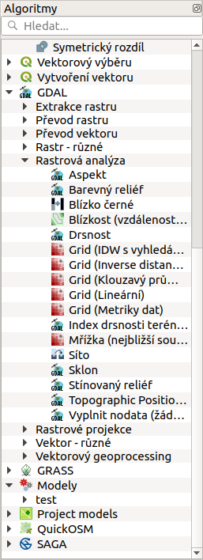
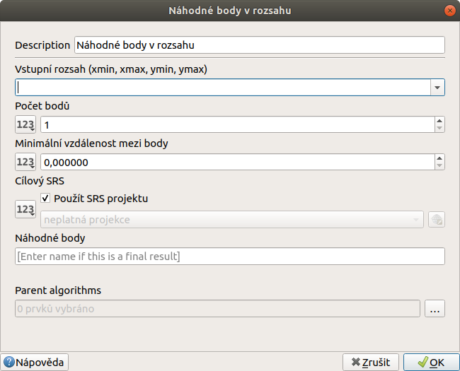
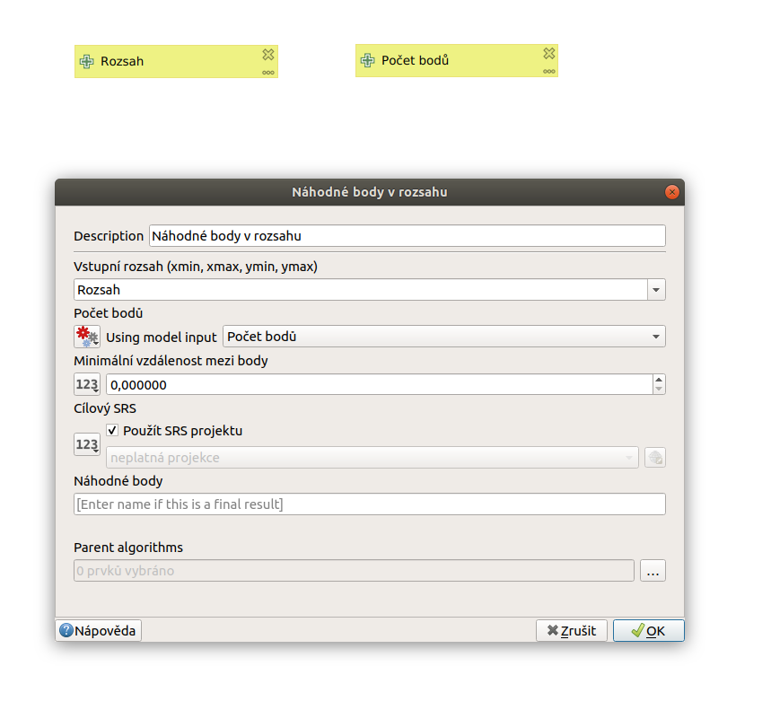
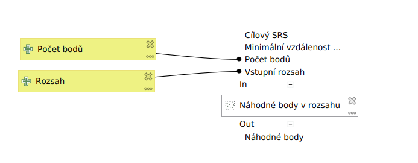

.. |model| image:: ../images/icon/model.png
   :width: 1.5em
.. |qgis| image:: ../images/intro_logo.png
   :width: 1.5em
.. |mActionFileSave| image:: ../images/icon/mActionFileSave.png
   :width: 1.5em
.. |mActionFileSaveAs| image:: ../images/icon/mActionFileSaveAs.png
   :width: 1.5em
.. |mActionFileOpen| image:: ../images/icon/mActionFileOpen.png
   :width: 1.5em
.. |run| image:: ../images/icon/custom_modelerrun.png
   :width: 1.5em	
.. |iconSaveAsConsole| image:: ../images/icon/iconSaveAsConsole.png
   :width: 1.5em
.. |help| image:: ../images/icon/custom_modelerhelp.png
   :width: 1.5em  
.. |mActionSaveMapAsImage| image:: ../images/icon/mActionSaveMapAsImage.png
   :width: 1.5em    
Úvod
====
Spuštění grafického modeláře
----------------------------
Okno grafického modeláře můžeme otevřít z menu :menuselection:`Zpracování --> Grafický modelář...`, klávesovou zkratkou :kbd:`Ctrl+Alt+M` nebo pomocí položky |model| :guilabel:`Vytvořit nový model` v okně nástrojů zpracování.

   Spouštění okna modeláře z hlahvního menu
   
   
Uložené modely lze nálezt mezi ostatními algoritmy v okně nástrojů zpracování, kde jsou strukturovány podle zadaných skupin při tvorbě modelu. Také lze přidávat modely ze souboru (.model) nebo z online kolekce.

.. figure:: images/modeler_panel.png 
   :class: tiny 
   :scale-latex: 40 

   Modely jako součást okna nástrojů zpracování
   
Popis okna
----------
.. figure:: images/modeler.png 
   :class: middle 
   :scale-latex: 40 

   Okno grafického modeláře

Popis jednotlivých částí okna:

1. V horní části okna máme sadu ikonek pro základní operace (ukládání, export atd.)

	- |mActionFileOpen|, |mActionFileSave|, |mActionFileSaveAs| - ikony pro otevření a uložení souboru :file:`.model`
	- |mActionSaveMapAsImage| - export modelu jako obrázku :file:`.PNG`
	- |iconSaveAsConsole| - export modelu jako Python skript :file:`.py`
	- |help| - editace informací o modelu a nápovědy k modelu 
	- |run| - spustí model
	
2. Levá část okna slouží k přidávání prvků do modelu - vstupních parametrů (záložka :guilabel:`Vstupy`) a Algoritmů (záložka :guilabel:`Algoritmy`)
3. Dvě textové pole složí k zadání názvu a skupiny, do které se model zařadí v rámci nástrojů zpracování (před uložením nutné vyplnit)
4. Hlavní okno modeláře. Zde se skládají, configurují a propojují jednotlivé části modelu
   
Jednotlivé části modelu
-----------------------
Před samotnou tvorbou modelu je vhodné zadat název a skupinu modelu (num část 3) a uložit jej |mActionFileSave|. Potom můžeme model při jeho tvorbě průběžně ukládat.

.. figure:: images/modeler_name.png 
   :class: middle 
   :scale-latex: 40 

   Zadání jména a skupiny modelu
	
Vstupní parametry
^^^^^^^^^^^^^^^^^
.. _vstupdia:
.. figure:: images/modeler_vstup_dia.png 
   :class: tiny
   :scale-latex: 40 

   Značení vstupního parametru v modelu
   
Prvním krokem při tvorbě modelu je vložení vstupních parametrů.Tyto parametry jsou stejné jako u běžných algoritmů - vrstva, rozsah vrstvy, číslo, text, boolean (formou checkboxu) atd. Při spouštění vytvořeného modelu bude požadováno vyplnění vložených vstupních parametrů. Tyto parametry jsou navázany na konkrétní algoritmy v modelu.

.. figure:: images/modeler_vstup.png 
   :class: small 
   :scale-latex: 40 

   Možné vstupní parametry
   
Jednotlivé parametry lze do modelu přidat tažením nebo poklikáním. Po přídání se objeví dialogové okno, které je u většiny parametrů jednoduché, základní položkou je zde název parametru. Nastavení parametrů v modelu lze průběžně měnit kliknutím na symbol tužky, nebo lze parametry odstranit kliknutím na křížek (:num:`#vstupdia`).

.. figure:: images/modeler_vstup_num.png 
   :class: small 
   :scale-latex: 40 

   Dialogové okno při vložení číselného parametru

- do našeho modelu přidáme vstupy :item:`Extent` a :item:`Number`. Pojmenujeme např. :guilabel:`Rozsah` a :guilabel:`Počet bodů`, pozděj můžeme podle potřeby změnit.

Algoritmy
^^^^^^^^^
.. figure:: images/modeler_algor_dia.png 
   :class: tiny
   :scale-latex: 40 

   Značení algoritmu v modelu
   
Hlavní součástí modelů jsou algoritmy. Nalezneme zde většinu algoritmů, které jsou v okně nástrojů zpracování. Kromě těchto funkcí jsou zde speciální :guilabel:`Nástroje jen pro modely` (:num:`#algor`)

.. _algor:

   Možné vstupní algoritmy
   
Algoritmy se přidávají do modelu opět tažením nebo poklikáním. Po přidání se ukáže běžné dialogové okno konkrétního algoritmu (:num:`#algorrand`). Zde máme možnost nastavit výchozí hodnoty parametrů algoritmu, se kterými se bude počítat při spuštění modelu. Jesltiže chceme mít parametry při spouštění modelu volitelné je třeba nakonfigurovat odpovídající vstupy (:num:`#algorrand2`).

- vložíme algoritmus |qgis|:guilabel:`Random points in extent` a jako vstupní rozsah zadáme náš vstupní parametr :item:`Rozsah`. Jako pošet bodů zvolíme vstupní parametr :item:`Počet bodů` . Minimální vzdálenost a výstupní soubor měnit prozatím nebudeme, potvrdíme parametry tlačítkem :item:`OK`. 

.. _algorrand:

   Dialogové okno algoritmu s pevně stanpvenými parametry

.. _algorrand2:

   Nastavení parametrů na základě vstupů do modelu

Nastavení algoritmů v modelu lze průběžně editovat kliknutím na symbol tužky, nebo lze algotritmy odstranit kliknutím na křížek. Také lze pomocí tlačítek + a -  jaké mohou být vstupy a výstpy algoritmu. 

.. _algorrand3:

   Nastavení volitelných parametrů algoritmu |qgis|:guilabel:`Random points in extent` při spouštění modelu

Jednotlivé algoritmy lze na sebe dále navazovat - to co je výstupem z jednoho algoritmu může nějakým způsobem vstupovat do algoritmu druhého (:num:`#algorrand4`).

- vložíme do modelu algoritmus |qgis|:guilabel:`Fixed distance buffer`. Jako vstupní vrstvu nastavíme :guilabel:`'Náhodné body' z algoritmu 'Random points in extent'` a dále nastavíme libovolnou fixní vzdálenost v metrech.

.. _algorrand4:
.. figure:: images/modeler_algor_rand4.png 
   :class: middle 
   :scale-latex: 40 

   Náhodné body vygenerované |qgis|:guilabel:`Random points in extent` použité jako vstup pro vytvoření obalových zón

Pravým kliknutím na algoritmus v modelu můžeme vyvolat kontextové menu, vekterém můžeme algoritmus vymazat, deaktivovat nebo spustit jeho editaci (:num:`#algkont`). Ve spodní části dialogového okna každého algoritmu je parametr :guilabel:`Rodičovské algoritmy`, pomocí kterého lze nastavit nadřazené algorimty, takto vybrané algoritmy se budou vždy spouštět před tímto algoritmem (:num:`#algpar`).

.. _algkont:
.. figure:: images/modeler_algor_kont.png 
   :class: small 
   :scale-latex: 40 

   Kontextové menu algoritmu v modelu

.. _algpar:
.. figure:: images/modeler_algor_parent.png 
   :class: middle 
   :scale-latex: 40 

   Nastavení rodičovských algoritmů

Výstupy
^^^^^^^
.. figure:: images/modeler_out_dia.png 
   :class: tiny
   :scale-latex: 40 

   Značení výstupu v modelu
   
Výstup slouží k vytvoření souboru (vrstva, html atd.). Může sloužit jako vlastní konečný výsledek modelu, ale také lze nastavit výstupy průběžně a jakéhokoliv algoritmu. Výstup se konfiguruje u každého algoritmu zvlášť, stačí zadat název výstupu do textového pole ve spodní části dialogového okna algoritmu (:num:`#modeloutname`). Všeobecně, a především při generování více výstupů, je vhodné zvolit smysluplný název podle toho jaký je obsah dat, nebo co nám data sdělují.
   
.. _modeloutname:
.. figure:: images/modeler_out_name.png 
   :class: middle
   :scale-latex: 40 

   Dialogové okno algoritmu - pole pro zadání názvu výstupu

- otevřeme (editace) algoritmus |qgis|:guilabel:`Fixed distance buffer` zadáme libovolný název finálního výstupu (např. :item:`Výstup`).

Zadáním jména do textového pole pro výstup, nastavíme model aby vytvořil výstupní soubor. Pokud pole necháme nevyplněné, model žádný soubor nevytvoří. Výsledek algoritmu však může dále sloužit jako vstup pro jiné algoritmy.

.. _modelerukaz:
.. figure:: images/modeler_out_model.png 
   :class: middle 
   :scale-latex: 40 

   Model, ve kterém bude výstup vrstva obalových zón

.. figure:: images/modeler_out_model2.png 
   :class: middle 
   :scale-latex: 40 

   Ukázka modelu z více výstupy

Spouštění modelu
----------------
Model se spouští z okna nástrojů zpracování, stejným způsobem jako ostatní algoritmy. Lze jej také spustit jako dávkový proces. Při tvorbě modelu jej lze také přímo spouštět z okna modeláře pomocí ikony 

.. figure:: images/modeler_spust.png 
   :class: middle 
   :scale-latex: 40 

   Dialogové okno ukázkového modelu (:num:`#modelerukaz`)

.. figure:: images/modeler_spust_vysl.png 
   :class: middle 
   :scale-latex: 40 

   Výstup ukázkového modelu (:num:`#modelerukaz`)
   
Editace, smazání modelu
-----------------------
K modelu se můžeme vracet a provádět změny pomocí kontextového menu vyvolaného v okně nástrojů zpracování. Zde můžeme také změnit výchozí styl pro generované výstupy nebo model smazat.

.. figure:: images/modeler_edit.png 
   :class: small 
   :scale-latex: 40 

   Kontextová nabídka modelu
