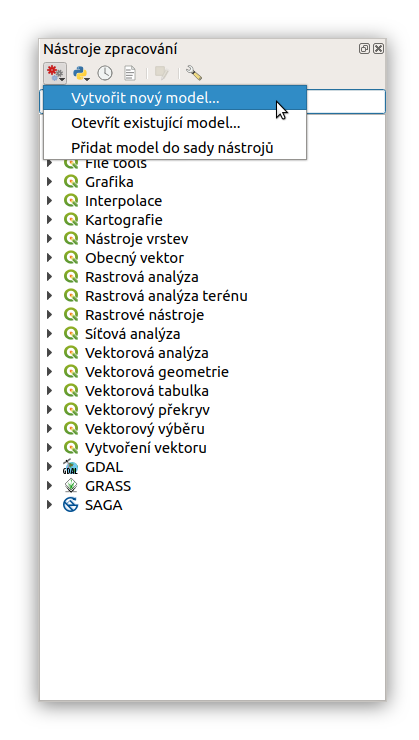

..  .. |iconSaveAsConsole| image:: ../images/icon/iconSaveAsConsole.png
       :width: 1.5em

Úvod
====

Spuštění grafického modeláře
----------------------------
Okno grafického modeláře můžeme otevřít z menu :menuselection:`Zpracování --> 
Grafický modelář...`, klávesovou zkratkou :kbd:`Ctrl+Alt+M` nebo pomocí položky 
|processingModel| v okně nástrojů zpracování, kde zvolíme možnost
:guilabel:`Vytvořit nový model`. Pomocí možnosti
:guilabel:`Otevřít existující model...` lze otevřít soubor modelu v okně
grafického modeláře. Položka :guilabel:`Přidat model do sad nástrojů`
potom umožňuje importovat model ze souboru přímo do nástrojů zpracování. 

.. figure:: images/modeler_menu.png 
   :class: small 

   Spouštění okna modeláře z hlahvního menu.
   
Po vytvoření nebo importování prvního modelu, lze modely nálezt mezi
ostatními algoritmy v okně nástrojů zpracování. Modely jsou zde
strukturovány podle zadaných skupin při tvorbě modelu.

   Modely jako součást okna nástrojů zpracování.
   
Popis okna
----------

.. _modeler_casti:

.. figure:: images/modeler.png 
   :class: middle 

   Okno grafického modeláře.

Popis jednotlivých částí okna:

V horní části okna máme *lištu nástrojů* pro základní operace
(ukládání, export atd.)

    - |mActionFileOpen|, |mActionFileSave|, |mActionFileSaveAs| - ikony pro 
      otevření a uložení souboru :file:`.model`
    - |mAddToProject| - uložení modelu jako součást projektu
    - |mActionZoomIn|, |mActionZoomOut|, |mActionZoomActual|,
      |mActionZoomFullExtent| - možnosti přiblížení v okně modeláře
    - |mActionSaveMapAsImage|, |mActionSaveAsPDF|, |mActionSaveAsSVG| -
       export modelu jako obrázku :file:`.PNG`, pdf dokumentu :file:`PDF`
       nebo vektorové grafiky :file:`SVG`
..    - |iconSaveAsConsole| - export modelu jako Python skript :file:`.py`

	- |mActionEditHelpContent| - editace informací o modelu a nápovědy k modelu 
	- |mTaskRunning| - spustí model přímo z okna grafického modeláře
	
Panel *Vlastnosti modelu* tvoří dvě textové pole, které slouží k zadání
názvu a skupiny, do které se model zařadí v rámci nástrojů zpracování
(před uložením je nutné obě položky vyplnit).

Panely *Vstupy* a *Algoritmy* slouží k přidávání prvků do modelu - vstupních parametrů (záložka :guilabel:`Vstupy`) a Algoritmů
(záložka :guilabel:`Algoritmy`).
