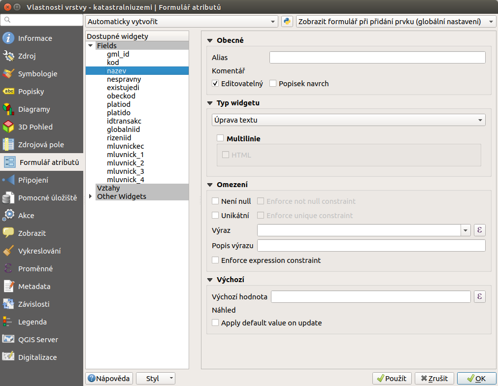
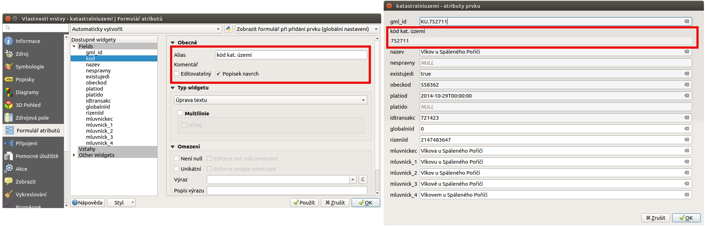

Atributové formuláře
^^^^^^^^^^^^^^^^^^^^

Při načtení běžné datové sady do QGISu (například shapefile vrstva) je běžné,
že se data zobrazí stejně v atributové tabulce i v detailu prvku.

Očekávané chování je, že se jednotlivé atributy budou chovat různě, podle toho
jestli mají číselný, textový nebo jiný formát, nebo jestli při editaci
nejsou překročováný limity.
Dostupné datové typy se liší podle zdroje. Jiné typy nabízí shapefile, jiné 
například databázové vrstvy a další. Od toho se odvíjí také možnosti dalšího
nastavení.
Přehled datových typů je dostupný ve vlastnostech každé vrstvy v záložce
:item:`Zdrojová pole`.

Aktuální nastavení jak pro zobrazování, tak pro další možnosti je dostupné v
záložce :item:`Formulář atributů`. 
Každý atribut lze nastavit samostatně. V pravé části je vždy část pro nastavení
jednotlivých sekcí. Ty jsou detailněji popsány níže.

   Menu pro práci s nastavením jednotlivých atributů.
   
Nastavení, která se popisují jsou u různých formátů možné nastavit samostatně.
Výhodou nastavení v QGIS projektu má tu výhodu, že při editaci rozhraní
komunikuje s uživatelem a dává uživateli vědět jaké hodnoty a jak zadávat.

Obecné nastavení atributů
=========================

Bez ohledu na typ atributu se dají nastavit základní parametry pro zobrazování
atributu. Jedná se zejména o změny projevující se v atributové tabulce a
detailu prvku.

- **Alias**
   Titulek pro atribut, který může obsahovat diakritiku a mezery, čím se ulehčí
   možnost líp popsat atributy. Zobrazí se v atributové tabulce a v detailu
   prvku.Alias lze používat i ve výrazech. Uvádí se v dvojitých uvozovkách.
- **Komentář** 
   Popisek zobrazovaný v detailu prvku při ponechání kurzoru myši na názvu
   atributu.
- |checkbox| **Editovatelný**
   Pomocí tohoto nastavení lze atribut uzamkout pro inline úpravy. Pokud je teda
   zaškrtávací políčko nezatrhnuté, tak se zobrazuje jako needitovatelné jak v
   atributové tabulce, tak v detailu prvku. Na jiné formy editace, jako
   například kalkulačka polí, nemá vlyv. Výchozí nastavení editaci umožňuje.
- |checkbox| **Popisek navrch** 
   Zaškrtávací políčko, které zabazpečí, že v detailu prvku se název atributu a
   jeho obsah bude zobrazovat na dvou separátných řádcích.  
  
Na obrázku je vidět ukázku nastavení spolu s tím jak se nastavení projeví v
detailu prvku. V detailu se projevuje i fakt, že není povolená editace (jiné
zobrazení).

   Obecné nastavení atributu a zobrazení v detailu prvku.

Typy widgetů
============

Omezení
=======

V této sekci je možné ovlyvnit obsah atributů

- |checkbox| **Není null** 
   Atribut musí být vyplněný (nesmí být null). Pokud je toto políčko zaškrtnuté,
   tak se v detailu prvku při editaci kontroluje obsah tohoto atributu. Pokud
   atribut není vyplněný, tak je řádek zvýrazněn oranžovou barvou se symbolem
   křížku na konci řádku. V případě zadání hodnoty se obejví zelený symbol.
   Bez ohledu na symbol je možné prvek uložit. 
   Pokud je nutné zamezit tomu, aby bylo možné prázdnou hodnotu vložit, tak je
   potřebné zašktrnout ješťě nově aktivovanou možnost nastavení -  |checkbox|
   :sup:`Enforce not null constraint`. 
- |checkbox| **Unikátní** 
   Kontroluje unikátnost záznamu při jeho editaci. Kontrola funguje na stejném
   principu jako u předchozího nastavení - pomocí barevných statusů.
   Pro zamezení editace proti tomuto pravidlu je zapotřebí použít ještě
   dodatečné nastavení |checkbox| :sup:`Enforce unique constraint`.
- **Výraz**
   Pro zadávané hodnoty je možné nastavit kontrolu formou výrazu. Například
   na délku vkládané hodnoty, obsah pouze nečíselných znaků a mnoho jiných.
- **Popis výrazu**
   Slouží pro popsání zadaného výrazu, tak aby bylo možné ho pak lehce zobrazit
   jako poznámku. Zobrazí se v detailu prvku po najetí myši na symbol statusu
   na konci řádku.
- |checkbox| Enforce expression constraint
   Jako u ostatních kontrol v této sekci slouží na vynucení dodržení kontroly
   výrazem u vkládaného atributu. 

Výchozí
=======
Pokud je zřejmé, že obsah atributu je určován podle určitého pravidla, tak je
možné toto pravidlo použít pro automatické vyplňování. Typickým použitím je
například atribut určující vznik atributu - datum a čas. Dalším stupněm je pak
nastavení obnovy hodnoty při editaci prvku.
Tato nastavení je možné provést v sekci "Výchozí" pomocí následujících položek.

- **Výchozí hodnota**
   Pole pro zadání výrazu pro určení výchozí hodnoty. Například :kbd:`now()`
   je výraz, který zapíše aktuání datum a čas. Doplněním výrazu  je možné
   obsah dále upravovat podle potřeby. Obecně je možné pracovat jak s textovými
   a číslenými hodnotami, tak s hodnotami, které jsou určovány z geometrie.
   Například výměra - :kbd:`$area`, délka - :kbd:`$length` a mnoho dalších.
   Výraz je možné složit v klasickém okně **Expression dialog**.
   Výchozí hodnota se objeví v detailu prvku hned po zadání nového prvku.
   Náhled hodnoty je vidět v řádku přímo pod nastavením.
- |checkbox| Apply default value on update
   Pokud se jedná o atribut, který se mění v návaznosti na geometrii, tak je
   výhodné použít toto nastavení. Zabezpečí, že se hodnota bude generovat znova
   při každé změně (jak geometrické, tak atributové)
   
Tato část nastavení je velmi důležitá, protože dokáže zastoupit velké množství
práce.
   
   

