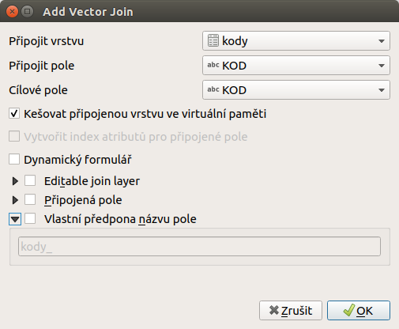

Příklad - bilancování území
^^^^^^^^^^^^^^^^^^^^^^^^^^^

Jednou z typických GIS úloh je tvorba bilancí vybrané datové sady za území.
V tomto případě jde o ukázku bilancování dat tzv. současného stavu využití území
Prahy. Tato data jsou volně dostupná na rozhraní 
`IPR Praha <https://www.geoportalpraha.cz/cs/data/otevrena-data/A0198E36-FCAD-42E7-BE4A-3B7755A48DAC>`_
spolu s metadaty o tomto datasetu.
Pro lepší přehled je možné si je prohlédnout v aplikaci
`Atlas 5000 <https://app.iprpraha.cz/apl/app/atlas-praha-5000/>`_, kde jsou
v sekci *Využití území*.

   
   Ukázka datové sady *Současný stav* v aplikaci Atlas 5000.

Tato datová sada souvisle pokrývá celé území Prahy pomocí malých, nepřekrývajících
se plošek. Každá ploška má jednoznačně definované různé atributy, mezi nimi i
atribut :item:`Kód`. Vysvětlní každého kódu je možné najít v metadatech této
sady.

V legendě je vidět, že se jednotlivé kódy shlukují do skupin.

   
   Náhled do legendy s ukázkou seskupování kódů.

Zadání
======

Cílem je získat přehled za různé administrativní jednotky o tom
jaké je procentuální zastoupení jenotlivých skupin dle kódů využití území.
Takovýto výsledek lze zobrazovat pomocí kartodiagramu, nebo použít pro
samostatnou tabulku a grafy.

Příprava dat
============

1. stáhnout data z rozhraní IPR Praha (nebo jsou předpřipravena v balíku dat)
2. územní členění Prahy (jsou součástí balíku dat, nebo stáhnout z RÚIAN)
3. tabulka kódů a jejich členění (převedeno do :file:`kody.csv` souboru)

Před samotným provedením analýzy je potřeba udělat kontrolu geometrie pomocí
nástroje **Zkontrolovat Platnost**. 
Tento nástroj je v menu :menuselection:`Zpracování --> Vektorová geometrie`.
Datová sada využití území je spravována a vydávána pomocí ESRI technologie,
která má jiné nastavení pro validitu geometrie.
Na obrázku je vidět geometrii, která je pro ESRI nástroje vpořádku, ale pro
QGIS není validní. Jedná se o tzv. `self-intersection` nebo `samoprotnutí prstence`.

.. figure:: images/b_topoerror.png
   :class: small
   
   Ukázka problémové geometrie na vstupních datech.

Tento typ chyb lze opravit automaticky pomocí nástroje `Opravit geometrie`.
Předpřipravená data prošla kontrolou a opravou geometrie. Rovněž by měli být
validní i členění území.

Bilance se přepočítávají na různé prostorové členění. K dispozici jsou různé
administrativní jednotky - katastrální území (KU), základní sídelní jednotky
(ZSJ), městské obvody (MO), městské části (MČ) a další.
V tomto případě budeme používat ZSJ a to pouze pro území Prahy 7. 
Důvodem je rychlost výpočtu a přehlednost v malém zvoleném území.
Vybrané ZSJ je možné si uložit do samostatné datové vrstvy.
Prvky územního členění mají určenou výměru. Je vhodné přidat nový atribut,
do kterého se přepočte výměra. Pokud bychom pracovali s přirpavenou výměrou,
tak by se mohlo stát, že by součty jednolivých částí přesně neodpovídali.

1. propojení dat využití a skupin
=================================

Jednotlivý plochy  využití mají vždy určen atribut :item:`Kód`. 
Rozdělení kódů do skupin  obsahuje soubor :file:`kody.csv`. Ten se do projektu
přidá jako `textový soubor s oddělovači`. Po načtení se zobrazí jako tabulka
bez geometrie. Obsahuje tři sloupečky - kód, textový popis kódu a skupinu, do
které je kód zařazen.
Tyto hodnoty musí být přiřazeny ke geometrické vrstvě využití území.
Ve vlastnostech vrstvy `vyuziti_uzemi` v sekci `Připojení` se vytvoří nové
připojení.
Musí se připojit tabulková data `kody` na základě atributů s kódy u zdrojové
i cílové datové sady.
Ukázka připojení je na obrázku.

   
   Připojení tabulky kódů na vrstvu využití území.
   
Po připojení jsou nové atributy zařazeny nan konec atributové tabulky.

.. warning:: Po připojení dat je vhodné zkontrolovat, zda všechny prvky mají
             přiřazen záznam z párované tabulky. Důvodem může být chyba v
             datech anebo změna v metodice, která vede k změnám v kódech.
             Obě situace by se měli hlídat.
             
Pro jednoduché zobrazení skupin je možné využít nastavení symbologie.
Ve :menuselection:`Vlastnosti --> Symbologie` se nastaví `Kategorizovaný` typ.

   
   Nastavení symbologie podle skupin kódů.
 

2. propojení dat využití území a členění
========================================
Druhým krokem je určit každé ploše příslušnou jednotku ZSJ pod kterou spadá.
Pokud jedna plocha spadá do vícero území, tak toto musí být rozděleno hranicí
a každá část bude mít správné uzemní přiřazení. Plochy, které leží mimo zájmové
území se nebude používat - vypadnou.
Tento požedavek splňuje operace **Protnutí** (intersection).

Vstupní vrstva je `vyuziti_uzemi`, překryvná je `zsj`. Výstup je v tomto
případě uložen do GPKG.

.. figure:: images/b_intersect.png
   :class: medium
   
   Nastavení nástroje protnutí.
   
Pro každou ZSJ je teď možné spočíst plochu ze všech dílčích plošek a nasčítat
celkovou plochu pro všechny skupiny v ní zastoupené.

3. sumarizace podle skupin v ZSJ
================================

4. přehledné zobrazení výsledků
===============================
   

