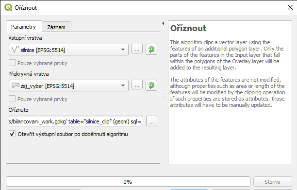
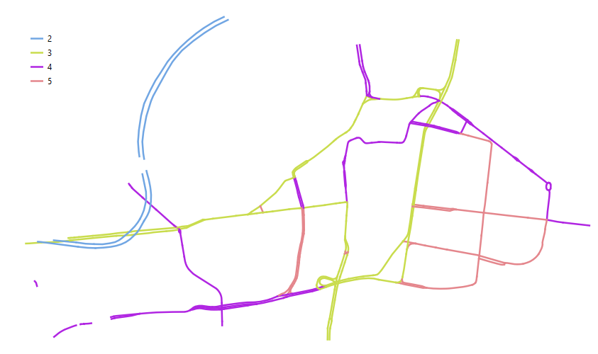
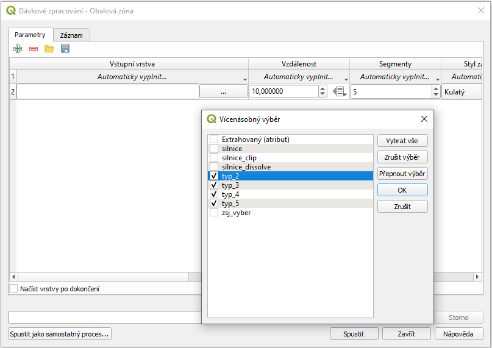
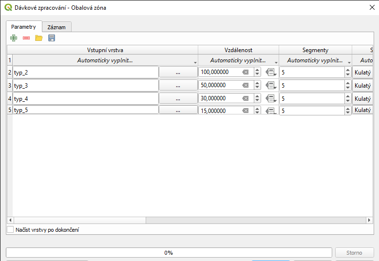
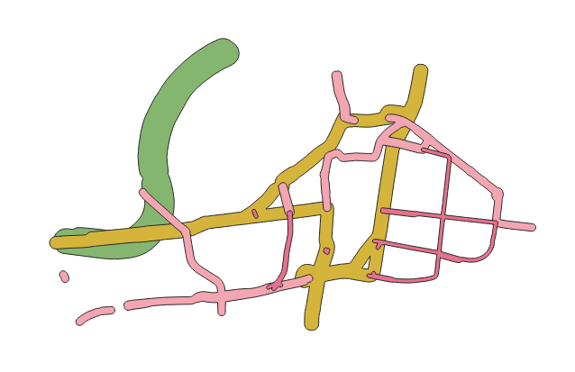
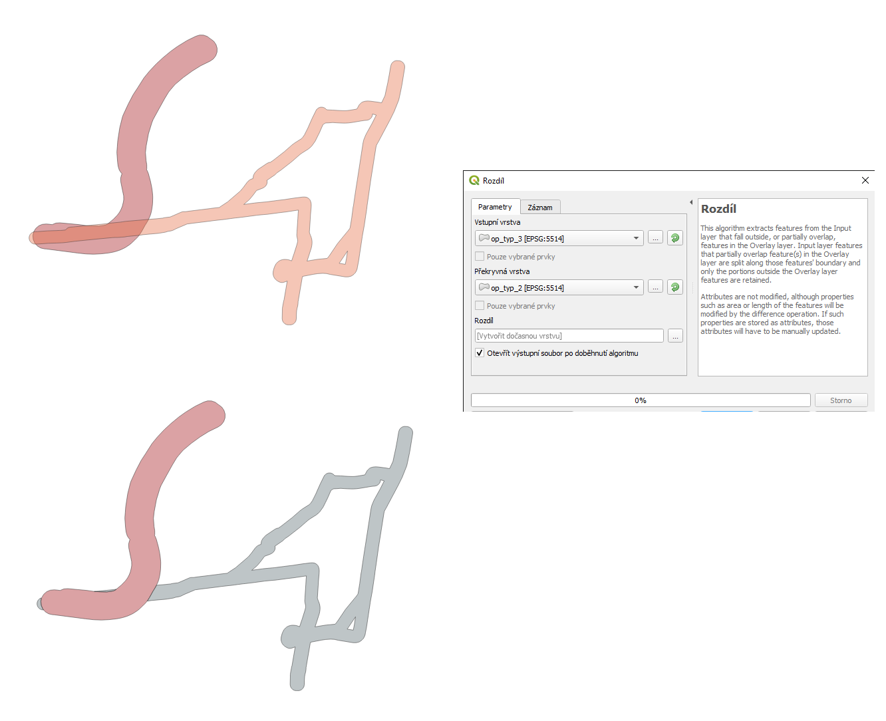
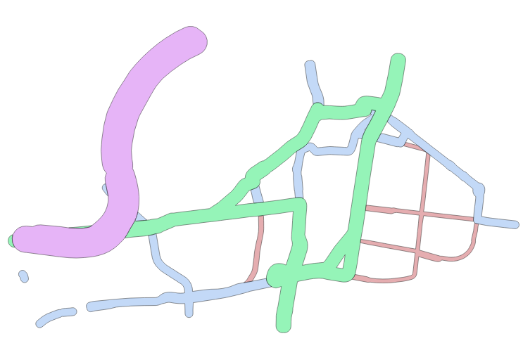
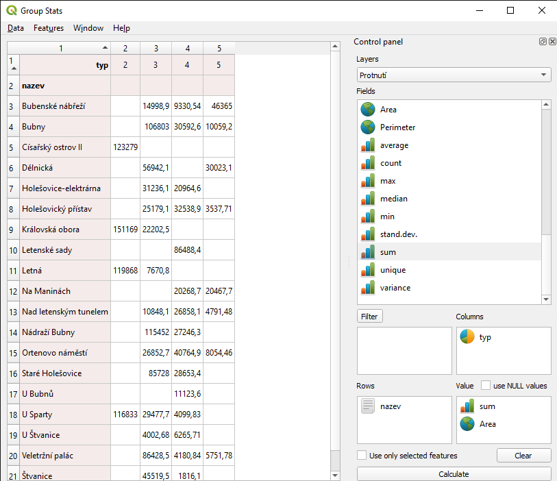

Bilancování ochranných pásem silnic
^^^^^^^^^^^^^^^^^^^^^^^^^^^^^^^^^^^

Na tomto příkladu bilancování bude ukázáno jednak jednorázové zpracování,
ale i vytvoření modelu pro opakovaný výpočet tohoto typu úlohy.

Tato úloha bude používat pouze data ze základního balíčku dat pro školení.
Konkrétně se použije dataset `silnice`. Cilem úkolu je vypočítat plochu
ochranných pásem (OP) jednotlivých typů silnic ve vybraných `ZSJ`. Důležité je
zacházení s variabilní šířkou ochranného pásma, ale i způsob řešení
překryvů jednotlivých typů OP silnic.

Zadání
======

Pro všechny silnice ve sledovaném území se postupnými kroky vygeneruje
hierarchický model OP. Tento výpočet bude následně převeden do grafického
modeleru. Posledním volitelným krokem je pak vizualizace (grafická nebo
tabulková) přehledných údajů za jednotlivé kategorie pro každou `ZSJ`.

Příprava dat
============

1. silniční síť z OSM (součást balíku dat, enbo stáhnout z OSM)
2. územní členění Prahy (jsou součástí balíku dat, nebo stáhnout z RÚIAN)

Stejně jako v předešlém příkladu platí, že je dobré provést kontrolu geometie
před samotnou realizací výpočtů. Vrstva `silnice` obsahuje liniové prvky a
neprovádí se kontrola, která by zaručovala možnost provádět síťovou analýzu.

1. ořez dat 
===========

Prvním krokem je výběr dat pouze v zájmovém území.
Použije se operace **Ořez** (clip).
Vstupní vrstva je v tomto případě `silnice` a překryvná `ZSJ`.

   
   Ořez vrstvy silnic pomocí vrstvy `ZSJ`.
   
.. note:: Výběr správné operace je důležitý pro náseldující kroky.
          V tomto případě se prvky ořežou  překryvnými prvky, ale
          jenom na vnějších okrajích. Jak je vidět na obrázku níže,
          vybraná sinice zůstane na spojnici ZSJ nerozdělená.
          
          .. figure:: images/b_clip_detail.png
             :class: small
   
             Prvek po ořezání zůstává vevnitř nerozdělený.
             

2. rozdělení silnic podle třídy
===============================

Každý úsek silnice bude mít OP podle toho, do jaké třídy patří.
Toto rozdělení je uvedeno v atributu `typ` jako číselná hodnota.
Na obrázku je vidět symbologie podle tohoto atributu ve zpracovávaném území.

   
   Kategorizovaná symbologie pomocí hodnoty atributu `typ`.
   

Každá třída nás zajímá jako celek, ne jako samostatné úseky.
Proto je výhodné prvky sloučit pomocí funkce **Rozpustit** (dissolve).
V tomto případě se pro rozpuštění použije právě atribut `typ`.
Výledkem budou 4 multiliniové prvky - 1 pro každou z vyskytující se kategorie.

Pro další kroky je výhodné rozdělit jednotlivé kategorie do samostatných
vrstev. Lze využít nástroj **Rozdělit vektorovou vrstvu** (split vector layer),
kde se použije atribut `typ` pro rozdělení. Nevýhodou tohoto nástroje je, že
výstup nelze uložit do jednoho GPKG jako více vrstev, ale vytvoří více výstupních
GPKG souborů. 
Podle potřeby je možné je manuálně nakopírovat do pracovního umístění.

3. vytvoření variabilního OP
============================

Pro každou kategorii se vygeneruje obalová zóna reprezentující OP o požadované
velikosti.

typ 2 = 100 m
typ 3 = 50 m
typ 4 = 30 m
typ 5 = 15 m

Pro vygenerování se použije nístroj **Obalová zóna** (buffer) ze sekce 
`Vektorová geometrie`. Po spuštění tohoto nástroje se přepne pomocí tlačítka 
:item:`Spustit jako dávkový proces...` do režimu dávkového zpracování.

Jako vstupní vrstvu vybereme všechny vygenerované typy z předešlého kroku.

   
   Hromadný výběr vstupních vrstev pro vytvoření OP.
   
Postupně se pak každé vrstvě vyplní požadovaná velikost OP. 

   
   Nastavení velikosti OP každé zpracovávané vrstvě.
   
Výstup se nechá vygenerovat automaticky pomocí hodnot parametru vstupu, nebo
velikosti. Bohužel platí, že u GPKG opět není možné zapsat do jednoho souboru.

   
   Zobrazení výsledných OP pro každou kategorii silnic.
   
   
4. hierarchický ořez
====================

Vygenerované OP jednotlivých tříd se v místech křížení překrývají.
Požadovaným výstupem je ale v místě překryvu zachovat OP vyšší třídy.
Je proto nutné udělat postupný ořez dle hierarchie jednotlivých tříd.

Postupně se vždy vezmou dvě kategorie nejvyšších tříd. Ta nižší z nich se
ořeže tou vyšší. Následně se pak spojí. Iterace se opakuje až po nejnižší
třídu.

První krok je tedy mezi kategorií 2 a 3. Použije se nástroj **Rozdíl**
(difference).

   
   Původní překrývající se vrstvy se pomocí nástroje upraví na hierarchicky ořezané.
   
   
Takto upravené vrstvy se sloučí pomocí nástroje **Sloučit vektorové vrstvy** (merge).

Zpracování pak postupuje na zpracování následující nižší třídy.
Výsledkem je sloučená vrstva všech hierarchicky ořezaných vrstev s OP.

   
   Zobrazení výseldné vrstvy za pomoci částečné průhlednosti zobrazuje
   nepřekrývající se prvky.

5. statistika na požadované jednotky
====================================

Posledním krokem je vyhodnocení ploch za požadované jednotky.
V tomto případě se jedná o `ZSJ`. Postup je stejný jako v předchozím
příkladě, proto tady nebude popsaný.

   
   Zobrazení tabulkového přehledu.

   

