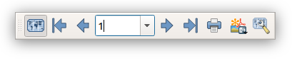
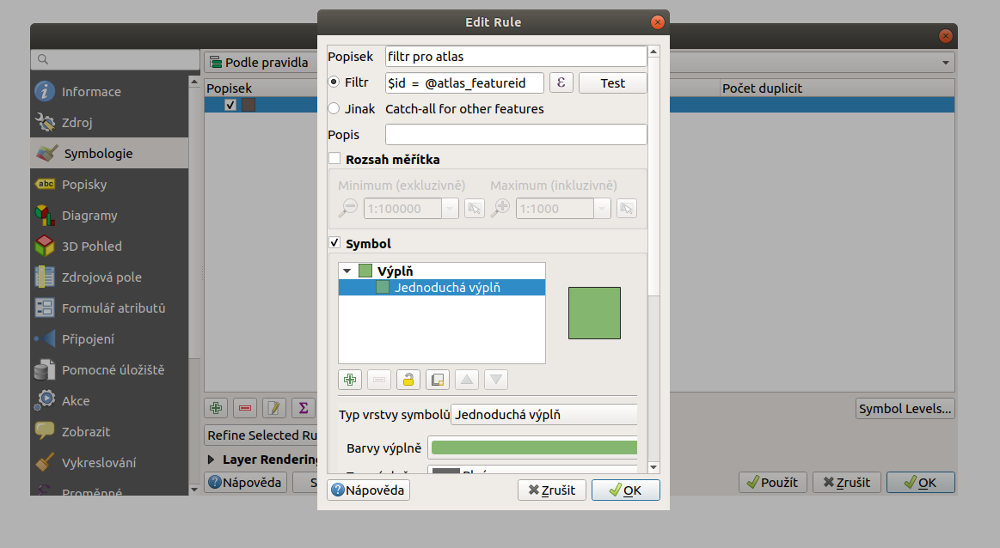
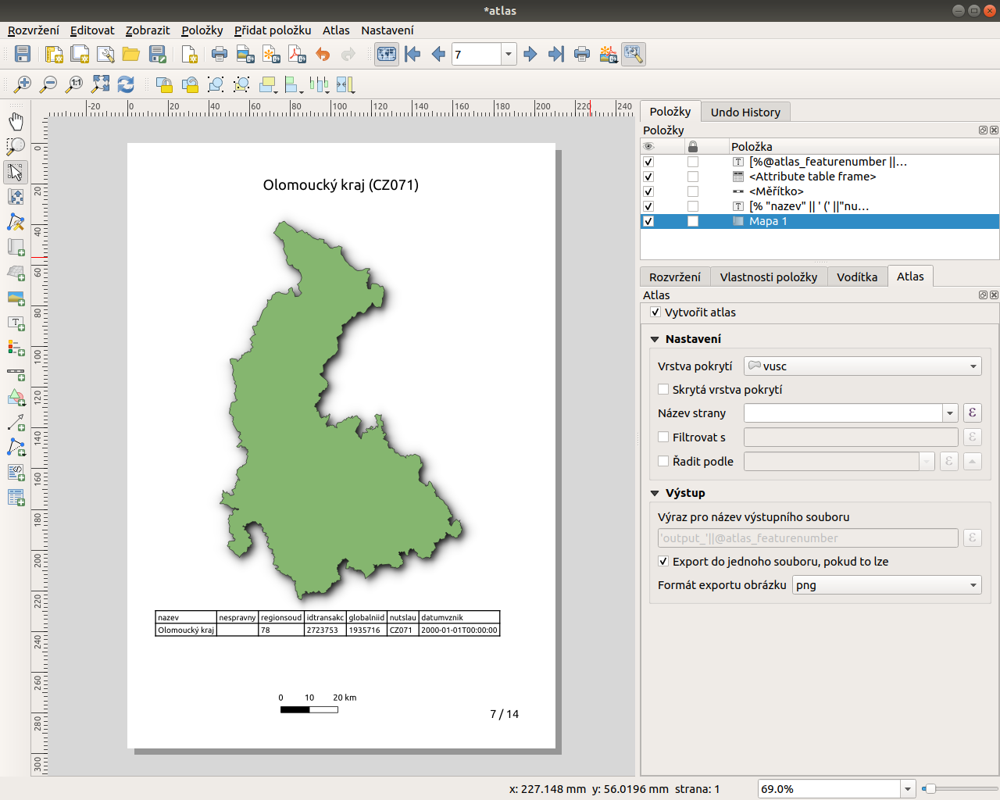

.. |selectstring| image:: ../images/icon/selectstring.png
   :width: 2.5em
.. |checkbox| image:: ../images/icon/checkbox.png
   :width: 1.5em
.. |combobox| image:: ../images/icon/combobox.png
   :width: 1.5em

.. |add_map| image:: ../images/icon/mActionAddMap.png
   :width: 1.5em
.. |mIconAtlas| image:: ../images/icon/mIconAtlas.png
   :width: 1.5em
.. |add| image:: ../images/icon/symbologyAdd.png
   :width: 1.5em    
.. |add_scale| image:: ../images/icon/mActionScaleBar.png
   :width: 1.5em
.. |add_label| image:: ../images/icon/mActionLabel.png
   :width: 1.5em
.. |add_attributes| image:: ../images/icon/grass_edit_attributes.png
   :width: 1.5em  
   
   
Tvorba atlasu
=============

Kromě tvorby samostatných výstupů lze pomocí tvůrce mapy vytvořit
sérii mapových výstupů, neboli *atlas*. Principem vytvoření takového
hromadného výstupu je využití tzv. *vrstvy pokrytí*. Pro každý prvek v
této vrstvě bude vytvořen vlastní mapový výstup, přičemž výřez
mapového okna bude přesunut vždy na polohu daného prvku.

Podrobnější informace o přidávání jednotlivých prvků a jejich
nastaveních najdete ve školení :skoleni:`QGIS pro
začátečníky<qgis-zacatecnik>` v kapitole :skoleni:`Tvorba mapového
výstupu<qgis-zacatecnik/mapovy_vystup/index.html>`.

Aktivace funkce atlasu
----------------------

Funkci atlasu lze aktivovat v záložce :guilabel:`Vytvoření atlasu`
zaškrtnutím položky |checkbox|:item:`Vytvořit atlas`. V této záložce
dále najdeme základní nastavení vrstvy pokrytí a výstupního souboru.

   Aktivace a základní nastavení funkce atlasu.

Nastavení
^^^^^^^^^

- :item:`Vrstva pokrytí` |selectstring| - vybereme vrstvu pokrytí
- :item:`Skrytá vrstva pokrytí` |checkbox| - vrstva pokrytí může být
  součástí mapového výstupu (např. hranice zájmového území, zobrazení
  konkrétních prvků, ...) nebo může být skryta
- :item:`Název strany` |combobox| - lze zadat název pro strany atlasu
  pro lepší orientaci při náhledu. Lze vybrat stávající atribut, nebo
  vytvořit název na základě výrazu (např. id prvku, název, ...)
- |checkbox| :item:`Filtrovat s` - umožňuje filtrovat zobrazené prvky
  vrstvy pokrytí na základě zadaného výrazu
- |checkbox| :item:`Řadit podle` - umožňuje seřadit prvky vrstvy
  pokrytí na základě atributu

Výstup
^^^^^^

- :item:`Výraz pro název výstupního souboru` - zadání formátování
  názvu výstupních souborů
- |checkbox| :item:`Export do jednoho souboru, pokud to lze` -
  např. při importu do jednoho souboru PDF

Příprava atlasu
---------------

Po aktivaci funkce a nastavení vrstvy pokrytí, postupujeme obdobně
jako u vytváření samostatného výstupu. V tomto momentě je také vhodné
zapnout náhled atlasu, což nám umožní sledovat prováděné změny a
listovat jednotlivými prvky/stranami atlasu.  Náhled jde spustit buď z
menu :menuselection:`Atlas --> Náhled atlasu` a nebo pomocí ikony
|mIconAtlas|:sup:`Náhled atlasu` z panelu *Atlas*.

   Panel - *Atlas*.

Mapové okno
^^^^^^^^^^^

V první řadě přidáme na list mapové okno pomocí ikony |add_map|
:sup:`Přidat novou mapu` a ve vlastnostech položky přidané mapy
aktivujeme možnost |checkbox|:item:`Ovládáno atlasem`. Zde je také 
možné nastavit generování měřítka.

.. figure:: images/atlas_control.png 
   :class: small
   :scale-latex: 40 

   Aktivace ovládání mapové položky atlasem.
   
Generování měřítka
~~~~~~~~~~~~~~~~~~

- |radiobutton|:item:`Ohraničení kolem prvku` - možnost zadání
  prostoru kolem prvku v procentech
- |radiobutton|:item:`Předdefinované měřítko (optimální)` - automatický
  výběr nejvhodnějšího měřítka na základě předdefinovaných měřítek
  projektu
  (viz. :skoleni:`Měřítko<qgis-zacatecnik/intro/popis_rozhrani.html#meritko>`)
- |radiobutton|:item:`Pevné měřítko` - nastavení pevného měřítka pro
  všechny prvky/listy atlasu
   
.. figure:: images/atlas_priklad.png 
   :class: middle 
   :scale-latex: 40 

   Příklad tvorby atlasu krajů.

Náhled atlasu
^^^^^^^^^^^^^

Nyní můžeme pomocí šipek nebo rolovací nabídky v panelu *Atlas*
procházet jednotlivé položky atlasu.

Symbologie
----------

Pokud vrstva pokrytí není skrytá, a je základem pro zobrazení dat v
mapovém okně, je pro dosažení lepšího výsledku zobrazení výsledných
map vhodné tuto vrstvu patřičně nastylovat. Zde jsou možnosti velice
široké, my si v následujícím příkladu popíšeme jeden z nejčastějších
případů a to nastylování, kdy se nám v jednotlivých listech atlasu
zobrazí pouze daný prvek či jeho hranice.

Přejdeme se do hlavního okna QGIS a otevřeme vlastnosti symbologie
vrstvy a z rolovací nabídky vybereme jako styl symbologie :item:`Podle
pravidla`. Pomocí tlačítka |add|:sup:`Přidat pravidlo` vytvoříme
formátování symbolu pro prvky splňující zadanou podmínku.

   Vytváření symbologie na základě zadaných pravidel.

V první položce :item:`Popisek` zadáme libovolný popisek pravidla a do
položky :item:`Filtr` zadáme výraz podmínky. Pomocí tlačítka
:item:`...` můžeme vyvolat :guilabel:`Tvůrce řetězce výrazu`, kde si
daný výraz můžeme pohodlně poskládat.  V našem případě chceme
nastylovat prvek (využijeme id prvku), který se zobrazuje v daném
listu atlasu (id prvku/listu atlasu). Požadovaný výraz bude tedy
vypadat takto:

.. code-block:: sql

    $id  =  @atlas_featureid 

Funkčnost výrazu si můžeme překontrolovat pomocí tlačítka
:item:`Test`. Po spuštění testu se nám objeví okno s počtem prvků,
které odpovídají výrazu ( v našem případě 1). Nastavíme pro prvek
požadovaný symbol a potvrdíme tlačítkem :item:`OK`. Pro účely našeho
příklad si prozatím vystačíme pouze s tímto jedním pravidlem, potvrďte
tedy změny provedené v symbologii vrstvy a přesuňte se opět do okna
tvorby mapových výstupů.

.. figure:: images/atlas_priklad_styl.png 
   :class: middle 
   :scale-latex: 40 

   Příklad tvorby atlasu krajů - nastylovaná vrstva.

Další kompoziční prvky 
----------------------

Nyní doplníme ostatní kompoziční prvky do mapového listu.

Textové pole
^^^^^^^^^^^^

Pomocí ikonky |add_label| :sup:`Přidat nový popisek` přidáme textové
pole a přejdeme na záložku :item:`Vlastnosti položky`.

Nyní můžeme využít vložení výrazu do textového pole, což nám umožní
vygenerovat např. unikátní názvy pro jednotlivé listy atlasu. Pomocí
tlačítka :item:`Vložit výraz...` můžeme otevřít okno pro tvorbu
výrazu. V našem případě vyhledáme atribut nesoucí názvy krajů
("nazev"), vložíme do výrazu a potvrdíme. Výsledný text v popisku bude
vypadat takto:

.. code-block:: sql

    [% "nazev" %]

Pokud chceme vložit název vytvořený na základě více atributů
(např. název + NUTS kód), zadání by vypadalo takto:

.. code-block:: sql

    [% "nazev"  || ' (' ||"nutslau" ||')'%]

.. note:: Všimněte si, že vložený výraz je v okně pro zadání textu
          "obalený" v hranatých závorkách se znakem procent. Mimo tyto
          závorky lze pokračovat v zadávání běžného textu.

.. tip:: Po zaškrtnutí položky |checkbox|:item:`Vykreslit jako HTML`
         můžeme do popisku vložit HTML kód včetně hypertextových
         odkazů a pod.

Měřítko
^^^^^^^

Měřítko lze přidat pomocí ikony |add_scale|:sup:`Přidat nové grafické
měřítko`. Pokud chceme při tvorbě atlasu použít grafické měřítko, je
třeba nastavit vhodný referenční bod, na základě kterého se nám bude
velikost grafického měřítka roztahovat v jednotlivých listech
atlasu. Nastavení referenčního bodu najdeme v záložce
:item:`Vlastnosti položky --> Umístění a velikost`. Pokud chceme
měřítko zobrazovat na středu mapového listu je třeba nastavit
referenční bod, který je uprostřed.

Atributová tabulka
^^^^^^^^^^^^^^^^^^

Pomocí tlačítka |add_attributes|:sup:`Přidat atributovou tabulku`
můžeme do výstupu přidat atributovou tabulku. Po vložení a nastavení
atributové tabulky (zobrazené atributy, formátování atd.), je pro
správné fungování v atlasu nutné nastavit filtrování prvků. V našem
případě chceme zobrazit pouze atributy prvku na daném mapovém listu.
Do políčka |checkbox|:item:`Filtrovat s` tedy opět použijeme výraz:

.. code-block:: sql

    $id  =  @atlas_featureid
    
.. tip:: Jako alternativní možnost vložení atributu a jeho hodnot je
         možné využít běžné textové pole s využitím formátování HTML.
         Také je možné vkládat výrazy pro výpočet např. *$area*.

Tiráž a doplňující informace
^^^^^^^^^^^^^^^^^^^^^^^^^^^^

Pomocí speciálních proměnných lze do textového pole vkládat výrazy,
které se mohou odkazovat např. na pořadové číslo listu, autora, verzi
QGIS, název a cestu projektu, rozlišení DPI, šířku a výšku papíru,
...).

   Příklad proměnných.
   
Pro přidání vypsání pořadového čísla listu při tisku vložíme textové
pole s výrazem:

.. code-block:: sql

    [%@atlas_featurenumber || ' / ' || @atlas_totalfeatures%]
    

   Atlas připravený k exportu.

Export
------

Stejně jako u samostatných mapových listů lze atlas exportovat do
formátů SVG, PDF nebo jako obrázek (JPG, PNG, ...).  Exportovat můžeme
buď pomocí menu :menuselection:`Atlas --> Exportovat Atlas jako ...`
nebo přímo z panelu *Atlas*. Pokud exportujeme do jednoho souboru
(jako např. PDF) při spuštění exportu zadáme standardně název souboru
a cestu kam chceme soubor uložit. V případě, že ukládáme atlas ve formě
jednotlivých výstupů (samostatné soubory) vybíráme v okně exportu
složku, do které se atlas bude generovat.  Jak byl v úvodu zmíněno,
základní nastavení pro export najdeme na kartě :item:`Vytvoření
atlasu` u položky *Výstup*.

.. figure:: images/atlas_export.png 
   :class: small 
   :scale-latex: 40 

   Nabídka pro export atlasu.
   
   
.. figure:: images/atlas_pdf.png 
   :class: middle 
   :scale-latex: 40 

   Výsledný atlas (jeden soubor PDF) otevřený v prohlížeči PDF souborů.

