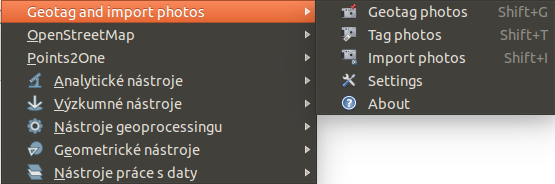
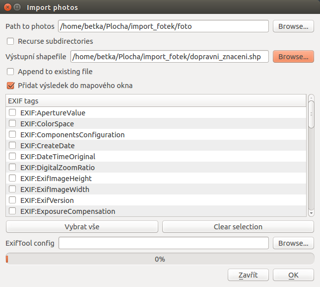
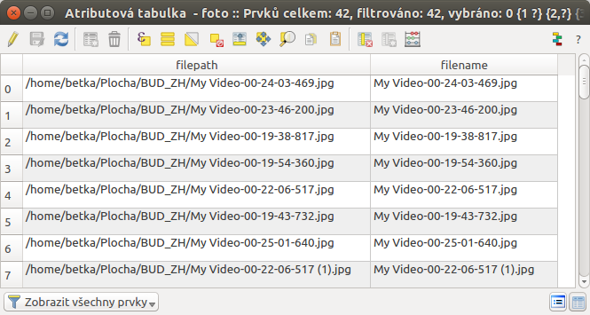
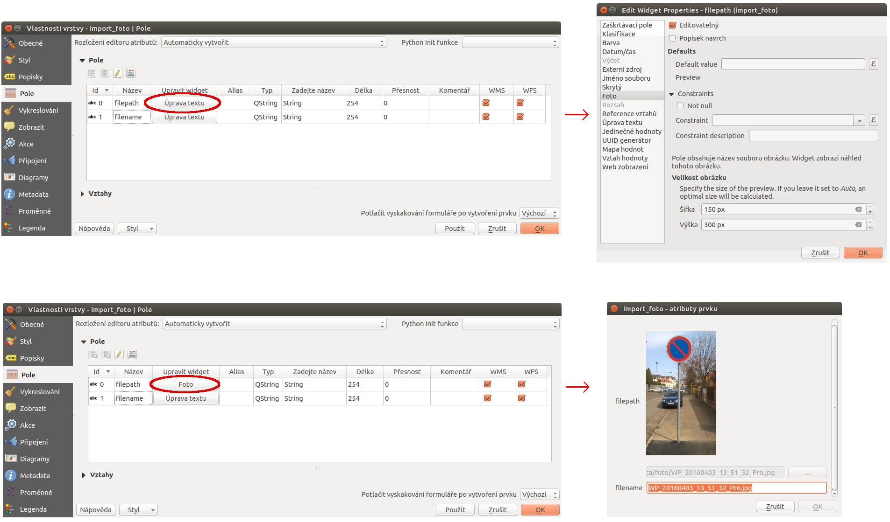
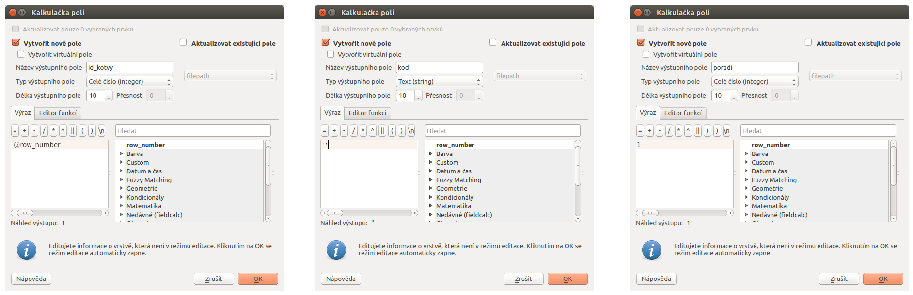
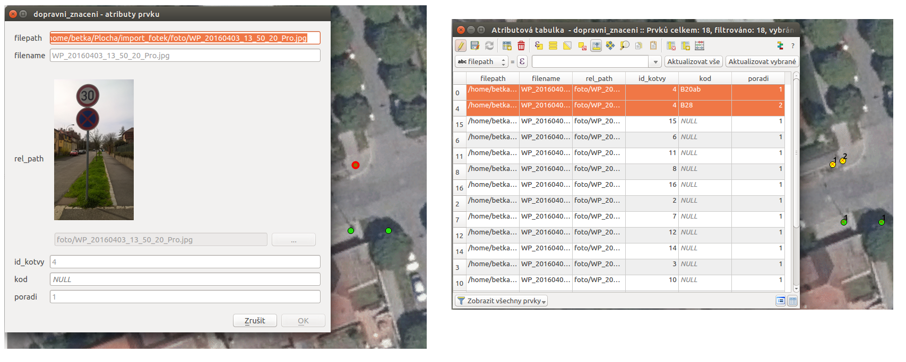
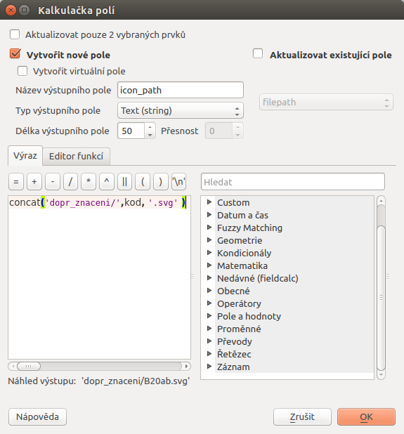
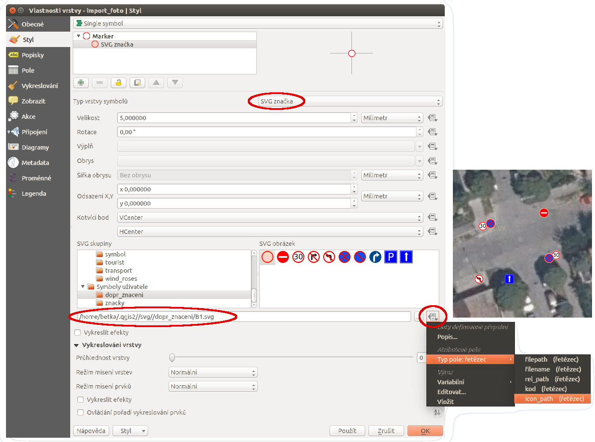
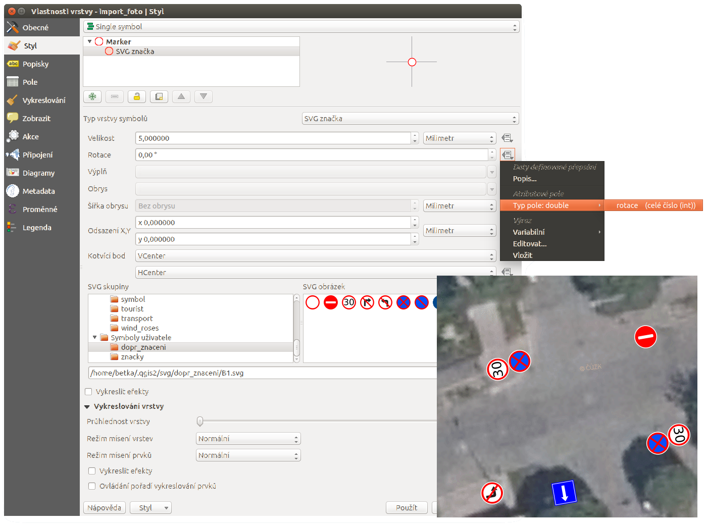

.. |mIconEditable| image:: ../images/icon/mIconEditable.png
   :width: 1.5em

.. |mActionCalculateField| image:: ../images/icon/mActionCalculateField.png
   :width: 1.5em
.. |mIconDataDefine| image:: ../images/icon/mIconDataDefine.png
   :width: 1.5em

Obrazová data jako součást vektorů 
^^^^^^^^^^^^^^^^^^^^^^^^^^^^^^^^^^

Možnost různě kombinovat různá data je čím dál víc dostupná. Jedním z běžných
požadavků se stává možnost přiřadit obrázek k vektorovým datům jako jakýkoli
jiný atribut. Způsobů jak naložit s takovým požadavkem je vícero. Jednou z
možností je mít atribut, ve kterém je zapsán název souboru, který k jednotlivým
záznamům patří. To umožňuje jednoznčné přiřazení obrázku k záznamu. Pokud je ale
obrázek zdrojem informací a chceme ho vidět, tak ho pak musíme otevřít 
samostatně v prohlížeči obrázků. 
QGIS však nabízí možnost zobrazit přímo v detailu jendotlivého prvku. Jednotlivé
kroky pro nastavení jsou popsány níže.

Využití
=======

Příkladem využití je pořizování geotagovaných fotografií (fotka s určeným místem
jejího pořízení). V současné době je možné dělat takovéto záznamy i s běžnými
mobilními telefony (je však nutné brát v potaz přesnost určení polohy).
Proces zpracování pak pozůstává z načtení dat jako vektorové vrstvy a nastavení
zobrazování daného obrázku jako atributu. Kompletní postup je rozepsán níže.

1. Vstupní obrazová data:
=========================

Pro práci s geotagovanými fotkami je nutné mít nainstalovaný
`ExifTool <http://www.sno.phy.queensu.ca/~phil/exiftool/>`_ který nám umožňuje 
s nimi pracovat.

Instalace na *Linux* je možná pomocí instalačníko balíčku. Pro instalaci na 
*Windows* je nutné stáhnout příslušnou složku (spouští se pomocí `.exe` 
souboru).

.. notecmd:: Instalace ExifTool
   
   .. code-block:: bash

      sudo apt-get install exiftool

.. tip::   
   Pokud si chcete prohlédnout informace vztažené k danému obrázku, tak obrázek
   jednoduše otevřete v *ExifTool*. 
   Ve *Windows* tak udělále pomocí drag-and-drop v Linuxu například pomocí 
   příkazu :map:`exiftool nazev_obrazku.jpg`. 
   Výpis obsahuje informace od definice zařízení, parametry snímku, definici
   polohy až po detailní parametry z času tovrby snímku. 

   .. code-block:: bash

      exiftool nazev_obrazku.jpg

      ======== WP_20160403_13_48_24_Pro.jpg
      ExifTool Version Number         : 9.46
      File Name                       : WP_20160403_13_48_24_Pro.jpg
      Image Width                     : 1840
      Image Height                    : 3264

      ...

      GPS Latitude                    : 50 deg 7' 37.74" N
      GPS Longitude                   : 14 deg 27' 11.27" E
      GPS Position                    : 50 deg 7' 37.74" N, 14 deg 27' 11.27" E

      ...
  

2. instalace pluginu 
====================

Pro možnost tvorby vektorové vrstvy z geotagovaných fotek využijeme plugin
`Geotag and import photos <https://hub.qgis.org/projects/geotagphotos/wiki>`_.
Tento nainstalujeme standardní cestou přes :menuselection:`Zásuvné moduly -->
Spravovat a instalovat zásuvné moduly...`. Potřebný modul je pouze
experimentální, proto musíte být povolené zobrazování experimentálních modulů.

Po instalaci se modul nachází v :menuselection:`Vektor --> Geotag and import
photos` (:num:`menu-geotag`).

.. _menu-geotag:

   Umístění nástrojú přidaného pluginu v menu QGIS.

.. note::
   
   Pro práci na na OS Windows je nutné nastavit cestu k složce :item:`ExifTool`,
   ve které se nachází `exiftool.exe` (:num:`exif-win`).
   Nastavení se nachází v :menuselection:`Vetkor --> Geotag and import photos 
   --> Settings`. 
   Na OS Linux toto není potřebné.

   .. _exif-win:

   .. figure:: images/exif_win.png
      :class: small

      Okno pro nastavení cesty k `exiftool.exe`. 

3. import fotek do vektorové vrstvy
===================================

Pro vytvoření bodové vrstvy z jednotlivých fotografií použijeme funkci pluginu
:item:`Import photos`.
Prvním krokem je zadání adresáře, ve kterém se nacházejí požadované fotky.
Po zadání adresáře s fotkami se do pole `EXIF tags` vypíšou nalezené kategorie
hodnot.
Pro základné zpracování dále toto pole nemusíme používat. Pokud by jsme označili
některý z nalezených tagů, tak by se po importu uložil jako další atribut.
Hodnoty se můžou různit podle toho, jaké údaje dané zařízení pořizuje. 
Pomocí checkboxu :item:`Recurse subdirectories` můžeme polovit prohledávání i
podadresářů námi vybrané složky. 
Druhým krokem je zádání výstupního `shapefilu`. Pokud by jsme chtěli jenom
doplnit již existující vektorovou vrstvu, tak použijeme volbu :item:`Append to
existing file`.

   Nastavení pro zpracování geotagovaných fotografii do shapefile vrstvy.

Po dokončení procesu se nová bodová vrstva přidá do mapového okna. 
Naprostá většina zařízení, která dokáže dělat takto zpracovatelné fotografie
pracuje se souřadnicemi v sys. *WGS - 84*. Výsledná vrstva má tudíž ten samý
souřadnicový systém (EPSG:4326).

Pokuk si otevřeme atributovou tabulku (:num:`attribute-tab`), tak se tam standardně nachází 2 atributy.
Prvním je `filepath` - absolutní cesta k obrázku v čase vytvoření a `filename` -
název souboru.

.. _attribute-tab:

   Ukázka atributové tabulky po importu geotagovaných fotografií.

4. vykreslování obrázku v detailu prvku
=======================================

Pokud má vrstva jako atribut zapsanou cestu k obrázku (nebo přímo název
souboru), tak je možné zobrazovat tento obrázek při zobrazení detailu prvku.

Ve vlastnostech vrstvy si otevřeme záložku :item:`Pole`, kde se nachází přehled
o vlastnostech dané vrstvy. V tomto případě vidíme stále původí vlastnosti a
vidíme taky, že mají obě nastaveno :item:`Úprava textu`. (Jde tedy o klasické
vlastnosti s textem, které můžeme upravovat přepisováním.)

Prvním krokem je zapnutí editace pomocí ikony |mIconEditable| :sup:`Přepnout na
režim editace`.
Pak chceme použít atribut `filepath` jako zdroj pro vykreslení obrázku.
Kliknutím na tlačítko s textem :item:`Úprava textu` se dostaneme do možností
nastavení této vlastnosti.
V postranním menu vybereme :item:`Foto`. V detailnějším nastavení je pak možné
zakázat možnost editace, nebo nastavení popisku. Dále je pak možné nastavit
velikost obrázku pro vykreslování. Pokud velikost nebude nastavena tak se
odhadne optimum.

Potvrzením tohoto nastavení se dostaneme do předchozího okna. Zde je už vidět,
že vlastnost `filepath` má změněné nastavení.

Při identifikaci prvku v mapovém okně pomocí |mActionIdentify|
:sup:`Identifikovat prvky` se otevře detail prvku, kde je vykreslen požadovaný
obrázek.

   
   Jednotlivé kroky nastavení pro vykreslování obrázku.

.. tip::
   Pokud chceme data předávat dál, tak je dobré myslet na používání relativních
   cest. V příkladě jsme použili absolutní cestu k obrázku pro jejo vykreslení.
   Pokud bychom chtěli redat složku i se všemi daty dál, tak je ideální využít
   relativní cestu. 

   Celý projekt je uložen ve složce s názvem `vektor_obrázky`. Přímo vtéto
   složce je pak shaepfile, který vzniknul importem geotagovaných fotek, projekt
   a pak samotná složka s názvem `fotky`.

   .. figure:: images/files.png
      :class: small

      Struktura uložení fotek, projektu a shapefilu.

   Pomocí :item:`Fieldcalculatoru` si přidáme nový atribut, který bude složen z
   názvu složky, ve které jsou uloženy fotky (fotky), lomítka a hodnoty atributu
   `filename`. Vytvoření nové hodnoty bude tedy definováno výrazem 
   `concat('fotky/',"filename")`.

   .. figure:: images/field_calc.png
      :class: small

      Vytvoření atributu s relativní cestou k obrázku.

   Pak je nutné znovu nastavit nový atribut pro zobrazování fotky. (Informace o
   používání relativních cest je uložena v nastavení projektu, proto je nutné
   pracovat v projektu)

   .. figure:: images/rel_path.png
      :class: large

      Ukázka nastavení vlastností a následné identifikace prvku.

   V rámci změny OS může dojít k problému se značením cesty. Pokud je stále k
   dispozici název fotografie u daného prvku, tak si cestu můžete vyskládat
   kdykoli znova.

.. note::

   Po úspěšném importu geotagovaných fotografií do shapefilu je možné s nima
   pracovat jako s běžnými vektorovými daty.
   Například je možné je připojit na základě prostorové analýzy k jiným datům.
   Příkladem z praxe může být pořízení fotek tecnických objektů o kterých již
   máme atributové záznamy ve vektorové vrstvě. 
   Postupem popsaným v této části školení z nich dostaneme vektorová data,
   kterých atributy je možno například pomocí :item:`Připojit atributy podle 
   umístění` připojit k původním datům. 
   

Další zpracování
================

Tvorba vektorových dat pomocí pořizování geotagovaných fotografií může mít různé
možnosti využití. 
Jednou z nich může být mapování prvků za ůčelem tvorby evidence. Ve výše
udedeném příkladu jsme z pořízených fotografií udělali  bodovou vektorovou
vrstvu, kde je možné každý prvek vidět na fotografii. 
Obrázek zachycuje velké množství informací, které se běžně evidují formou
atributů. Z obrázku je možné tyto atributy jednoduše určit a vytvořit tak
běžnou evidenci.

U dopravného značení se určují víceré parametry (kód tabule, ukotvení,
provedení a další). Většinou slouží k vytvoření mapového výstupu a přehledné
tabulky s určenými atributy.
Vytvoření jednoduchého mapového výstupu je popsáno v dalších krocích.

1.Definice dopravní tabule
--------------------------

Prvním krokem pro znázornění dopravního značení je nutnost identifikovat
jednotlivé značky v místě jejich výskytu.
V případě, že by na jednom místě byla maximálně jedna dopravní tabule, tak aby
stačilo přidat atribut pro její kód. 
Protože je ale běžné, že se na jednom místě nachází vyšší počet dopravních
tabulí,tak je nutné tuto situaci ošetřit.

Prvním krokem je přidání evidovaných atributů.

* id_kotvy (celé číslo defaultně dvyplněn pomocí proměnné @row_number)
* kod (text - bez vyplnění, je nutno jej určit z obrázku)
* poradi (celé číslo defaultně vyplněno na hodnotu 1 - v případě více tabulí
  na jedné kotvě se hodnota upraví)  

   Přidání jednotlivýcha atributů (id_kotvy, kod, poradi) a jejich definování.

Druhým krokem je určování kódu jednotlivým prvkům. Pokud se na jedné kotvě
nachází vícero tabulí, tak musíme vytvořit adekvátní počet prvků zkopírováním
původního. Jednotlivé prvky se budou vykreslovat `.svg` značkou podle atributu
kódu. Proto musíme prvky uspořádat dle jejich skutečného pořadí sezhora dolů a
toto i zapsat jako atribut. (Rozestup záleží na velikosti ikon a měřítku.)
Příklad výchozího a upraveného stavu je na :num:`copy-feature`.

.. _copy-feature:

   Původní a upravené prvky definující dopravní tabule umístěné na jedné kotvě.

Výsledkem jsou záznamy pro každou dopravní tabuli, které mají určený
identifikátor umístění, pořadí a kód dopravní tabule. 

2.Uložení .svg symbolů
----------------------

Jednotlivé prvky budeme vykreslovat `.svg` znakem. 
Názvy jednotlivých symbolů odpovídají kódům tabulí a jsou uloženy v jedné
složce.
Tuto složku pak umístíme mezi ostatní systémové sady svg symbolů.

V případě práce v systému Linux se jedná o složku `/usr/share/qgis/svg/`
sem je nutné složku nakopírovat jako `root`.

.. code-block:: bash

   sudo cp -a /source/. /usr/share/qgis/svg/dopr_znaceni/

3.Nastavení stylování objektů
-----------------------------

Dalším krokem je zobrazení prvku podle atributu s kódem dopravní značky.
Jednotlivé symboly však chceme vykreslit značkou, která je umístěná ve složce
`dop_znaceni` a má příponu `.svg`. Vytvoříme tedy nový atribut s hodnotou
relativní cesty symbolu.

   Určení relativní cesty k ikoně podle určeného kódu dopravní tabule.

Pak ve vlastnostech vrstvy upravíme stylování. 
Podstatné je vybrat typ symbolu :item:`SVG značka` a pomocí ikony
|mIconDataDefine| z menu vybereme pole `icon_path`. V tomto případě je vhodné
používat ikonky s velikostí 6 milimetrů.

   
   Nastavení stylování podle atributu s umístěním svg symbolu a ukázka výsledku.

4.Určení rotace
---------------

Posledním krokem je rotování ikon. Jednotlivé ikony by se měli rotovat podle
reálného umístění v terénu.
Takovéto natočení lze uplatnit i pro vykreslování v mapovém okně. Rotaci lze
určit hromadně, ale v tomto případě to není dostačující.
Ideální je přidat atribut rotace, kde se defnuje celočíselná hodnota pootočení
požadovaného směru vůči směru na sever (jde o hodnotu azimutu, kde lze zadávat i
záporná čísla -10 = 350).

Po vyplnění atributu u všech prvků nastavíme položku Rotace pomocí
|mIconDataDefine| na atribut `rotace`.

   Nastavení rotace sympolu podle hodnoty atributu a ukázka výsledku.

