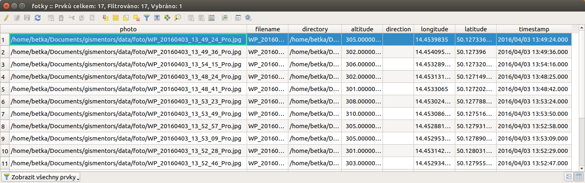
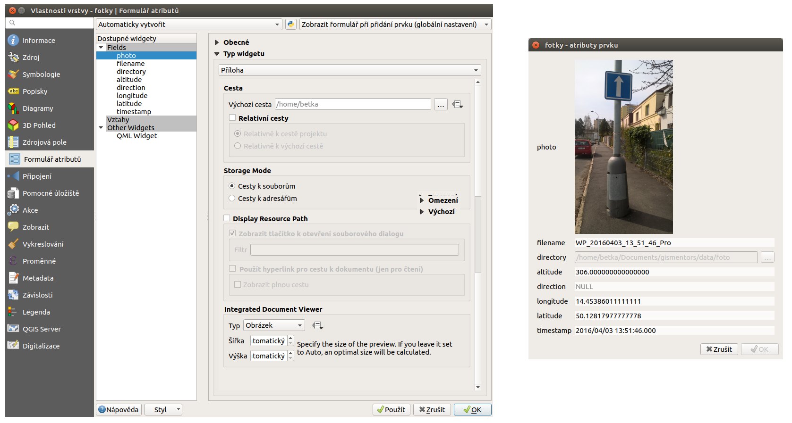
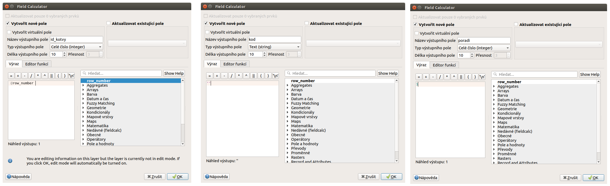
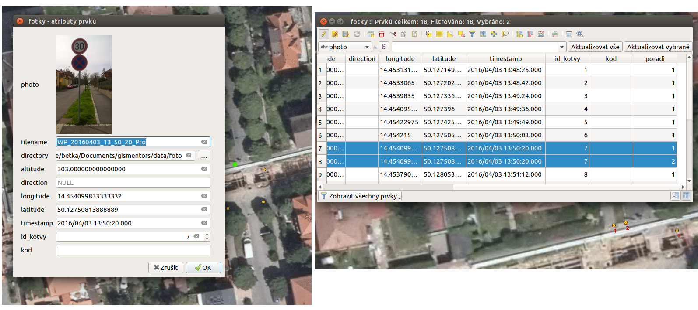
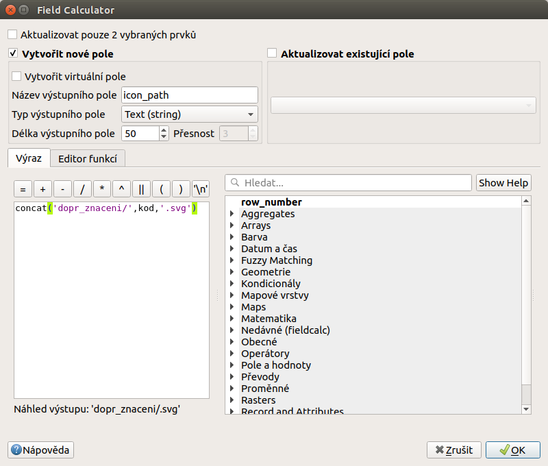
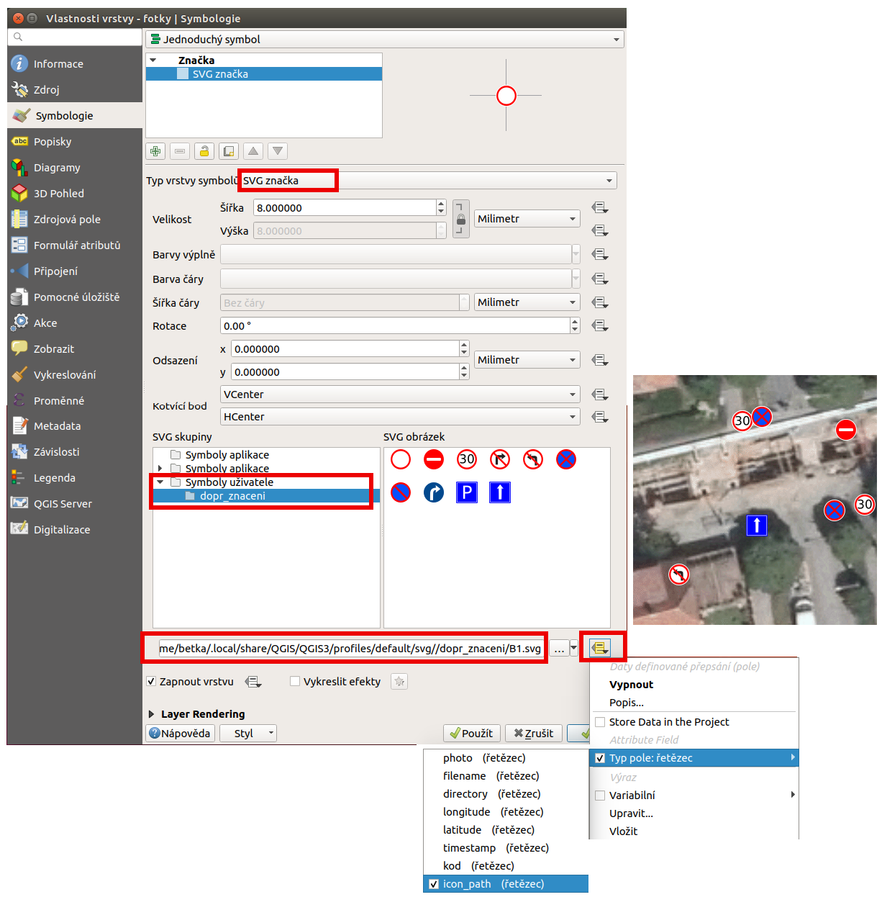
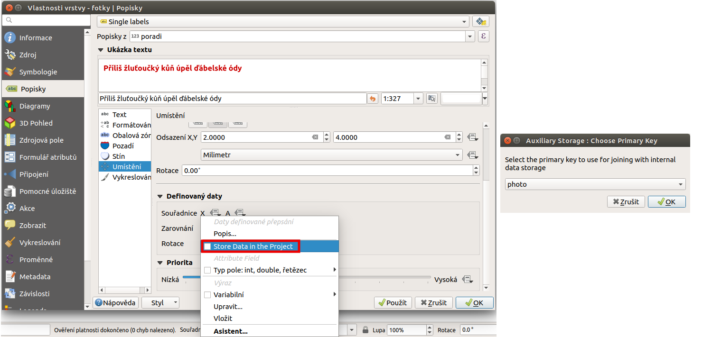
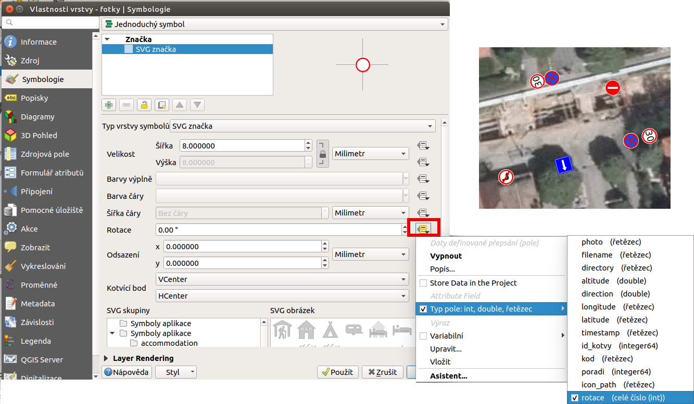

Obrazová data jako součást vektorů (práce s geotagovanými fotografiemi)
^^^^^^^^^^^^^^^^^^^^^^^^^^^^^^^^^^^^^^^^^^^^^^^^^^^^^^^^^^^^^^^^^^^^^^^

Možnost různě kombinovat různorodá data je čím dál víc dostupná. Jedním z běžných
požadavků se stává možnost přiřadit obrázek k vektorovým datům jako jakýkoli
jiný atribut. Způsobů jak naložit s takovým požadavkem je vícero. Jednou z
možností je mít atribut, ve kterém je zapsán název souboru, který k jednotlivým
záznamům patří. To umožňuje jednoznačné přiřazení obrázku k záznamu. Pokud je ale
obrázek zdrojem informací a chceme ho vidět, tak ho pak musíme otevřít 
samostatně v prohlížeči obrázků. 
QGIS však nabízí možnost zobrazit přímo v detailu daného prvku. Jednotlivé
kroky pro nastavení jsou popsány níže.

Využití
=======

Příkladem využití je pořizování geotagovaných fotografií (fotografie s určeným místem
jejího pořízení). V současné době je možné dělat takovéto záznamy i s běžnými
mobilními telefony (je však nutné brát v potaz přesnost určení polohy).
Proces zpracování pak pozůstává z načtení dat jako vektorové vrstvy a nastavení
zobrazování daného obrázku jako atributu. Kompletní postup je rozepsán níže.

1. Vstupní obrazová data
========================

Pokud chceme vidět data připojená k obrázku typu fotka, mlžeme použít nástroj
`ExifTool <http://www.sno.phy.queensu.ca/~phil/exiftool/>`_, který nám umožňuje 
tato data číst. Tento nástroj pro tento úkol není potřebný.

.. note:: Instalace na operačním systému *Linux* je možná pomocí
          instalačního balíčku. Pro instalaci na *Windows* je nutné stáhnout
          příslušnou složku (spouští se pomocí `.exe` souboru).

          .. notecmd:: Instalace ExifTool
   
             .. code-block:: bash
                
                sudo apt-get install exiftool

.. tip:: Pokud si chcete prohlédnout informace vztažené k danému
   obrázku, tak obrázek jednoduše otevřete v *ExifTool*.  Ve *Windows*
   tak uděláte pomocí drag-and-drop, v Linuxu například pomocí příkazu
   ``exiftool nazev_obrazku.jpg``.  Výpis obsahuje informace od
   definice zařízení, parametry snímku, definici polohy až po detailní
   parametry z času tvorby snímku.

   .. code-block:: bash

      exiftool nazev_obrazku.jpg

      ======== WP_20160403_13_48_24_Pro.jpg
      ExifTool Version Number         : 9.46
      File Name                       : WP_20160403_13_48_24_Pro.jpg
      Image Width                     : 1840
      Image Height                    : 3264

      ...

      GPS Latitude                    : 50 deg 7' 37.74" N
      GPS Longitude                   : 14 deg 27' 11.27" E
      GPS Position                    : 50 deg 7' 37.74" N, 14 deg 27' 11.27" E

      ...
  

.. _import:

2. Import fotek do vektorové vrstvy
===================================

Pro vytvoření bodové vrstvy z jednotlivých fotografií použijeme funkci
pluginu :item:`Import photos`.
Prvním vstupem je zadání adresáře, ve kterém se nacházejí požadované fotky.
Druhým krokem je zadání výstupního souboru ve formátu GPKG (řípadn ějiném formátu).
Volitelně můžeme nastavit styly, kterými budou body vykresleny.

.. figure:: images/import_photos.png

   Nastavení pro zpracování geotagovaných fotografii do GPKG vrstvy.

Po dokončení procesu se nová bodová vrstva přidá do mapového okna. 
Naprostá většina zařízení, která dokáže dělat takto zpracovatelné fotografie
pracuje se souřadnicemi v systému *WGS - 84*. Výsledná vrstva má tudíž ten samý
souřadnicový systém (:epsg:`4326`).

Pokud si otevřeme atributovou tabulku (:numref:`attribute-tab`), tak se
tam nacházejí různé atributy. Atributy definují geometrii, čas pořízení
a umístění fotky na disku.

.. _attribute-tab:

   Ukázka atributové tabulky po importu geotagovaných fotografií.

3. Vykreslování obrázku v detailu prvku
=======================================

Pokud má vrstva jako atribut zapsanou cestu k obrázku (nebo přímo název
souboru), tak je možné zobrazovat tento obrázek při zobrazení detailu prvku.

Ve vlastnostech vrstvy si otevřeme záložku :item:`Formulář atributů`, kde se
nachází přehled a nastavení všech atributů.
Při kliknutí na položku atributu, která obsahuje cestu k originální fotce se
otevře menu pro nastavení této položky. V našem případě se jedná o atribut
`photo`. Klíčové je zejména nastavení v části  :item:`Typ widgetu`, kde zvolíme
typ :item:`Příloha` a nastavíme další dodateční parametry pro jeho
vykreslování.

Při identifikaci prvku v mapovém okně pomocí |mActionIdentify|
:sup:`Identifikovat prvky` se otevře detail prvku, kde je vykreslen požadovaný
obrázek.

   
   Nastavení pro vykreslování obrázku.

.. note::

   Po úspěšném importu geotagovaných fotografií do souboru ve formátu
   Shapefile je možné s nimi pracovat jako s běžnými vektorovými daty.
   Například je možné je připojit na základě prostorové analýzy k
   jiným datům.  Příkladem z praxe může být pořízení fotek technických
   objektů, o kterých již máme atributové záznamy ve vektorové vrstvě.
   Postupem popsaným v této části školení z nich dostaneme vektorová
   data, kterých atributy je možno například pomocí :item:`Připojit
   atributy podle umístění` připojit k původním datům.
   

Další zpracování
================

Tvorba vektorových dat pomocí pořizování geotagovaných fotografií může mít různé
možnosti využití. 
Jednou z nich může být mapování prvků za účelem tvorby evidence. Ve výše
uvedeném příkladu jsme z pořízených fotografií udělali  bodovou vektorovou
vrstvu, kde je možné každý prvek vidět na fotografii. 
Obrázek zachycuje velké množství informací, které se běžně evidují formou
atributů. Z obrázku je možné tyto atributy jednoduše určit a vytvořit tak
běžnou evidenci.

U dopravného značení se určují víceré parametry (kód tabule, ukotvení,
provedení a další). Většinou slouží k vytvoření mapového výstupu a přehledné
tabulky s určenými atributy.
Vytvoření jednoduchého mapového výstupu je popsáno v dalších krocích.

1. Definice dopravní tabulky
----------------------------

Prvním krokem pro znázornění dopravního značení je nutnost identifikovat
jednotlivé značky v místě jejich výskytu.
V případě, že by na jednom místě byla maximálně jedna dopravní tabule, tak by
stačilo přidat atribut pro její kód. 
Protože je ale běžné, že se na jednom místě nachází vyšší počet dopravních
tabulí, tak je nutné tuto situaci ošetřit.

Prvním krokem je přidání evidovaných atributů.

* ``id_kotvy`` (celé číslo, výchozí hodnota nastavena pomocí proměnné
  ``@row_number``)
* ``kod`` (text - bez vyplnění, je nutno jej určit z obrázku)
* ``poradi`` (celé číslo, výchozí hodnota 1 - v případě více tabulí
  na jedné kotvě se hodnota upraví)  

   Přidání jednotlivých atributů (id_kotvy, kod, poradi) a jejich definování.

Druhým krokem je určování kódu jednotlivým prvkům. Pokud se na jedné
kotvě nachází vícero tabulí, tak musíme vytvořit adekvátní počet prvků
zkopírováním původního. Jednotlivé prvky se budou vykreslovat
:wikipedia:`SVG` značkou podle atributu kódu. Proto musíme prvky
uspořádat dle jejich skutečného pořadí ze shora dolů a toto i zapsat
jako atribut (rozestup záleží na velikosti ikon a měřítku.)  Příklad
výchozího a upraveného stavu je na :numref:`copy-feature`.

.. _copy-feature:

   Původní a upravené prvky definující dopravní tabule umístěné na jedné kotvě.

Výsledkem jsou záznamy pro každou dopravní tabuli, které mají určený
identifikátor umístění, pořadí a kód dopravní tabule. 

2. Uložení SVG symbolů
----------------------

Jednotlivé prvky budeme vykreslovat SVG znakem. Názvy jednotlivých
symbolů odpovídají kódům tabulí a jsou uloženy v jedné složce. Tuto
složku pak umístíme do složky `.local/share/QGIS/QGIS3/profiles/default/svg`.
Pokud složka neexistuje, tak ji vytvoříme.
U operačního systému Windows se tato složka nachází  
`USER\\AppData\\Roaming\\QGIS\\QGIS3\\profiles\\default\\svg`.

.. note:: V případě budoucí publikace služby přes QGIS Server je vhodné použít
          pro umístění složky s ikonkami systémový adresář 
          `/usr/share/qgis/svg/`. Stejný obsah by měl být nakopírován i na 
          server. Projekt se pak bude chovat nezávisle na jeho umístění a vždy
          bude používat systémové ikony (základní nebo rozšířené).
          Pro kopírování do systémového adresáře musíme použít práva 
          superuživatele `root`.

          .. code-block:: bash

             sudo cp -a /source/. /usr/share/qgis/svg/dopr_znaceni/

3. Nastavení stylování objektů
------------------------------

Dalším krokem je zobrazení prvků podle atributu s kódem dopravní značky.
Jednotlivé symboly však chceme vykreslit značkou, která je umístěná ve složce
`dop_znaceni` a má příponu `.svg`. Vytvoříme tedy nový atribut s hodnotou
relativní cesty symbolu - `concat('/dopr_znaceni/',kod,'.svg')`.

   Určení relativní cesty k ikoně podle určeného kódu dopravní tabule.
   
.. tip:: Použití kalkulačky polí funguje jednorázově. Pro takovýto případ je
         výhodné použít nástroj, který automaticky vygeneruje požadovaný
         složený text při každé změně.
         Ve vlastnostech vrstvy, záložce :item:`Formulář atributů`, kde označíme
         vlastnost `icon_path`.
         
         .. figure:: images/geotag_auto_update.png
            :class: large
   
            Automatické generování hodnoty při změně hodnoty podle předpisu.

Pak ve vlastnostech vrstvy upravíme stylování. 
Podstatné je vybrat typ symbolu :item:`SVG značka` a pomocí ikony
|mIconDataDefine| z menu vybereme pole `icon_path`. V tomto případě je vhodné
používat ikonky s velikostí 8 milimetrů.

   
   Nastavení stylování podle atributu s umístěním svg symbolu a ukázka výsledku.
   
   
Parametry jako je pozice, nebo rotace, je možné v rámci projektu ukládat i
mimo primární atributové tabulky. Pokud například chceme pracovat s rotací
popisků individuálně, ale nechceme aby byly řídící hodnoty součástí atrbutů,
tak nastavíme jejich ukládání do souborové databázy projektu jako tzv. 
pomocná data` (auxiliary).
Jako příklad použijeme rotaci číseldné hodnoty pořadí značky na kotvě. Ve
vlastnostech vrstvy u položky umístění, zaškrtneme v menu položku *Store Data
in the Project*. Následně se otevře dialogové okno, ve které zvolíme atribut
pomocí kterého se vrstvy budou dát navázat (primární klíč, identifikátor). 

   
   Výběr nastavení rotace napojené na databázi projektu a výběk klíče.
   
Pak je možné použít nástroj na manuální rotaci prvnků, hodnoty se budou aktualizovat přímo v databázi projektu. 

.. todo::  Ukázat náhled na db projektu a ukázat asistenta pro zadání
   dalších možností
   
   

4. Určení rotace
----------------

Posledním krokem je rotování ikon. Jednotlivé ikony by se měli rotovat podle
reálného umístění v terénu.
Takovéto natočení lze uplatnit i pro vykreslování v mapovém okně. Rotaci lze
určit hromadně, ale v tomto případě to není dostačující.
Ideální je přidat atribut rotace, kde se definuje celočíselná hodnota pootočení
požadovaného směru vůči směru na sever (jde o hodnotu azimutu, kde lze zadávat i
záporná čísla -10 = 350).

Po vyplnění atributu u všech prvků nastavíme položku Rotace pomocí
|mIconDataDefine| na atribut `rotace`.

   Nastavení rotace symbolu podle hodnoty atributu a ukázka výsledku.

.. tip::
   Některá zařízení jsou schopna určovat a i ukládat informace o orientaci
   přístoje.
   U takovýchto přístrojů se tedy v exif datech objeví takováto položka:

   .. code-block:: bash

      ...

     GPS Img Direction Ref           : True North
     GPS Img Direction               : 32.52336904
      ...

   Dále je pak možné rotaci symbolů nastavit přímo z toho atributu.
   

