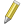
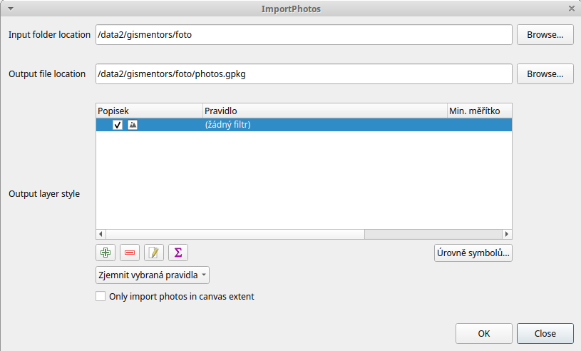

.. |mActionIdentify| image:: ../images/icon/mActionIdentify.png
   :width: 1.5em

Obrazová data jako součást vektorů 
^^^^^^^^^^^^^^^^^^^^^^^^^^^^^^^^^^
Možnost různě kombinovat různá data je čím dál víc dostupná. Jedním z běžných
požadavků se stává možnost přiřadit obrázek k vektorovým datům jako jakýkoli
jiný atribut. Způsobů jak naložit s takovým požadavkem je vícero. Jednou z
možností je mít atribut, ve kterém je zapsán název souboru, který k jednotlivým
záznamům patří. To umožňuje jednoznčné přiřazení obrázku k záznamu. Pokud je ale
obrázek zdrojem informací a chceme ho vidět, tak ho pak musíme otevřít 
samostatně v prohlížeči obrázků. 
QGIS však nabízí možnost zobrazit přímo v detailu jendotlivého prvku. Jednotlivé
kroky pro nastavení jsou popsány níže.

Využití
=======
Příkladem využití je pořizování geotagovaných fotografií (fotka s určeným místem
jejího pořízení). V současné době je možné dělat takovéto záznamy i s běžnými
mobilními telefony (je však nutné brát v potaz přesnost určení polohy).
Proces zpracování pak pozůstává z načtení dat jako vektorové vrstvy a nastavení
zobrazování daného obrázku jako atributu. Kompletní postup je rozepsán níže.

1. Vstupní obrazová data:
=========================

Pro práci s geotagovanými fotkami je nutné mít nainstalovaný
`ExifTool <http://www.sno.phy.queensu.ca/~phil/exiftool/>`_ který nám umožňuje 
s nimi pracovat.

Instalace na *Linux* je možná pomocí instalačníko balíčku. Pro instalaci na 
*Windows* je nutné stáhnout příslušnou složku (spouští se pomocí `.exe` 
souboru).

.. notecmd:: Instalace ExifTool
   
   .. code-block:: bash

      sudo apt-get install exiftool

.. tip::
  
   Pokud si chcete prohlédnout informace vztažené k danému obrázku, tak obrázek
   jednoduše otevřete v *ExifTool*. 
   Ve *Windows* tak udělále pomocí drag-and-drop v Linuxu například pomocí 
   příkazu :map:`exiftool -a gps:nazev_obrazku.jpg`. 
   Na obrázku :num:`exif-data` je vidět přehled ecidovaných informací.

  .. _exif-data:
   
  .. figure:: images/exif_data.png
     :class: small

     Příklad vypsaných informací u geotagované fotky 'ukazkova.jpg'.

2. instalace pluginu 
====================

Pro možnost tvorby vektorové vrstvy z geotagovaných fotek využijeme plugin
`Geotag and import photos <https://hub.qgis.org/projects/geotagphotos/wiki>`_.
Tento nainstalujeme standardní cestou přes :menuselection:`Zásuvné moduly -->
Spravovat a instalovat zásuvné moduly...`. Potřebný modul je pouze
experimentální, proto musíte být povolené zobrazování experimentálních modulů.

Po instalaci se modul nachází v :menuselection:`Vektor --> Geotag and import
photos` (:num:`menu-geotag`).

.. _menu-geotag:

.. figure:: images/geotag_menu.png
   :class: small

   Umístění nástrojú přidaného pluginu v menu QGIS.

.. note::
   
   Pro práci na na OS Windows je nutné nastavit cestu k složce :item:`ExifTool`,
   ve které se nachází `exiftool.exe` (:num:`exif-win`).
   Nastavení se nachází v :menuselection:`Vetkor --> Geotag and import photos 
   --> Settings`. 
   Na OS Linux toto není potřebné.

   .. _exif-win:

   .. figure:: images/exif_win.png
      :class: small

      Okno pro nastavení cesty k `exiftool.exe`. 

3. import fotek do vektorové vrstvy
===================================
Pro vytvoření bodové vrstvy z jednotlivých fotografií použijeme funkci pluginu
:item:`Import photos`.
Prvním krokem je zadání adresáře, ve kterém se nacházejí požadované fotky.
Pozadání adresáře s fotkami se do pole `EXIF tags` vypíšou nalezené typy hodnot. 
Pro základné zpracování dále toto pole nemusíme používat.
Pomocí checkboxu :item:`Recurse subdirectories` můžeme polovit prohledávání i
podadresářů námi vybrané složky. 
Druhým krokem je zádání výstupního `shapefilu`. Pokud by jsme chtěli jenom
doplnit již existující vektorovou vrstvu, tak použijeme volbu :item:`Append to
existing file`.

   Nastavení pro zpracování geotagovaných fotografii do shapefile vrstvy.

Po dokončení procesu se nová bodová vrstva přidá do mapového okna. 
Naprostá většina zařízení, která dokáže dělat takto zpracovatelné fotografie
pracuje se souřadnicemi v sys. *WGS - 84*. Výsledná vrstva má tudíž ten samý
souřadnicový systém (EPSG:4326).

Pokuk si otevřeme atributovou tabulku (:num:`attribute-tab`), tak se tam standardně nachází 2 atributy.
Prvním je `filepath` - absolutní cesta k obrázku v čase vytvoření a `filename` -
název souboru.

.. _attribute-tab:

.. figure:: images/attr_table.png
   :class: small

   Ukázka atributové tabulky po importu geotagovaných fotografií.

4. vykreslování obrázku v detailu prvku
=======================================
Pokud má vrstva jako atribut zapsanou cestu k obrázku (nebo přímo název
souboru), tak je možné zobrazovat tento obrázek při zobrazení detailu prvku.

Ve vlastnostech vrstvy si otevřeme záložku :item:`Pole`, kde se nachází přehled
o vlastnostech dané vrstvy. V tomto případě vidíme stále původí vlastnosti a
vidíme taky, že mají obě nastaveno :item:`Úprava textu`. (Jde tedy o klasické
vlastnosti s textem, které můžeme upravovat přepisováním.)

Prvním krokem je zapnutí editace pomocí ikony |mIconEditable| :sup:`Přepnout na
režim editace`.
Pak chceme použít atribut `filepath` jako zdroj pro vykreslení obrázku.
Kliknutím na tlačítko s textem :item:`Úprava textu` se dostaneme do možností
nastavení této vlastnosti.
V postranním menu vybereme :item:`Foto`. V detailnějším nastavení je pak možné
zakázat možnost editace, nebo nastavení popisku. Dále je pak možné nastavit
velikost obrázku pro vykreslování. Pokud velikost nebude nastavena tak se
odhadne optimum.

Potvrzením tohoto nastavení se dostaneme do předchozího okna. Zde je už vidět,
že vlastnost `filepath` má změněné nastavení.

Při identifikaci prvku v mapovém okně pomocí |mActionIdentify|
:sup:`Identifikovat prvky` se otevře detail prvku, kde je vykreslen požadovaný
obrázek.

.. figure:: images/set_image.png
   :class: large
   
   Jednotlivé kroky nastavení pro vykreslování obrázku.

.. tip::
   Pokud chceme data předávat dál, tak je dobré myslet na používání relativních
   cest. V příkladě jsme použili absolutní cestu k obrázku pro jejo vykreslení.
   Pokud bychom chtěli redat složku i se všemi daty dál, tak je ideální využít
   relativní cestu. 

   Celý projekt je uložen ve složce s názvem `vektor_obrázky`. Přímo vtéto
   složce je pak shaepfile, který vzniknul importem geotagovaných fotek, projekt
   a pak samotná složka s názvem `fotky`.

   .. figure:: images/files.png
      :class: small

      Struktura uložení fotek, projektu a shapefilu.

   Pomocí :item:`Fieldcalculatoru` si přidáme nový atribut, který bude složen z
   názvu složky, ve které jsou uloženy fotky (fotky), lomítka a hodnoty atributu
   `filename`. Vytvoření nové hodnoty bude tedy definováno výrazem 
   `concat('fotky/',"filename")`.

   .. figure:: images/field_calc.png
      :class: small

      Vytvoření atributu s relativní cestou k obrázku.

   Pak je nutné znovu nastavit nový atribut pro zobrazování fotky. (Informace o
   používání relativních cest je uložena v nastavení projektu, proto je nutné
   pracovat v projektu)

   .. figure:: images/rel_path.png
      :class: large

      Ukázka nastavení vlastností a následné identifikace prvku.

   V rámci změny OS může dojít k problému se značením cesty. Pokud je stále k
   dispozici název fotografie u daného prvku, tak si cestu můžete vyskládat
   kdykoli znova.

.. note::

   Po úspěšném importu geotagovaných fotografií do shapefilu je možné s nima
   pracovat jako s běžnými vektorovými daty.
   Například je možné je připojit na základě prostorové analýzy k jiným datům.
   Příkladem z praxe může být pořízení fotek tecnických objektů o kterých již
   máme atributové záznamy ve vektorové vrstvě. 
   Postupem popsaným v této části školení z nich dostaneme vektorová data,
   kterých atributy je možno například pomocí :item:`Připojit atributy podle 
   umístění` připojit k původním datům. 
   
.. todo:: zkusit najít vhodný příklad v podkladových datech,urobiť záživnejšie
   fotky

