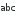
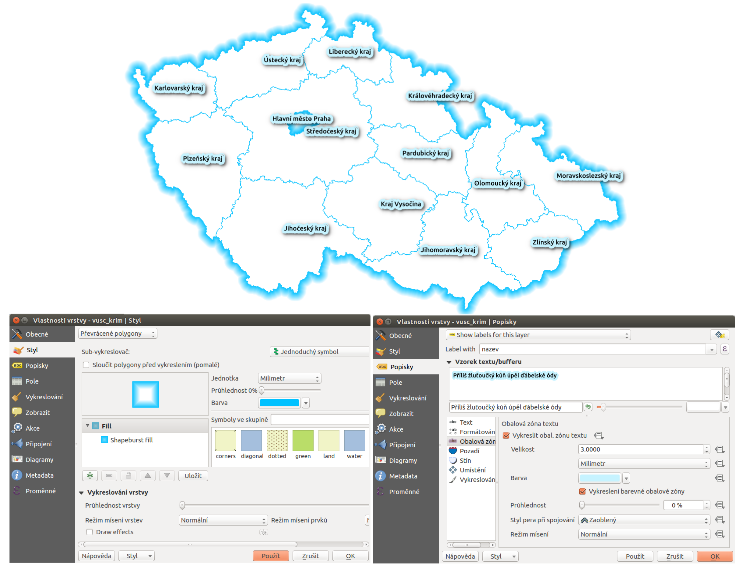
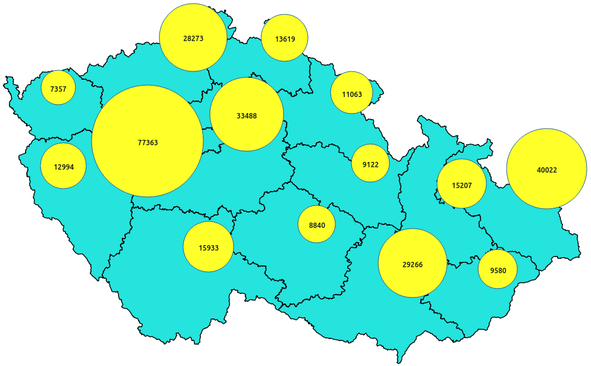
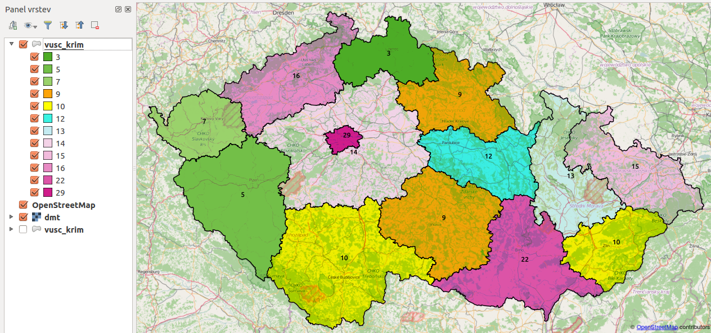
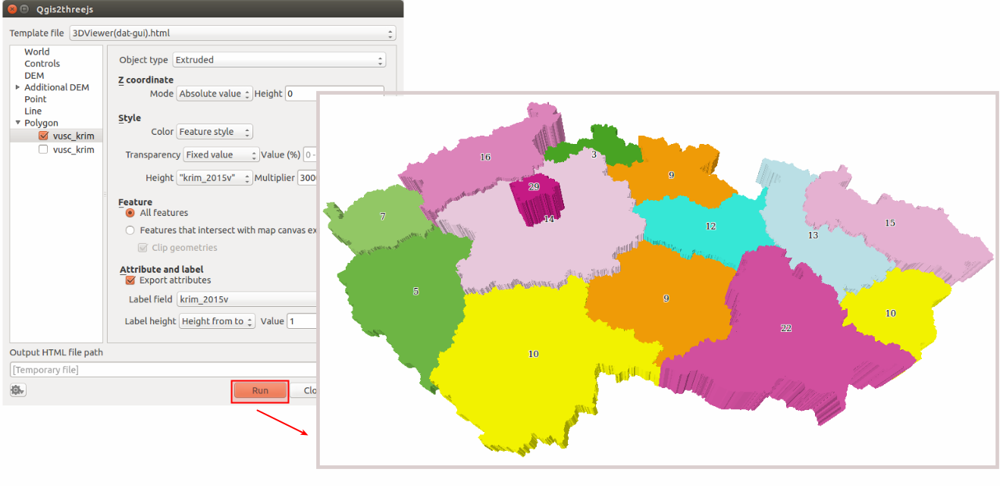

.. |diagram| image:: ../images/icon/diagram.png
   :width: 1.5em
.. |box_no| image:: ../images/icon/checkbox_unchecked.png
   :width: 1.5em
.. |box_yes| image:: ../images/icon/checkbox.png
   :width: 1.5em

.. |plus| image:: ../images/icon/mActionSignPlus.png
   :width: 1.5em
.. |minus| image:: ../images/icon/mActionSignMinus.png
   :width: 1.5em
.. |expression| image:: ../images/icon/mIconExpression.png
   :width: 1.5em

.. |q2t| image:: ../images/icon/q2t.png
   :width: 1.5em

Znázornenie diagramov
---------------------

Medzi ďalšie možnosti patrí tvorba diagramov a grafov. QGIS nám umožňuje na 
základe dát vytvárať či už koláčové, textové alebo stĺpcové diagramy a následne 
ich zobrazovať v mape.

Mapa celkovej kriminality krajov ČR
===================================
    
Do mapového okna pridáme vektorovú vrstvu vyšších územných samosprávnych celkov
(:map:`vusc_krim`). Nastavíme štýl, napr. na :num:`#cr-styl` je typ vrstvy 
symbolu nastavený na ``Shapeburst fill``, ide o ``Prevrácené polygóny`` s farbami
prechodu ``modrá`` a ``biela`` s nastaveným tieňovaním do vzdialenosti
5 mm. Popisky predstavujú názvy jednotlivých samosprávnych celkov 
(:dbcolumn:`nazev`), ich veľkosť je nastavná na ``10``, povolená je svetlomodrá 
obalová zóna s veľkosťou ``3 mm`` a umiestnenie je okolo centroidu.

.. _cr-styl:

        
   Vyššie územné samosprávne celky Českej republiky.

Pravým kliknutím na mapu v paneli vrstiev zvolíme 
:item:`Otevrít atributovou tabulku` a prezrieme stĺpce a hodnoty v atribútovej 
tabuľke. Nájdeme tam údaje o kriminalite v Českej republike (zdroj:
`Dátová stránka <http://www.mapakriminality.cz/#tabulky>`_). Konkrétnejšie, 
stĺpec :dbcolumn:`krim_2015c` obsahuje údaje o počte celkovej kriminality 
v jednotlivých samosprávnych celkoch Českej republiky od januára 2014 do 
januára 2015 a stĺpec s názvom :dbcolumn:`krim_2015v` predstavuje počet vrážd 
pre to isté obdobie. Tieto údaje pridáme do mapy vo forme diagramov.

V dialógovom okne *Vlastnosti vrstvy* (pravé tlačidlo myši na mapu a voľba 
:item:`Vlastnosti`) zvolíme záložku |diagram| :sup:`Diagramy`. Zobrazia sa 
nastavenia súvisiace s ich tvorbou.

V prvom kroku zaklikneme |box_no| :sup:`Show diagrams for this 
layer`. Potom vyberieme typ diagramu, pričom môže ísť o 
|pie-chart| :sup:`Koláčový graf`, |text| :sup:`Textový diagram` alebo 
|histogram| :sup:`Histogram`. V rámci tohto okna je možné nastaviť jeho vzhľad, 
formát, viditeľnosť, tlačidlami |plus| a |minus| sa dá pridávať, resp. uberať 
zobrazované atribúty, tlačidlom |expression| možno definovať atribút založený 
na výraze. Na :num:`#d-pie` sú kombináciou koláčového grafu a textového diagramu
znázornené informácie o celkovej kriminalite pre jednotlivé vyššie územné 
samosprávne celky Českej republiky. Je to jeden z najjednoduchších spôsobov
takejto reprezentácie dát (zobrazujeme len jeden atribút).

.. _d-pie:

        
   Celková kriminalita vyšších územných samosprávnych celkov Českej republiky.

Ďalším spôsobom je zobrazenie pomocou pluginu *QGIS2threejs*. Pôjde o informácie
o počte vrážd pre jednotlivé samosprávne kraje (atribút :dbcolumn:`krim_2015v`)
za rok 2015. 

.. note:: Tento plugin sa dá spustiť, len ak je prítomná rastrová vrstva 
	  digitálneho modelu terénu, preto netreba zabudnúť do mapového okna 
	  pridať rastrovú vrstvu :map:`dmt`.

Nastavíme štýlovanie vrstiev, t.j. |catsymbol| :sup:`Kategorizovaný symbol` pre hodnoty
o počte vrážd za rok 2015. Pomocou :menuselection:`Web --> OpenLayers Plugin`
pridáme do mapového okna napríklad aj vrstvu :map:`OpenStreetMap`. Výsledok môže
vyzerať ako to znázorňuje :num:`cr-graf-osm`. 

.. _cr-graf-osm:

        
   Počet vrážd pre vyššie územné samosprávne celky Českej republiky.

V dialógovom okne zásuvného modulu |q2t| :sup:`Qgis2threejs` na zobrazovanie dát 
v prostredí web-u nastavíme v záložke ``World`` rozsah, mierku, farbu pozadia, 
typ zobrazovaných súradníc, ... v záložke ``DEM`` predovšetkým vstupný 
digitálny model terénu, prípadne rozlíšenie či nastavenie transparentnosti a 
nakoniec v záložke ``Polygon`` použijeme vrstvu :map:`vusc_krim` a jej atribút 
:dbcolumn:`krim_2015v` prenásobený hodnotou napr. ``3000``. 
Potvrdíme stlačením :item:`Run` a počkáme na automatické otvorenie výsledku 
vo webovom prehliadači. Tu môžeme zapínať, resp. vypínať vrstvy, meniť 
transparentnosť ako vrstiev, tak pozadia, viď. :num:`cr-graf-g2t`.

.. _cr-graf-g2t:

        
   Počet vrážd pre vyššie územné samosprávne celky Českej republiky.

