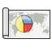
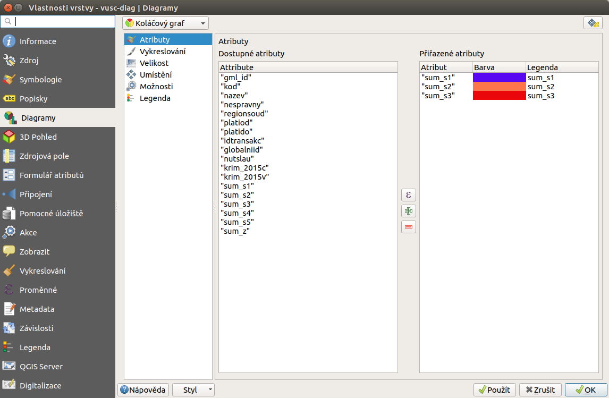
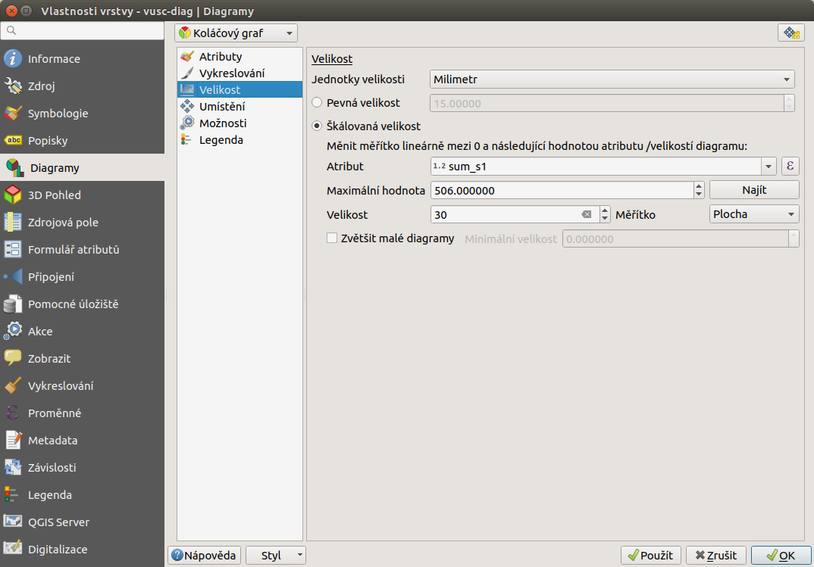
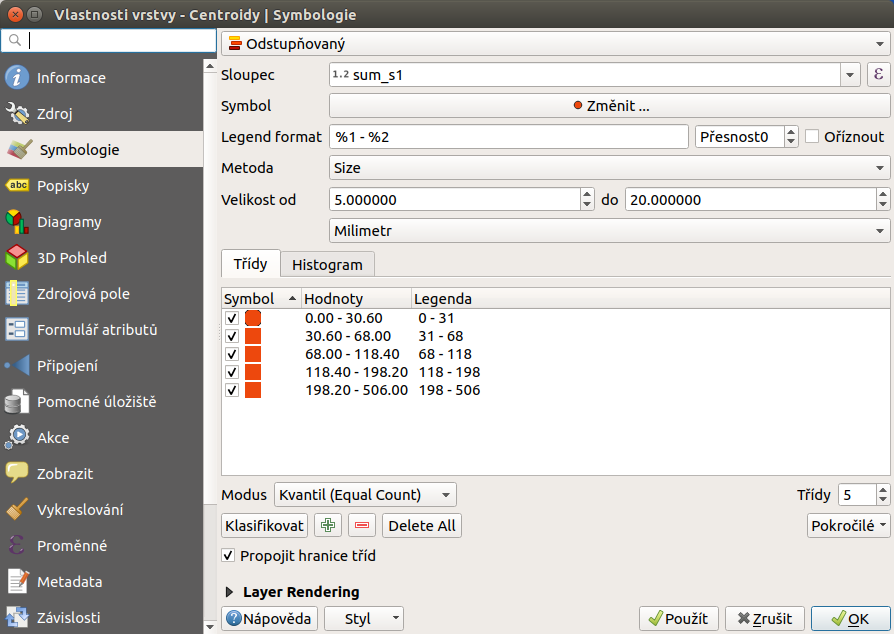

.. |histogram| image:: ../images/icon/histogram.png
   :width: 1.5em

.. |plus| image:: ../images/icon/mActionSignPlus.png
   :width: 1.5em
.. |minus| image:: ../images/icon/mActionSignMinus.png
   :width: 1.5em
.. |expression| image:: ../images/icon/mIconExpression.png
   :width: 1.5em
.. |q2t| image:: ../images/icon/q2t.png
   :width: 1.5em

.. |centroids| image:: ../images/icon/centroids.png
   :width: 1.5em

Tvorba kartodiagramů
--------------------
Záložka |diagram|:sup:`Diagramy`
================================
Kromě přípravy dat pro mapové výstupy pomocí základní symbologie, lze na základě hodnot atributů jednotlivých prvků vytvářet také diagramy. K tomu slouží záložka |diagram|:sup:`Diagramy` ve vlastnostech vektorové vrstvy.

   Okno nastavení diagramů

V první řadě musíme z rolovací nabídky vybrat typ diagramu. Na výběr máme ze 3 typů:

- |pie-chart| :sup:`Koláčový graf`
- |text| :sup:`Textový diagram`
- |histogram| :sup:`Histogram`

Poté je nutné pomocí tlačítek |plus| a |minus| vybrat ze seznamu jeden či více atributů, které chceme do diagramů přiřadit resp. odebrat. Atributy lze hromadně označit pomocí káves :item:`Ctrl` a :item:`Shift` a také jednotlivě přidávat poklikáním. Pomocí tlačítka |expression| je možné definovat atribut založený na výrazu. Poklikáním na již přiřazené atributy, můžeme editovat jejich požadované vlastnosti -- nadefinovat výraz, změnit barvu a popisek legendy.

   Okno nastavení diagramů

Kromě volby atributů můžeme v dalších záložkách měnit základní parametry vzhledu, velikosti, umístění atd. U možností |pie-chart| :sup:`Koláčový graf` a |text| :sup:`Textový diagram` můžeme rovnou použít přednastavené hodnoty, při použití |histogram| :sup:`Histogram` je nutné nastavit alespoň atribut pro výpočet velikosti sloupečků. Ve všech třech případech je však pro lepší vzhled a interpretaci dat vhodné vlastnosti poupravit. Práce s nastavením vlastností je intuitivní a až na malé odchylky u všech typů stejná.

Za zmínku stojí záložka |transparency|:sup:`Velikost` kde můžeme zvolit buď velikost pevnou, nebo velikost diagramu škálovat na základě atributu nebo výrazu (pokud potřebujeme stanovit velikostní kategorie, je tento přístup trochu komplikovanější). U zobrazení histogramu se škálování týká velikosti sloupečků a je nutné ho nastavit.

   Nastavení velikosti diagramů

Slabší stránkou této metody je zatím generování legendy, a to zejména při použití škálování. Pro finální mapový výstup je však možné vytvořit sofistikovanější legendu v grafickém (Gimp) nebo vektorovém (Inkscape) editoru.

.. figure:: images/diag_legend.png 
   :class: small 
   :scale-latex: 40 

   Automaticky generovaná legenda

Příklady tvorby kartodiagramů
^^^^^^^^^^^^^^^^^^^^^^^^^^^^^
|pie-chart| :sup:`Koláčový graf`
********************************

.. figure:: images/diag_pie.png
   :class: middle
        
   Podíl dálnic, silnic I. a II. třídy v krajích.

|text| :sup:`Textový diagram`
*****************************

        
   Délka dálnic, silnic I. a II. třídy v krajích.

        
   Součet délky dálnic v krajích.

.. figure:: images/diag_text3.png
   :class: middle
        
   Součet délky dálnic v krajích.

|histogram| :sup:`Histogram`
****************************

.. figure:: images/diag_hist.png
   :class: middle
        
   Podíl dálnic, silnic I. a II. třídy v krajích.

Další příklady využití QGIS v tematické kartografii
===================================================
Použití stylu vrstvy
^^^^^^^^^^^^^^^^^^^^
Jednoduché kartogramy se škálováním velikosti podle jednoho atributu lze vytvořit pomocí odstupňovaného stylu bodové vrstvy, kde lze zvolit metodu odstupňování pro velikost. Takovou vrstvu si můžeme z polygonové vrstvy vytvořit například vygenerováním centroidů (|centroids|:sup:`Centroidy polygonů`). Výhodou je, že můžeme pohodlně definovat jednotlivé kategorie, vygeneruje se nám odpovídající legenda a pomocí editace bodové vrstvy, můžeme body jednoduše posunovat podle potřeby.

        
   Nastavení stylu bodové vrstvy.

.. figure:: images/diag_styl.png
   :class: middle
        
   Součet délky dálnic v krajích.

Použití pluginu Cartogram
^^^^^^^^^^^^^^^^^^^^^^^^^
Pomocí pluginu Cartogram lze vytvořit geografickou anamorfózu, kdy se rozloha polygonu deformuje na základě daného atributu.

.. figure:: images/diag_anamor.png
   :class: middle
        
   Anamorfóza na základě celkové kriminality v krajích.

Použití pluginu Qgis2threejs
^^^^^^^^^^^^^^^^^^^^^^^^^^^^
Pomocí pluginu Qgis2threejs lze vytvářet spojité i nespojité povrchy. Tvorbou spojitých povrchů (3D model) se věnuje podkapitola `Zobrazování ve 3D <http://training.gismentors.eu/qgis-zacatecnik/rastrova_data/zobrazovani_3D.html>`_ v materiálech pro Školení QGIS pro začátečníky.

        
   Nastavení pro vytvoření nepsojitého povrchu pomocí pluginu |q2t|:sup:`Qgis2threejs`.

.. figure:: images/diag_qgis2threejs2.png
   :class: middle
        
   Nespojitý povrch vyjadřující celkovou míru kriminality v krajích.

