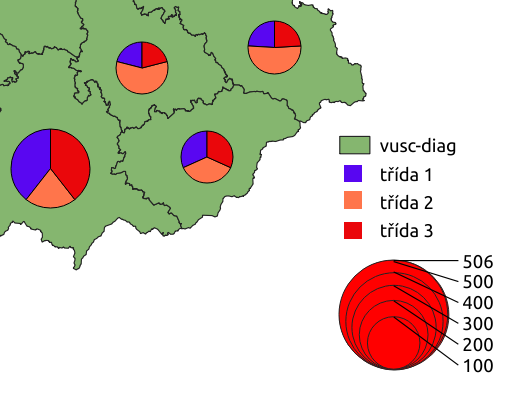

.. |q2t| image:: ../images/icon/q2t.png
   :width: 1.5em

Tvorba kartodiagramů
--------------------
Záložka |diagram|:sup:`Diagramy`
================================
Kromě přípravy dat pro mapové výstupy pomocí základní symbologie, lze na
základě hodnot atributů jednotlivých prvků vytvářet také diagramy. K tomu
slouží záložka |diagram|:sup:`Diagramy` ve vlastnostech vektorové vrstvy.

.. figure:: images/diag_okno.png 
   :class: middle 
   :scale-latex: 40 

   Okno nastavení diagramů.

V první řadě musíme z rolovací nabídky vybrat typ diagramu. Na výběr máme ze 3
typů:

- |pie-chart| :sup:`Koláčový graf`
- |text| :sup:`Textový diagram`
- |histogram| :sup:`Histogram`

Poté je nutné pomocí tlačítek |mActionSignPlus| a |mActionSignMinus| vybrat ze
seznamu jeden či více atributů, které chceme do diagramů přiřadit resp.
odebrat. Atributy lze hromadně označit pomocí káves :kbd:`Ctrl` a :kbd:`Shift`
a také jednotlivě přidávat poklikáním. Pomocí tlačítka |mIconExpression| je
možné definovat atribut založený na výrazu. Poklikáním na již přiřazené
atributy, můžeme editovat jejich požadované vlastnosti -- nadefinovat výraz,
změnit barvu a popisek legendy.

.. figure:: images/diag_okno2.png 
   :class: middle 
   :scale-latex: 40 

   Výběr atributů zobrazovaných v diagramech.

Kromě volby atributů můžeme v dalších záložkách měnit základní parametry
vzhledu, velikosti, umístění atd. U možností |pie-chart| :sup:`Koláčový graf`
a |text| :sup:`Textový diagram` můžeme rovnou použít přednastavené hodnoty, při
použití |histogram| :sup:`Histogram` je nutné nastavit alespoň atribut pro
výpočet velikosti sloupečků. Ve všech třech případech je však pro lepší vzhled
a interpretaci dat vhodné vlastnosti poupravit. Práce s nastavením vlastností
je intuitivní a až na malé odchylky u všech typů stejná.

Za zmínku stojí záložka |transparency|:sup:`Velikost` kde můžeme zvolit buď
velikost pevnou, nebo velikost diagramu škálovat na základě atributu nebo
výrazu (pokud potřebujeme stanovit velikostní kategorie, je tento přístup
trochu komplikovanější). U zobrazení histogramu se škálování týká velikosti
sloupečků a je nutné ho nastavit.

.. figure:: images/diag_velik.png 
   :class: middle 
   :scale-latex: 40 

   Nastavení velikosti diagramů.
   
Pracovat s umístěním diagramů je možné pomocí nastavení v záložce
:item:`Umístění`, které funguje podobně jako umisťování popisků.
Nejdůležitější však je, že pozice může být upravována manuálně pomocí panelu.
Nastavení se může ukládat buď do dané vrstvy jako nové atributy, nebo je možné
je ukládat do souborové databázy daného projektu.

.. figure:: images/diag_position.png 
   :class: middle 
   :scale-latex: 40 

   Nastavení umísťování diagramů.
   

   Nástroje pro interaktivní umísťování popisků.
     
Pokud potřebujeme vygenerovat legendu pro diagram, tak je zapotřebí nastavit
víc detailů. Prvním je nastavení korektních popisků v záložce :item:`Atributy`.
To nám zaručí korektní vykreselní barevného symbolu a správného popisku v
legendě.
Pokud používáme nastavení velikosti, tak je vhodné do legendy uvést také
rozměrové symboly pro porovnání se symboly použitými v mapovém okně.
Toto nastavení je dostupné  v záložce :item:`Legenda` pod tlačítkem
:item:`Data-defined Size Legend`.

.. figure:: images/diag_size_legend.png 
   :class: small 
   :scale-latex: 40 

   Nastavení legendy velikosti symbolů grafu pro mapový výstup. 

Pro finální mapový výstup je však možné vytvořit sofistikovanější legendu v
grafickém (Gimp) nebo vektorovém (Inkscape) editoru.

   Automaticky generovaná legenda s definicí velikosti.

Příklady tvorby kartodiagramů
^^^^^^^^^^^^^^^^^^^^^^^^^^^^^
|pie-chart| :sup:`Koláčový graf`
********************************

.. figure:: images/diag_pie.png
   :class: middle
        
   Podíl dálnic, silnic I. a II. třídy v krajích.

|text| :sup:`Textový diagram`
*****************************

.. figure:: images/diag_text.png
   :class: middle
        
   Délka dálnic, silnic I. a II. třídy v krajích.

.. figure:: images/diag_text2.png
   :class: middle
        
   Součet délky dálnic v krajích.

        
   Součet délky dálnic v krajích.

|histogram| :sup:`Histogram`
****************************

.. figure:: images/diag_hist.png
   :class: middle
        
   Podíl dálnic, silnic I. a II. třídy v krajích.

Další příklady využití QGIS v tematické kartografii
===================================================
Použití stylu vrstvy
^^^^^^^^^^^^^^^^^^^^
Jednoduché kartogramy se škálováním velikosti podle jednoho atributu lze
vytvořit pomocí odstupňovaného stylu bodové vrstvy, kde lze zvolit metodu
odstupňování pro velikost. Takovou vrstvu si můžeme z polygonové vrstvy
vytvořit například vygenerováním centroidů (|mAlgorithmCentroids|
:sup:`Centroidy...`).
Výhodou je, že můžeme pohodlně definovat jednotlivé kategorie a vygeneruje
se nám odpovídající legenda.

.. figure:: images/diag_styl_okno.png
   :class: middle
        
   Nastavení stylu bodové vrstvy.

.. figure:: images/diag_styl.png
   :class: middle
        
   Součet délky dálnic v krajích.

Použití pluginu ctogram3ram
^^^^^^^^^^^^^^^^^^^^^^^^^^^
Pomocí pluginu Cartogram lze vytvořit geografickou anamorfózu, kdy se rozloha
polygonu deformuje na základě daného atributu.

        
   Anamorfóza na základě celkové kriminality v krajích.

Zobrazení dat ve 3D na základě charakteristiky
^^^^^^^^^^^^^^^^^^^^^^^^^^^^^^^^^^^^^^^^^^^^^^
Vyobrazit kvalitativní nebo kvantitativní charakteristiku pomocí 3D zobrazení
je častým způsobem vyjádřování. Díky nativnímu zobrazování ve 3D mapovém okně
se dá toto jednoduše zobrazit.

Vykreslování prvků ve 3D prozatím není propojené se standardní symbologii a
prozatím ani nenabízí odpovídající možnosti.
V záložce :item:`3D Pohled` je možné nastavit zdroj generování "výšky objektů",
tzv. extruze.
V našem případě využijeme napojení na existující sloupec, který obsahuje
hodnoty pro jednotlivé prvky dané vrstvy. (vrstva :kbd:`vusc_krim`, atribut 
:kbd:`krim_2015c`).
Ostatní nastavení již záleží na požadavcích uživatele.

