.. |box_yes| image:: ../images/icon/checkbox.png
   :width: 1.5em
.. |npicon| image:: ../images/icon/np_plugin_icon.png
   :width: 1.5em

Vytvorenie zásuvného modulu
---------------------------

Zásuvné moduly, tzv. :wikipedia:`pluginy <https://en.wikipedia.org/wiki/Plug-in_(computing)>` predstavujú doplnkové moduly a ich úlohou je 
rozširovať funkčnosť a širokú škálu použitia QGIS. Úvod a predstavenie tejto 
problematiky je súčasťou Školenia pre začiatočníkov ako kapitola QGIS pluginy, 
kde sa okrem iného píše, že v súčasnosti existuje pre QGIS viac než 300 
zásuvných modulov napísaných v programovacom jazyku `Python 
<https://www.python.org/>`_ alebo `C++ <https://isocpp.org/>`_.

V mnohých prípadoch však môže nastať situácia, kedy ani jeden z existujúcich 
zásuvných modulov nespĺňa funkcionalitu akú by sme práve potrebovali. 
Úroveň rozširovania funkcionality QGIS sa líši. Za pomoci jazyka Python môže 
ísť o pridanie jednoduchého tlačidla až po tvorbu sofistikovaných nástrojov.
V nasledujúcej časti načrtneme návod ako si vlastný plugin vytvoriť 
a postup následne odskúšame na jednoduchom reálnom príklade. Vytvoríme zásuvný 
modul s názvom *Save Views*, ktorý exportuje grafický výstup vo forme `*.png` 
pre každý prvok vo vybranej vektorovej vrstve do zvoleného adresára. 

Potrebné nástroje
=================

I. Qt Creator
^^^^^^^^^^^^^

Pri tvorbe nového pluginu budeme potrebovať `Qt Creator <https://wiki.qt.io/Category:Tools::QtCreator>`_, čo je aplikácia vývojového framework-u s názvom **Qt**. 
Túto aplikáciu využijeme pri tvorbe užívateľského rozhrania nového modulu. 

II. Python 'bindings' pre Qt
^^^^^^^^^^^^^^^^^^^^^^^^^^^^

Vzhľadom k tomu, že budeme vyvíjať plugin v programovacom jazyku Python, musíme
nainštalovať niečo ako *python väzby pre Qt*. Pre tvorbu zásuvných modulov je 
potrebný ``pyrcc4``. Spôsob inštalácie sa v tomto 
prípade líši od platformy.
Na Windows možno stiahnuť inštalátor 
`OSGeo4W <http://trac.osgeo.org/osgeo4w/>`_, vybrať *Express Desktop* inštalátor 
a nainštalovať balík **QGIS**. Po inštalácii je nástroj `pyrcc4` prístupný cez 
*OSGeo4W Shell*.
Pre Mac OS je potrebné nainštalovať `Homebrew <http://brew.sh>`_ správcu balíčkov
a nainštalovať **PyQt** balíček. 
V prípade Linux-u je dôležitý **python-qt4** balíček. Pre Ubuntu ho dostaneme 
spustením príkazu ``sudo apt-get install python-qt4`` v príkazovom riadku.

III. Textový editor
^^^^^^^^^^^^^^^^^^^

Správny textový editor alebo integrované vývojové prostredie (IDE) sú dôležité 
pri písaní kódu. Medzi obľúbené editory patria 
napríklad *Sublime Text, Vim, Emacs, Notepad++, TextWrangler, IDLE, Atom, 
Aquamacs, GNU Nano, Kate, gedit* a podobne.

IV. Zásuvný modul Plugin Builder
^^^^^^^^^^^^^^^^^^^^^^^^^^^^^^^^

Tento veľmi užitočný zásuvný modul nám vytvorí všetky potrebné súbory a 
štandardnú podobu kódu pre budúci plugin. Nainštalujeme ho klasickým spôsobom
pomocou správcu zásuvných modulov, viď. 
`Správca zásuvných modulov <http://training.gismentors.eu/qgis-zacatecnik/ruzne/qgis_pluginy.html#spravce-zasuvnych-modulu>`_

V. Zásuvný modul Reloader plugin
^^^^^^^^^^^^^^^^^^^^^^^^^^^^^^^^
Vďaka tomuto pluginu nemusíme pri každej zmene kódu reštartovať QGIS. Zmeny sa
prejavia po jeho spustení.

Päť základných krokov pre vytvorenie pluginu Save Views
======================================================

:ref:`1.<krok1>` 
Spustenie zásuvného modulu *Plugin Builder* a vyplnenie dialógu

:ref:`2.<krok2>` 
Kompilácia súboru *.qrc príkazom `make` (vlastne spustenie pyrcc4)

:ref:`3.<krok3>` 
Načítanie nového pluginu v správcovi zásuvných modulov

:ref:`4.<krok4>` 
Vytvorenie užívateľského rozhrania pomocou Qt Creator

:ref:`5.<krok5>` 
Pridanie logiky pomocou python kódu a ďalšie úpravy

.. _krok1:

1. Spustenie zásuvného modulu *Plugin Builder* a vyplnenie dialógu
^^^^^^^^^^^^^^^^^^^^^^^^^^^^^^^^^^^^^^^^^^^^^^^^^^^^^^^^^^^^^^^^^^
Po spustení zásuvného modulu na tvorbu pluginov sa objaví dialógové okno, kde 
zadáme základné údaje o našom novom plugine, viď. :num:`#plugin-builder`.
Potom prejdeme tlačidlom `Next` na ďalšie okno, kde vyplníme bližšie informácie
*About*. V tretej časti definojeme template ako `Tool button with dialog`,
zadáme text, ktorý sa bude zobrazovať v menu a nakoniec vyberieme, pod ktorou
položkou v menu náš nový plugin používateľ nájde, napríklad `Vector`.
V ďalších intuitívnych krokoch je možné ovplyvniť vytvorenie niektorých súborov, 
vyplniť povinné a odporúčané informácie napríklad o domovskej stránke, 
repozitári modulu, označiť plugin ako experimentálny a podobne.

Následne sa objaví okno, kde je potrebné zadať cestu, kde bude adresár so 
všetkými súbormi uložený (:num:`#plugin-dir`). Treba nájsť adresár `.qgis2/python/plugins`. Jeho 
umiestnenie sa líši od platformy. 

.. _plugin-builder:

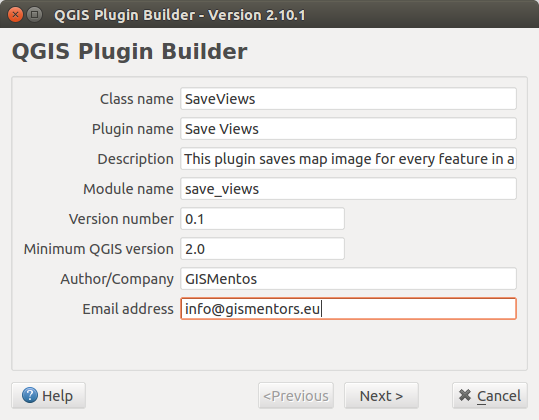

   Dialógové okno zásuvného modulu na tvorbu pluginov.

.. _plugin-dir:

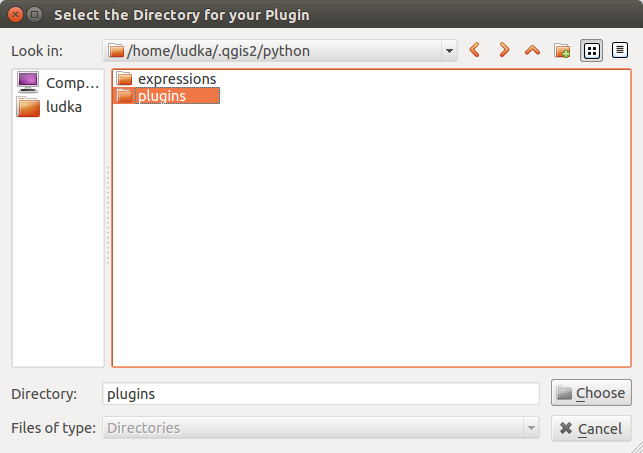

   Adresár obsahujúci všetky nainštalované zásuvné moduly QGIS.

Po tomto kroku dostaneme potvrdzujúci dialóg, tzv. `Plugin Builder Results`
so súhrnom rôznych informácií.

.. _krok2:

2. Kompilácia
^^^^^^^^^^^^^

V termináli prejdeme do adresára, kde bol plugin SaveViews vytvorený,
napríklad pre Linux pomocou ``cd .qgis2/python/plugins/SaveViews/`` a spustíme
``make``. Tento príkaz vlastne spustí vyššie spomenutý `pyrcc4`.

.. _krok3:

3. Načítanie nového pluginu v správcovi zásuvných modulov
^^^^^^^^^^^^^^^^^^^^^^^^^^^^^^^^^^^^^^^^^^^^^^^^^^^^^^^^^

Po reštarte QGIS je v :menuselection:`Plugins --> Manage and Install plugins`
viditeľný aj plugin *Save Views*. Zaškrtnutím |box_yes| sa jeho ikona 
|npicon| objaví v hlavnej lište a ako sme zadali, nájdeme ho aj pod
položkou `Vector` (:num:`#plugin-menu`).

.. _plugin-menu:

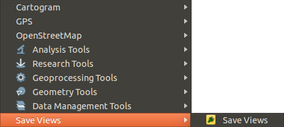

   Nový plugin dostupný pod položkou *Vector*.

Spustením otvoríme okno, ktoré obsahuje tlačidlá `Cancel` a `OK` 
(:num:`#plugin-dlg`). 

.. _plugin-dlg:

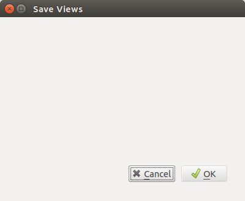

   Dialógové okno modulu *Save Views* po prvom spustení.

.. tip::

	V tejto fáze je dobré premyslieť si, akú funkcionalitu by plugin mal 
	a nemal mať, aký bude typ vstupných dát a podobne. Jednoducho je 
	potrebné plugin priebežne počas vývoja testovať.

Vytvoríme si jednoduchý projekt v QGIS, ktorý bude obsahovať pár vektorových 
vrstiev. Na :num:`#np-project` sú zobrazené napríklad požiarne stanice, 
železnice, kraje Českej republiky, veľkoplošné územia a štátna hranica. 

.. _np-project:

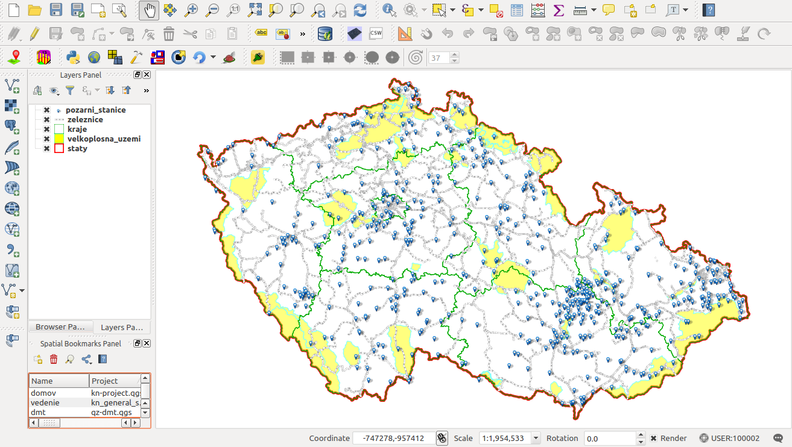

   Príklad projektu s vektorovými vrstvami v QGIS.

.. _krok4:

4. Vytvorenie užívateľského rozhrania pomocou *Qt Creator*
^^^^^^^^^^^^^^^^^^^^^^^^^^^^^^^^^^^^^^^^^^^^^^^^^^^^^^^^^^

Vzhľad a elementy dialógového okna pluginu vieme customizovať vďaka aplikácii
Qt Creator. V hlavnej lište prejdeme na :menuselection:`File --> Open File or Project` a otvoríme súbor `*.ui`, v našom prípade `save_views_dialog_base.ui`, ktorý 
nájdeme v adresári vytváraného pluginu. Na :num:`#qtcreator` je znázornené
zatiaľ prázdne okno s objektami `SaveViewsDialogBase` a `button_box`. Spôsobom 
`drag-and-drop` je možné z ľavého panelu pridávať ďalšie objekty a ich názvy 
a vlastnosti meniť v pravej časti okna aplikácie *Qt Creator*.

.. _qtcreator:

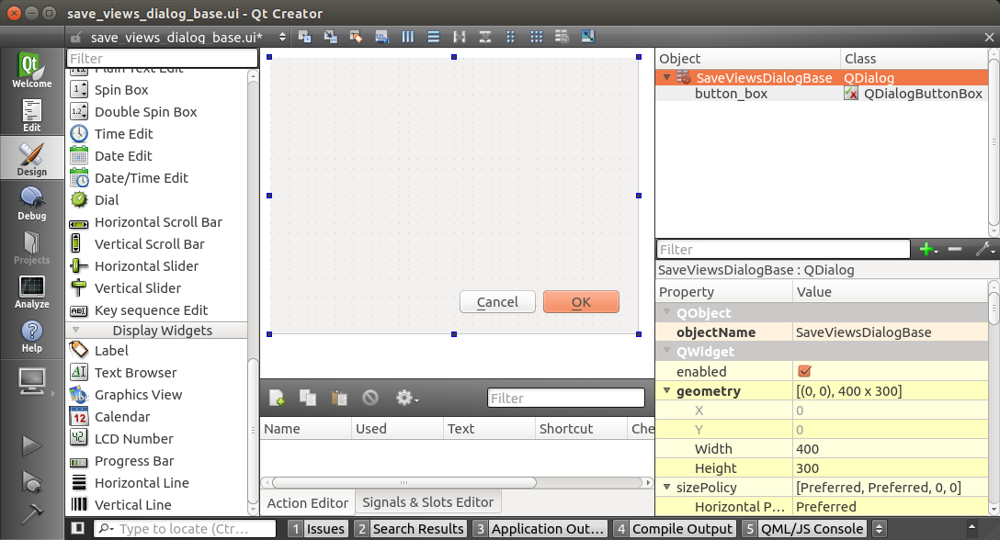

   Dialógové okno vytváraného pluginu v prostredí aplikácie *Qt Creator*.

Prvé dva objekty, ktoré pridáme budú tzv. *Combo Box* z kategórie *Input Widgets*
a tzv. *Label* z kategórie *Display Widgets*. V pravom paneli predvolený text 
objektu *label* zmeníme na `Select a layer` (:num:`#qtlabel`). 

.. _qtlabel:

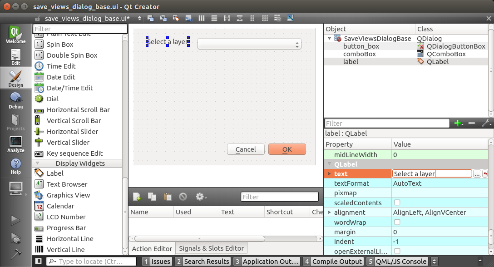

   Editácia objektov dialógového okna.

Po uložení súboru `*.ui` cez :menuselection:`File --> Save "save_views_dialog_base.ui"` prejdeme do prostredia QGIS, kde použijeme plugin *Plugin Reloader*. V 
`Configure Plugin reloader` nastavíme `SaveViews` (:num:`#qt-plugin-reloader`) 
a plugin spustíme. Po kliknutí na ikonu `Save Views` sa otvorí okno totožné 
s návrhom na :num:`#qtlabel`.

.. _qt-plugin-reloader:

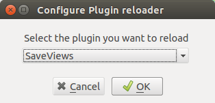

   Konfigurácia zásuvného modulu *Plugin Reloader*.

.. _krok5:

5. Pridanie logiky pomocou python kódu a ďalšie úpravy
^^^^^^^^^^^^^^^^^^^^^^^^^^^^^^^^^^^^^^^^^^^^^^^^^^^^^^

Povedzme, že chceme, aby sa po spustení pluginu *Combo Box* automaticky naplnil 
vektorovými vrstvami aktuálneho projektu. Hlavným súborom, ktorý sa stará 
o logiku jednotlivých objektov je python kód, v našom prípade súbor 
`save_views.py`. Otvoríme ho v textovom editore a nájdeme metódu `run(self)`.
Táto metóda je spustená pri každom štarte pluginu. Pod jej prvý riadok 
(:num:`#np-run-method`) umiestnime nasledujúci kód. 

.. code::

	# populate the Combo Box with the layers loaded in QGIS
        self.dlg.comboBox.clear()
        layers = self.iface.legendInterface().layers()
        layer_list = []
        for layer in layers:
            layer_list.append(layer.name())
        self.dlg.comboBox.addItems(layer_list)

.. _np-run-method:

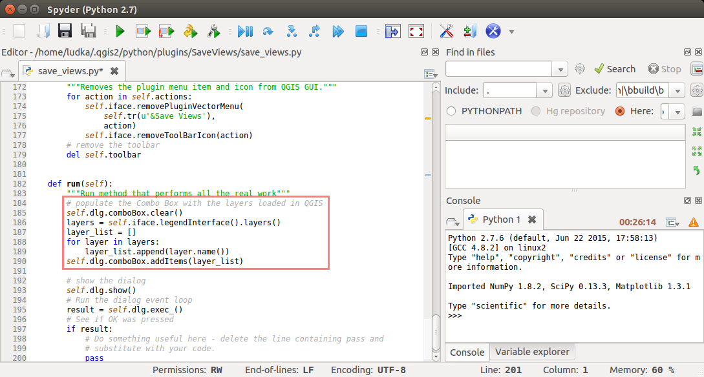

   Editácia python súboru s cieľom naplniť *Combo Box* vektorovými vrstvami.

Na :num:`#np-cb-filled` je vidieť, že po novom spustení *Save Views* sa 
zmeny prejavia.

.. _np-cb-filled:

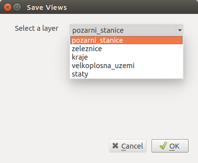

   Vzhľad dialógového okna po zmenách v python kóde.

Obdobne pridáme do okna ďalšie elementy a priradíme im príslušnú funkcionalitu.
Okrem popisu `Select output directory` pôjde o objekty `Line Edit` a `Tool Button`.
Pre `button_box` vo vlastnostiach zmeníme tlačidlo `OK` na `Save All`, 
nastavíme primerané rozmery pre každý element a nový `*.ui` súbor uložíme.
Dôležité je všimnúť si názvy jednotlivých objektov, viď. :num:`#np-final-dlg`, 
pretože ich budeme ešte potrebovať.

.. _np-final-dlg:

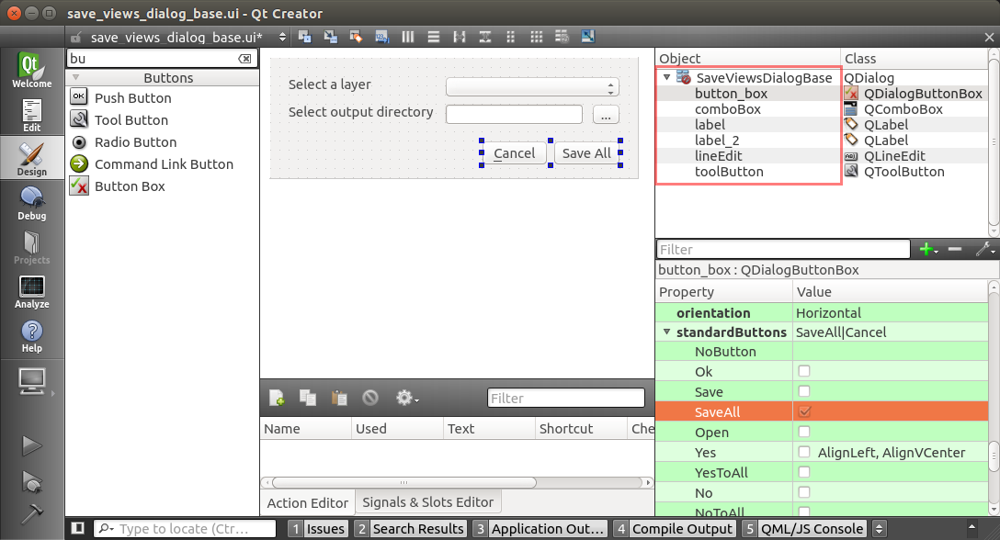

   Finálny návrh dialógového okna pluginu *Save Views* a jeho objekty.

.. note:: Pri viacerých objektoch je lepšie názvy objektov premenovať. Pre 
	  náš jednoduchý modul si vystačíme s tými predvolenými.

V ďalšom kroku opäť editujeme súbor `save_views.py`. Potrebujeme pridať kód, 
ktorý zabezpečí, aby sa po kliknutí na tlačidlo `...` otvoril prehliadač, v ktorom
zvolíme adresár na uloženie výsledných obrazových súborov `.png` pre každý 
prvok vo vybranej vektorovej vrstve.
O túto funkcionalitu sa postará metóda `select_output_directory`. Pridáme ju 
napríklad nad metódu `run` (:num:`#select-output-dir`). 

.. code::

	# open directory browser and populate the line edit widget 
    	def select_output_dir(self):
	    self.dirname = QFileDialog.getExistingDirectory(self.dlg, "Select directory ","/home")
            self.dlg.lineEdit.setText(self.dirname)	

.. _select-output-dir:

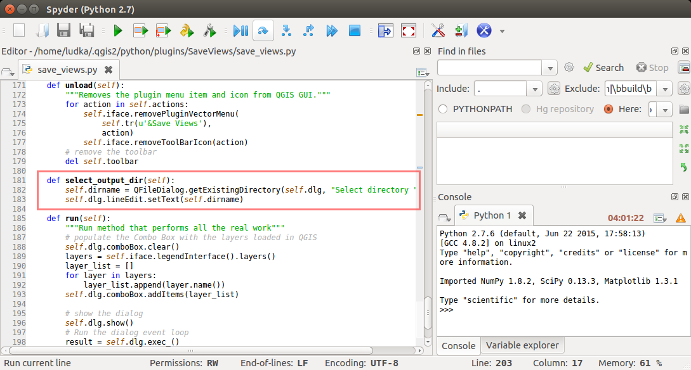

   Metóda, ktorá spustí prehliadač na výber adresára pre výsledky.
 
.. note:: Do listu *import* na začiatku súboru je nutné pridať `QFileDialog`
	  ako ``from PyQt4.QtGui import QAction, QIcon, QFileDialog``.

Následne prepojíme metódu `select_output_dir` s tlačidlo *pushButton* (tlačidlo `...`)
pridaním týchto riadkov do metódy `__init__`, súbor uložíme, plugin reštartujeme 
a vyskúšame (:num:`#np-skuska-1`). 

.. code::

	# clear the previously loaded text (if any) in the line edit widget 
        self.dlg.lineEdit.clear()
	# connect the select_output_file method to the clicked signal of the tool button widget
        self.dlg.toolButton.clicked.connect(self.select_output_dir)

.. _np-skuska-1:

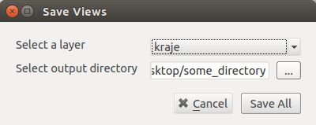

   Načítanie adresára pre grafické výstupy pomocou nového pluginu.

Posledným krokom je zmeniť to, aby sa po kliknutí na tlačidlo `Save all` naozaj
vykonalo to, čo chceme. Začneme importom `QColor` a `QPixmap`. Potom vyhľadáme
metódu `run` a nájdeme riadok obsahujúci ``pass``, ktorý nahradíme nasledujúcim
obsahom.

.. code::

	# save graphical output for every row in attribute table
        selectedLayerIndex = self.dlg.comboBox.currentIndex()
        selectedLayerName = self.dlg.comboBox.currentText()
        selectedLayer = layers[selectedLayerIndex]
        frame_count = 0

        for feature in selectedLayer.getFeatures():
            if frame_count < selectedLayer.dataProvider().featureCount():
                frame_count = selectedLayer.dataProvider().featureCount()
    
        if frame_count <= 1:
            print "Layer must have more than one feature!"
        else:               
            for feature in range(int(frame_count)):
                selection = [int(feature)]
                selectedLayer.setSelectedFeatures(selection)
                self.iface.mapCanvas().setSelectionColor(QColor("transparent"));
                box = selectedLayer.boundingBoxOfSelected()
                self.iface.mapCanvas().setExtent(box)
                pixmap = QPixmap(self.iface.mapCanvas().mapSettings().outputSize().width(),
                self.iface.mapCanvas().mapSettings().outputSize().height())
                mapfile = self.dirname + "/" + selectedLayerName + "_" + format(feature, "03d") + ".png"
                self.iface.mapCanvas().saveAsImage(mapfile, pixmap)
                selectedLayer.removeSelection()

            # save also full extend of vector layer                            
            canvas = self.iface.mapCanvas()
            canvas.setExtent(selectedLayer.extent())
            pixmap = QPixmap(self.iface.mapCanvas().mapSettings().outputSize().width(),
            self.iface.mapCanvas().mapSettings().outputSize().height())
            mapfile = self.dirname + "/" + selectedLayerName + "_full" + ".png"
            self.iface.mapCanvas().saveAsImage(mapfile, pixmap) 

.. _np-run-code:

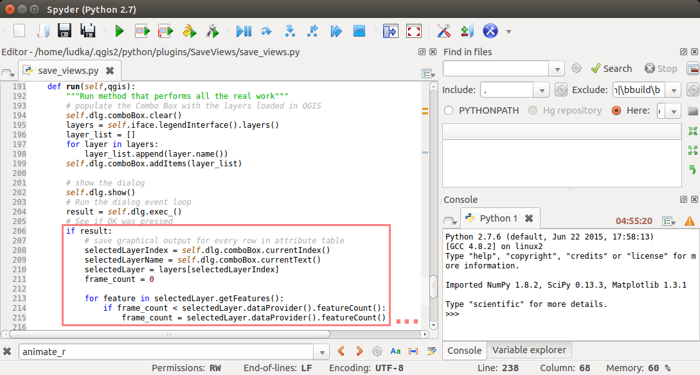

   Doplnenie kódu do metódy *run*.

Kompletný obsah výsledného súboru `save_views.py` je uvedený nižšie.

.. code::

        # -*- coding: utf-8 -*-
        """
        /***************************************************************************
         SaveViews
                                         A QGIS plugin
         This plugin saves map image for every feature in attribute table of vector layer.
                                      -------------------
                begin                : 2016-03-06
                git sha              : $Format:%H$
                copyright            : (C) 2016 by GISMentos
                email                : info@gismentors.eu
         ***************************************************************************/
        
        /***************************************************************************
         *                                                                         *
         *   This program is free software; you can redistribute it and/or modify  *
         *   it under the terms of the GNU General Public License as published by  *
         *   the Free Software Foundation; either version 2 of the License, or     *
         *   (at your option) any later version.                                   *
         *                                                                         *
         ***************************************************************************/
        """
        from PyQt4.QtCore import QSettings, QTranslator, qVersion, QCoreApplication
        from PyQt4.QtGui import QAction, QIcon, QFileDialog, QColor, QPixmap
        # Initialize Qt resources from file resources.py
        import resources
        # Import the code for the dialog
        from save_views_dialog import SaveViewsDialog
        import os.path
        from qgis.core import *
        
        
        class SaveViews:
            """QGIS Plugin Implementation."""
        
            def __init__(self, iface):
                """Constructor.
        
                :param iface: An interface instance that will be passed to this class
                    which provides the hook by which you can manipulate the QGIS
                    application at run time.
                :type iface: QgsInterface
                """
                # Save reference to the QGIS interface
                self.iface = iface
                # initialize plugin directory
                self.plugin_dir = os.path.dirname(__file__)
                # initialize locale
                locale = QSettings().value('locale/userLocale')[0:2]
                locale_path = os.path.join(
                    self.plugin_dir,
                    'i18n',
                    'SaveViews_{}.qm'.format(locale))
        
                if os.path.exists(locale_path):
                    self.translator = QTranslator()
                    self.translator.load(locale_path)
        
                    if qVersion() > '4.3.3':
                        QCoreApplication.installTranslator(self.translator)
        
                # Create the dialog (after translation) and keep reference
                self.dlg = SaveViewsDialog()
        
                # Declare instance attributes
                self.actions = []
                self.menu = self.tr(u'&Save Views')
                # TODO: We are going to let the user set this up in a future iteration
                self.toolbar = self.iface.addToolBar(u'SaveViews')
                self.toolbar.setObjectName(u'SaveViews')
                
                # clear the previously loaded text (if any) in the line edit widget
                self.dlg.lineEdit.clear()
                # connect the select_output_file method to the clicked signal of the tool button widget
                self.dlg.toolButton.clicked.connect(self.select_output_dir)
        
            # noinspection PyMethodMayBeStatic
            def tr(self, message):
                """Get the translation for a string using Qt translation API.
        
                We implement this ourselves since we do not inherit QObject.
        
                :param message: String for translation.
                :type message: str, QString
        
                :returns: Translated version of message.
                :rtype: QString
                """
                # noinspection PyTypeChecker,PyArgumentList,PyCallByClass
                return QCoreApplication.translate('SaveViews', message)
        
        
            def add_action(
                self,
                icon_path,
                text,
                callback,
                enabled_flag=True,
                add_to_menu=True,
                add_to_toolbar=True,
                status_tip=None,
                whats_this=None,
                parent=None):
                """Add a toolbar icon to the toolbar.
        
                :param icon_path: Path to the icon for this action. Can be a resource
                    path (e.g. ':/plugins/foo/bar.png') or a normal file system path.
                :type icon_path: str
        
                :param text: Text that should be shown in menu items for this action.
                :type text: str
        
                :param callback: Function to be called when the action is triggered.
                :type callback: function
        
                :param enabled_flag: A flag indicating if the action should be enabled
                    by default. Defaults to True.
                :type enabled_flag: bool
        
                :param add_to_menu: Flag indicating whether the action should also
                    be added to the menu. Defaults to True.
                :type add_to_menu: bool
        
                :param add_to_toolbar: Flag indicating whether the action should also
                    be added to the toolbar. Defaults to True.
                :type add_to_toolbar: bool
        
                :param status_tip: Optional text to show in a popup when mouse pointer
                    hovers over the action.
                :type status_tip: str
        
                :param parent: Parent widget for the new action. Defaults None.
                :type parent: QWidget
        
                :param whats_this: Optional text to show in the status bar when the
                    mouse pointer hovers over the action.
        
                :returns: The action that was created. Note that the action is also
                    added to self.actions list.
                :rtype: QAction
                """
        
                icon = QIcon(icon_path)
                action = QAction(icon, text, parent)
                action.triggered.connect(callback)
                action.setEnabled(enabled_flag)
        
                if status_tip is not None:
                    action.setStatusTip(status_tip)
        
                if whats_this is not None:
                    action.setWhatsThis(whats_this)
        
                if add_to_toolbar:
                    self.toolbar.addAction(action)
        
                if add_to_menu:
                    self.iface.addPluginToVectorMenu(
                        self.menu,
                        action)
        
                self.actions.append(action)
        
                return action
        
            def initGui(self):
                """Create the menu entries and toolbar icons inside the QGIS GUI."""
        
                icon_path = ':/plugins/SaveViews/icon.png'
                self.add_action(
                    icon_path,
                    text=self.tr(u'Save Views'),
                    callback=self.run,
                    parent=self.iface.mainWindow())
        
        
            def unload(self):
                """Removes the plugin menu item and icon from QGIS GUI."""
                for action in self.actions:
                    self.iface.removePluginVectorMenu(
                        self.tr(u'&Save Views'),
                        action)
                    self.iface.removeToolBarIcon(action)
                # remove the toolbar
                del self.toolbar
        
            def select_output_dir(self):
                self.dirname = QFileDialog.getExistingDirectory(self.dlg, "Select directory ","/home")
                self.dlg.lineEdit.setText(self.dirname)
        
            def run(self,qgis):
                """Run method that performs all the real work"""
                # populate the Combo Box with the layers loaded in QGIS
                self.dlg.comboBox.clear()
                layers = self.iface.legendInterface().layers()
                layer_list = []
                for layer in layers:
                    layer_list.append(layer.name())
                self.dlg.comboBox.addItems(layer_list)
                    
                # show the dialog
                self.dlg.show()
                # Run the dialog event loop
                result = self.dlg.exec_()
                # See if OK was pressed
                if result:
                    # save graphical output for every row in attribute table
                    selectedLayerIndex = self.dlg.comboBox.currentIndex()
                    selectedLayerName = self.dlg.comboBox.currentText()
                    selectedLayer = layers[selectedLayerIndex]
                    frame_count = 0
        
                    for feature in selectedLayer.getFeatures():
                        if frame_count < selectedLayer.dataProvider().featureCount():
                            frame_count = selectedLayer.dataProvider().featureCount()
            
                    if frame_count <= 1:
                        print "Layer must have more than one feature!"
                    else:                
                        for feature in range(int(frame_count)):
                            selection = [int(feature)]
                            selectedLayer.setSelectedFeatures(selection)
                            self.iface.mapCanvas().setSelectionColor(QColor("transparent"));
                            box = selectedLayer.boundingBoxOfSelected()
                            self.iface.mapCanvas().setExtent(box)
                            pixmap = QPixmap(self.iface.mapCanvas().mapSettings().outputSize().width(),
                                             self.iface.mapCanvas().mapSettings().outputSize().height())
                            mapfile = self.dirname + "/" + selectedLayerName + "_" + format(feature, "03d") + ".png"
                            self.iface.mapCanvas().saveAsImage(mapfile, pixmap)
                            selectedLayer.removeSelection()
                        
                        # save also full extend of vector layer                       
                        canvas = self.iface.mapCanvas()
                        canvas.setExtent(selectedLayer.extent())
                        pixmap = QPixmap(self.iface.mapCanvas().mapSettings().outputSize().width(),
                                             self.iface.mapCanvas().mapSettings().outputSize().height())
                        mapfile = self.dirname + "/" + selectedLayerName + "_full" + ".png"
                        self.iface.mapCanvas().saveAsImage(mapfile, pixmap)
        

