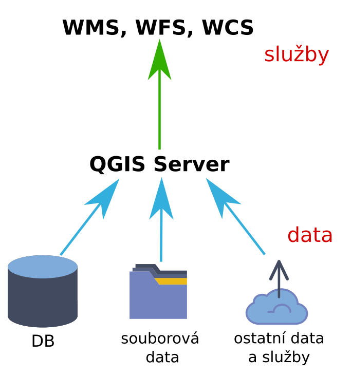
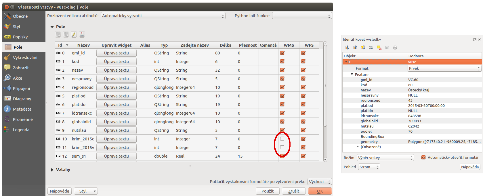

.. |box_yes| image:: ../images/icon/checkbox.png
   :width: 1.5em
.. |npicon| image:: ../images/icon/np_plugin_icon.png
   :width: 1.5em

QGIS Server
-----------

**QGIS Server** je :wikipedia:`FastCGI`/CGI (:wikipedia:`Common
Gateway Interface`) aplikace implementující OGC webové služby WMS (Web
Map Service) 1.3, WFS (Web Feature Service) 1.0.0 a WCS (Web Coverage
Service) 1.1.1.

.. note:: Více k tématu webových služeb OGC ve školení :skoleni:`Open
          Source GIS <open-source-gis/standardy/ogc/index.html>`.

QGIS Server je podobně jako samotný QGIS napsán v jazyce C++, pro svůj
běh vyžaduje webový server (například :wikipedia:`Apache <Apache HTTP
Server>`). QGIS knihovny jsou potom serverem využívány pro GIS logiku a
vykreslování mapy. Oba softwary používají totožné vizualizační knihovny, proto
se výstup zobrazuje stejně při publikaci přes QGIS Server ale i přímo v QGISu.
Takovýmto způsobem lze tedy jednoduše publikovat např. WMS službu na základě
existujícího QGIS projektu a příslušných dat.

Zjednodušeně by šlo tuto technologii popsat jako možnost prezentace či sdílení 
dat, či odvozených datasetů pomocí standardizovaných služeb  jakými jsou 
WMS či WFS, případně další. Způsob publikace je díky jednoduchému nastavení 
rychlý a umožňuje využít již existující projekty. 
Díky možnosti použít značně pokročilé způsoby stylování je možné vypublikovat 
graficky propracované výstupy s vysokou obsahovou kvalitou.

Infrastruktura do které lze QGIS Server začlenit může být vystavěna různým způsobem.
V případě jakýchkoli projektů je však vhodné využívat ukládání dat v databázích, 
nikoli pouze využívat souborovou strukturu.

Technologie je popsaná na `stránkách QGISu <http://docs.qgis.org/2.8/en/docs/user_manual/working_with_ogc/ogc_server_support.html>`_.

   Schématický nákres fungování QGIS serveru

Instalace a první použití
=========================

Pro jednoduché testování je možné využít návod na výše uvedených
stránkách pro základní instalaci a na jednoduchém příkladu vyzkoušet
nastavení služeb, jako je uvedeno níže.

Výchozí nastavení QGIS projektu umožňuje jeho přímou publikaci jako
jednoduché WMS služby, bez jakéhokoli dalšího nastavení.  Přidáme
novou službu WMS z URL
*http://server:91/cgi-bin/qgis_mapserv.fcgi?service=WMS&REQUEST=GetCapabilities&MAP=user/diagram1.qgs*,
kde pomocí parametru MAP definujeme cestu k projektu.

.. figure:: images/qgis_server_wms.png
   :class: large

   Přidání základní WMS služby z lokálního projektu.

Nastavení publikačních služeb v projektu
========================================

Specifikace a detailní nastavení služeb pro každý projekt je možné měnit pomocí
nastavení samotného QGIS projektu v :menuselection:`Projekt --> Vlastnosti
projektu` v záložce `OWS Server`.

.. figure:: images/project_settings.png

   Nastavení webových služeb v QGIS projektu.

WMS služba
^^^^^^^^^^

QGIS Server podporuje následující typy požadavků na WMS službu:

- GetCapabilities
- GetMap
- GetFeatureInfo
- GetLegendGraphics
- DescribeLayer
- GetStyles  

**`GetCapabilities`**

Jedním z požadavků klienta na server je požadavek na vypsání informací 
`GetCapabilities`. Jde o specifikaci služeb ve dvou základních částech - *Service*
a *Capability*.

Jak již bylo uvedeno, tak pro základní publikaci služby není nutné
žádné speciální nastavení. V takovém případě ale požadavek
`GetCapabilities` vrátí odpověď, která je nastavená ve výchozím souboru
`wms_metadata.xml` v adresáři *cgi-bin*.

Sestavený požadavek pro náš příklad může vypadat následovně:

::
   
   http://server:91/cgi-bin/qgis_mapserv.fcgi?service=WMS&REQUEST=GetCapabilities&MAP=user/diagram1.qgs

Na následujícím obrázku je ukázka odpovědi na požadavek před úpravou
projektu, nastavení projektu a následní odpověď na stejný požadavek po
uložení projektu.  Jak je na obrázku zvýrazněno, je nutné mít
zaškrtnutou volbu :item:`Schopnosti služby`.

.. figure:: images/capabilities.png
   :class: large

   Výchozí odpověď na požadavek `GetCapabilities`, nastavení informací o
   službě v projektu a nová odpověď dle nastavení.

Službu WMS lze definovat i detailněji.
V záložce :item:`Schopnosti WMS` jsou k dispozici detailnější nastavení, které
modifikují  výchozí nastavení.
Lze zde upravit **Rozsah** poskytovaného obsahu, podporované **souřadnicové 
systémy**, vyloučit jednotlivé **tvůrce mapy**. Nejdůležitější je omezení
(vyloučení) **vrstev**. Lze tedy
definovat vrstvy, které služba nebude zahrnovat -  z velkého projektu lze
nadefinovat službu poskytující jenom určitý obsah. 
Z dalších nastavení je podstatné zejména kvalita obrázků a nastavení maximální
velikosti pro požadavek `GetMap`.

Dotazování na prvek můžeme rozšířit i výpisem geometrie dotazovaného prvku
pomocí volby :item:`Add geometry to feature response`. Geometrie je
pak vypsaná jako samostatný atribut ve formě WKT.

.. figure:: images/wms_capabilites.png

   Příklad detailnějšího nastavení WMS služby.

WFS služba
^^^^^^^^^^

Nastavení služby WFS je v samostatné části. 
Lze zde nastavit WFS službu pro každou vrstvu zvlášť. A dokonce je možné
nastavit práva ke každé vrstvě pro *publikaci, aktualizaci, vkládání a mazání*
samostatně (tedy využívat standard WFS-T -- *WFS - Transactional*).

.. figure:: images/wfs.png

   Nastavení práv pro jednotlivé vrstvy ve službě WFS.

.. tip:: V nastavení projektu je ještě položka :item:`Otestovat nastavení`, kde
   je možné spustit kontrolu nastavení jednotlivých služeb. Kontrolují se
   například názvy vrstev a jejich kódování.
   Jako výstup testování se vypíše krátká správa o stavu nastavení.

   .. figure:: images/test_qgisserver.png

      Výsledná zpráva testování nastavených webových služeb.

.. note:: Ve stávající verzi podporuje QGISServer OGC WFS ve verzi 1.0.0, což už
        je poněkud překonaná verze.
   

Pokročilé nastavení
===================

**`GetFeatureInfo` - nastavení vrstvy**

Dalším nastavením je možnost povolit vrstvu k identifikování, což určuje zda je k
dispozici požadavek `GetFeatureInfo` u služby WMS. Toto nastavení je v
:menuselection:`Projekt --> Vlastnosti projektu` záložka :item:`Identifikovat
vrstvy`. Jak je vidět i na :numref:`get-feature-info-set` nastavení je formou
voleb u každá vrstvy samostatně.

.. _get-feature-info-set:

.. figure:: images/set_get_feature_info.png

   Ukázka nastavení reakce na požadavek `GetFeatureInfo` u jednotlivých vrstev.

**`GetFeatureInfo` - nastavení atributů**   

Rozlišit možnost přístupu k datům lze i na úrovni atributů. Pokud bychom chtěli
poskytovat jenom určité atributy u vrstev, tak i toto chování lze jednoduše 
docílit. Ve vlastnostech  každé vrstvy je záložka :item:`Pole`, kde jsou uvedeny
všechny atributy dané vrstvy. 
Mimo běžných informací např. o datovém typu každé vlastnosti je u každé kolonka
s volbou pro *WMS* a *WFS* službu. Ve výchozím nastavení jsou pro obě služby
dostupné všechny atributy. Jednoduchou úpravou docílíme, že atribut pro zvolenou
službu nebude dostupný.

   Nastavení přístupu pro službu WMS k vybraným atributům a výsledek požadavku
   `GetFeatureInfo` na službu - atributy `krim_2015c` a `krim_2015v` nejsou  v
   odpovědi.

  

