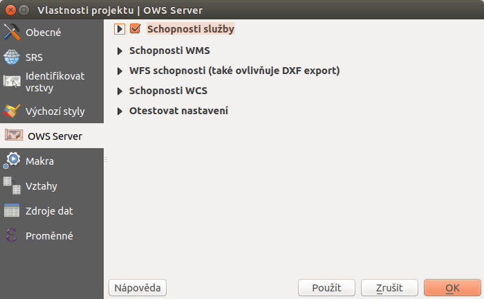

.. |box_yes| image:: ../images/icon/checkbox.png
   :width: 1.5em
.. |npicon| image:: ../images/icon/np_plugin_icon.png
   :width: 1.5em

QGIS Server
-----------

QGIS Server je FastCGI/CGI (Common Gateway Interface) aplikace implenentující
WMS 1.3, WFS 1.0.0 a WCS 1.1.1.
Je napsaná v jazyce C++ a funguje spolu s webovým servrem (například Apache2).
Využívá QGIS pro GIS logiku a vykreslování mapy. Oba používají totožné
vizualizační knihovny, proto se výstup zobrazuje stejně při publikaci přez
QGIS Server ale i přímo v QGISu.
Takovýmto způsobem lze tedy jednoduše publikovat např. WMS službu z
existujícího QGIS projektu a příslušných dat.

Technologie je popsaná na `stránkách QGISu <http://docs.qgis.org/2.8/en/docs/user_manual/working_with_ogc/ogc_server_support.html>`_.

Instalace a první použití
=========================

Pro jednoduché testování je možné využít návod na stránkách pro základní 
instalaci a na jednoduchém příkladu vyzkoušet nastavení služeb, jako je uvedeno 
níže.

Definice služeb `WMS <http://training.gismentors.eu/open-source-gis/standardy/ogc/wms.html>`_,
`WFS <http://training.gismentors.eu/open-source-gis/standardy/ogc/wfs.html>`_ a
WCS je dostupná i na obecném školení GIS.

Defaultní nastavení QGIS projektu umožňuje jeho přímou publikaci jako jednoduché 
WMS služby, bez jakéhokoli dalšího nastavení. 
Přidáme novou službu WMS z url *http://localhost/cgi-bin/qgis_mapserv.fcgi?MAP=/home/betka/Plocha/diagram1.qgs*,
kde pomocí parametru MAP definujeme cestu k projektu.

   Přidání základní WMS služby z lokálního projektu.

Nastavení publikačních služeb v projektu
========================================

Specifikace a detailní nastavení služeb pro každý projekt je možné měnit pomocí
nastavení samotného QGIS porjektu v :menuselection:`Projekt --> Vlastnosti
projektu` v záložce `OWS Server`.

   Nastavení služeb v QGIS projektu.

GetCapabilities
^^^^^^^^^^^^^^^
Jedním z požadavků od klienta na server je požadavek na vypsání informací 
GetCapabilities. Jde o specfikaci služeb ve dvou základních částech - *Service*
a *Capability*.

Jak již bylo uvedeno, tak pro základní publikaci služby není nutné žádné
speciální nastavení. V takovém případě ale požadavek GetCapabilities vrátí
odpověd, která je nastavená v soubou `wms_metadata.xml` v adresáři *cgi-bin*.

Sestavený požadavek pro náš příklad může vypadat následovně -
*http://localhost/cgi-bin/qgis_mapserv.fcgi?service=WMS&REQUEST=GetCapabilities&MAP=/home/betka/Plocha/diagram1.qgs*

Na následujícím obrázku je ukázka odpovědi na požadavek před úpravou projektu,
nastavení projektu a následní odpověď na stejný požadavek po uložení projektu. 
Jak je na obrázku zvýrazněno, je nutné mít zaškrtnutý checkbox 
:item:`Schopnosti služby`.

.. figure:: images/capabilities.png
   :class: large

   Defaultní odpověď na požadavek, nastavení informací o službě v projektu a 
   nová odpověď dle nastavení.

-get capabilities z defaultu vs. nastavení v projektu
- nastavení extentu a zobrazovaného obsahu
- nastavení WFS - v menu projektu

-nastavení atributů vrstev  pro WMS a WFS

- nastavení

        

