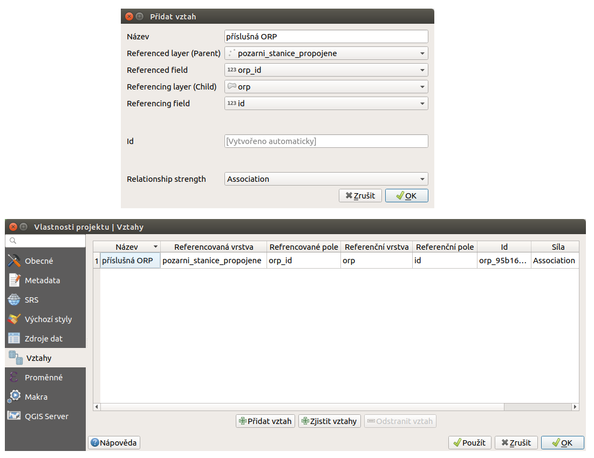

Vazby mezi vrstvami
--------------------

Závislosti mezi datasety často závisí na tom, jak zřejmá je a jak důležité
je tu závislost zdůraznit. 
Výhodou geodat je možnost zjevné vztahy ponechat zobrazené pouze vykreslením.
Pokud to však není dostatečné, tak je možné využít pokročilejší nástroje, 
které umožní prvky mezi sebou provázat a tyto vztahy i jasně vizualizovat.
V prostředí QGIS se za účelem propojování prvků mezi různými datasety používá
nástroj s názvem **Vztahy** (anglicky Relations).

Důležité je uvědomit si, že tento nástroj  provede nastavení na základě dat a
zapíše ho do projeku. 

Vazby lze implementovat i na data bez geometrie.

Typy vazeb
==========

U vazeb se rozlišují 3 základní typu vazeb:

* 1 k 1
   Jde o vazbu kdy jeden prvek může být navázán právě na jeden prvek z 
   druhého datasetu. Příkladem je například vztah mezi státem a hlavními
   městy. Každý stát má právě jedno hlavní město a naopak.
   Jedná se o nejjednodušší typ vazby.
   
* 1 k N
   Jeden prvek může být navázán na víc prvků z druhého datasetu. Jedná se o
   nejčastěji používaný typ vazby. Příkladem je kraj a města. Na území jednoho
   kraje se nachází víc měst. Jedno město je pouze na území jednoho kraje
   - při bodové reprezentaci měst.
   
* M ku N
   Jedná se o nejsložitější typ vazeb, kdy se 1 prvek váže na víc prvků
   v jednom směru, ale násobná vazba platí i v opačném směru. Jedna řeka
   protéká vícero okresy. Jedním okresem protéká vícero řek. 

Příprava dat
============

Implementace vazeb mezi datasety ja založená na principu propojování prvků
pomocí propojení vlastního identifikátoru s identifikátorem z vázaného datasetu.
Jako příklad použijeme datasety :file:`ORP` a :file:`pozarni_stanice`.

.. figure:: images/relation_vizualization1.png
   :class: large

   Zobrazení vybraných datasetů.

Na obrázku je vidět vzájemné rozložení obou datasetů. Opticky je možné určit
příslušnost požárních stanic k jednotlivým ORP. Požadovaným stavem ale je, aby
po identifikaci libovolného ORP byly vypsány všechny požární stanice, které se
nachází na jeho území.

V atributové tabulce každé vrstvy je každý prvek označen jednoznačným
identifikátorem. 

   Atributové tabulky obou datasetů a jejich identifikátory.
   
Klíčovým pro propojení je, aby v jedné z tabulek k vlastnímu
identifikátoru přibyl identifikátor vázaného prvku. V tomto případě zvolíme
možnost, kdy do vrstvy :file:`pozarni_stanice` přidáme nový atribut. Ten bude
obsahovat identifikátor toho ORP, ve kterém daná požární stanice leží.
Tento krok lze provést různými způsoby - od ruční editace až po využití
některého z existujících nástrojů.

Jako nejjednodušší postup zvolíme nástroj |processingAlgorithm|:sup:`Připojit
atributy podle umístění...`. 
Pomocí tohoto nástroje vygenerujeme novou vrstvu z původní vrstvy
:file:`pozarni_stanice`. Do její atributové tabulky se připojí atributy z
vrstvy ORP na základě použitého geometrického predikátu. 
V tomto případě postačuje připojení atributu s identifikátorem orp, další
atribute nejsou potřebné. Vybraným atributům je možné přidat prefix, aby bylo
možné připojené atributy jasně rozeznat.
Další nastavení umožňuje vybrat typ připojení podle typu vazby.
Některé prvky můžou zůztat bez připojení - nemají požadovaný prostorový vztah.
Takovéto prvky můžou být odstraněny.
Přesné nastavení pro ukázkový příklad je na obrázku.

.. figure:: images/relation_add_attribute.png
   :class: large

   Připojení atributů na základě umístění a atributová tabulka výsledné vrstvy.

Nastavení vazby
===============

Samotné nastavení vazby je součástí nastavení projektu :menuselection:`Projek -->
Properties...` záložka :item:`Vztahy`. 
Sem je nutné zapsat nastavení relace mezi jednotlivými vrstvami. Je důležité,
že jeden záznam v tabulce znamená jeden vazební atribut.

Nejdříve přidáme proklik z požární stanice na příslušné ORP. Pomocí tlačítka
|symbologyAdd| :sup:`Přidat vztah` se otevře dialog pro přidání jednoho
vazebního atributu.

   Nastavení relace z požární stanice na ORP v dialogu a pak ve vlastnostech.
   
Pokud použijeme nástroj identifikace na požární stanici, tak se otevře
detail prvku spolu s vazbou na ORP. Přidaný vazební atribut se zobrazuje na
poslední pozici (lze změnit) a je možné ho vizualizovat jako formulář nebo jako
klasickou atributovou tabulku. 

   Detail prvku s vazebním atributem v obou možných variantách.

V zobrazení je vidět, že jsou k dispozici i nástroje pro editaci vazeb.
-výčet.

Aktuální nastavení ale neumožňuje zobrazení všech požárních stanic u každého
ORP. Je nutné přidat novou položku vztahu.

.. figure:: images/relation_create2.png
   :class: medium

   Nastavení relace z ORP na požární stanici.

