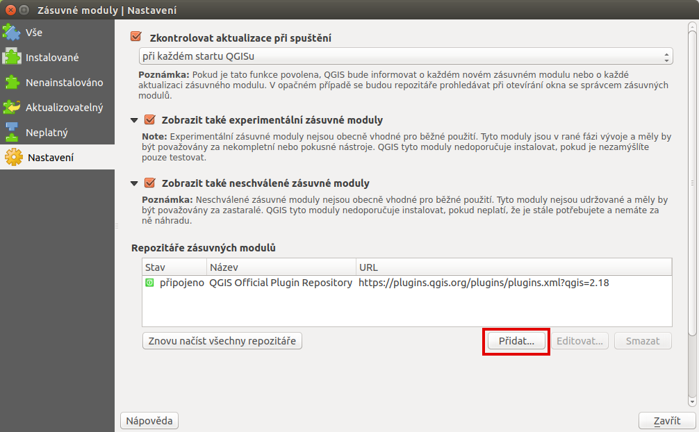

.. |vfkPlugin| image:: images/vfkPluginIcon.png
   :width: 1.5em

VFK a RÚIAN
-----------

Tato kapitola pojednává o možnosti pracovat s českými výměnnými
formáty **VFK** (:ref:`Výměnný formát katastru <vfk>`) a **VFR**
(:ref:`Výměnný formát RÚIAN <vfr>`) v prostředí QGIS.

.. _vfk:

Výměnný formát katastru (VFK)
=============================

Výměnný formát (VF) je určen k vzájemnému předávání dat mezi systémem
ISKN a jinými systémy zpracování dat, viz `dokumentace formátu
<http://www.cuzk.cz/Katastr-nemovitosti/Poskytovani-udaju-z-KN/Vymenny-format-KN/Vymenny-format-ISKN-v-textovem-tvaru/Popis_VF_ISKN-v5_1-1-%281%29.aspx>`_.

.. note::
   
   Formát VFK podporuje knihovna GDAL (tuto knihovnu používá QGIS pro
   čtení řady datových formátu včetně formátu VFK) od verze 1.7. Více
   o podpoře formátu VFK v knihovně GDAL `na portálu FreeGIS
   <http://freegis.fsv.cvut.cz/gwiki/VFK_/_GDAL>`_. Pro práci nicméně
   doporučujeme minimálně verzi knihovny GDAL 1.11, ideálně potom GDAL
   2.0 (GDAL 1.11 `nepodoruje křivky
   <http://freegis.fsv.cvut.cz/gwiki/VFK_/_GDAL#K.C5.99ivky.2C_kru.C5.BEnice.2C_kruhov.C3.A9_oblouky>`_,
   což je vzhledem k tomu, že hranice parcel mohou být tvořeny
   kružnicemi či kruhovými oblouky problém. Verzi knihovny GDAL můžete
   zjistit z menu :menuselection:`Nápověda --> O programu`.

   .. figure:: images/vfk-qgis-verze.png

Data ve formátu VFK můžete načíst jako každá jiná vektorová data. Po
načtení dat se objeví dialog pro výběr vrstev, které odpovídají
jednotlivým datovým blokům VFK. Některé mají definovánu geometrii
(např. BUD, PAR, HP a další), jiné obsahují pouze popisné informace.

.. _vfk-vrstvy:

.. figure:: images/vfk-vrstvy.png

   V dialogu vrstev vybereme vrstvy, které chceme přidat do QGISu.
   
.. important:: Knihovna GDAL při prvním načítání dat vytváří v
               adresáři, ve kterém je umístěn soubor VFK, interní
               :wikipedia:`SQLite` databázi. To znamená, že musíte mít
               v tomto adresáři **právo zápisu**. S tím také souvisí
               fakt, že první načtení dat trvá vždy *delší dobu*,
               neboť dochází k vytvoření interní databáze. Při dalším
               čtení jsou již data načítána přímo z interní databáze,
               což vede k mnohonásobnému zrychlení přístupu k datů.

Po načtení můžeme v QGISu jednotlivé vrstvy s geometrií a popisnými
informace spojovat. To nicméně vyžaduje znalosti vnitřní struktury
formátu VFK. Proto vznikl specializovaný zásuvný modul tzv. **VFK
plugin**, který  pro práci s katastrálními daty výrazně usnadňuje.

        
   Příklad připojení tabulky druh pozemku (DRUPOZ) k atributové
   tabulce parcel (PAR) ve vlastnostech vrstvy a záložce Připojení.

Po připojení popisných informací můžeme provádět dotazy typu vyhledání
parcel podle druhu pozemku.
   

   Nalezení parcel, které mají druh pozemku chmelnice.

VFK plugin
^^^^^^^^^^

Mnohem větší komfort při práci s daty ve formátu VFK umožňuje v QGISu
specializovaný **VFK plugin**.

.. note:: Tento zásuvný modul byl vyvinut v roce 2011 studenty oboru
          Geoinformatika na ČVUT v Praze, fakulty stavební. Kód byl
          napsán v programovacím jazyku C++, což výrazně stěžovalo
          instalaci pluginu, která nebyla možna standardní
          cestou. Proto byl v roce 2015 a 2016 kód zástuvného modulu
          přepsán do jazyka Python a v něj je i dále vyvíjen. Více
          informací o zásuvném modulu najdete na stránkách `portálu
          FreeGIS
          <http://freegis.fsv.cvut.cz/gwiki/VFK_/_QGIS_plugin>`_.

Instalace
~~~~~~~~~

V současné době není VFK plugin součástí oficiálního repozitáže
QGISu. Pro jeho instalaci je nutné do QGISu zaregistrovat nový
repozitář, který je dostupný na adrese
*http://geo.fsv.cvut.cz/osgeorel/qgis-plugins.xml*.

V dialogu :menuselection:`Zásuvné moduly --> Spravovat a instalovat
zásuvné moduly` přidáme nový repozitář a aktivuje experimentální
moduly.

   Pro instalaci VFK pluginu je nutné aktivovat experimentální zásuvné
   moduly a přidat nový repozitář.

.. figure:: images/vfk-repo.png
   :class: small
        
   V dialogu definujeme název a URL 
   http://geo.fsv.cvut.cz/osgeorel/qgis-plugins.xml.

   Poté se již VFK plugin zobrazí v seznamu zásuvných modulů a můzeme
   jej nainstalovat.

Po instalaci se přidá do menu :menuselection:`Zásuvné moduly --> VFK`
a do nástrojové lišty ikonka |vfkPlugin|. Zásuvný modul otevřeme
pomocí této ikonky anebo z menu :menuselection:`Zásuvné moduly --> VFK
--> Otevřít prohlížeč VFK`.

Práce se zásuvným modulem
~~~~~~~~~~~~~~~~~~~~~~~~~

Panel nástroje pro práci s katastrálními daty má 3 části:

        
   Panel nástroje a jeho části: část pro vstupní parametry načítání a
   dotazování dat (1), nástrojová lišta (2) a část pro nápovědu a
   výstup dotazů.

Nejprve zadáme VFK soubor, který chceme načíst a poté stiskneme
tlačítko :item:`Načíst`. Po načtení dat se v mapovém okně objeví
vrstvy parcel (PAR) a budov (BUD). Pomocí nástroje může v datech
vyhledávat, postupovat podle listů vlasnictví a mnoho dalších funkcí.

.. figure:: images/vfk-plugin.png
   :class: middle
   
   Ukázka využití VFK pluginu pro nalezení parcel s druhem pozemku
   zahrada.

.. _vfr:

Výměnný formát RÚIAN (VFR)
==========================
